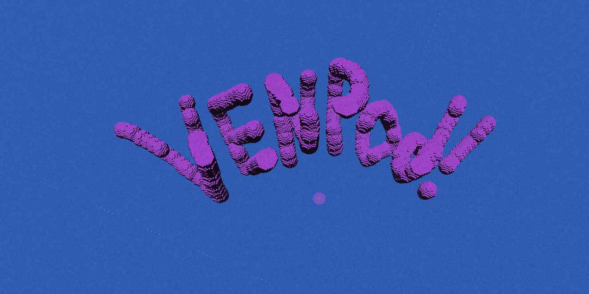
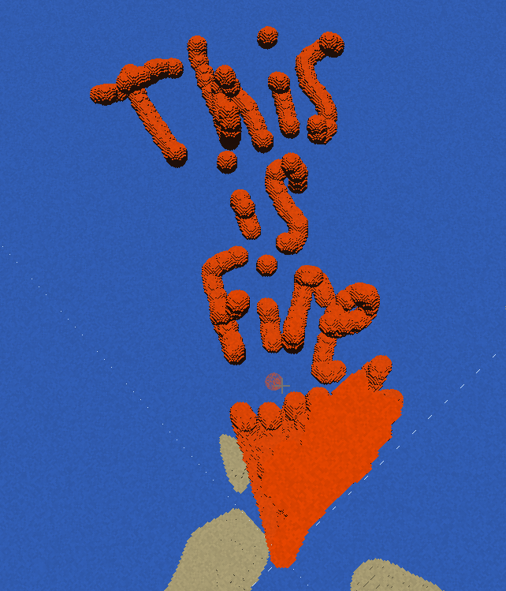

# VENPOD

A high-performance voxel physics engine built with DirectX 12 and compute shaders, targeting 100M+ active voxels at 60 FPS.

## Overview

VENPOD is a GPU-accelerated voxel engine that demonstrates modern graphics programming techniques including compute shaders, GPU raymarching, infinite terrain generation, and real-time physics simulation. The engine uses a hybrid rendering approach with DDA raymarching for visualization and parallel compute dispatches for physics.

### Two Modes

VENPOD features two distinct gameplay modes accessible through a launcher dialog:

1. **Sand Simulator** - Material physics and gravity simulation in a fixed 256x128x256 voxel grid. Paint with different materials (sand, water, stone, etc.) and watch them interact with realistic physics. Perfect for experimenting with falling sand mechanics and material interactions.

2. **Sandbox Mode** - Infinite terrain exploration with procedural generation. Fly through an endless voxel world with chunk streaming, build structures, and explore terrain that generates around you. Features flight mode toggle and ground collision.

## Screenshots

### Voxel Painting Examples

<p align="center">
  
  <br>
  <em>Procedurally generated terrain with GPU-based raymarching</em>
</p>

<p align="center">
  
  <br>
  <em>Real-time voxel painting with brush preview and material selection</em>
</p>

<p align="center">
  
  <br>
  <em>Building complex structures with spherical and cubic brush shapes</em>
</p>

## Features

### Rendering

- GPU-based DDA raymarching for real-time voxel visualization
- Shader-visible descriptor management for efficient resource binding
- 25x2x25 chunk render distance (1,250 chunks, ~52MB render buffer)
- Dynamic lighting and material system with 256-color palette
- First-person camera with smooth movement and mouse look

### Infinite World System

- Procedural terrain generation using 3D Perlin noise
- Chunk-based streaming with hysteresis to minimize buffer shifts
- Region-based rendering (256x128x256 voxel window around player)
- Efficient chunk copy pipeline using compute shaders
- Double-buffered chunk tracking to prevent redundant copies

### Physics Simulation

- GPU-accelerated gravity simulation via compute shaders
- Chunk-based spatial optimization for physics updates
- ExecuteIndirect for dynamic workload distribution
- Player collision detection with ground raycasting
- Real-time voxel painting and erasing

### Input and Controls

- WASD movement with gravity and ground collision
- Mouse look with pitch/yaw camera control
- GPU-based brush raycasting for painting (2M times faster than CPU)
- Material selection and brush size adjustment
- Pause menu with debug statistics

## Architecture

### Core Components

- **Engine**: Main game loop and system initialization
- **Window**: SDL3 window management with resize support
- **Timer**: Frame timing and delta time calculation
- **ServiceLocator**: Dependency injection for core systems

### Graphics Pipeline

- **DX12Device**: DirectX 12 device and adapter management
- **DX12CommandQueue**: Command submission and GPU synchronization
- **DX12GraphicsPipeline**: Graphics pipeline state objects
- **DX12ComputePipeline**: Compute shader pipeline management
- **DescriptorHeap**: Centralized descriptor allocation and management
- **ShaderCompiler**: Runtime HLSL shader compilation with DXC
- **Renderer**: High-level rendering abstraction
- **VoxelRenderer**: Voxel-specific rendering implementation

### Simulation

- **VoxelWorld**: Ping-pong voxel buffer management (read/write swapping)
- **InfiniteChunkManager**: Chunk generation, loading, and unloading
- **ChunkManager**: Sparse chunk optimization for physics
- **PhysicsDispatcher**: Compute shader dispatch for physics updates
- **Chunk**: Individual chunk data and generation

### Shaders

#### Graphics Shaders
- `VS_Fullscreen.hlsl`: Fullscreen triangle vertex shader
- `PS_Raymarch.hlsl`: DDA raymarching pixel shader

#### Compute Shaders
- `CS_Initialize.hlsl`: Procedural terrain initialization
- `CS_GenerateChunk.hlsl`: Infinite chunk terrain generation
- `CS_CopyChunkToBuffer.hlsl`: Chunk streaming to render buffer
- `CS_Gravity.hlsl`: Voxel gravity simulation
- `CS_GravityChunk.hlsl`: Chunk-based gravity optimization
- `CS_Brush.hlsl`: Voxel painting and erasing
- `CS_BrushRaycast.hlsl`: GPU brush position raycasting
- `CS_ChunkScanner.hlsl`: Active chunk detection
- `CS_PrepareIndirect.hlsl`: ExecuteIndirect argument preparation

### User Interface

- **ImGuiBackend**: Dear ImGui integration with DirectX 12
- **DebugOverlay**: Performance statistics and system information
- **MaterialPalette**: Interactive material selection
- **BrushPanel**: Brush size and mode controls
- **PauseMenu**: In-game menu system

## Technical Highlights

### GPU Raycast Optimization

Replaced 32MB CPU voxel readback with 16-byte GPU raycast result, achieving a 2,000,000x reduction in bandwidth. The brush raycasting compute shader runs a single thread to find the intersection point, writing only the position to a tiny buffer that gets copied to CPU.

### Hysteresis-Based Buffer Shifting

Buffer center only shifts when the camera moves 8+ chunks from the current center (512 voxels), reducing buffer shift frequency by 8x. This prevents the constant stuttering that occurred when shifting every 64 voxels.

### Double-Buffered Chunk Tracking

Each ping-pong buffer maintains its own cache of copied chunks, preventing the need to re-copy all 1,250 chunks every frame. Only missing or modified chunks are copied, dramatically reducing memory bandwidth.

### Compute Shader Physics

All physics simulation runs on the GPU using compute shaders. The chunk scanner identifies active chunks, and ExecuteIndirect dispatches only the necessary work, avoiding CPU-GPU synchronization overhead.

## Build Requirements

### Dependencies (via vcpkg)

- SDL3: Window management and input
- DirectX 12 Headers: Graphics API
- GLM: Math library for vectors and matrices
- spdlog: Logging framework
- nlohmann_json: JSON parsing
- Dear ImGui: UI framework (included as vendor)

### Platform

- Windows 10/11 (DirectX 12 required)
- Visual Studio 2019 or later
- CMake 3.20 or later
- Windows SDK 10.0.26100.0 or later (for DXC shader compiler)

## Building

```batch
cd VENPOD
mkdir build
cd build
cmake ..
cmake --build . --config Release

or

cd VENPOD
>> .\setup.ps1
```

## Running

```batch
cd VENPOD\build\bin
VENPOD.exe

or

cd VENPOD
>> .\run.ps1
```

When you launch VENPOD, a launcher dialog will appear asking you to choose between:
- **Sand Simulator** - Material physics and gravity simulation
- **Sandbox Mode** - Infinite terrain exploration

### Controls

- **WASD**: Move horizontally
- **Space**: Jump (single press when on ground)
- **Space (double-click)**: Toggle flight mode on/off
- **Space (hold in flight mode)**: Fly up
- **Shift**: Fly down
- **Mouse**: Look around
- **Left Click**: Paint voxels
- **Right Click**: Erase voxels
- **Tab**: Toggle mouse capture
- **ESC**: Pause menu
- **Q/E**: Previous/Next material
- **[/]**: Decrease/Increase brush size

#### Flight Mode

Double-click Space to toggle between normal gravity mode and creative flight mode:
- **Normal Mode**: Gravity pulls you down, Space jumps when on ground
- **Flight Mode**: No gravity, Space/Shift for manual vertical movement

### Command Line Options

- `--stress-test` or `-s`: Run stress tests before starting

## Performance

### Current Metrics

- Render buffer: 256x128x256 voxels (8.3M voxels)
- Total chunks: 1,250 active chunks
- Memory: ~104MB for ping-pong buffers
- Target: 60 FPS with gravity simulation
- GPU: Optimized for RTX 3070 Ti (8GB VRAM)

### Optimizations Applied

- Hysteresis buffer shifting (8x reduction in shifts)
- GPU raycast for brush (2M times less bandwidth)
- Chunk-based physics (sparse simulation)
- ExecuteIndirect (dynamic workload)
- Ping-pong buffers (avoid GPU stalls)

## Project Structure

```
VENPOD/
├── assets/
│   └── shaders/           # HLSL shader files
│       ├── Graphics/      # Rendering shaders
│       └── Compute/       # Simulation shaders
├── docs/
│   └── screenshots/       # Project screenshots and images
├── src/
│   ├── Core/             # Engine core systems
│   ├── Graphics/         # Rendering subsystem
│   │   └── RHI/         # DirectX 12 abstraction
│   ├── Simulation/       # Voxel world and physics
│   ├── Input/           # Input handling
│   ├── UI/              # User interface
│   └── Utils/           # Utilities and helpers
├── vendor/
│   └── imgui/           # Dear ImGui library
└── CMakeLists.txt       # Build configuration
```

## Known Issues

- Descriptor heap tests disabled to prevent conflicts with production descriptors
- Occasional brief stutter when buffer shifts (every ~512 voxels)
- Static chunk layout debug mode requires manual activation

## Future Improvements

- GPU buffer shifting using compute shaders for zero-stutter movement
- Multithreaded chunk generation for faster terrain loading
- LOD system for distant chunks
- Serialization for chunk persistence
- Multiplayer support with chunk synchronization

## License

MIT License - see [LICENSE](LICENSE) for details.


