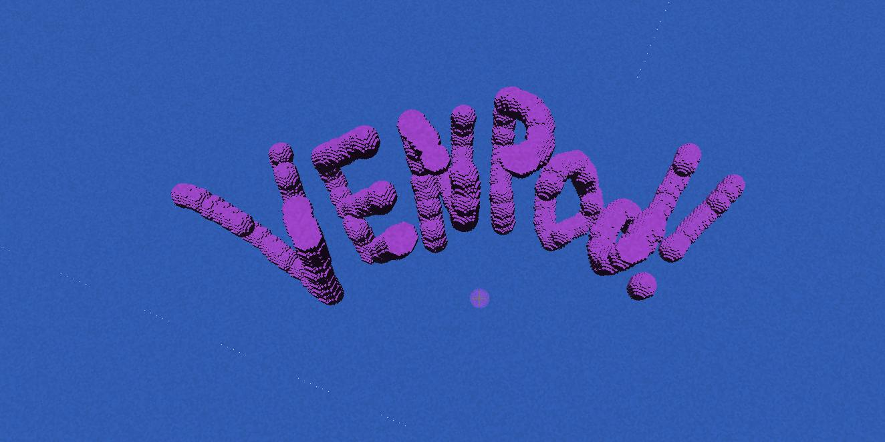

# VENPOD

VENPOD is a DirectX 12 voxel engine tech demo written in C++20 and HLSL. It renders an infinite first-person voxel sandbox with GPU-generated terrain, chunk streaming, HLSL raymarching, voxel physics, brush editing tools, and ImGui diagnostics.

The goal of the project is to make low-level graphics and GPU-simulation systems visible: descriptor management, command queues, resource barriers, shader compilation, allocator reuse, fence synchronization, chunk streaming, and compute-driven simulation.

## Demo

<p align="center">
  
</p>

Additional captures are in [docs/screenshots](docs/screenshots).

## Features

- DirectX 12 rendering backend with explicit resource state management.
- Runtime HLSL shader compilation with DXC.
- DDA raymarching in the pixel shader.
- GPU-generated terrain in `64 x 64 x 64` voxel chunks.
- `1 MB` GPU buffer per chunk.
- A visible render window of `25 x 2 x 25` chunks, or 1,250 chunks total.
- A loaded-world budget of `33 x 2 x 33` chunks, or 2,178 chunks total.
- Infinite-world chunk queueing, streaming, unloading, and deferred cleanup.
- GPU brush raycasting and localized brush compute dispatches.
- Chunk-scoped voxel physics and ImGui diagnostics.

## Architecture

```text
Camera
  -> InfiniteChunkManager
  -> GPU chunk generation
  -> moving render buffer
  -> HLSL raymarch renderer
  -> ImGui diagnostics
```

The sandbox keeps more chunks loaded than are visible, so chunks can be generated before they enter the render window. The renderer then raymarches a moving GPU buffer centered around the player. Brush edits and physics operate on the same voxel buffers through compute shaders.

## Build

VENPOD currently targets Windows with DirectX 12.

Requirements:

- Windows 10 or 11
- DirectX 12 capable GPU
- Visual Studio 2022 with the C++ desktop workload
- CMake 3.20 or newer
- Git
- PowerShell
- vcpkg

Recommended manual setup:

```powershell
cd VENPOD
cmake -S . -B build -G Ninja -DCMAKE_BUILD_TYPE=Release
cmake --build build --config Release
```

Optional one-command setup:

```powershell
cd VENPOD
.\setup.ps1
```

`setup.ps1` imports the Visual Studio build environment, installs or locates Ninja, installs vcpkg packages, checks the vendored ImGui source, configures CMake, and builds the executable. It is convenient for local development, but the manual commands above are clearer if you prefer to manage tools yourself.

## Run

```powershell
cd VENPOD
.\run.ps1
```

Choose `Sandbox Mode` in the launcher to run the infinite terrain explorer.

## Controls

- `WASD`: Move
- Mouse: Look
- `Space`: Jump
- Double-tap `Space`: Toggle flight mode
- `Space` / `Shift` in flight mode: Fly up / down
- Left mouse: Paint voxels
- Right mouse: Erase voxels
- `Q` / `E`: Previous / next material
- `[` / `]`: Decrease / increase brush radius
- `Tab`: Toggle mouse capture
- `Esc`: Pause menu

## Documentation

The docs are organized using the Diataxis model:

- Tutorial: [Build and run VENPOD](docs/tutorials/build-and-run.md)
- How-to: [Use the sandbox](docs/how-to/use-the-sandbox.md)
- How-to: [Debug runtime behavior](docs/how-to/debug-runtime.md)
- Explanation: [Engine architecture](docs/explanation/architecture.md)
- Reference: [Runtime reference](docs/reference/runtime.md)

## Project Layout

```text
VENPOD/
  assets/shaders/       HLSL graphics and compute shaders
  src/Core/             windowing, timing, and app infrastructure
  src/Graphics/         renderer and DirectX 12 RHI helpers
  src/Input/            keyboard, mouse, and brush input
  src/Simulation/       voxel buffers, chunk streaming, physics
  src/UI/               ImGui panels and overlays
  vendor/imgui/         Dear ImGui source, vendored for reproducible demo builds
docs/
  screenshots/          README images
  tutorials/            guided learning docs
  how-to/               task-oriented docs
  explanation/          design and architecture docs
  reference/            controls and runtime details
```

## Known Limits

VENPOD is a graphics programming tech demo, not a packaged game engine. The code favors explicit DirectX 12 systems over engine middleware so the rendering, synchronization, and chunk-streaming work is visible in the repository.

Generated build outputs are intentionally excluded from version control. Rebuild locally with the PowerShell scripts or CMake commands above.

## License

MIT. See [LICENSE](LICENSE).
