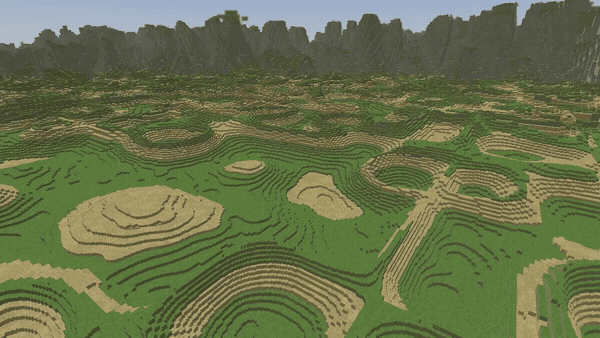
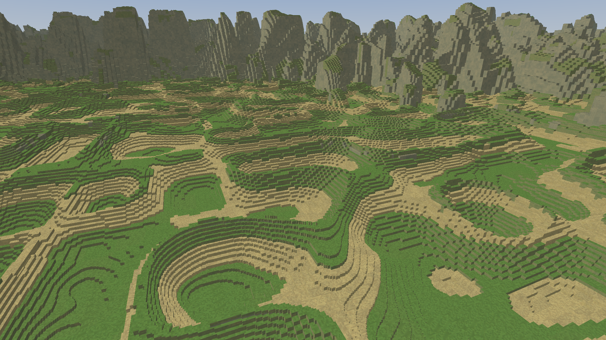
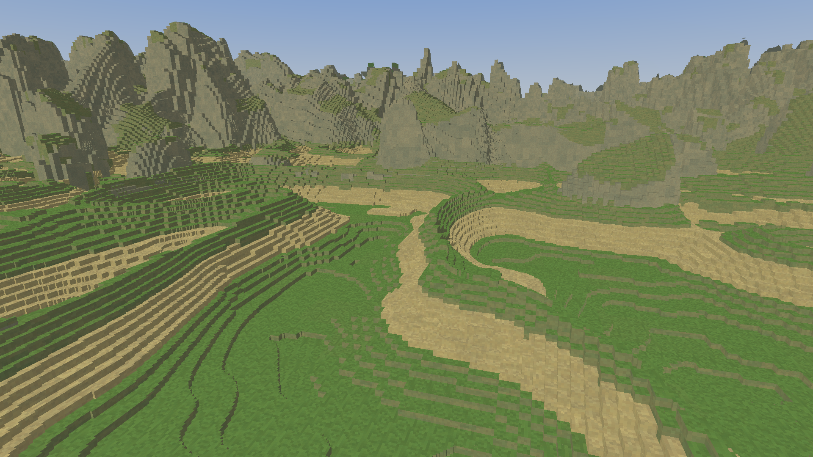

# VENPOD — a voxel world that runs on the GPU

**A from-scratch DirectX 12 engine that streams an infinite, editable voxel world — with terrain generated on the GPU and falling-sand-style material simulation.**



*Real in-engine capture: an infinite voxel landscape streamed in sparse bricks as the camera flies — terraced valleys, mountain ranges, and lakes you can reshape in real time.*

| | |
| --- | --- |
|  |  |

*Full-resolution stills from the engine's quality mode ([more clips](docs/media): mountain sweep, low cruise, valley orbit).*

**Why it's hard:** no game engine, no graphics library — just raw DirectX 12. That means hand-managing GPU memory, descriptor heaps, command queues, and fence synchronization; writing a custom voxel renderer (DDA raymarch + rasterized sparse surfaces); generating terrain on the GPU with compute shaders; and simulating falling-sand-style materials across the world.

**What you can do in it:** fly through an infinite streamed world (above), then land and reshape it — paint and erase voxels with a brush, carve tunnels, and let sand/water-style materials flow and settle. Edits persist across streaming and can be saved between runs.

**Run it** (Windows + a DirectX 12 GPU):

```powershell
cd VENPOD
.\setup.ps1     # one-time: vcpkg deps + build
.\rebrun.ps1    # launch the sandbox
```

Everything below is the engineering detail — architecture, build internals, controls, and honest limitations.

## Feature Highlights

- DirectX 12 rendering backend with explicit resource state transitions.
- Runtime HLSL shader compilation with DXC.
- Sparse near-field brick pool using `16 x 16 x 16` world-space bricks.
- Generation-aware CPU/GPU page-table publication.
- Rasterized sparse surface path with GPU culling and indirect draw commands.
- Full-resolution terrain LOD mesh as an always-present floor — every distance
  band renders real stepped voxel geometry (distance-capped quad sizes,
  slope-aware refinement, resident-aware LOD suppression).
- Streaming that degrades honestly: a CPU-fed streamed-radius guard keeps
  un-streamed terrain from ever rendering as false water or sky during fast
  flight, backed by mid/height clipmaps and an async far SVO horizon.
- Legacy fullscreen HLSL raymarch renderer over a moving dense voxel window for
  fallback and comparison.
- Conceptual vertical terrain range from `Y = -332` to `Y = 664`.
- Sparse residency planning, byte-aware upload scheduling, page publish queues,
  and fence-aware surface range retirement.
- GPU sparse raycast/brush feedback diagnostics with CPU-authoritative fallback.
- Sparse edit overlays so brush changes survive eviction/reload during a run.
- Traversal brush handoff that finishes line-of-sight painting as a ramp near
  the player feet.
- Local sparse physics on dirty/active regions by default; GPU proposal
  validation is available as an experimental diagnostic path.
- Dear ImGui runtime metrics overlay.

## Architecture

```text
Input / Camera
  -> sparse residency planner
  -> sparse brick generation / edit overlays
  -> GPU upload ring and page-table publish queue
  -> sparse surface extraction and GPU culling
  -> mid/far clipmap and far SVO background layers
  -> sparse local physics and feedback readbacks
  -> ImGui diagnostics
```

The engine's unit of streaming is a stable world-space sparse brick. A dense
moving-buffer renderer is retained as a legacy comparison path.

### Where to look in the code

| Area | Path |
| --- | --- |
| DX12 device, swapchain, pipelines, GPU memory | `VENPOD/src/Graphics/Renderer.cpp`, `src/Graphics/DX12*` |
| Voxel raymarcher (DDA, LOD layers, water/sky) | `VENPOD/assets/shaders/Graphics/PS_Raymarch.hlsl` |
| Sparse streaming: bricks, clipmaps, terrain LOD mesh | `VENPOD/src/Simulation/SparseClipmap.cpp` |
| GPU terrain generation (compute) | `VENPOD/assets/shaders/Compute/CS_GenerateMidVoxelBricks.hlsl` |
| Far-field sparse voxel octree | `VENPOD/src/Graphics/FarVoxelOctree.cpp` |
| Capture & regression harnesses | `VENPOD/democapture.ps1`, `VENPOD/sparse_regression.ps1` |

## Build

VENPOD targets Windows and DirectX 12.

Requirements:

- Windows 10 or 11
- DirectX 12 capable GPU
- Visual Studio 2022 with the C++ desktop workload
- CMake 3.20 or newer
- Git
- PowerShell
- vcpkg

Recommended setup:

```powershell
cd VENPOD
.\setup.ps1
```

`setup.ps1` imports the Visual Studio build environment, installs or locates
Ninja, installs vcpkg packages, checks the vendored ImGui source, configures
CMake, and builds the executable.

Manual build, if you manage dependencies yourself:

```powershell
cd VENPOD
cmake -S . -B build -G Ninja -DCMAKE_BUILD_TYPE=Release -DCMAKE_TOOLCHAIN_FILE="$env:VCPKG_ROOT\scripts\buildsystems\vcpkg.cmake"
cmake --build build --config Release
```

## Run

For the current sparse demo path:

```powershell
cd VENPOD
.\rebrun.ps1
```

For dense legacy comparison:

```powershell
cd VENPOD
.\rebrun.ps1 -DenseLegacy
```

To load and save sparse brush edits across runs:

```powershell
cd VENPOD
.\rebrun.ps1 -SparseEditFile saves\review-edits.vsed
```

To capture demo media (smooth 60fps flight clips and full-res stills) straight
from the engine's DX12 capture path:

```powershell
cd VENPOD
.\democapture.ps1 -Tag myclip -AltTenths 1800 -PitchDeg -22 -YawRate 12   # video
.\democapture.ps1 -Tag stills -Mode quality -Stills                       # stills
```

To run the visual regression gate (scripted flight scenarios, ownership and
coverage checks against the runtime log):

```powershell
powershell -ExecutionPolicy Bypass -File .\VENPOD\sparse_regression.ps1 -Config Release
```

Choose `Sandbox Mode` in the launcher.

## Controls

| Input | Action |
| --- | --- |
| `WASD` | Move |
| Mouse | Look |
| `Space` | Jump |
| Double-tap `Space` | Toggle flight mode |
| `Space` in flight mode | Fly up |
| `Shift` in flight mode | Fly down |
| `V` | Toggle first-person / third-person camera |
| Left mouse | Paint voxels |
| Right mouse | Erase voxels |
| `Q` / `E` | Previous / next material |
| `[` / `]` | Decrease / increase brush radius |
| `Tab` | Toggle mouse capture |
| `Esc` | Pause menu |

## Documentation

The docs are organized using the Diataxis model:

- Tutorial: [Build and run VENPOD](docs/tutorials/build-and-run.md)
- How-to: [Use the sandbox](docs/how-to/use-the-sandbox.md)
- How-to: [Capture a public demo](docs/how-to/capture-public-demo.md)
- How-to: [Debug runtime behavior](docs/how-to/debug-runtime.md)
- Explanation: [Engine architecture](docs/explanation/architecture.md)
- Reference: [Runtime reference](docs/reference/runtime.md)
- Reference: [Sparse refactor review checklist](docs/reference/sparse-refactor-review.md)
- Reference: [Public review manifest](docs/reference/public-review-manifest.md)
- Reference: [Sparse completion audit](docs/reference/sparse-completion-audit.md)
- Reference: [Asset credits](docs/reference/asset-credits.md)
- Historical report: [Vertical world pass](docs/reports/vertical-world-pass.md)
- Historical report: [Sparse voxel octree far-field plan](docs/reports/sparse-voxel-octree-plan.md)

## Project Layout

```text
VENPOD/
  assets/shaders/       HLSL graphics and compute shaders
  src/Core/             windowing, timing, and app infrastructure
  src/Graphics/         renderer, far SVO, and DirectX 12 RHI helpers
  src/Input/            keyboard, mouse, and brush input
  src/Simulation/       voxel buffers, chunk streaming, physics, edit overlays
  src/UI/               ImGui panels and overlays
  vendor/imgui/         Dear ImGui source, vendored for reproducible demo builds
docs/
  tutorials/            guided learning docs
  how-to/               task-oriented docs
  explanation/          design and architecture docs
  reference/            controls and runtime details
  reports/              historical implementation reports
```

## Known Limits

VENPOD is a graphics programming tech demo, not a packaged game engine.

Current limitations:

- The sparse renderer is the active development path, but dense legacy is still
  kept for regression comparison and public fallback.
- Brush edits can be saved and loaded with `.\rebrun.ps1 -SparseEditFile` or
  from the pause-menu metrics panel.
- GPU brush feedback and GPU physics proposal application are guarded hybrid
  paths; CPU sparse authority remains the resilience fallback.
- Distant cliffs beyond ~5 km render as coarser stepped geometry by design (a
  measured fps/fidelity tradeoff); `VENPOD_SPARSE_MID_MESH_MAX_DISTANCE=13900`
  extends full terrain geometry to the render horizon for screenshot sessions.
- At extreme flight speeds (200+ units/s) streaming can briefly lag the camera;
  un-streamed terrain falls back to an analytic fill rather than holes.
- The curated demo media lives in `docs/media`; the broader review suites are
  generated on demand by the capture scripts and stay out of git.

Generated build outputs are intentionally excluded from version control.

## License

MIT. See [LICENSE](LICENSE).
