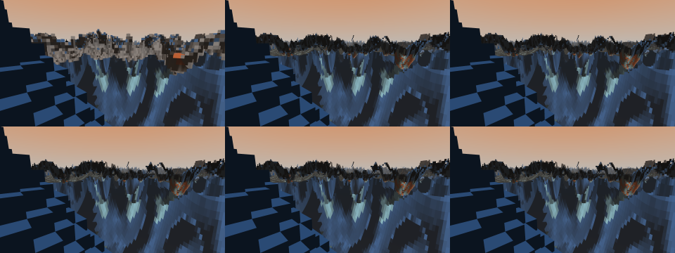

# VENPOD Documentation

These docs are organized around the Diataxis model:

- Tutorials teach the first successful path through the project.
- How-to guides solve specific tasks.
- Explanations describe how the engine fits together.
- Reference pages list facts, controls, and runtime switches.

## Start Here

If you only want to run the demo, use [Build and run VENPOD](tutorials/build-and-run.md).

If you are reviewing the project, read [Engine architecture](explanation/architecture.md) after the README.

## Document Map

- [Build and run VENPOD](tutorials/build-and-run.md)
- [Use the sandbox](how-to/use-the-sandbox.md)
- [Capture a public demo](how-to/capture-public-demo.md)
- [Debug runtime behavior](how-to/debug-runtime.md)
- [Engine architecture](explanation/architecture.md)
- [Runtime reference](reference/runtime.md)
- [Sparse refactor review checklist](reference/sparse-refactor-review.md)
- [Public review manifest](reference/public-review-manifest.md)
- [Sparse completion audit](reference/sparse-completion-audit.md)
- [Sparse completion ledger](COMPLETION_LEDGER.md)
- [Asset credits](reference/asset-credits.md)
- Historical report: [Vertical world pass](reports/vertical-world-pass.md)
- Historical report: [Sparse voxel octree far-field plan](reports/sparse-voxel-octree-plan.md)

## Media

The current sparse renderer contact sheet is generated from the in-engine DX12
backbuffer capture smoke:

To regenerate review media, run
[`VENPOD/public_demo_capture.ps1`](../VENPOD/public_demo_capture.ps1). It writes
a validated contact sheet, image stats, runtime log, and MP4 under
`VENPOD/build/captures/public_demo/`. The full sparse regression gate also
checks the generated runtime log for terrain ownership, mid/far ownership,
visible far-SVO pixels, surface fragments, and zero sparse
miss/unsafe-near-miss pixels.
Use `-ReviewReel` to generate one normal/high-flight/waterline public-review
reel with per-segment contact sheets and logs.

For the broader visual review suite, run
[`VENPOD/visual_review_capture.ps1`](../VENPOD/visual_review_capture.ps1). It
regenerates normal, walk, long-walk, fast-flight, long-fast-flight,
fast water-transition, long fast-water transition, waterline, and
long-waterline contact sheets plus a manual checklist and CSV summary under
`VENPOD/build/logs/visual_review_capture/`.
