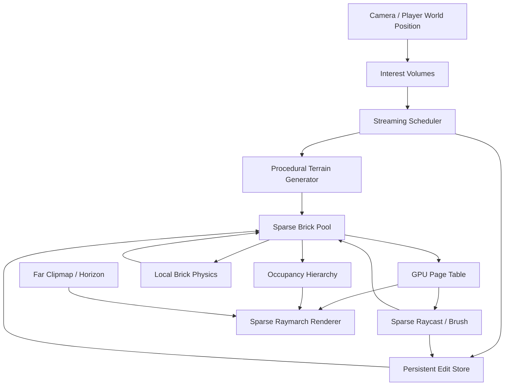

# VENPOD Sparse Voxel Refactor Blueprint

This document is the implementation plan for moving VENPOD from a dense voxel
sandbox renderer to an infinite-world sparse voxel engine.

The current engine began as a voxel particle sandbox. The dense ping-pong buffer
model was reasonable for that scope, but it is now carrying responsibilities it
was not designed for:

- infinite terrain streaming
- high-speed traversal
- extreme vertical worlds
- persistent painting
- local physics
- long render distance
- far terrain continuity

The goal of this refactor is not to tune the dense path harder. The goal is to
replace the default render/runtime architecture with a sparse brick pool, GPU
page table, occupancy acceleration, near/far separation, and local dirty-region
simulation.

## Core Direction

Target rendering model:

```text
stable world coordinates
    -> world brick coordinate floor(worldVoxel / 16)
    -> GPU page table lookup
    -> resident brick page in sparse brick pool
    -> occupancy mask / hierarchy skip
    -> voxel sample only near occupied bricks
    -> far terrain clipmap/procedural fallback when near brick is absent
```

The near field is fully editable and simulated. The far field is approximate and
optimized for continuity, scale, and speed.

## Design Constraints

- World coordinates are stable. Render-window movement must never move the
  player.
- The renderer must not depend on a giant dense world-aligned buffer.
- Painting, raycast, collision, and physics must use the same world-space brick
  coordinate system.
- Missing pages should degrade gracefully to far LOD or sky, not expose stale
  dense memory.
- Edits are persistent world data, not render-buffer-local data.
- Full-resolution simulation is local. Far terrain is visual only until promoted.
- Rendering must be budgeted and measurable.

## Current Implementation Status

This refactor is now substantially implemented behind
`VENPOD_RENDER_BACKEND=sparse`. The normal `rebrun.ps1` path now opts into the
sparse backend by default, with `-DenseLegacy` retained as the old renderer
escape hatch. The dense path still exists as a fallback/debug comparison, but
the sparse path is no longer just a scaffold: it exercises allocation,
generation, upload staging, GPU copy commands, page-table publication, sparse
surface rasterization, mid/far continuity layers, local physics, and runtime
metrics.

Implemented pieces:

- `SparseVoxelTypes`
  - 16 x 16 x 16 sparse bricks.
  - Stable `BrickCoord` and `LocalVoxelCoord`.
  - Correct floor division/modulo for negative world coordinates.
  - Formal `BrickLifecycleState` transitions.
  - `BrickPageEntry` with coord, page index, generation, flags, and occupancy.

- `SparsePageTable`
  - Fixed-size power-of-two CPU mirror.
  - Linear probing with tombstones.
  - Generation-aware lookup.
  - Entry-index lookup for GPU page-table uploads.

- `SparseBrickPool`
  - Physical page allocator.
  - Hidden allocation: requested/generated/uploading bricks are not resident.
  - Resident publication only after upload stage.
  - Generation increment on physical page reuse.
  - CPU page-table invalidation before eviction.

- `SparseTerrainGenerator`
  - Deterministic CPU terrain brick generation.
  - World-coordinate sampling so neighboring bricks are seam-consistent.
  - Occupancy and residency flags.

- `SparseEditStore`
  - Sparse per-brick edit overlays.
  - Negative coordinate support.
  - Overlay replay over generated brick payloads.

- `SparseCollisionQuery`
  - Collision does not require render page residency.
  - Query order is persistent edit overlay first, procedural terrain second.

- `SparseVoxelWorld`
  - CPU orchestrator for request -> generate -> queue upload -> upload -> resident.
  - Edit updates can dirty resident bricks and queue re-upload.
  - Runtime metrics for tracked, resident, queued, free, and edited bricks.

- `SparseBrickRequestPlanner`
  - Bounded request planner for near bricks.
  - Nearest-brick priority plus forward prefetch.
  - Deterministic ordering and duplicate suppression.

- `SparseVoxelGpuResources`
  - GPU brick pool buffer.
  - GPU page-table buffer.
  - GPU occupancy buffer.
  - Mapped upload ring.
  - Brick/occupancy upload staging.
  - Page-table entry upload staging.
  - Command-list `CopyBufferRegion` path for brick payload, occupancy, and page
    entry updates.

- Renderer binding and sparse visual path
  - `FrameConstants` were moved from 56 DWORD root constants to a per-frame CBV.
  - Sparse near-field descriptors now have independent t6..t8 bindings:
    - t6: sparse brick voxel pool
    - t7: sparse page table
    - t8: sparse occupancy metadata
  - Far SVO keeps t2..t4.

- Sparse HLSL / sparse surface renderer
  - `PS_Raymarch.hlsl` declares sparse brick/page-table/occupancy resources.
  - Shader lookup uses the same FNV-style brick-coordinate hash as the CPU page
    table.
  - Sparse local voxel conversion uses 16 x 16 x 16 bricks and correct negative
    coordinate floor division.
  - Occupancy tests use the CPU generator's 4 x 4 x 4 sub-brick mask layout.
  - Sparse raymarch sampling is opt-in with `VENPOD_SPARSE_RAYMARCH=1`.
  - Missing sparse pages fall back to dense rendering for now; resident sparse
    pages can override dense samples when the experimental visual path is on.
  - `VENPOD_SPARSE_DEBUG_MODE=7` tints sparse-sourced hits green and dense
    fallback hits red.
  - `VENPOD_SPARSE_ONLY=1` disables dense fallback for missing sparse pages so
    sparse coverage can be tested directly.
  - Sparse-only raymarch now skips missing 16 x 16 x 16 bricks instead of
    checking every voxel inside missing sparse space.
  - Sparse sampling now reads occupancy from the dedicated `SparseBrickOccupancy`
    buffer, so the brick pool, page table, and occupancy resources are all used.
  - Sparse surface rasterization is now the default sparse near-field path in
    `rebrun.ps1`; the full-screen sparse raymarch remains available for debug
    coverage and fallback investigation.

- GPU page-table initialization
  - The sparse GPU page table is explicitly reset to all-invalid before page
    entries are copied.
  - This prevents missing lookups from reading uninitialized page-table memory.

- Sparse residency trimming / eviction
  - `SparseVoxelWorld::TrimResidentBricks` evicts resident bricks outside a
    configurable keep radius.
  - Only published resident bricks are candidates.
  - Bricks with persistent edits or active physics flags are protected.
  - CPU page-table removal happens before the physical page is returned to the
    free list.
  - Eviction queues a `SparsePageInvalidationPacket` so the matching GPU
    page-table slot can be overwritten with an invalid entry.
  - Runtime invalidation uploads are processed before new sparse brick uploads in
    the frame command list.
  - The metrics overlay reports sparse evictions and queued invalidations.

- Eviction correctness tests
  - Unit tests now cover:
    - resident trim behavior,
    - edited-brick eviction protection,
    - CPU page-table invalidation,
    - GPU invalidation packet creation,
    - physical page generation increment on reuse when the same page is reused.

Verified so far:

- Release build succeeds.
- `VENPODSparseCore` CTest passes.
- Runtime smoke with `VENPOD_RENDER_BACKEND=sparse` initializes sparse CPU and
  GPU scaffolding without renderer initialization failure or device-removal logs.
- Runtime smoke with `VENPOD_RENDER_BACKEND=sparse` and
  `VENPOD_SPARSE_RAYMARCH=1` compiles/binds the experimental sparse visual path
  and uploads the invalid page-table reset without critical/error logs.
- Runtime smoke with `VENPOD_SPARSE_RAYMARCH=1`,
  `VENPOD_SPARSE_DEBUG_MODE=7`, and `VENPOD_SPARSE_ONLY=1` reached the main loop
  without shader/root/device errors. The first sparse-only implementation showed
  roughly 29 ms GPU raymarch cost at frame 120; after missing-brick skipping it
  dropped to roughly 5 ms in the same smoke-test window.
- Runtime smoke with sparse-only rendering, `VENPOD_BOUNDARY_TEST=1`, and a
  constrained 64-page sparse pool crossed large X/Z distances without
  sparse-invalidation warnings or device/shader/root errors. GPU raymarch stayed
  roughly in the 4-6 ms range in the sampled log window.
- Sparse surface hierarchy:
  - resident sparse brick uploads now refresh a CPU extracted-surface cache,
  - the cache emits a contiguous surface-face buffer plus a BrickCoord-keyed
    hash range table,
  - both buffers upload to GPU resources (`t16`/`t17`),
  - `FrameConstants.surfaceParams` exposes face count, live range count, and
    range-table capacity to shaders,
  - `PS_Raymarch.hlsl` has a `LookupSparseSurfaceRange` path and debug mode 46
    for validating GPU surface range lookup,
  - `VS_SparseSurface.hlsl` / `PS_SparseSurface.hlsl` add the first raster
    surface draw path, expanding each extracted face to two triangles directly
    from `SV_VertexID`,
  - the renderer now owns a depth buffer and a `SparseSurfacePipeline`, so the
    sparse surface path is depth-resolved by raster hardware instead of relying
    on unordered range submission,
  - surface payload uploads now use a variable-size face range allocator with
    fence-delayed range retirement,
  - clean surface metadata blocks are skipped by mirror comparison,
  - dirty surface payloads can patch changed face runs instead of reuploading
    every cached face,
  - stable draw slots plus compact indirect commands keep draw order stable
    while allowing GPU-side culling.

- Sparse mid/far hierarchy:
  - mid clipmap height tiles and coarse voxel clipmap bricks are generated from
    the same terrain function as sparse near bricks,
  - clipmap interest is capacity-aware and anchored around terrain height as
    well as camera height,
  - dirty clipmap uploads are range-limited,
  - far SVO is enabled by default with async/budgeted finalization.

- Sparse local physics:
  - local dirty/active-brick physics is default-on in sparse runtime mode,
  - dense full-buffer physics remains disabled in sparse mode,
  - GPU physics packet upload/readback is validated,
  - GPU proposal application is opt-in and now guarded by page-generation and
    same-batch voxel-claim checks.

- Sparse foreground/background composition:
  - rasterized sparse surfaces now draw before the fullscreen background pass,
  - the sparse surface pass writes depth plus stencil value `1`,
  - the fullscreen raymarch/background pass is configured with stencil
    `EQUAL 0`, so it only shades pixels not already owned by sparse surfaces,
  - the depth/stencil target is now `D24_UNORM_S8_UINT`,
  - the background shader no longer writes `SV_Depth` and is marked
    `[earlydepthstencil]`, allowing the hardware to reject surface-owned pixels
    before the expensive mid/far raymarch work,
  - the fullscreen background PSO now has depth writes disabled; sparse raster
    surfaces own depth, while the background pass owns only color for
    stencil-empty pixels,
  - GPU timings now split `pre-render`, `surface`, `ray`, `overlay`, and
    `ui/readback` phases so this ownership split is measurable.
  - sparse surface vertex expansion now clips back-facing opaque voxel faces in
    shader space, cutting measured surface fragments in the default smoke path
    from roughly 2.0M to roughly 1.05M without changing CPU face extraction or
    draw submission.
  - the diagnostics overlay now distinguishes final surface-owned pixels
    inferred from stencil rejection (`screen pixels - background pixels`) from
    raw surface fragments, so scheduler/debug work can reason about coverage
    separately from overdraw.
  - the background render-quality scheduler now receives the background pixel
    share. Expensive mid/far ownership only triggers a quality downshift when
    those pixels occupy enough of the actual screen; if sparse surfaces already
    own most pixels, the scheduler avoids unnecessary quality loss.
  - brush preview and the third-person block avatar are now rendered through a
    separate alpha-blended overlay pass when sparse surfaces are authoritative.
    The background raymarch receives null brush/avatar constants in that mode,
    so foreground tools are no longer tied to stencil-empty background pixels.
  - the sparse surface PSO now exposes a formal `frontCounterClockwise` state
    through `DX12GraphicsPipeline`. Sparse extracted quads use outward CCW
    winding, so fixed-function backface culling is enabled for the sparse
    raster path after visual capture validation.

Validation:

```powershell
powershell -ExecutionPolicy Bypass -File .\VENPOD\build.ps1 -Config Release
ctest --test-dir .\VENPOD\build -C Release --output-on-failure
powershell -ExecutionPolicy Bypass -File .\VENPOD\sparse_regression.ps1 -Config Release -SkipTests
```

Observed composition sample from the default sparse smoke:

```text
PERF_RENDER_COMPOSITION frame=240 screen=2073600 backgroundPixels=1562074
surfaceOwnedPixels=511526 surfaceFragments=1052742 overdrawRatio=2.06
```

Current major blockers:

- The sparse renderer is now usable by default through `rebrun.ps1`, but the
  architecture is not finished until the legacy dense path is no longer needed
  as a fallback/debug comparison.
- Near, mid, and far ownership is much more explicit than before, but the final
  visual system still needs stronger transition metadata so clipmap/far terrain
  cannot ever draw through near-owned holes.
- Sparse surface draw submission uses indirect commands and GPU culling, but it
  is still a brick-face renderer rather than a meshlet/cluster renderer with
  hierarchical occlusion.
- Brush preview and the third-person avatar now have an explicit overlay path
  for sparse-authoritative rendering. The overlay is intentionally simple and
  alpha-blended; a later polish pass can add depth-aware character occlusion if
  third-person traversal needs it.
- Sparse GPU uploads are command-queued and then immediately CPU-published in
  the same frame. This is safe for current same-command-list rendering, but
  future async upload command lists need fence-backed publish queues before
  sharing pages across queues.
- GPU physics proposal application has stronger guards now, but remains opt-in
  until destination residency, edit-delta conflicts, and multi-material
  interactions are covered by a larger adversarial test matrix.

## Page Table Consistency Contract

The GPU page table is the central correctness object in the sparse renderer. If
it exposes stale or mismatched data, every downstream system becomes unreliable:
rendering flickers, painting writes to the wrong brick, raycasts hit ghosts, and
physics can simulate stale pages.

Required invariants:

```text
1. A page-table entry may not become visible under BrickCoord B until:
   - the voxel payload for B has been uploaded,
   - the occupancy data for B has been uploaded,
   - the resident record generation for B matches the page-table generation.

2. A page-table entry must never point to a physical page whose generation does
   not match the intended resident record.

3. Eviction must invalidate/remove the page-table entry before the physical page
   enters the free-page list.

4. Reuse of a physical page increments that page's generation.

5. Missing lookup means exactly one of:
   - return air,
   - request/promote brick residency,
   - use explicitly allowed far fallback.
   It must never sample stale page memory.

6. CPU resident map is authoritative for ownership; GPU page table is a published
   visibility snapshot.
```

CPU-side lifecycle rule:

```cpp
// Allocation alone is not visibility.
PageIndex page = pool.AllocatePage(coord);          // hidden from GPU lookup
GenerateBrickCPU(coord, page);
UploadVoxelPayload(page);
UploadOccupancy(page);
PublishPageTableEntry(coord, page, generation);     // now visible
```

Eviction rule:

```cpp
InvalidatePageTableEntry(coord, page, generation);  // no shader lookup
WaitOrFenceIfNeeded(page);
FreePage(page);                                     // reusable only now
```

GPU lookup rule:

```hlsl
bool LookupBrick(int3 brickCoord, out Page page) {
    Entry e = ProbePageTable(brickCoord);
    if (!e.valid) return false;
    if (e.brickCoord != brickCoord) return false;
    if (e.generation != ResidentGeneration(e.pageIndex)) return false;
    page = e.pageIndex;
    return true;
}
```

The exact GPU representation may change, but these invariants are not optional.

## Brick Lifecycle State Machine

Every sparse brick must have a single lifecycle state. Flags such as
`dirtyCpu`, `dirtyGpu`, `hasPersistentEdits`, and `physicsActive` are secondary
annotations, not replacements for lifecycle.

```text
Missing
  -> Requested
  -> GeneratingCPU
  -> GeneratedCPU
  -> UploadQueued
  -> UploadingGPU
  -> Resident
  -> DirtyCPU
  -> UploadQueued
  -> UploadingGPU
  -> Resident
  -> EvictQueued
  -> Evicted
```

State meanings:

```text
Missing:
    No tracked CPU/GPU ownership.

Requested:
    Interest system wants this brick.

GeneratingCPU:
    CPU procedural terrain/edit composition is running.

GeneratedCPU:
    CPU brick payload exists, but no GPU upload is queued yet.

UploadQueued:
    Brick payload/occupancy are waiting for an upload slot.

UploadingGPU:
    GPU copy commands are in flight. The page is still not visible unless this
    is an already-resident dirty update with safe double-buffering.

Resident:
    Page-table entry is visible and generation-matched.

DirtyCPU:
    CPU edits changed the desired payload; GPU page is now stale.

DirtyGPU:
    GPU-side brush/physics changed the page; CPU persistence/readback needs to
    catch up.

EvictQueued:
    Brick should be removed from published residency.

Evicted:
    Page table has been invalidated and the physical page may be recycled.
```

Invalid examples:

```text
Missing + dirtyGpu
UploadingGPU + visible under new coordinate
Evicted + valid page-table entry
Resident + generation mismatch
```

## Sparse Collision Query / Collision Residency

Rendering and collision both use world-space brick coordinates, but they do not
have the same residency guarantees.

Rendering can tolerate:

```text
missing page -> sky / far LOD / requested page
```

Collision often cannot tolerate missing data. Missing collision data causes
fall-through, snapping, vertical correction, and apparent teleporting. Therefore
collision must be world-authoritative, not render-residency-authoritative.

Collision query order:

```text
1. persistent edit overlay
2. resident sparse brick page, if available
3. procedural terrain function for generated static terrain
4. explicit unknown/blocked result if data cannot be resolved
```

Collision must not depend on whether the renderer has uploaded a visible page.
The renderer can lag; collision around the player must stay authoritative.

Collision residency policy:

```text
Immediate collision shell:
    small brick shell around player body and predicted movement.
    hard priority.

Traversal shell:
    bricks near brush target, feet, and recently painted bridge/ramp path.
    high priority.

Visual-only shell:
    visible but non-collision-critical bricks.
    normal priority.
```

Collision result contract:

```cpp
enum class CollisionSampleStatus {
    KnownAir,
    KnownSolid,
    KnownLiquid,
    UnknownBlocked
};
```

`UnknownBlocked` is safer than treating missing collision data as air. It should
slow/hold motion briefly rather than letting the player fall through unloaded
terrain and then snapping them back.

## Shared Types

These are the conceptual types used throughout the plan. Names can change during
implementation, but the ownership model should stay intact.

```cpp
constexpr int BrickSize = 16;
constexpr int BrickVoxelCount = BrickSize * BrickSize * BrickSize; // 4096

struct BrickCoord {
    int32_t x;
    int32_t y;
    int32_t z;
};

struct LocalVoxelCoord {
    uint8_t x; // 0..15
    uint8_t y; // 0..15
    uint8_t z; // 0..15
};

struct BrickPage {
    uint32_t pageIndex;
    uint32_t generation;
    uint32_t flags;
};

struct BrickPageEntry {
    int32_t brickX;
    int32_t brickY;
    int32_t brickZ;
    uint32_t pageIndex;
    uint32_t generation;
    uint32_t flags;
    uint32_t occupancyWord0;
    uint32_t occupancyWord1;
};

struct BrickResidentRecord {
    BrickCoord coord;
    uint32_t pageIndex;
    uint32_t generation;
    BrickLifecycleState state;
    uint32_t lastTouchedFrame;
    uint32_t lastUploadedFrame;
    bool dirtyCpu;
    bool dirtyGpu;
    bool hasPersistentEdits;
    bool physicsActive;
};
```

Coordinate conversion must use floor division, not truncating division.

```cpp
BrickCoord WorldVoxelToBrick(int wx, int wy, int wz) {
    return {
        FloorDiv(wx, BrickSize),
        FloorDiv(wy, BrickSize),
        FloorDiv(wz, BrickSize)
    };
}

LocalVoxelCoord WorldVoxelToLocal(int wx, int wy, int wz) {
    return {
        FloorMod(wx, BrickSize),
        FloorMod(wy, BrickSize),
        FloorMod(wz, BrickSize)
    };
}
```

## System Overview



## Migration 1: Freeze Dense Path As Legacy Fallback

### Purpose

Keep the current dense render-buffer path available while the sparse renderer is
built. This prevents the refactor from blocking testing and gives us a known
fallback while pieces are replaced.

### Architecture

Add a backend switch:

```cpp
enum class VoxelRenderBackend {
    DenseLegacy,
    SparseBrick
};
```

Runtime flags:

```text
VENPOD_RENDER_BACKEND=dense
VENPOD_RENDER_BACKEND=sparse
VENPOD_SPARSE_DEBUG=1
```

Default during migration:

```text
dense legacy remains default until sparse supports:
- near terrain rendering
- painting
- collision
- persistence
```

Default after migration:

```text
sparse brick renderer becomes default
dense legacy remains a debug fallback
```

### Code Layout

```text
VENPOD/src/Rendering/DenseVoxelRenderer.*
VENPOD/src/Rendering/SparseVoxelRenderer.*
VENPOD/src/Simulation/VoxelWorldLegacyDense.*
VENPOD/src/Simulation/SparseVoxelWorld.*
```

The initial cut can keep files where they are, but the ownership boundary should
be explicit:

```cpp
class IVoxelRenderSource {
public:
    virtual VoxelRenderBackend Backend() const = 0;
    virtual void UpdateStreaming(const CameraState& camera, FrameBudget budget) = 0;
    virtual void Render(RenderContext& ctx, const CameraState& camera) = 0;
};
```

### Pseudocode

```cpp
std::unique_ptr<IVoxelRenderSource> world;

if (config.backend == VoxelRenderBackend::SparseBrick) {
    world = std::make_unique<SparseVoxelWorld>();
} else {
    world = std::make_unique<DenseLegacyVoxelWorld>();
}

while (running) {
    FrameBudget budget = scheduler.BeginFrame();
    world->UpdateStreaming(camera, budget);
    world->Render(renderContext, camera);
}
```

### Acceptance Gates

- Dense legacy still builds and runs.
- Sparse backend can be selected without deleting dense code.
- Metrics overlay reports active backend.
- No gameplay code directly assumes the dense read buffer once sparse mode is
  enabled.

### Tests

- Launch dense mode.
- Launch sparse mode with empty renderer stub.
- Verify backend selection in logs and overlay.

## Migration 2: Add SparseBrickPool CPU/GPU Structures

### Purpose

Replace the giant dense render window with a finite pool of resident 16^3 voxel
bricks.

### Brick Size Choice

Use `16x16x16`.

Reasons:

- 4096 voxels per brick is large enough to keep page metadata manageable.
- 16 KB per brick at 4 bytes per voxel.
- Clean bit packing for 4x4x4 occupancy subcells.
- Better upload granularity than 64^3 chunks.
- Smaller than 64^3, so edits and physics dirty regions are affordable.

Budget examples:

```text
 4,096 bricks =  64 MB voxel data
 8,192 bricks = 128 MB voxel data
16,384 bricks = 256 MB voxel data
32,768 bricks = 512 MB voxel data
```

### CPU Data Structures

```cpp
class SparseBrickPool {
public:
    bool Initialize(ID3D12Device* device, uint32_t maxPages);

    PageIndex AllocatePage(BrickCoord coord);
    void FreePage(PageIndex page);
    bool IsResident(BrickCoord coord) const;
    PageIndex FindPage(BrickCoord coord) const;

    void MarkDirty(BrickCoord coord, DirtyReason reason);
    void UploadDirtyBricks(FrameUploadBudget budget);
    void EvictColdPages(FrameEvictionBudget budget);

private:
    std::vector<BrickResidentRecord> m_pages;
    std::queue<PageIndex> m_freePages;
    std::unordered_map<BrickCoord, PageIndex, BrickCoordHash> m_resident;
    std::deque<BrickCoord> m_uploadQueue;
    std::deque<BrickCoord> m_evictionQueue;
};
```

### GPU Resources

```text
StructuredBuffer<uint> BrickVoxelPool
    pageCount * 4096 uints

RWStructuredBuffer<BrickPageEntry> PageTableEntries
    fixed hash table or dense clip-local table

RWStructuredBuffer<uint2> BrickOccupancy
    one uint2 per resident brick page
```

### Memory Ownership

CPU owns:

- residency decisions
- page allocation
- persistent edit overlays
- upload queue
- eviction queue

GPU owns:

- voxel samples
- page table lookup data
- occupancy data
- optional generated brick data if later moved GPU-side

### Pseudocode

```cpp
void SparseBrickPool::EnsureResident(BrickCoord coord) {
    if (IsResident(coord)) {
        Touch(coord);
        return;
    }

    PageIndex page = AllocatePage(coord);
    BrickCPUData generated = terrain.GenerateBrick(coord);
    edits.ApplyOverlay(coord, generated);

    StageUpload(page, generated.voxels);
    StagePageTableUpdate(coord, page);
    StageOccupancyUpdate(page, ComputeOccupancy(generated));
}
```

### Acceptance Gates

- Can allocate/free pages without leaking.
- Can upload a known brick and sample it in a debug shader.
- Page residency survives camera movement until eviction.
- Metrics show resident bricks, free pages, upload queue, eviction count.

### Tests

- Allocate all pages, verify no duplicates.
- Free and reallocate pages.
- Upload checkerboard brick, verify GPU debug render.
- Negative coordinate brick lookup.

## Migration 3: Generate Terrain Into 16^3 Bricks

### Purpose

Stop generating only 64^3 chunks for rendering. The sparse path should generate
exactly the bricks it needs.

### Terrain Source Contract

```cpp
class ITerrainSource {
public:
    virtual GeneratedBrick GenerateBrick(BrickCoord coord) = 0;
    virtual VoxelMaterial SampleGeneratedVoxel(int wx, int wy, int wz) = 0;
};
```

`GenerateBrick` must be deterministic and chunk-seam-free.

```cpp
GeneratedBrick TerrainGenerator::GenerateBrick(BrickCoord brick) {
    GeneratedBrick out;
    for (int z = 0; z < 16; ++z) {
        for (int y = 0; y < 16; ++y) {
            for (int x = 0; x < 16; ++x) {
                int wx = brick.x * 16 + x;
                int wy = brick.y * 16 + y;
                int wz = brick.z * 16 + z;
                out.voxels[Index16(x, y, z)] = SampleGeneratedVoxel(wx, wy, wz);
            }
        }
    }
    out.occupancy = ComputeOccupancy(out.voxels);
    out.flags = ClassifyBrick(out.voxels);
    return out;
}
```

### Brick Classification

```cpp
enum BrickFlags : uint32_t {
    BrickEmpty       = 1 << 0,
    BrickSolid       = 1 << 1,
    BrickHomogeneous = 1 << 2,
    BrickHasWater    = 1 << 3,
    BrickHasEdits    = 1 << 4,
    BrickPhysicsLive = 1 << 5
};
```

Classification enables:

- skip empty bricks
- optionally compress homogeneous bricks
- avoid physics on static terrain
- prioritize edited bricks

### Generation Queue

```cpp
struct BrickGenerationRequest {
    BrickCoord coord;
    uint32_t priority;
    GenerationReason reason;
};
```

Priority order:

```text
1. player collision shell
2. brush/raycast target shell
3. visible near-field frustum
4. near movement direction prefetch
5. local physics dirty shell
6. far/mid visual continuity
```

### Acceptance Gates

- Terrain matches existing visual style at near range.
- No seams across brick boundaries.
- Negative Y bricks generate correctly.
- Empty/solid/homogeneous classifications are correct.

### Tests

- Generate adjacent bricks and compare boundary voxels.
- Generate high positive Y and low negative Y.
- Generate the same brick twice and compare hash.
- Classification unit tests with synthetic voxel arrays.

## Migration 4: Upload Resident Bricks To GPU Brick Pool

### Purpose

Move from full-window chunk copies to small brick uploads.

### Upload Path

```text
CPU generated/edited brick
    -> upload ring buffer
    -> CopyBufferRegion into BrickVoxelPool[pageIndex]
    -> update occupancy buffer
    -> update page table
    -> mark page resident for frame N+1
```

### Upload Budget

```cpp
struct FrameUploadBudget {
    uint32_t maxBrickUploads;
    uint32_t maxBytes;
    float maxCpuMs;
    float maxGpuCopyMs;
};
```

Budget policy:

```cpp
if (frameMs > 16.6f) {
    budget.maxBrickUploads = min(budget.maxBrickUploads, 64);
} else {
    budget.maxBrickUploads = 128 or 256;
}
```

But required collision/brush bricks can bypass soft visual limits.

### GPU Copy Resources

```cpp
class BrickUploadRing {
    static constexpr uint32_t Slots = 3;
    ComPtr<ID3D12Resource> uploadBuffers[Slots];
    uint8_t* mapped[Slots];
    uint64_t fenceValues[Slots];
};
```

### Pseudocode

```cpp
void SparseBrickPool::UploadDirtyBricks(FrameUploadBudget budget) {
    uint32_t uploaded = 0;

    while (!m_uploadQueue.empty() && uploaded < budget.maxBrickUploads) {
        BrickCoord coord = m_uploadQueue.pop_front();
        PageIndex page = FindOrAllocate(coord);

        BrickCPUData data = BuildBrickData(coord);
        uint64_t uploadOffset = uploadRing.Write(data.voxels);

        cmd.CopyBufferRegion(
            BrickVoxelPool,
            page * BrickVoxelCount * sizeof(uint32_t),
            uploadRing.Buffer(),
            uploadOffset,
            BrickVoxelCount * sizeof(uint32_t));

        StageOccupancyUpdate(page, data.occupancy);
        StagePageTableUpdate(coord, page);
        ++uploaded;
    }
}
```

### Acceptance Gates

- Uploads are asynchronous.
- No CPU waits in normal streaming.
- Upload queue drains under normal walking speed.
- Fast flight degrades gradually instead of flashing stale data.

### Tests

- Upload 1000 bricks with fixed data, verify hashes.
- Reuse upload ring under fence pressure.
- Force page eviction and upload replacement.
- Log max upload latency.

## Migration 5: Add GPU Page Table Lookup

### Purpose

Let shaders convert world brick coordinates into resident brick pages without a
dense render buffer.

### Initial Page Table

Start with a fixed-size hash table. It is simple and works for an unbounded
world.

```hlsl
struct GpuPageEntry {
    int brickX;
    int brickY;
    int brickZ;
    uint pageIndexAndFlags;
};

StructuredBuffer<GpuPageEntry> PageTable : register(t0);
StructuredBuffer<uint> BrickVoxelPool : register(t1);
StructuredBuffer<uint2> BrickOccupancy : register(t2);
```

Hash:

```hlsl
uint HashBrick(int3 brick) {
    uint h = 2166136261u;
    h = (h ^ asuint(brick.x)) * 16777619u;
    h = (h ^ asuint(brick.y)) * 16777619u;
    h = (h ^ asuint(brick.z)) * 16777619u;
    return h;
}
```

Lookup with bounded probing:

```hlsl
bool LookupBrickPage(int3 brick, out uint pageIndex, out uint flags) {
    uint start = HashBrick(brick) & (PageTableSize - 1);

    [loop]
    for (uint probe = 0; probe < MaxPageTableProbe; ++probe) {
        uint idx = (start + probe) & (PageTableSize - 1);
        GpuPageEntry e = PageTable[idx];
        if (e.pageIndexAndFlags == EMPTY_ENTRY) {
            return false;
        }
        if (e.brickX == brick.x && e.brickY == brick.y && e.brickZ == brick.z) {
            pageIndex = e.pageIndexAndFlags & PAGE_INDEX_MASK;
            flags = e.pageIndexAndFlags >> PAGE_FLAG_SHIFT;
            return true;
        }
    }

    return false;
}
```

### CPU Mirroring

CPU maintains the authoritative map:

```cpp
std::unordered_map<BrickCoord, PageIndex> residentMap;
std::vector<GpuPageEntry> pageTableCpuMirror;
```

On updates:

```cpp
void StagePageTableUpdate(BrickCoord coord, PageIndex page) {
    uint32_t slot = FindHashSlot(coord);
    pageTableCpuMirror[slot] = MakeEntry(coord, page);
    pageTableDirtyRanges.Add(slot);
}
```

### Future Page Table

Hash table is the first version. Later, near-field clip-local page tables may be
faster:

```text
clipmap origin brick
local brick coord
3D array index
page index
```

That avoids probing for hot near-field bricks.

### Acceptance Gates

- Shader can sample resident brick by world coordinate.
- Missing pages return air/far fallback, never stale memory.
- Page replacement cannot expose old page data under a new coordinate.
- Hash collisions are handled.

### Tests

- Insert colliding coordinates.
- Lookup negative coordinates.
- Replace page and verify old coordinate misses.
- GPU debug shader colors bricks by page index.

## Migration 6: Write Sparse Raymarch Path

### Purpose

Replace dense-buffer DDA with sparse world-space ray traversal.

### Traversal Strategy

Use hierarchical stepping:

```text
ray enters near world bounds
    -> current world voxel
    -> current brick coord
    -> page table lookup
        missing: skip whole 16^3 brick or fall back to far terrain
        empty: skip whole 16^3 brick
        occupied: use sub-brick occupancy
            empty subcell: skip 4^3 subcell
            occupied subcell: voxel DDA within subcell
```

### Shader Pseudocode

```hlsl
RayHit SparseRaymarch(float3 origin, float3 dir) {
    float t = 0.0;

    [loop]
    for (int step = 0; step < MaxSparseSteps && t < MaxDistance; ++step) {
        float3 p = origin + dir * t;
        int3 voxel = floor(p);
        int3 brick = FloorDiv(voxel, 16);

        uint page;
        uint flags;
        if (!LookupBrickPage(brick, page, flags)) {
            t += DistanceToBrickExit(p, dir, brick);
            continue;
        }

        if (flags & BRICK_EMPTY) {
            t += DistanceToBrickExit(p, dir, brick);
            continue;
        }

        uint2 occupancy = BrickOccupancy[page];
        uint subcell = ComputeSubcell16(voxel);
        if (!IsSubcellOccupied(occupancy, subcell)) {
            t += DistanceToSubcellExit(p, dir);
            continue;
        }

        VoxelHit hit;
        if (DdaInsideSubcell(page, p, dir, hit)) {
            return Shade(hit);
        }

        t += DistanceToSubcellExit(p, dir);
    }

    return FarTerrainOrSky(origin, dir, t);
}
```

### Near Bounds

Sparse near field still needs a budgeted interest volume:

```cpp
struct NearFieldBounds {
    BrickCoord min;
    BrickCoord max;
};
```

But missing bricks inside this range should be treated as not-yet-resident, not
stale dense memory.

### Acceptance Gates

- Renderer uses page table, not dense buffer.
- Empty bricks are skipped.
- Missing bricks do not flicker stale geometry.
- GPU time scales with visible surfaces and occupancy, not dense volume size.

### Tests

- Render synthetic sparse scene.
- Render mostly empty world.
- Render solid wall.
- Render high/negative coordinates.
- Compare hit positions against CPU reference raycast.

## Migration 7: Route Brush And Raycast Through Sparse Bricks

### Purpose

Make painting reliable by removing render-buffer-local brush coordinates from
the default path.

### Raycast Contract

```cpp
struct BrushHit {
    bool valid;
    glm::ivec3 worldVoxel;
    glm::ivec3 normal;
    BrickCoord brick;
    LocalVoxelCoord local;
    uint32_t material;
    uint32_t pageIndex;
};
```

GPU raycast:

```text
camera/world ray
-> sparse page table
-> occupancy skip
-> hit world voxel
-> output world-space hit
```

No render-local positions should leave the raycast shader.

### Brush Edit Flow

```text
BrushHit world hit
-> brush placement policy
-> list of affected world voxels
-> group by BrickCoord
-> apply to CPU persistent edit store
-> mark brick dirty
-> upload dirty bricks
```

### Brush Placement Policy

The traversal brush can keep the current behavior conceptually:

```cpp
glm::vec3 ComputeBrushCenter(BrushHit hit, PlayerState player, BrushMode mode) {
    glm::vec3 target = hit.worldVoxel + hit.normal * brush.radius;

    if (IsCloseToPlayerEyes(target, player)) {
        return RampTowardFeet(target, player.feetPosition);
    }

    return target;
}
```

But the result is always world-space.

### GPU Feedback

Keep the compact feedback design, but make events world-keyed or page-keyed:

```cpp
struct GpuBrushEditEvent {
    int32_t worldX;
    int32_t worldY;
    int32_t worldZ;
    uint32_t packedVoxel;
};
```

Alternative, if using page-local writes:

```cpp
struct GpuBrushEditEvent {
    int32_t brickX;
    int32_t brickY;
    int32_t brickZ;
    uint16_t localIndex;
    uint32_t packedVoxel;
};
```

### Acceptance Gates

- Painting is stable across movement and streaming.
- Brush preview and actual edit use the same world-space result.
- Holding paint while turning does not drop strokes due to stale local cache.
- Persistent edits survive page eviction/reload.

### Tests

- Paint across brick boundary.
- Paint high Y and negative Y.
- Paint while page is missing, verify request/promote behavior.
- Paint, evict, reload, verify edit.
- Compare GPU feedback events to CPU expected brush volume.

## Migration 8: Move Persistent Edits To Brick Overlays

### Purpose

Make persistence native to the sparse architecture.

### Data Model

```cpp
struct BrickEditOverlay {
    BrickCoord coord;
    std::unordered_map<uint16_t, uint32_t> voxels; // local index -> packed voxel
    uint32_t revision;
    bool dirtyDisk;
    bool dirtyGpu;
};

class PersistentEditStore {
public:
    void SetVoxel(int wx, int wy, int wz, uint32_t packedVoxel);
    bool TryGetVoxel(int wx, int wy, int wz, uint32_t* out) const;
    void ApplyToGeneratedBrick(BrickCoord coord, GeneratedBrick& brick) const;
    const BrickEditOverlay* FindOverlay(BrickCoord coord) const;
};
```

### Overlay Application

```cpp
GeneratedBrick BuildBrickData(BrickCoord coord) {
    GeneratedBrick brick = terrain.GenerateBrick(coord);
    edits.ApplyToGeneratedBrick(coord, brick);
    brick.occupancy = ComputeOccupancy(brick.voxels);
    brick.flags = ClassifyBrick(brick.voxels);
    return brick;
}
```

### Save Format

Simple first version:

```text
magic: VENPOD_EDITS_V1
seed
overlayCount
for each overlay:
    brickX, brickY, brickZ
    revision
    voxelEditCount
    repeated:
        localIndex uint16
        packedVoxel uint32
```

Later version can chunk/compress.

### Acceptance Gates

- Edits are keyed by stable world/brick coordinates.
- Sparse renderer and physics see edits after upload.
- Edits survive brick eviction and reload.
- Optional disk save/load works independently of render cache.

### Tests

- Set voxel at world `-1,-1,-1`, verify brick `-1,-1,-1`, local `15,15,15`.
- Apply overlay to generated brick.
- Save/load overlay.
- Many edits in one brick and across many bricks.

## Migration 9: Move Local Physics To Dirty/Active Bricks

### Purpose

Physics should not scan the whole visible world. It should run on active local
bricks, especially edited or unstable bricks.

### Active Region Model

Physics candidates:

```text
- bricks near player feet
- bricks touched by brush edits
- bricks containing falling/liquid voxels
- bricks neighboring active bricks
- collision shell bricks
```

### Data Structures

```cpp
struct PhysicsBrickTask {
    BrickCoord coord;
    uint32_t priority;
    uint32_t lastProcessedFrame;
    PhysicsReason reason;
};

class SparsePhysicsScheduler {
    PriorityQueue<PhysicsBrickTask> tasks;
    HashSet<BrickCoord> queued;
};
```

### Budget

```cpp
struct PhysicsBudget {
    uint32_t maxBricksPerFrame;
    uint32_t maxVoxelUpdatesPerFrame;
    float maxGpuMs;
};
```

### Simulation Path

```text
active brick
-> ensure resident with one-brick neighbor shell
-> dispatch local physics kernel
-> write back modified voxels
-> mark affected bricks dirty
-> update occupancy
-> enqueue neighbors if material crossed boundary
```

### Pseudocode

```cpp
void SparsePhysics::Step(PhysicsBudget budget) {
    uint32_t processed = 0;

    while (!queue.empty() && processed < budget.maxBricksPerFrame) {
        PhysicsBrickTask task = queue.pop();

        if (!pool.HasResidentWithNeighbors(task.coord)) {
            streaming.RequestUrgent(task.coord, RequestReason::Physics);
            continue;
        }

        DispatchPhysicsKernel(task.coord);
        MarkDirty(task.coord);
        EnqueueTouchedNeighbors(task.coord);
        ++processed;
    }
}
```

### Acceptance Gates

- Physics is enabled by default locally.
- No full-buffer scans.
- Brush-created sand/liquid activates nearby bricks.
- Physics cannot stall rendering by taking unbounded work.
- Metrics show queue size, processed bricks, skipped bricks, dirty bricks.

### Tests

- Single falling column inside one brick.
- Falling material crossing brick boundary.
- Edited bridge with static material does not create infinite physics queue.
- Physics budget clamp under frame pressure.

## Migration 10: Add Far Clipmap / Procedural Terrain Separately

### Purpose

Make the world feel infinite without requiring infinite full-resolution voxels.

### Layering

```text
Near field:
    sparse editable 16^3 bricks
    full-res
    collision/brush/physics

Mid field:
    voxel clipmap rings
    lower resolution
    terrain continuity
    no per-voxel physics

Far field:
    procedural height/silhouette renderer
    fogged
    cheapest possible
```

### Clipmap Rings

```cpp
struct ClipmapLevel {
    int level;              // 0, 1, 2...
    int voxelScale;         // 2, 4, 8, 16...
    int brickSize;          // still 16 samples, but larger world coverage
    BrickCoord origin;
    GPUBuffer voxelOrHeightData;
    GPUBuffer occupancy;
};
```

Example:

```text
level 0: near sparse bricks, 1 voxel/sample
level 1: 2x scale
level 2: 4x scale
level 3: 8x scale
```

### Render Selection

```hlsl
if (SparseNearHit(ray, hit)) {
    return ShadeNear(hit);
}

if (ClipmapHit(ray, hit)) {
    return ShadeClipmap(hit);
}

return ProceduralHorizon(ray);
```

### Transition Contract

Far terrain must not be allowed to paper over every missing near page. That was
the source of the previous detached SVO/page artifacts.

Layer ownership rules:

```text
1. Near sparse bricks have priority wherever resident.

2. Missing near pages inside the near interest volume are not automatically
   filled by far terrain. They may show sky/temporary fallback unless the brick
   is explicitly marked safe for far substitution.

3. Far terrain may contribute only:
   - beyond the near transition distance,
   - through a controlled fade band,
   - or through an explicitly safe missing-page fallback.

4. Coarse far geometry must never appear inside the high-resolution editable
   interaction shell.

5. Far LOD and near bricks must share the same terrain function seed and broad
   shape so transitions are coherent.
```

Ray segment ownership:

```text
camera -> near interaction shell:
    sparse near only

near shell -> transition band:
    sparse near if resident, otherwise controlled fallback/fade

beyond transition band:
    clipmap/far procedural allowed
```

Debug modes required:

```text
show near-owned pixels
show clipmap-owned pixels
show far-owned pixels
show unsafe missing near pages
```

### Avoiding Previous Far SVO Problem

The previous page-indexed far SVO looked detached because it was not anchored as
a coherent LOD layer with consistent transition rules. The replacement must:

- share the same terrain function
- fade by distance
- not draw through resident near terrain
- not expose coarse isolated cuboids as if they are near geometry
- use fog and scale-aware shading

### Acceptance Gates

- Near field remains editable and correct.
- Far terrain never draws detached block islands inside the near field.
- Flying high shows coherent terrain layers, not a finite cube boundary.
- Long horizon is cheap and stable.

### Tests

- Fly high above terrain.
- Fly fast horizontally.
- Cross clipmap boundaries.
- Compare terrain height continuity across near/mid/far transitions.

## Scheduler Blueprint

The sparse engine depends on a smarter scheduler. It should be predictive, not
just reactive to frame time.

```cpp
struct RuntimeBudgets {
    uint32_t generationBricks;
    uint32_t uploadBricks;
    uint32_t evictionBricks;
    uint32_t physicsBricks;
    uint32_t pageTableUpdates;
    float targetGpuMs = 16.6f;
};

struct SchedulerInputs {
    float cpuFrameMs;
    float gpuFrameMs;
    float raymarchMs;
    float uploadMs;
    float physicsMs;
    glm::vec3 playerPosition;
    glm::vec3 playerVelocity;
    bool painting;
};
```

Priority volumes:

```text
collision shell: immediate, small
brush shell: immediate, small
visible frustum: high
velocity prefetch: high
near radius: medium
far clipmap: low
eviction: background
```

Pseudocode:

```cpp
void StreamingScheduler::BuildRequests(CameraState camera, PlayerState player) {
    RequestCollisionShell(player.feet);
    RequestBrushShell(currentBrushTarget);
    RequestVisibleFrustum(camera);
    RequestVelocityPrefetch(player.velocity);
    RequestFarClipmap(camera);
}

void StreamingScheduler::Execute(RuntimeBudgets budget) {
    GenerateUrgentBricks(budget.generationBricks);
    UploadDirtyBricks(budget.uploadBricks);
    UpdatePageTable(budget.pageTableUpdates);
    StepLocalPhysics(budget.physicsBricks);
    EvictColdPages(budget.evictionBricks);
}
```

## Diagnostics Blueprint

Overlay must distinguish dense legacy from sparse brick mode.

Required sparse metrics:

```text
backend: sparse/dense
resident bricks
free brick pages
page table load factor
page table probe avg/max
brick uploads/frame
brick generation queue
dirty brick queue
eviction queue
near sparse ray steps avg/max
empty brick skips
sub-brick skips
voxel samples
near hit count
clipmap hit count
horizon hit count
brush target world voxel
brush target brick/local
physics active bricks
physics processed/skipped
GPU raymarch ms
GPU upload ms
GPU physics ms
```

Debug views:

```text
page residency
brick occupancy
clipmap level
physics active bricks
edit overlays
missing-page fallback
```

## Implementation Order Summary

```text
1. Backend switch and dense fallback boundary
2. SparseBrickPool CPU allocation and GPU buffers
3. 16^3 terrain generation path
4. Async brick upload path
5. GPU page table lookup
6. Sparse raymarch shader
7. Sparse brush/raycast
8. Persistent brick overlays
9. Local dirty-brick physics
10. Far clipmap/procedural horizon
```

## Progress Snapshot

Current state before the next pass:

```text
1. Backend switch and dense fallback boundary        DONE
2. SparseBrickPool CPU allocation and GPU buffers    DONE
3. 16^3 terrain generation path                      DONE
4. Async brick upload path                           DONE
5. GPU page table lookup                             DONE
6. Sparse raymarch shader                            DONE
7. Sparse brush/raycast                              PARTIAL, CPU default + GPU health-gated path
8. Persistent brick overlays                         FUNCTIONAL, sparse edit overlay persists
9. Local dirty-brick physics                         FUNCTIONAL, CPU default + GPU packet diagnostics
10. Far clipmap/procedural horizon                   FUNCTIONAL, mid clipmap + voxel clipmap + async far SVO
```

Practical completion estimate:

```text
Sparse architecture foundation:       ~85%
Sparse visual renderer testability:    ~85%
Sparse editing persistence:            ~72%
Sparse gameplay/collision path:        ~72%
Sparse physics path:                   ~60%
Default-backend readiness:             ~65%
```

The current sparse runtime is now a real test harness and the default `rebrun.ps1`
path: it bypasses dense infinite chunk streaming, streams sparse pages, uploads
page-table/clipmap/far-field resources, rasterizes extracted sparse surfaces,
records sparse edits, and runs local sparse physics. The biggest remaining
architectural gaps are:

- sparse interaction still defaults to CPU-authoritative sparse raycast/probe
  logic, but the optional GPU sparse brush raycast now has deterministic health
  coverage and no longer rejects sparse world-space hits against the tiny dense
  compatibility buffer;
- collision is world-authoritative and now has a dedicated collision/brush
  residency planner, but the GPU sparse edit-feedback path is still not the
  default interaction authority;
- GPU physics proposal application is guarded and tested, but not broad enough
  to be the only default simulation path;
- the sparse surface renderer is still a brick-face renderer rather than a
  material/cluster/meshlet renderer with hierarchical occlusion.

## Critical Non-Goals For The First Sparse Pass

- Do not attempt full infinite-resolution residency.
- Do not make far terrain editable.
- Do not keep full dense ping-pong buffers in the default render path.
- Do not make physics global.
- Do not optimize around visual hacks before page residency is correct.

## Definition Of Done For The Refactor

The sparse refactor is ready to replace dense legacy when:

- Player spawns on sparse-rendered terrain.
- Sparse near terrain is visibly coherent.
- Brush paint uses world-space sparse raycast.
- Painted edits persist after eviction/reload.
- Collision samples sparse bricks, not height snap.
- Local physics runs on dirty/active bricks only.
- Fast flight does not flash stale chunks.
- Flying high shows coherent far LOD, not a finite dense cube.
- Metrics expose page residency, skips, uploads, and GPU timings.
- Dense legacy can still be selected for regression comparison.

## Current Refactor Status - Sparse Brush Overlay Pass

This checkpoint moves the sparse backend from "renderer-only scaffold" toward an editable world model.

Implemented in this pass:

- Added sparse world-space brush edit application in `SparseVoxelWorld`.
- Mirrored the dense compute brush SDF shapes for sphere, cube, and cylinder.
- Mirrored paint/erase/replace/fill semantics against the sparse authoritative world:
  - `Paint` only writes into air.
  - `Erase` only removes non-air, non-bedrock voxels.
  - `Replace` only overwrites non-air, non-bedrock voxels.
  - `Fill` writes into any non-bedrock voxel.
- Sparse brush edits now sample persistent edit overlays first and generated terrain second, so CPU persistence is not guessing blindly from an empty overlay.
- Sparse brush edits are collision-authoritative immediately through `SparseCollisionQuery`.
- Sparse brush edits can optionally request render residency for affected 16^3 bricks.
- Dirty resident sparse bricks are regenerated and queued for upload instead of rewriting unrelated pages.
- Edits that arrive while a sparse page is in `UploadingGPU` are deferred and republished after the current upload is completed. This preserves the page table invariant that a visible page never points at stale/partially rewritten payload.
- The diagnostics overlay now reports sparse brush evaluated voxels, edited voxels, touched bricks, and upload-queued bricks.
- Added a CPU sparse DDA raycast over the authoritative sparse collision model.
- In `VENPOD_SPARSE_ONLY=1`, brush targeting can now use sparse raycast hits instead of stale dense GPU brush readback. This is a bridge for testing before the final GPU sparse raycast exists.
- Unit tests now cover sparse brush semantics:
  - painting air
  - erasing edited voxels
  - rejecting paint into generated solid terrain
  - replacing generated solid terrain
  - collision authority without render residency
  - render residency requests for visible edits
  - generated-terrain sparse raycast
  - persistent-edit sparse raycast
  - DDA entry normals

Verification:

```text
.\VENPOD\build.ps1 -Config Release
ctest --test-dir .\VENPOD\build --output-on-failure
```

Both passed after this pass.

Runtime smoke:

```text
VENPOD_RENDER_BACKEND=sparse
VENPOD_SPARSE_RAYMARCH=1
VENPOD_SPARSE_ONLY=1
VENPOD_SPARSE_DEBUG_MODE=7
VENPOD_SPARSE_MAX_PAGES=128
VENPOD_SPARSE_PAGE_TABLE=512
VENPOD_BOUNDARY_TEST=1
VENPOD_DISABLE_FAR_SVO=1
VENPOD_LOG_FILE=1
```

The smoke reached the main loop, reset the sparse GPU page table, uploaded sparse resources, and ran boundary movement without root-signature or device errors. It still shows that sparse visual mode is not a clean standalone test path yet because the dense legacy `VoxelWorld` and chunk streamer still initialize and perform heavy background work.

Remaining blocker before sparse mode is pleasant to test:

- The active default game loop still depends on dense `VoxelWorld` for raycast, brush targeting, ground queries, and legacy chunk streaming. Sparse raymarch can draw from sparse pages, but the default app still pays much of the dense startup/update cost.

## Current Refactor Status - Sparse Runtime Test Mode

This checkpoint adds a sparse-first test path so the sparse backend can be exercised without the legacy dense infinite chunk streamer masking results.

Activation:

```powershell
$env:VENPOD_MODE='sandbox'
$env:VENPOD_RENDER_BACKEND='sparse'
$env:VENPOD_SPARSE_RAYMARCH='1'
$env:VENPOD_SPARSE_ONLY='1'
```

`VENPOD_SPARSE_ONLY=1` now enables sparse runtime test mode by default. Set `VENPOD_SPARSE_LEGACY_RUNTIME=1` to force the old mixed sparse+dense runtime path.

Sparse runtime test mode changes:

- Disables dense infinite chunk streaming.
- Reduces the placeholder dense `VoxelWorld` from the large 1216x448x1216 window to a configurable 512x384x512 default.
- Skips dense `CS_Initialize`; sparse pages are authoritative.
- Skips dense GPU ground raycast and brush raycast dispatches.
- Uses sparse CPU ground probing in the movement path instead of legacy GPU ground readback.
- Marks terrain ready from sparse runtime startup so walking does not wait for dense chunk streaming.
- Uses a camera-centered render volume for sparse raymarch bounds instead of the legacy chunk-window origin.
- Records brush strokes directly into sparse world-space edit overlays.
- Keeps renderer/material/ImGui infrastructure intact so this can be tested inside the existing sandbox shell.

Environment overrides:

```powershell
$env:VENPOD_SPARSE_TEST_GRID_X='512'
$env:VENPOD_SPARSE_TEST_GRID_Y='384'
$env:VENPOD_SPARSE_TEST_GRID_Z='512'
$env:VENPOD_SPARSE_MAX_PAGES='256'
$env:VENPOD_SPARSE_PAGE_TABLE='1024'
```

Runtime logging now includes sparse-specific perf lines:

```text
PERF_SPARSE frame=... runtimeTest=1 resident=... tracked=... genQueued=...
uploadQueued=... free=... edits=... brushEval=... brushEdit=...
gpuStaged=... pageEntries=... uploadMB=... overflow=...
```

Verification:

```text
.\VENPOD\build.ps1 -Config Release
ctest --test-dir .\VENPOD\build --output-on-failure
```

Both passed after this pass.

Sparse runtime smoke:

```text
VENPOD_MODE=sandbox
VENPOD_RENDER_BACKEND=sparse
VENPOD_SPARSE_RAYMARCH=1
VENPOD_SPARSE_ONLY=1
VENPOD_SPARSE_DEBUG_MODE=7
VENPOD_SPARSE_MAX_PAGES=256
VENPOD_SPARSE_PAGE_TABLE=1024
VENPOD_BOUNDARY_TEST=1
VENPOD_DISABLE_FAR_SVO=1
VENPOD_LOG_FILE=1
```

Observed:

- Sparse runtime test mode entered correctly.
- Legacy dense infinite chunk streaming did not initialize.
- Dense placeholder memory dropped to 512x384x512, reported as 768 MB.
- Dense chunk copy/generation stayed at zero in `PERF`.
- Sparse residency reached roughly 150-177 resident bricks during boundary movement.
- No upload-ring overflow was reported.
- Frame time during the smoke stayed around 6 ms on the test RTX 3070 Ti path.

Remaining blocker:

- This is still a test mode, not the default production path. The next refactor step is to replace the temporary CPU sparse raycast/ground probes with GPU sparse raycast kernels and then switch the default sparse backend from "test harness" to a real gameplay path.

## Current Refactor Status - Sparse Raycast and Safe Test Launch

This checkpoint fixes a practical testing regression in the sparse path: stale
PowerShell environment variables could accidentally launch the game in
`VENPOD_SPARSE_ONLY` + debug tint mode, which made the normal sandbox look like
empty sky or green sparse-coverage diagnostics. Sparse visual testing is now
explicit in `VENPOD/rebrun.ps1`.

`rebrun.ps1` behavior:

- Normal `.\rebrun.ps1` clears experimental sparse variables before launch.
- `.\rebrun.ps1 -Sparse` enables sparse raymarch over dense fallback.
- `.\rebrun.ps1 -SparseOnly` enables sparse-only runtime test mode.
- `.\rebrun.ps1 -SparseDebug` enables sparse debug tinting.

Sparse runtime changes:

- Added `CS_SparseRaycast.hlsl`.
- Added `PhysicsDispatcher::DispatchSparseRaycast`.
- Sparse runtime test mode now dispatches GPU sparse raycasts for ground and
  brush queries, then keeps the CPU sparse raycast as a fallback only when the
  async GPU result is not available yet.
- Sparse ray prefetch is now budgeted:
  - `VENPOD_SPARSE_NEW_REQUEST_BUDGET` default 16 new bricks/frame.
  - `VENPOD_SPARSE_MIN_FREE_PAGES` default max(16, pool / 8).
  - `VENPOD_SPARSE_RAY_PREFETCH_DISTANCE` default 192 world units.
  - `VENPOD_SPARSE_RAY_PREFETCH_MAX_REQUESTS` default 16.
- Urgent player/collision bricks can still reserve a small amount of free-page
  headroom, but speculative view-ray prefetch can no longer consume the whole
  sparse page pool.
- View prefetch now samples a small five-ray cone: center, left, right, up, and
  down. This is still a temporary approximation, but it is less brittle than a
  single center ray when the camera turns.

Why this mattered:

- `SparseVoxelWorld::RequestBrick` allocates a physical page immediately.
- The previous ray prefetch default could request dozens of bricks per center
  change before generation/upload caught up.
- In a small sparse pool this starved useful local pages and made the sparse
  test view look empty or debug-only.

Verification:

```text
.\VENPOD\build.ps1 -Config Release
ctest --test-dir .\VENPOD\build --output-on-failure
```

Both passed after this pass.

Runtime smoke, normal dense launch with sparse variables cleared:

```text
Render backend requested: dense-legacy | active: dense-legacy
Sparse raymarch visual path: disabled
PERF frame=120 ...
```

Runtime smoke, sparse-only with GPU sparse raycast and budgeted prefetch:

```text
VENPOD_MODE=sandbox
VENPOD_RENDER_BACKEND=sparse
VENPOD_SPARSE_RAYMARCH=1
VENPOD_SPARSE_ONLY=1
VENPOD_SPARSE_DEBUG_MODE=7
VENPOD_SPARSE_MAX_PAGES=256
VENPOD_SPARSE_PAGE_TABLE=1024
VENPOD_SPARSE_RAY_PREFETCH_DISTANCE=192
VENPOD_SPARSE_RAY_PREFETCH_MAX_REQUESTS=16
VENPOD_BOUNDARY_TEST=1
VENPOD_DISABLE_FAR_SVO=1
VENPOD_LOG_FILE=1
```

Observed:

- Sparse raycast pipeline created successfully.
- Boundary movement reached X/Z/Y phases.
- Sparse resident pages stayed bounded instead of exhausting the pool.
- Five-ray view-cone prefetch stayed within the same request budget.
- GPU raymarch stayed around 4-6 ms in sampled frames.
- No critical/error/failed/device-removed logs were observed.

Remaining blocker:

- Sparse-only can now be tested without poisoning the normal launcher, but it is
  still not the default public path. The next substantive refactor step is a
  better sparse visibility/residency planner that requests bricks from the
  camera frustum and expected collision support, not just the current center and
  a short view ray.

## Current Refactor Status - Temporary Dense Harness Throttle

This checkpoint explicitly separates the long-term performance target from the
temporary test harness.

Long-term target:

- Huge effective voxel worlds should come from sparse bricks, page tables,
  occupancy acceleration, clipmaps, and LOD ownership rules.
- The goal is not to reduce ambition or permanently shrink the world. The dense
  path is a compatibility harness while the sparse path becomes the main engine.

Temporary dense harness change:

- Legacy dense render window reduced from `19x7x19` chunks to `11x5x11`
  chunks.
- Dense voxel volume is now `704x320x704`, about 158M voxels per buffer.
- Expected dense visible cache is now `605` chunks instead of `2,527`.
- This avoids the old `1216x448x1216` ping-pong allocation that could consume
  about 5 GB before source chunks and other GPU resources.
- Chunk generation is capped by `VENPOD_DENSE_GENERATION_MAX`, default `8`
  chunks/frame, to avoid bursty CPU generation stalls while the dense cache
  fills.

Correctness detail:

- The previous low-memory attempt only changed the dense buffer dimensions. That
  was wrong because the dense copy/render loops still used the old
  `TerrainConstants` render-window dimensions, causing partial coverage and sky
  holes.
- This pass changes the shared constants, so dense buffer size, valid-mask slot
  count, copy loops, cache convergence, and metrics agree.

Launch safety:

- Stale `VENPOD_RENDER_BACKEND=sparse`, `VENPOD_SPARSE_ONLY`, debug tint, and
  `VENPOD_BOUNDARY_TEST` variables are ignored unless explicit gate variables
  are set.
- `rebrun.ps1` clears experimental sparse/test variables by default.

Verification:

```text
.\VENPOD\build.ps1 -Config Release
ctest --test-dir .\VENPOD\build --output-on-failure
```

Both passed after this pass.

Dense smoke with deliberately polluted sparse/test environment:

```text
Render backend requested: dense-legacy | active: dense-legacy
Ignoring VENPOD_RENDER_BACKEND=sparse because VENPOD_ENABLE_EXPERIMENTAL_SPARSE is not set
Ignoring VENPOD_BOUNDARY_TEST because VENPOD_ENABLE_TEST_MODES is not set
VoxelWorld initialized: 704x320x704 grid (1210 MB)
PERF ... cached=605/605/605 pageMiss=0/0 ...
```

Remaining work:

- Replace the dense harness with sparse frustum residency as the normal path.
- Move render distance growth into sparse clipmap/far-field layers rather than
  dense render-window expansion.

## Current Refactor Status - Sparse Frustum Residency Planner

This pass starts moving sparse mode away from a center-shell plus a few hardcoded
forward rays.

Implemented:

- `SparseBrickRequestPlanner::PlanViewCone`
  - Takes camera origin, forward/right/up basis, FOV, aspect ratio, ray-grid
    density, max distance, and step distance.
  - Samples a bounded set of rays across the camera frustum.
  - Converts sample points into stable world-space `BrickCoord` values using the
    same negative-coordinate-safe conversion as the rest of the sparse system.
  - Deduplicates brick requests before they enter the runtime queue.
  - Prioritizes the center ray and near samples first, then lateral/outer-frustum
    samples.
  - Hard caps emitted requests so view prefetch cannot exhaust the sparse page
    pool in one frame.

Runtime integration:

- Sparse mode now uses `PlanViewCone` for predictive visual residency instead of
  the old five-direction prefetch list.
- Fast movement also runs a bounded predictive view-cone pass from an
  extrapolated camera position, so sparse pages can begin loading before the
  player reaches them.
- Sparse mode now has a bootstrap budget while resident pages are below the
  target. This fills the initial visible page set faster without changing the
  steady-state budget.
- Existing request throttles still apply:
  - `VENPOD_SPARSE_NEW_REQUEST_BUDGET`
  - `VENPOD_SPARSE_MIN_FREE_PAGES`
  - `VENPOD_SPARSE_RAY_PREFETCH_DISTANCE`
  - `VENPOD_SPARSE_RAY_PREFETCH_STRIDE`
  - `VENPOD_SPARSE_RAY_PREFETCH_MAX_REQUESTS`
- New tuning knob:
  - `VENPOD_SPARSE_VIEW_PREFETCH_RAYS`, default `3`
  - `VENPOD_SPARSE_PREDICTIVE_PREFETCH_MS`, default `250`
  - `VENPOD_SPARSE_BOOTSTRAP_GENERATION_BUDGET`, default `16`
  - `VENPOD_SPARSE_BOOTSTRAP_UPLOAD_BUDGET`, default `24`
  - `VENPOD_SPARSE_BOOTSTRAP_RESIDENT_TARGET`, default `min(192, maxPages / 2)`

Why this matters:

- Sparse rendering needs residency that follows what the camera can see, not only
  what the player stands inside.
- The planner is still CPU-side and conservative, but it gives us a clean
  migration point for later GPU-driven request feedback.
- This is the first step toward making sparse pages the main visible-world
  representation rather than a debug overlay.

Tests added:

- View-cone request generation.
- Duplicate suppression.
- Forward visible brick inclusion.
- Lateral frustum sampling.
- Request cap enforcement.

Next step:

- Use occupancy/page-miss feedback from raymarching to request exact missing
  bricks instead of relying only on CPU frustum samples.

## Current Refactor Status - GPU Sparse Miss Feedback

This pass adds the first renderer-driven sparse residency feedback loop.

Implemented:

- `CS_SparseMissFeedback.hlsl`
  - Runs a small screen-space ray grid against the GPU sparse page table.
  - Reports the nearest missing sparse brick for each sampled ray.
  - Writes compact `uint4` feedback records into a UAV buffer.
  - Limits feedback to a fixed record cap so the renderer cannot flood the CPU.

- `SparseVoxelGpuResources`
  - Owns the GPU miss-feedback UAV buffer.
  - Owns per-frame readback buffers.
  - Queues GPU-to-CPU feedback copies after the feedback dispatch.
  - Retires feedback only after the matching frame fence has completed.
  - Tracks feedback metrics in `SparseVoxelGpuStats`.

- `PhysicsDispatcher`
  - Compiles and owns `SparseMissFeedbackPipeline`.
  - Dispatches the feedback shader with camera basis, FOV, sparse page-table
    descriptors, sample distance, sample stride, and record cap.

- Runtime sparse residency loop
  - Retired feedback records are deduplicated.
  - Feedback requests are treated as high-priority visible-page requests.
  - Pending feedback is capped and compacted so stale missing pages cannot grow
    into an unbounded backlog.
  - The existing request/free-page budgets still gate total residency growth.

New tuning knobs:

- `VENPOD_SPARSE_MISS_FEEDBACK`, default `1`
- `VENPOD_SPARSE_MISS_FEEDBACK_RECORDS`, default `256`
- `VENPOD_SPARSE_MISS_FEEDBACK_RAYS`, default `5`
- `VENPOD_SPARSE_MISS_FEEDBACK_DISTANCE`, default `256`
- `VENPOD_SPARSE_MISS_FEEDBACK_STRIDE`, default `16`

Important correction:

- The first feedback shader version reported every missing brick along every
  sampled ray. That saturated the 256-record cap every frame and created stale
  pending work when the sparse pool reached its free-page floor.
- The shader now reports only the nearest missing brick per ray. That is the
  useful page-table feedback signal and avoids turning visibility feedback into
  a background streaming flood.

Verification:

```text
.\VENPOD\build.ps1 -Config Release
ctest --test-dir .\VENPOD\build --output-on-failure
```

Both passed.

Sparse smoke with boundary movement and feedback enabled:

```text
Sparse miss feedback pipeline created successfully
PERF_SPARSE ... resident=191 tracked=225 free=31 ... missRetired=25 missPending=23 missConsumed=22
PERF_SPARSE ... resident=211 tracked=233 free=23 ... missRetired=25 missPending=10 missConsumed=12
```

No critical/error/failed/device-removed logs were observed in the smoke run.

Next step:

- Use the feedback stream to drive a stricter page replacement policy: visible
  feedback pages, collision pages, edited pages, and speculative frustum pages
  need separate priority classes instead of sharing the same free-page threshold.

## Current Refactor Status - Sparse Residency Priority Classes

This pass gives sparse pages a basic retention priority so all requests no
longer look identical to the eviction pass.

Implemented:

- `SparseResidencyClass`
  - `Speculative`: CPU frustum/predictive prefetch.
  - `Visible`: GPU miss-feedback requests and near visible shell requests.
  - `Collision`: local collision/support shell near the player.
  - `Edited`: persistent brush/edit bricks.

- `BrickResidentRecord`
  - Stores the strongest residency class seen for that page.
  - Classes only upgrade during a residency cycle; speculative requests cannot
    downgrade collision, visible, or edited pages.

- `SparseBrickPool::MarkResidencyClass`
  - Updates an existing page/request without touching lifecycle state.

- `SparseVoxelWorld::MarkResidencyClass`
  - Runtime-facing wrapper used by the request loop.
  - Brush edits mark touched pages as `Edited`.

- Eviction scoring
  - Speculative pages remain easiest to evict.
  - Visible feedback pages get a retention bonus.
  - Collision pages get a stronger retention bonus.
  - Edited pages were already protected; the class now documents that intent in
    the page record too.

- Runtime request classification
  - GPU miss-feedback pages are requested as `Visible`.
  - Near/camera shell pages are requested as `Visible`.
  - Player collision shell pages are requested as `Collision`.
  - CPU frustum and predictive pages are requested as `Speculative`.

Tests:

- Extended sparse eviction test so a visible far page survives when competing
  against a speculative far page under a one-page eviction budget.

Verification:

```text
.\VENPOD\build.ps1 -Config Release
ctest --test-dir .\VENPOD\build --output-on-failure
```

Both passed.

Sparse smoke:

```text
Sparse miss feedback pipeline created successfully
PERF_SPARSE ... resident=191 tracked=225 free=31 evictLast=3 ... missRetired=25 missPending=22 missConsumed=22
PERF_SPARSE ... resident=209 tracked=236 free=20 evictLast=0 ... missRetired=25 missPending=21 missConsumed=19
```

No critical/error/failed/device-removed logs were observed.

Next step:

- Add a real sparse page budget scheduler. The current loop still uses one
  `sparseNewRequestBudget` and one trim pass; the next version should allocate
  per-class budgets so collision and visible feedback cannot be crowded out by
  speculative prefetch.

## Current Refactor Status - Per-Class Sparse Request Budgets

This pass separates sparse page request admission by residency purpose.

Implemented:

- Total request budget:
  - `VENPOD_SPARSE_TOTAL_REQUEST_BUDGET`
  - Defaults to `VENPOD_SPARSE_NEW_REQUEST_BUDGET * 2`.

- Per-class request budgets:
  - `VENPOD_SPARSE_SPECULATIVE_REQUEST_BUDGET`
  - `VENPOD_SPARSE_VISIBLE_REQUEST_BUDGET`
  - `VENPOD_SPARSE_COLLISION_REQUEST_BUDGET`

- Runtime behavior:
  - Speculative CPU frustum/prediction requests spend only the speculative
    budget.
  - GPU miss-feedback and near visible shell requests spend the visible budget.
  - Player support/collision shell requests spend the collision budget.
  - All classes still respect the total per-frame budget and free-page floor.

- Diagnostics:
  - Overlay now reports sparse request counts by class.
  - `PERF_SPARSE` now logs `reqSpec`, `reqVis`, and `reqColl`.

Why this matters:

- Fast-flight visual smoothness depends on speculative lookahead, but movement
  correctness depends on collision/support pages, and visual holes depend on
  feedback pages.
- A single FIFO-style request cap lets speculation crowd out correctness. The
  per-class scheduler gives the next optimization passes a place to attach
  stronger policies without rewriting the whole sparse loop again.

Verification:

```text
.\VENPOD\build.ps1 -Config Release
ctest --test-dir .\VENPOD\build --output-on-failure
```

Both passed.

Sparse smoke:

```text
Sparse miss feedback pipeline created successfully
PERF_SPARSE ... resident=16 tracked=32 free=224 ... reqSpec=0 reqVis=16 reqColl=16
PERF_SPARSE ... resident=218 tracked=238 free=18 ... missRetired=25 missPending=10 missConsumed=9 reqSpec=0 reqVis=3 reqColl=0
```

No critical/error/failed/device-removed logs were observed.

Next step:

- Add controlled sparse eviction pressure when visible/collision requests are
  blocked by the free-page floor, so important pages can replace speculative
  pages instead of waiting for the broad trim pass.

## Current Refactor Status - Sparse Pressure Trim Hook

This pass adds an early eviction-pressure hook before sparse request admission.

Implemented:

- `VENPOD_SPARSE_PRESSURE_TRIM_BUDGET`
  - Defaults to `VENPOD_SPARSE_TRIM_BUDGET`.
  - When pending GPU miss-feedback exists and free pages are at/below the
    configured free-page floor, the runtime runs a bounded trim before admitting
    new requests.

- Diagnostics:
  - Overlay reports pressure-trim count and budget.
  - `PERF_SPARSE` logs `pressureTrim`.

Behavior:

- This does not evict edited pages or physics-active pages.
- It reuses the sparse eviction scoring introduced above, so speculative pages
  are preferred victims over visible/collision pages.
- If no safe eviction candidates exist outside the keep radius, the pressure trim
  reports zero and the request remains pending instead of forcing unsafe reuse.

Verification:

```text
.\VENPOD\build.ps1 -Config Release
ctest --test-dir .\VENPOD\build --output-on-failure
```

Both passed.

Sparse smoke:

```text
Sparse miss feedback pipeline created successfully
PERF_SPARSE ... resident=192 tracked=228 free=28 ... missRetired=25 missPending=23 missConsumed=22 reqVis=2 pressureTrim=0
PERF_SPARSE ... resident=217 tracked=246 free=10 ... missRetired=25 missPending=10 missConsumed=14 reqVis=3 pressureTrim=0
```

No critical/error/failed/device-removed logs were observed. In this short run
the hook did not need to evict because the broad trim/normal free pages still
covered the sampled feedback.

Next step:

- Add a true page replacement path for feedback/collision requests that can evict
  a selected low-priority resident page immediately when the pool is full, while
  preserving page-table invalidation-before-reuse ordering.

## Current Refactor Status - Targeted Sparse Page Replacement

This pass adds immediate sparse page replacement for important requests.

Implemented:

- `SparseVoxelWorld::EvictLowerPriorityForRequest`
  - Selects replacement victims before request admission.
  - Never evicts edited pages.
  - Never evicts physics-active pages.
  - Never evicts pages inside the hard support/collision keep radius.
  - For visible/collision feedback, can evict lower-class pages.
  - For current visible feedback, can also evict stale same-class visible pages
    outside the hard keep radius. This matters when the pool is full of old
    visible pages and current feedback would otherwise stall.
  - Queues page-table invalidation packets before the freed page is reused.

- Runtime request loop
  - If an important request is blocked by the free-page floor, it attempts one
    targeted replacement before failing.
  - Replacement is bounded by `VENPOD_SPARSE_REPLACEMENT_BUDGET`.
  - Replacement evictions are logged separately as `replaceEvict`.

- Adaptive feedback budgets
  - Feedback pressure now raises generation/upload budgets while visible misses
    or replacement work is pending.
  - New knobs:
    - `VENPOD_SPARSE_FEEDBACK_GENERATION_BUDGET`, default `max(8, generationBudget)`
    - `VENPOD_SPARSE_FEEDBACK_UPLOAD_BUDGET`, default `max(16, uploadBudget)`

- Residency class diagnostics
  - `SparseVoxelWorldStats` now tracks resident pages by class:
    speculative, visible, collision, edited.
  - Overlay and `PERF_SPARSE` now report `class=spec/vis/coll/edit`.

Tests:

- Added priority replacement coverage:
  - visible request evicts speculative far page first
  - edited pages survive replacement
  - same-class visible replacement can evict the farthest stale visible page
    outside the hard keep radius
  - invalidation is queued before the freed page is reused

Verification:

```text
.\VENPOD\build.ps1 -Config Release
ctest --test-dir .\VENPOD\build --output-on-failure
```

Both passed.

Forced 128-page sparse smoke:

```text
Sparse miss feedback pipeline created successfully
PERF_SPARSE ... resident=123 tracked=124 class=0/42/81/0 ... gpuStaged=8 pageEntries=10 missPending=8 missConsumed=9 reqVis=2 replaceEvict=2
PERF_SPARSE ... resident=115 tracked=124 class=0/34/81/0 ... gpuStaged=8 pageEntries=16 missPending=25 missConsumed=14 reqVis=8 replaceEvict=8
PERF_SPARSE ... resident=105 tracked=124 class=0/24/81/0 ... gpuStaged=8 pageEntries=15 missPending=22 missConsumed=25 reqVis=7 replaceEvict=7
```

No critical/error/failed/device-removed logs were observed.

Why this matters:

- This is the first sparse path that can actively replace stale visible pages
  with current visible misses without waiting for the broad trim pass.
- The invalidation-before-reuse contract is preserved by reusing the existing
  invalidation queue: replacement evicts and queues invalidation first, then the
  new request allocates/generates/uploads later in the same frame pipeline.

Next step:

- Move the replacement policy from distance/class heuristics toward an explicit
  per-page score that incorporates last feedback frame, last render touch,
  collision need, edit state, and generation/upload age.

## Current Refactor Status - Age-Aware Residency and Priority Queues

This pass makes sparse residency pressure less FIFO/distance-only and more
representative of what the camera/collision system currently needs.

Implemented:

- Per-page touch metadata
  - `BrickResidentRecord` now stores:
    - `lastSpeculativeFrame`
    - `lastVisibleFrame`
    - `lastCollisionFrame`
    - `lastEditedFrame`
    - existing `lastTouchedFrame`
  - Runtime request admission calls `TouchResidencyClass` with the current frame
    for already-allocated and newly-requested pages.

- Age-aware targeted replacement
  - `EvictLowerPriorityForRequest` now scores candidates by:
    - residency class
    - distance from protected center
    - last touch age
  - It still preserves the hard correctness rules:
    - edited pages are not evicted
    - physics-active pages are not evicted
    - higher-class pages are not evicted for lower-class requests
    - hard collision/support radius is protected
    - page-table invalidation is queued before page reuse

- Priority generation queue
  - Sparse generation no longer blindly consumes old speculative requests first.
  - Generation selects the highest-priority queued brick by residency class and
    recent touch frame.
  - This is meant to reduce visible holes caused by stale speculative work
    blocking visible/collision bricks.

- Priority upload queue
  - Upload publication also selects the highest-priority queued upload instead
    of strict FIFO.
  - A visible/collision brick generated after an older speculative brick can now
    publish first.

- Diagnostics correction
  - `SparseVoxelWorldStats` now distinguishes:
    - `generationQueuedBricks`: CPU generation requests waiting to run
    - `generatedBricks`: generated/staged CPU brick payloads
    - `uploadQueuedBricks`: generated bricks waiting for GPU upload
  - Overlay and `PERF_SPARSE` log `genQueued` and `staged` separately.

Tests:

- Added sparse replacement tests for age-aware eviction:
  - older visible page is evicted before a newer visible page at the same
    distance
  - collision page survives visible replacement

- Added sparse queue priority tests:
  - visible generation request jumps ahead of an older speculative request
  - visible upload jumps ahead of an older speculative upload

Verification:

```text
.\VENPOD\build.ps1 -Config Release
ctest --test-dir .\VENPOD\build --output-on-failure
```

Both passed.

Forced 128-page sparse smoke:

```text
Sparse miss feedback pipeline created successfully
PERF_SPARSE frame=0   resident=16  tracked=32  class=0/0/16/0  genQueued=16 staged=0 uploadQueued=0 free=96  replaceEvict=0
PERF_SPARSE frame=120 resident=124 tracked=124 class=0/43/81/0 genQueued=0  staged=0 uploadQueued=0 free=4   missPending=20 reqVis=5 replaceEvict=5
PERF_SPARSE frame=240 resident=124 tracked=124 class=0/43/81/0 genQueued=0  staged=0 uploadQueued=0 free=4   missPending=17 reqVis=8 replaceEvict=8
PERF_SPARSE frame=360 resident=74  tracked=124 class=0/5/69/0  genQueued=50 staged=0 uploadQueued=0 free=4   missPending=35 reqVis=5 replaceEvict=8
```

No critical/error/failed/device-removed logs were observed.

Notes:

- The final smoke line intentionally shows pressure in a tiny 128-page pool:
  collision residency remains protected, visible feedback continues replacing
  lower-value pages, and generation backlog is now explicit instead of hidden.
- This is still not the final brick-pool/page-table renderer. It is the next
  correctness step toward one: page reuse is becoming class-aware, age-aware,
  and queue-aware rather than FIFO.

Next step:

- Add lifecycle/queue backpressure so speculative planning reduces itself while
  `genQueued` or miss-feedback pressure is high, instead of continuing to admit
  work that cannot be serviced quickly.

## Current Refactor Status - Speculative Backpressure

This pass prevents sparse prefetch/speculative requests from competing with
visible and collision requests when the sparse backend is already under pressure.

Implemented:

- Speculative admission throttling
  - New speculative brick requests are skipped when any of these are true:
    - generation backlog is above `VENPOD_SPARSE_SPEC_BACKPRESSURE_GEN_QUEUE`
    - GPU miss-feedback pending count is above
      `VENPOD_SPARSE_SPEC_BACKPRESSURE_MISS_PENDING`
    - free pages are at/below the sparse free-page floor
  - Existing allocated pages can still be touched/retained; this only blocks
    new speculative allocation.

- New knobs:
  - `VENPOD_SPARSE_SPEC_BACKPRESSURE_GEN_QUEUE`
    - Default: `max(32, maxPages / 8)`
  - `VENPOD_SPARSE_SPEC_BACKPRESSURE_MISS_PENDING`
    - Default: `32`

- Diagnostics:
  - Overlay reports speculative backpressure skips and thresholds.
  - `PERF_SPARSE` logs `specSkip`.

Why this matters:

- The previous queue priority work made visible/collision pages jump ahead once
  they were requested, but speculative planning could still keep adding work
  while demanded visible pages were waiting.
- Backpressure makes the sparse runtime prefer correctness and responsiveness:
  visible feedback, collision support, and edited pages get capacity before
  speculative horizon filling.

Verification:

```text
.\VENPOD\build.ps1 -Config Release
ctest --test-dir .\VENPOD\build --output-on-failure
```

Both passed.

Forced 128-page sparse smoke with default backpressure thresholds:

```text
Sparse miss feedback pipeline created successfully
PERF_SPARSE frame=0   resident=16  tracked=32  class=0/0/16/0  genQueued=16 staged=0 uploadQueued=0 free=96 specSkip=6 replaceEvict=0
PERF_SPARSE frame=120 resident=124 tracked=124 class=0/43/81/0 genQueued=0  staged=0 uploadQueued=0 free=4  missPending=20 reqVis=6 specSkip=3 replaceEvict=6
PERF_SPARSE frame=240 resident=124 tracked=124 class=0/43/81/0 genQueued=0  staged=0 uploadQueued=0 free=4  missPending=24 reqVis=8 specSkip=0 replaceEvict=8
```

No critical/error/failed/device-removed logs were observed.

Open issue:

- With intentionally very low backpressure thresholds
  (`GEN_QUEUE=16`, `MISS_PENDING=8`), the short smoke run only logged frame 0
  before termination. The default thresholds did not reproduce that behavior.
  Do not use extremely low thresholds as normal tuning; they can starve early
  speculative fill while the tiny 128-page stress pool is bootstrapping.

Next step:

- Move more of the visual path onto sparse bricks so these residency decisions
  are directly visible in the renderer instead of being exercised mostly through
  debug/smoke paths.

## Current Refactor Status - Retryable GPU Publication and Page Generation Guard

This pass tightens the sparse CPU/GPU publication contract. The goal is to make
page reuse and upload pressure fail closed instead of producing stale or
intermittently invisible sparse bricks.

Implemented:

- Retryable brick upload publication
  - `SparseBrickPool::AbortUpload` moves a brick from `UploadingGPU` back to
    `UploadQueued` when staging/copy emission fails before publication.
  - `SparseVoxelWorld::RequeueUploadFront` restores failed upload packets to
    the front of the upload queue.
  - Runtime upload failures now requeue instead of permanently losing a brick
    or leaving it stranded in `UploadingGPU`.

- Retryable page-table invalidations
  - `SparseVoxelWorld::RequeueInvalidationFront` restores failed invalidation
    packets to the front of the invalidation queue.
  - This preserves the invariant that stale page-table entries are removed
    before a physical page is safely reused.

- Retryable page-table publish queue
  - Runtime now tracks pending page-table publishes separately from brick
    payload uploads.
  - If a page-table entry upload fails after CPU publication, the entry index is
    queued and retried on a later frame.
  - New knob:
    - `VENPOD_SPARSE_PAGE_TABLE_PUBLISH_BUDGET`
    - Default: `VENPOD_SPARSE_INVALIDATION_BUDGET`

- GPU physical-page generation guard
  - Added a GPU `SparseBrickPageGenerations` structured buffer.
  - Each brick payload upload also writes the physical page's current generation.
  - The sparse raymarch shader now rejects a page-table hit unless:

```text
SparseBrickPageGenerations[entry.pageIndex] == entry.generation
```

  - This directly implements the page-table consistency invariant:
    a stale page-table entry must resolve as missing, not as reused page memory.

- Renderer binding changes
  - Sparse near-field binding now includes:
    - brick voxel pool
    - page table
    - occupancy metadata
    - physical page generation buffer
  - The fullscreen root signature now binds sparse page generations at `t9`.

- Diagnostics:
  - Overlay now reports:
    - upload retries
    - invalidation retries
    - pending page-table publishes
    - page-table publish retries
  - `PERF_SPARSE` logs:
    - `retryUpload`
    - `retryInvalid`
    - `publishPending`
    - `publishRetry`

Tests:

- Extended sparse lifecycle test:
  - pop an upload
  - requeue it as if GPU upload failed
  - verify state returns to `UploadQueued`
  - pop it again and complete upload successfully

Verification:

```text
.\VENPOD\build.ps1 -Config Release
ctest --test-dir .\VENPOD\build --output-on-failure
```

Both passed.

Forced 128-page sparse smoke:

```text
Fullscreen pipeline created successfully
Sparse miss feedback pipeline created successfully
PERF_SPARSE frame=0   resident=16  tracked=32  class=0/0/16/0  genQueued=16 staged=0 uploadQueued=0 free=96 retryUpload=0 retryInvalid=0 publishPending=0 publishRetry=0
PERF_SPARSE frame=120 resident=124 tracked=124 class=0/43/81/0 genQueued=0  staged=0 uploadQueued=0 free=4  retryUpload=0 retryInvalid=0 publishPending=0 publishRetry=0
PERF_SPARSE frame=240 resident=124 tracked=124 class=0/43/81/0 genQueued=0  staged=0 uploadQueued=0 free=4  retryUpload=0 retryInvalid=0 publishPending=0 publishRetry=0
```

No critical/error/failed/device-removed logs were observed.

Why this matters:

- The sparse renderer can now reject stale page memory on the GPU.
- Upload-ring pressure no longer silently drops sparse work.
- Page-table invalidation and publication are now visible in diagnostics and
  retryable, which gives future visual bugs a much clearer failure surface.

Next step:

- Convert the sparse visual path from “single-resolution sparse near field” to
  a real near/mid/far hierarchy:
  - near sparse bricks for editable/collision-critical voxels
  - mid clipmap pages for continuous terrain context
  - far procedural/SVO fallback only beyond a controlled transition band

## Current Refactor Status - Near/Mid/Far Visual Hierarchy First Pass

This pass implements the first explicit near/mid/far hierarchy in the renderer.
It is still procedural in the mid layer, but it establishes the ownership rules
needed before moving to resident GPU clipmap pages.

Implemented:

- Near field
  - Sparse 16^3 brick pages remain the authoritative editable near-field layer.
  - Sparse page lookup still uses:
    - GPU page table
    - physical page generation guard
    - occupancy metadata
    - sparse-only missing-page behavior when enabled

- Mid field
  - Added a procedural mid-field clipmap layer in `PS_Raymarch.hlsl`.
  - Mid clipmap is controlled by a new frame constant:

```text
midFieldParams.x = enabled
midFieldParams.y = start distance
midFieldParams.z = end distance
midFieldParams.w = minimum cell size
```

  - It uses four implicit distance rings by default:
    - ring 0: min cell size
    - ring 1: 2x cell size
    - ring 2: 4x cell size
    - ring 3: 8x cell size
  - It raymarches a coherent procedural terrain height proxy with adaptive
    distance steps and binary hit refinement.
  - Debug mode `8` tints mid-field hits blue-green so ownership can be visually
    inspected.

- Transition contract
  - Near field owns the editable render window.
  - Mid field only starts after the near-field exit plus a transition gap, or
    at the configured mid start distance when the ray never intersects the near
    window.
  - Mid field does not draw for steep up/down rays, which prevents it from
    appearing as detached ceilings or filling holes inside the editable near
    field.
  - Far SVO/procedural fallback remains behind the mid layer.

- CPU-side policy object
  - Added `SparseClipmapPolicy`.
  - It defines:
    - enabled/disabled state
    - transition start after near exit
    - ray-segment ownership
    - distance-to-cell-size ring selection
    - explicit ring construction
  - This prevents the clipmap transition model from existing only in shader
    code.

- Runtime knobs:

```text
VENPOD_SPARSE_MID_CLIPMAP=1
VENPOD_SPARSE_MID_START=520
VENPOD_SPARSE_MID_END=4200
VENPOD_SPARSE_MID_CELL=16
VENPOD_SPARSE_MID_NEAR_PADDING=12
VENPOD_SPARSE_MID_RINGS=4
```

- Diagnostics:
  - Overlay reports mid clipmap enabled/start/end/cell size.
  - `PERF_SPARSE` logs:
    - `midClip`
    - `midStart`
    - `midEnd`

Tests:

- Added `TestSparseClipmapPolicy`:
  - validates transition start
  - validates near-owned segment rejection
  - validates ring cell sizes
  - validates ring coverage
  - validates disabled policy behavior

Verification:

```text
.\VENPOD\build.ps1 -Config Release
ctest --test-dir .\VENPOD\build --output-on-failure
```

Both passed.

Sparse runtime smoke:

```text
Fullscreen pipeline created successfully
Sparse mid clipmap enabled: start=520 end=4200 cell=16 rings=4
Sparse miss feedback pipeline created successfully
PERF_SPARSE frame=0   ... midClip=1 midStart=520 midEnd=4200
PERF_SPARSE frame=120 ... midClip=1 midStart=520 midEnd=4200
PERF_SPARSE frame=240 ... midClip=1 midStart=520 midEnd=4200
PERF_SPARSE frame=360 ... midClip=1 midStart=520 midEnd=4200
```

No critical/error/failed/device-removed logs were observed.

Important limitation:

- The mid layer is currently procedural, not a resident GPU page cache.
- It is useful as the visual transition contract and as a continuity layer, but
  it does not yet support persistent edits or collision.
- The next step is to replace the procedural mid clipmap with actual resident
  clipmap pages/tiles whose update budget and page-table semantics mirror the
  near sparse brick pool.

Next step:

- Add a real mid-field clipmap tile cache:
  - CPU tile descriptors
  - GPU tile height/material buffers or coarse voxel bricks
  - toroidal tile reuse
  - update budget
  - strict transition band with near sparse pages

## Current Refactor Status - Resident Mid Clipmap Tile Cache

Implemented after the first procedural clipmap pass:

- Added `SparseClipmapTileCache`.
  - Maintains resident mid-field tiles keyed by `(ring, tileX, tileZ)`.
  - Uses `SparseClipmapPolicy` rings for world-space tile scale.
  - Samples the shared `SparseTerrainGenerator`, so the mid layer follows the
    same generated terrain family as the sparse near-field world.
  - Stores packed height/material samples in sparse CPU tile payloads.
  - Enforces a fixed tile budget and evicts oldest untouched tiles when full.

- Added GPU-resident mid clipmap buffers.
  - `SparseMidClipmapMetadata` is a `StructuredBuffer<uint4>`.
  - `SparseMidClipmapSamples` is a `StructuredBuffer<uint>`.
  - Uploads use the existing sparse upload ring.
  - Runtime upload is dirty-serial based, so unchanged clipmap snapshots are not
    recopied every frame.

- Added shader sampling for resident mid clipmap tiles.
  - `PS_Raymarch.hlsl` binds:
    - `MidClipmapTiles : register(t10)`
    - `MidClipmapSamples : register(t11)`
  - The shader chooses the finest resident tile containing the ray sample point.
  - Heights are bilinearly filtered between tile samples.
  - Material is sampled from packed tile data.
  - If no resident tile covers the point, the shader falls back to the previous
    procedural mid/far terrain function instead of drawing stale memory.

- Added renderer bindings.
  - Root signature now binds sparse near-field resources plus mid clipmap
    metadata/sample SRVs.
  - Mid clipmap rendering only enables when:
    - sparse near field is active
    - metadata SRV is valid
    - sample SRV is valid
    - at least one mid tile has been uploaded

- Added runtime knobs:

```text
VENPOD_SPARSE_MID_TILE_RADIUS=2
VENPOD_SPARSE_MID_TILE_SIDE=33
VENPOD_SPARSE_MID_MAX_TILES=128
VENPOD_SPARSE_MID_TILE_BUDGET=4
```

- Added diagnostics:
  - overlay reports resident/queued/generated/evicted mid tiles
  - overlay reports mid clipmap upload retries
  - `PERF_SPARSE` reports:
    - `midTiles`
    - `midGen`
    - `midUpload`
    - `midRetry`
    - `midSerial`

Tests:

- Added `TestSparseClipmapTileCache`.
  - validates interest queuing
  - validates generation budget behavior
  - validates compact GPU snapshot construction
  - validates snapshot metadata/header fields
  - validates fixed-capacity eviction

Verification:

```text
.\VENPOD\build.ps1 -Config Release
ctest --test-dir .\VENPOD\build --output-on-failure
```

Both passed.

Runtime smoke:

```text
Sparse mid clipmap enabled: start=520 end=4200 cell=16 rings=4 tileRadius=2 tileSide=33 maxTiles=128 budget=4
Sparse GPU resources initialized: pages=4096 pageTable=16384 brickPool=64.0 MB occupancy=0.03 MB midClip=0.53 MB feedback=0.00 MB uploadRing=12.0 MB
PERF_SPARSE frame=0 ... midTiles=4/96 midGen=4 midUpload=4 midRetry=0 midSerial=5
PERF_SPARSE frame=120 ... midTiles=100/0 midGen=0 midUpload=0 midRetry=0 midSerial=101
```

No shader compile failure, critical error, device-removed error, or upload
overflow was observed in the smoke run.

Important limitation:

- This is still a height/material clipmap, not a true sparse mid-field voxel
  brick layer.
- It is useful for horizon continuity and reduced per-pixel procedural work,
  but it cannot represent persistent edits, caves, or overhangs in the mid
  field yet.
- The next architectural step is a coarse sparse brick/page layer for mid-field
  voxels, using the same page-table correctness contract as the near field.

## Current Refactor Status - Mid Clipmap Lookup Optimization

Implemented:

- Replaced shader-side linear tile scans with a resident tile lookup table.
  - `SparseClipmapGpuSnapshot` now carries:
    - compact tile metadata
    - packed height/material samples
    - a power-of-two lookup table
  - Lookup entries are keyed by `(ring, tileX, tileZ)`.
  - Lookup entries point to compact tile indices with `index + 1`, leaving
    zero as the empty slot sentinel.

- Added GPU storage for the lookup table.
  - `SparseMidClipmapLookup` is a `StructuredBuffer<uint4>`.
  - Renderer binding now uses:
    - `t10`: mid clipmap tile metadata
    - `t11`: mid clipmap tile lookup
    - `t12`: mid clipmap samples

- Updated shader sampling.
  - The shader derives the expected tile coordinate from `worldXZ`, ring cell
    size, and tile sample side.
  - It probes the lookup table for each ring instead of scanning all resident
    tiles.
  - Missing lookup resolves to the existing procedural fallback, never stale
    sample memory.

- Added stale queue protection for fast movement.
  - `SparseClipmapTileCache` now tracks the current interest set.
  - `PumpGeneration` skips queued tiles that are no longer in the active
    interest footprint.
  - This prevents fast flight from spending mid-field generation budget on
    tiles behind the camera.

Tests:

- Extended `TestSparseClipmapTileCache`.
  - validates lookup table capacity/storage
  - validates snapshot header lookup/ring metadata
  - validates one populated lookup entry per resident tile
  - validates stale queued tiles are skipped after a large interest jump

Verification:

```text
.\VENPOD\build.ps1 -Config Release
ctest --test-dir .\VENPOD\build --output-on-failure
```

Both passed.

Runtime smoke:

```text
Fullscreen pipeline created successfully
Sparse mid clipmap enabled: start=520 end=4200 cell=16 rings=4 tileRadius=2 tileSide=33 maxTiles=128 budget=8
Sparse GPU resources initialized: pages=4096 pageTable=16384 brickPool=64.0 MB occupancy=0.03 MB midClip=0.53 MB feedback=0.00 MB uploadRing=12.0 MB
PERF_SPARSE frame=0   ... midTiles=8/92  midGen=8 midUpload=8 midRetry=0 midSerial=9
PERF_SPARSE frame=120 ... midTiles=100/0 midGen=0 midUpload=0 midRetry=0 midSerial=101
PERF_SPARSE frame=720 ... midTiles=100/0 midGen=0 midUpload=0 midRetry=0 midSerial=101
```

No critical/error/failed/device-removed logs, upload overflow, or mid clipmap
upload retries were observed in the smoke run.

Next frontier:

- Replace the height/material mid clipmap with a coarse sparse voxel brick
  clipmap so mid-field terrain can represent caves, overhangs, and eventually
  persistent edit promotion.
- Add GPU-side timing around sparse raymarch and mid/far fallback paths so the
  scheduler can use GPU pressure instead of only CPU frame timings.

## Current Refactor Status - Coarse Sparse Voxel Mid Clipmap

Implemented:

- Added a coarse resident voxel-brick clipmap beside the height/material
  clipmap.
  - `SparseClipmapTileCache` now tracks `SparseVoxelClipmapCoord`
    `(ring, brickX, brickY, brickZ)` records.
  - Each resident coarse brick stores `16 x 16 x 16` packed voxel samples.
  - Samples are generated from the shared procedural terrain function, so the
    mid-field voxel layer is coherent with the near-field sparse brick world.

- Added GPU buffers for the coarse mid-field voxel layer.
  - `SparseMidVoxelClipmapMetadata`
  - `SparseMidVoxelClipmapLookup`
  - `SparseMidVoxelClipmapSamples`
  - Renderer bindings:
    - `t13`: voxel clipmap metadata
    - `t14`: voxel clipmap lookup
    - `t15`: voxel clipmap samples

- Added shader-side coarse voxel mid-field sampling.
  - `PS_Raymarch.hlsl` first tries the near sparse brick pool.
  - If the ray exits/misses the near field, it tests the coarse voxel clipmap.
  - If that misses, it falls back to the older resident height/material
    mid-field and then procedural far terrain.
  - Missing voxel clipmap lookup resolves to fallback terrain, not stale page
    memory.

- Fixed a measured cache-thrash bug in the new voxel clipmap.
  - The first implementation queued every candidate voxel brick in every ring.
  - The default footprint asked for about 292 bricks while the cache only held
    128, so the cache regenerated and reuploaded about 2.55 MB every frame.
  - Interest selection is now capacity-aware and split across rings.
  - After warmup, the voxel clipmap resident set stays stable instead of
    evicting/regenerating every logged frame.

- Added diagnostics:
  - overlay reports resident/queued/generated/evicted coarse voxel clipmap
    bricks
  - overlay reports staged coarse voxel clipmap uploads
  - overlay reports mid-field GPU memory split into height and voxel layers
  - `PERF_SPARSE` now reports:
    - `midVoxels`
    - `midVoxelGen`
    - `midVoxelUpload`
    - `midVoxelEvict`
    - `midBytesMB`

Tests:

- Extended `TestSparseClipmapTileCache`.
  - validates voxel clipmap GPU snapshot construction
  - validates voxel metadata/header magic
  - validates voxel lookup-table capacity/header fields
  - validates one populated lookup entry per resident voxel brick

Verification:

```text
.\VENPOD\build.ps1 -Config Release
ctest --test-dir .\VENPOD\build --output-on-failure
```

Both passed.

Runtime smoke:

```text
Sparse GPU resources initialized: pages=4096 pageTable=16384 brickPool=64.0 MB occupancy=0.03 MB midHeight=0.54 MB midVoxel=2.01 MB feedback=0.00 MB uploadRing=12.0 MB total=79.1 MB

Before anti-thrash fix:
PERF_SPARSE ... midVoxels=128/164 midVoxelGen=8 midVoxelUpload=128 midVoxelEvict=8 midBytesMB=2.55

After anti-thrash fix:
PERF_SPARSE frame=120 ... midVoxels=128/0 midVoxelGen=0 midVoxelUpload=0 midVoxelEvict=0 midBytesMB=0.00
PERF_SPARSE frame=960 ... midVoxels=128/0 midVoxelGen=0 midVoxelUpload=0 midVoxelEvict=0 midBytesMB=0.00
```

No critical/error/failed/device-removed logs or upload-ring overflow were
observed in the smoke run.

Remaining weakness exposed by the same logs:

- Near-field sparse-world churn still reports `evictLast=8` in several frames
  even when thousands of GPU brick pages remain free. That is now the next
  measured optimization frontier because it suggests request-class or lifecycle
  accounting is still retiring/recycling near-field bricks too aggressively.

## Current Refactor Status - Sparse Near-Field Trim Churn Fix

Problem found from the coarse voxel clipmap smoke:

- `PERF_SPARSE` showed near-field sparse-world churn even after the coarse
  voxel clipmap stabilized:

```text
PERF_SPARSE ... resident=321 tracked=407 free=3689 evictLast=8 uploadMB=0.13
```

- The pool still had thousands of free pages, so these evictions were not
  memory-pressure evictions.
- Root cause: the runtime called `TrimResidentBricks` every frame. That
  distance trim removed resident pages outside the local keep radius even when
  the page pool had ample free capacity. Miss feedback then requested similar
  pages again, creating avoidable render-page churn.

Implemented:

- Added `VENPOD_SPARSE_TRIM_START_RESIDENT`.
  - Default is `maxPages - sparseMinFreePages`.
  - With default `4096` pages and `512` minimum free pages, normal distance
    trim does not run until about `3584` resident pages.
- Kept pressure trim and replacement eviction intact.
  - If free pages drop below the configured safety margin, trimming still runs.
  - High-priority visible/collision requests can still evict lower-priority
    residents under pressure.
- Added diagnostics:
  - overlay reports whether distance trim was deferred
  - `PERF_SPARSE` reports `distTrimSkip` and `trimStart`

Verification:

```text
.\VENPOD\build.ps1 -Config Release
ctest --test-dir .\VENPOD\build --output-on-failure
```

Both passed.

Runtime smoke:

```text
PERF_SPARSE frame=0   ... resident=16  free=4064 evictLast=0 distTrimSkip=1 trimStart=3584
PERF_SPARSE frame=120 ... resident=626 free=3470 evictLast=0 gpuStaged=2 uploadMB=0.03
PERF_SPARSE frame=240 ... resident=844 free=3252 evictLast=0 gpuStaged=0 uploadMB=0.00
PERF_SPARSE frame=960 ... resident=844 free=3252 evictLast=0 gpuStaged=0 uploadMB=0.00
```

Result:

- Avoidable near-field eviction/upload churn is eliminated during low-pressure
  steady state.
- The sparse page pool now behaves more like a cache: it retains useful
  residents while capacity is available and trims under real pressure instead
  of rewriting terrain continuously.

Next frontier:

- Make the runtime scheduler predictive rather than purely reactive.
  - Use GPU timing, queue pressure, upload bytes, miss-feedback backlog, and
    free-page pressure to choose per-frame generation/upload/clipmap budgets.
  - The goal is to prevent new hitches when the player starts moving fast,
    rather than reacting only after frame time has already spiked.

## Current Refactor Status - Predictive Sparse Runtime Budgets

Implemented:

- Added a sparse runtime budget scale driven by measured pressure:
  - smoothed CPU frame time
  - scheduler predicted frame time
  - GPU frame/raymarch timing when available
  - sparse upload-ring overflow
  - sparse generation/upload/miss-feedback backlog
  - mid clipmap height/voxel queue backlog

- The scale now affects:
  - sparse CPU brick generation budget
  - sparse GPU brick upload budget
  - resident mid clipmap generation budget

- Behavior:
  - heavy pressure: scale down to reduce new work before a visible hitch grows
  - moderate pressure: keep work moving but avoid upload/generation bursts
  - queue backlog with frame/GPU headroom: temporarily boost budgets to warm the
    cache faster
  - steady state: return to normal budgets

- Added diagnostics:
  - overlay reports sparse runtime scale
  - overlay reports selected gen/upload/mid budgets
  - `PERF_SPARSE` reports:
    - `scale`
    - `budgetGen`
    - `budgetUpload`
    - `budgetMid`

Tests:

- Extended `TestSparseClipmapTileCache` with a regression case for the earlier
  voxel clipmap capacity bug:
  - candidate footprint intentionally exceeds resident capacity
  - queued/resident/snapshot voxel brick counts stay within capacity
  - after warmup, stable camera interest produces no voxel regeneration or
    eviction

Verification:

```text
.\VENPOD\build.ps1 -Config Release
ctest --test-dir .\VENPOD\build --output-on-failure
```

Both passed.

Runtime smoke:

```text
PERF_SPARSE frame=0   ... scale=1.00 budgetGen=16 budgetUpload=24 budgetMid=8  uploadMB=3.31
PERF_SPARSE frame=120 ... scale=1.35 budgetGen=11 budgetUpload=22 budgetMid=11 uploadMB=0.14
PERF_SPARSE frame=240 ... scale=1.00 budgetGen=4  budgetUpload=8  budgetMid=8  uploadMB=0.00
PERF_SPARSE frame=960 ... scale=1.00 budgetGen=4  budgetUpload=8  budgetMid=8  uploadMB=0.00
```

No critical/error/failed/device-removed logs or upload overflow were observed.

Next frontier:

- Decouple sparse movement/collision from dense render-window residency.
  - The refactor already has CPU procedural sparse collision.
  - The main runtime still uses dense/infinite chunk readiness checks in several
    movement paths.
  - Collision should become world-authoritative through sparse generated terrain
    plus persistent edits, not dependent on whether dense render chunks happen
    to be loaded.

## Current Refactor Status - Sparse Collision Runtime Integration

Implemented:

- Sparse backend movement now treats CPU sparse collision as authoritative.
  - Sparse collision samples persistent edits first.
  - If no edit exists, it samples procedural generated terrain in world space.
  - This path does not require dense chunks or GPU sparse pages to be resident.

- Walking readiness no longer depends on dense render-window residency when the
  sparse backend is active.
  - The old dense safety check still applies for dense/infinite legacy mode.
  - Sparse mode can keep gravity/collision stable while render pages stream.

- Ground detection fallback now uses sparse CPU raycast whenever the sparse
  backend is active and dense/GPU ground readback is missing.
  - This directly supports the collision architecture principle:
    collision is world-authoritative, not render-residency-authoritative.

Verification:

```text
.\VENPOD\build.ps1 -Config Release
ctest --test-dir .\VENPOD\build --output-on-failure
```

Both passed.

Runtime smoke:

```text
VENPOD_RENDER_BACKEND=sparse
VENPOD_SPARSE_RAYMARCH=1
VENPOD_SPARSE_ONLY=1
```

Sparse-only smoke produced no critical/error/failed/device-removed logs and no
large rejected ground snap logs.

## Current Refactor Status - Split Mid Clipmap Layer Uploads

Problem found:

- The resident mid-field clipmap had one dirty serial and one upload path.
- A change in the coarse voxel clipmap caused both the height/material layer and
  voxel layer to be staged together.
- In smoke, a voxel-only update staged the full combined snapshot:

```text
midVoxelGen=1 midVoxelUpload=124 midBytesMB=2.55
```

Implemented:

- Added separate dirty serials:
  - `HeightDirtySerial`
  - `VoxelDirtySerial`
- `SparseVoxelGpuResources::StageMidClipmapSnapshot` now accepts layer upload
  flags.
- `EmitMidClipmapCopy` copies/transitions only the selected layer resources.
- Runtime tracks uploaded height and voxel serials separately.

Verification:

```text
.\VENPOD\build.ps1 -Config Release
ctest --test-dir .\VENPOD\build --output-on-failure
```

Both passed.

Runtime smoke:

```text
Before:
PERF_SPARSE ... midVoxelGen=1 midVoxelUpload=124 midBytesMB=2.55

After:
PERF_SPARSE ... midGen=0 midUpload=0 midVoxelGen=1 midVoxelUpload=124 midBytesMB=2.01
PERF_SPARSE ... midGen=0 midUpload=0 midVoxelGen=0 midVoxelUpload=0 midBytesMB=0.00
```

Result:

- Height/material mid-field buffers are no longer rewritten for voxel-only
  updates.
- The next upload-granularity frontier is partial dirty-brick uploads inside
  the coarse voxel clipmap sample buffer itself. That requires stable GPU slot
  ownership for clipmap bricks rather than compacting every snapshot.

## Current Refactor Status - Stable Mid Voxel Slots and Active-Range Uploads

Implemented:

- Coarse voxel clipmap GPU indices now use stable cache slots.
  - Before: resident voxel bricks were compacted into a dense snapshot.
  - After: lookup entries point to the cache's physical voxel slot.
  - This prevents lookup/sample indices from shifting after unrelated evictions
    and prepares the layer for future dirty-brick partial uploads.

- The voxel clipmap header now stores the active slot range rather than only a
  compact resident count.
  - Empty metadata/sample slots remain zero.
  - Missing lookup still resolves to fallback terrain.

- Upload staging now copies active ranges instead of full buffer capacity.
  - height metadata: `tileCount + 1` records
  - height samples: `tileCount * tileSampleSide * tileSampleSide`
  - voxel metadata: `maxUsedVoxelSlot + 1` records
  - voxel samples: `activeVoxelSlotRange * 16 * 16 * 16`
  - lookup tables are still uploaded as full hash tables for now

Tests:

- Updated voxel clipmap tests to distinguish:
  - resident lookup entry count
  - GPU stable-slot active range
  - resident capacity

Verification:

```text
.\VENPOD\build.ps1 -Config Release
ctest --test-dir .\VENPOD\build --output-on-failure
```

Both passed.

Runtime smoke:

```text
Before active-range uploads:
PERF_SPARSE frame=0 ... midTiles=4 midVoxels=4 midBytesMB=2.55 uploadMB=3.31

After active-range uploads:
PERF_SPARSE frame=0 ... midTiles=4 midVoxels=4 midBytesMB=0.09 uploadMB=0.85
PERF_SPARSE frame=120 ... midBytesMB=0.00 uploadMB=0.17
PERF_SPARSE frame=240 ... midBytesMB=0.00 uploadMB=0.00
```

Result:

- Initial sparse mid-field upload traffic is much smaller.
- The coarse voxel clipmap now has the slot-stability contract needed for the
  next upload optimization: copy only dirty voxel brick sample ranges plus the
  changed lookup/metadata entries.

## Current Refactor Status - Dirty-Range Mid Voxel Sample Uploads

Implemented:

- Added dirty voxel slot tracking to `SparseClipmapTileCache`.
  - Dirty slot range is marked when a coarse voxel clipmap slot is allocated or
    regenerated.
  - Dirty range is retained until the GPU upload succeeds.
  - Failed uploads therefore retry the same dirty range instead of silently
    losing sample updates.

- Added dirty-range fields to `SparseClipmapGpuSnapshot`.
  - `voxelDirtyStartSlot`
  - `voxelDirtySlotCount`

- `SparseVoxelGpuResources` now uploads:
  - voxel metadata through active slot range
  - full voxel lookup table
  - only dirty voxel sample slot range

- `EmitMidClipmapCopy` copies the dirty voxel sample range into the matching
  destination offset inside `SparseMidVoxelClipmapSamples`.

Verification:

```text
.\VENPOD\build.ps1 -Config Release
ctest --test-dir .\VENPOD\build --output-on-failure
```

Both passed.

Runtime smoke:

```text
VENPOD_RENDER_BACKEND=sparse
VENPOD_SPARSE_RAYMARCH=1
VENPOD_SPARSE_ONLY=1
VENPOD_ENABLE_FAR_SVO=0
```

Observed:

```text
frame=0   uploadMB=0.85 midBytesMB=0.09
frame=120 uploadMB=0.05 midBytesMB=0.00
frame=240 uploadMB=0.00 midBytesMB=0.00 gpu raymarch ~=17.20 ms
frame=360 uploadMB=0.00 midBytesMB=0.00 gpu raymarch ~=17.30 ms
```

No critical/error/failed/device-removed logs or upload overflow were observed.

Result:

- Upload churn is no longer the dominant sparse-only bottleneck in the smoke
  scenario.
- The next measured bottleneck is sparse raymarch cost once the near sparse
  resident set grows past roughly 1200 pages.

## Current Refactor Status - Sparse Raymarch Stall Audit

Problem found:

- Sparse-only smoke could wedge the direct queue on the first rendered frames.
- Frame-stage tracing showed the CPU stalling at the frame-3 allocator fence
  while waiting for the frame-0 signal.
- A shader early-return path and a one-sample sparse probe path both exit
  cleanly, so descriptor binding and first sparse-buffer access are not the
  root cause.

Root causes:

- Full-screen sparse DDA is still too expensive as a pixel shader path. The
  stable cutoff found in smoke testing is roughly one sparse sample per pixel;
  eight sparse DDA steps can still leave an old frame fence unretired.
- Publishing a page table entry in the same frame as the brick payload upload
  made the first visible sparse frame harder to reason about and could expose
  pages during the heaviest reset/upload frame.
- The renderer was traversing the legacy dense render window even in
  sparse-only mode, causing rays to spend most of their work budget probing
  missing sparse bricks.
- Sparse miss feedback remains unsafe as a default path because earlier smoke
  runs showed it could wedge the direct queue. It is still opt-in.

Implemented:

- Added sparse-specific safety budgets:
  - `VENPOD_SPARSE_RAY_WINDOW`, default `64`
  - `VENPOD_SPARSE_RAYMARCH_MAX_DISTANCE`, default `64`
  - `VENPOD_SPARSE_RAYMARCH_MAX_STEPS`, default `16`
- Split dense and sparse shader clamps so sparse can accept low test budgets
  without inheriting dense minimums.
- Flattened the HLSL sparse ray cache from nested struct/bool state into scalar
  `uint` fields to avoid ambiguous shader-side state layout.
- Added per-ray sparse brick lookup caching and reduced the shader lookup probe
  cap to 8 probes.
- Enabled brick/subbrick skipping in sparse-only traversal; the remaining
  issue is not a missing skip path, but the full-screen cost of doing multiple
  sparse DDA steps per pixel.
- Changed brick publication to two phase:
  - upload brick payload/occupancy/generation now
  - publish the page-table slot from the pending-publish queue on a later
    command list
  This matches the intended invariant: a page-table entry must not become
  visible before its payload is ordered ahead of the draw that can sample it.
- Sparse-only raymarch now uses a compact camera-centered ray window instead
  of the full dense legacy render volume.
- Added an explicit safety gate:
  - default sparse-only visual mode uses debug mode `45`, which validates
    sparse binding and one sparse sample per pixel without freezing the GPU
  - full sparse DDA requires `VENPOD_SPARSE_FULL_RAYMARCH=1`
- Added sparse binding diagnostics:
  - `VENPOD_SPARSE_BIND_NEAR=0` disables sparse SRV binding for isolation.
  - `VENPOD_SPARSE_BIND_MASK` gates individual sparse descriptor tables.
- Added bounded runtime smoke controls:
  - `VENPOD_EXIT_AFTER_FRAMES`
  - `VENPOD_TRACE_FRAME_STAGES`
- Added sparse generated-terrain spawn placement so sparse-only smoke starts on
  terrain instead of falling for several seconds before the first ground hit.

Verification:

```text
.\VENPOD\build.ps1 -Config Release
ctest --test-dir .\VENPOD\build --output-on-failure
```

Both passed.

Runtime isolation:

```text
VENPOD_RENDER_BACKEND=sparse
VENPOD_SPARSE_RAYMARCH=1
VENPOD_SPARSE_ONLY=1
VENPOD_DISABLE_FAR_SVO=1
VENPOD_EXIT_AFTER_FRAMES=30
```

Observed:

```text
Sparse raymarch debug mode: 45 | sparse only: yes
Sparse spawn placed on generated terrain at world=(96.0,130.0,96.0) groundY=123
frame=0 resident=16 uploadMB=0.85 publishPending=16
VENPOD_EXIT_AFTER_FRAMES reached: 30
VENPOD shut down cleanly. Total frames: 30
```

Result:

- Dense legacy remains the stable public renderer.
- Sparse resource binding, sparse upload, page-table reset, one-sample sparse
  shader access, and unit-tested CPU sparse structures are stable enough for
  continued refactor work.
- Full-screen sparse DDA is not yet a viable production renderer. It is gated
  behind `VENPOD_SPARSE_FULL_RAYMARCH=1` until the next rendering pass replaces
  it with a coarse brick traversal, low-resolution sparse composite, or
  exposed-surface/brick renderer.

Remaining work:

- Replace the temporary one-sample sparse visual gate with a real sparse
  presentation path:
  - brick-level ray traversal with one page-table lookup per brick interval
  - or low-resolution sparse raymarch target plus temporal upscale/composite
  - or exposed-surface brick meshing for near resident pages
- Add GPU timing around sparse pixel cost specifically, not only whole-frame
  timing.
- Replace the temporary sparse startup budgets with a predictive sparse
  ray-budget scheduler that raises distance/steps only when GPU timings show
  headroom and backs off before fences build up.
- Keep sparse miss feedback opt-in until its command/list/readback path is
  redesigned to avoid direct-queue stalls.

## Current Refactor Status - Sparse Surface Extraction Frontier

Reason for this pass:

- The sparse full-screen DDA is the wrong long-term primitive for the near
  field. It performs too much random page/brick memory work per pixel before
  we have a proper hierarchical traversal.
- A sparse brick renderer needs a surface-oriented representation so the near
  field can draw only exposed faces instead of sampling every voxel along every
  pixel ray.

Implemented:

- Added `SparseSurfaceExtractor`.
- Added `SparseSurfaceCache`.
- Input:
  - one `GeneratedSparseBrick`
  - optional world-space neighbor sampler for adjacent bricks
- Output:
  - `SparseSurfaceFace` records with stable world voxel coordinates
  - face direction
  - packed voxel/material payload
  - extraction stats for solid voxels and exposed face counts
- Behavior:
  - internal solid-solid faces are suppressed
  - outer faces are emitted when the adjacent voxel is air or missing
  - cross-brick faces can be suppressed by the neighbor sampler
  - negative brick/world coordinates are preserved exactly
- Cache behavior:
  - updates replace only one brick's surface records
  - removals subtract the brick's face count from global cache stats
  - per-frame counters track updated and removed bricks
  - cached brick faces can be flattened into a contiguous list for a future GPU
    upload buffer

Tests added:

- isolated voxel exposes exactly six faces
- full `16^3` brick exposes only its outer shell:
  `6 * 16 * 16 = 1536` faces
- neighbor sampler suppresses the positive-X face sheet across a brick boundary
- negative brick coordinates produce correct negative world face positions
- cache update/replace/remove semantics preserve face counts and brick counts
- cache contiguous-list build returns the expected face count

Verification:

```text
.\VENPOD\build.ps1 -Config Release
ctest --test-dir .\VENPOD\build --output-on-failure
```

Both passed.

Dense public smoke:

```text
VENPOD_MODE=sandbox
VENPOD_DIAGNOSTICS=1
VENPOD_EXIT_AFTER_FRAMES=30
```

Result:

```text
VENPOD_EXIT_AFTER_FRAMES reached: 30
VENPOD shut down cleanly. Total frames: 30
```

Next implementation frontier:

- Convert extracted sparse faces into a renderable near-field surface path:
  - first CPU-side face buffers for resident pages
  - then GPU upload/ring-buffer ownership
  - then rendering via a compact voxel-face pipeline or indirect draw
- Add dirty tracking so only newly resident or edited bricks regenerate surface
  faces.
- Keep the dense legacy renderer as the public fallback until the sparse
  surface path produces stable visuals.

## Current Refactor Status - Surface Indirect Draw + Hierarchical Requests

Implemented in the latest long-horizon pass:

- Sparse surface CPU visibility culling
  - `SparseSurfaceCache::BuildGpuSnapshot` can now accept a camera/frustum
    visibility config.
  - The surface cache reports candidate, visible, and culled brick counts.
  - Visible brick filtering happens before face-buffer/range-table packing.

- Per-brick surface draw batches
  - `SparseSurfaceGpuSnapshot` now emits one draw command per visible brick with
    exposed faces.
  - Draw command ABI now matches `D3D12_DRAW_INDEXED_ARGUMENTS`:
    `indexCountPerInstance`, `instanceCount`, `startIndexLocation`,
    `baseVertexLocation`, `startInstanceLocation`.
  - Each exposed face is submitted as four generated IA vertices and six
    indices, so per-command face ranges are expressed through real IA/index
    offsets instead of inferred shader IDs.
  - The CPU snapshot also keeps draw-batch metadata so brick ownership and face
    ranges remain inspectable in tests.

- Sparse surface GPU draw-args buffer
  - `SparseSurfaceGpuResources` now owns an indirect-argument-capable draw args
    buffer.
  - Surface uploads stage and copy faces, range table, and draw args together.
  - Runtime metrics report staged/uploaded draw command counts.

- Sparse surface `ExecuteIndirect`
  - `Renderer` now creates a sparse surface draw command signature.
  - `RenderSparseSurfaceFaces` uses `ExecuteIndirect` when draw args are
    available.
  - `VENPOD_SPARSE_SURFACE_INDIRECT=1` is now the default sparse surface path.
    Set it to `0` to fall back to the old monolithic direct draw.

- Hierarchical sparse request planning
  - `SparseBrickRequestPlanner::PlanHierarchical` now emits one deduped,
    class-aware request stream:
    - collision/predicted collision shell first,
    - visible view-cone requests second,
    - speculative predicted view-cone requests last.
  - Requests carry `SparseResidencyClass` and urgency, so the runtime no longer
    has to stitch collision, visible, and speculative loops independently.
  - `VENPOD_SPARSE_HIERARCHICAL_REQUESTS=1` is the default sparse request path.
    Set it to `0` for the older separated-loop behavior.

- Testable sparse runtime budget policy
  - Added `SparseRuntimeBudgetScheduler`.
  - The sparse budget scale decision is now unit-tested instead of being only an
    inline `main_launcher` policy.
  - Pressure classes cover idle, backlog-with-headroom, moderate pressure, high
    pressure, and severe/upload-overflow pressure.

- GPU timing split
  - GPU timing now reports five stages:
    `frame / pre-render / raymarch / sparse surface / ui-readback`.
  - This separates sparse pixel/raymarch cost from sparse surface raster cost.

Verification:

```text
.\VENPOD\build.ps1 -Config Release
ctest --test-dir .\VENPOD\build --output-on-failure
```

Both passed.

Sparse smoke with:

```text
VENPOD_RENDER_BACKEND=sparse
VENPOD_SPARSE_RAYMARCH=1
VENPOD_SPARSE_ONLY=1
VENPOD_DISABLE_FAR_SVO=1
VENPOD_SPARSE_SURFACE_RASTER=1
VENPOD_SPARSE_SURFACE_CULLING=1
VENPOD_SPARSE_SURFACE_INDIRECT=1
VENPOD_SPARSE_HIERARCHICAL_REQUESTS=1
```

exited cleanly. Frame-0 sparse surface metrics showed 2,193 CPU extracted faces
across 16 cached bricks, 8 indirect draw commands, no upload retry, and no
overflow. A 150-frame smoke produced valid split GPU timings at frame 120:

```text
gpu=0.19/0.04/0.09/0.05/0.02
```

Remaining frontier:

- Surface uploads are still whole-cache snapshots. The next surface-resource
  refactor should allocate stable per-brick face pages or variable face ranges
  so edited/streamed bricks upload only their dirty face ranges.
- Sparse raymarch is still only a safety-gated visual/debug path. The near-field
  production path is moving toward rasterized extracted surfaces plus sparse
  page-table ownership, not full-screen sparse DDA as the default renderer.
- Hierarchical requests now produce better intent, but the generation/upload
  queues still need explicit request-class fairness so collision requests can
  preempt speculative backlog under fast flight.

## Current Refactor Status - Variable Surface Face Range Allocator

Implemented:

- Added `SparseSurfaceRangeAllocator`.
  - Owns a variable-size face heap in face units.
  - Tracks `BrickCoord -> { firstFace, capacity, faceCount, generation }`.
  - Supports in-place shrink/reuse when capacity is sufficient.
  - Grows by allocating a new range and freeing the old range.
  - Coalesces adjacent free ranges.
  - Releases allocations that are no longer present in the surface cache.

- Updated `SparseSurfaceCache` snapshots.
  - Snapshots now include `brickFaceCounts` for all cached bricks, including
    bricks culled from the current camera view.
  - This is important because a culled brick must not be mistaken for a removed
    brick by the GPU range allocator.

- Updated `SparseSurfaceGpuResources`.
  - `VENPOD_SPARSE_SURFACE_RANGE_ALLOCATOR=1` enables variable range allocation.
  - It defaults on when sparse surface indirect drawing is enabled.
  - Face payload copies now target each brick's allocated GPU face range instead
    of repacking the whole visible face buffer from zero.
  - Range table entries and indirect draw args are remapped to allocated face
    offsets after payload staging.
  - Legacy compact snapshot upload remains available by setting:

```text
VENPOD_SPARSE_SURFACE_RANGE_ALLOCATOR=0
```

Correctness contract:

```text
1. Allocate or resize the brick's face range.
2. Stage/copy face payload into that range.
3. Stage/copy range-table entry and draw args that point at that range.
4. Draw only through the published range table / indirect args.
5. Free ranges only for bricks no longer present in the surface cache, not for
   bricks merely culled from the current camera.
```

Diagnostics added:

```text
copyRegions
alloc
allocCap
freeRanges
largestFree
allocFail
```

Tests:

- Allocation from empty heap.
- Adjacent allocation placement.
- Shrink-in-place behavior.
- Growth into a new range.
- Free and coalesce back to a single free range.
- Over-capacity allocation failure.
- Release-stale while preserving live allocations.
- Dirty surface ack does not clear a newer dirty serial.
- Culled dirty payload remains pending until that brick is actually uploaded.
- Remove/re-add sequencing drops the stale remove and preserves the new dirty
  payload record.

Verification:

```text
.\VENPOD\build.ps1 -Config Release
ctest --test-dir .\VENPOD\build --output-on-failure
```

Both passed.

Sparse smoke:

```text
VENPOD_RENDER_BACKEND=sparse
VENPOD_SPARSE_RAYMARCH=1
VENPOD_SPARSE_ONLY=1
VENPOD_DISABLE_FAR_SVO=1
VENPOD_SPARSE_SURFACE_RASTER=1
VENPOD_SPARSE_SURFACE_CULLING=1
VENPOD_SPARSE_SURFACE_RANGE_ALLOCATOR=1
VENPOD_SPARSE_SURFACE_INDIRECT=1
VENPOD_EXIT_AFTER_FRAMES=150
```

Result:

```text
frame=120 gpu=0.29/0.03/0.20/0.05/0.02
PERF_SPARSE_SURFACE frame=120 ... gpuFaces=3569 gpuDrawCmds=12
stagedFaces=0 copyRegions=0 stagedMB=0.00 alloc=12 allocCap=3569
freeRanges=1 largestFree=1045007 allocFail=0 overflow=0
VENPOD shut down cleanly. Total frames: 150
```

Remaining frontier:

- Face payload staging still copies every visible changed snapshot on first
  publication. The allocator now makes dirty-brick-only payload uploads possible,
  but the surface cache needs persistent dirty brick records and retry-safe dirty
  clearing.
- Free ranges are CPU-safe for the current same-command-list submission model.
  If surface uploads move to async copy queues, frees must become fence-deferred.

## Current Refactor Status - Dirty Surface Payload Uploads

Implemented after the variable range allocator:

- `SparseSurfaceCache` now tracks retry-safe per-brick GPU sync state.
  - `m_dirtyBrickSerials` records bricks whose extracted surface payload changed.
  - `m_removedBrickSerials` records bricks removed from the surface cache.
  - `SparseSurfaceGpuSnapshot` carries `dirtyBricks` and `removedBricks` with
    serials, separate from the visible draw list.
  - `MarkGpuUploadComplete()` clears only the specific brick payloads/removals
    that were actually acknowledged after GPU copy emission.

Correctness contract:

```text
1. CPU surface extraction may update many bricks and bump the global surface serial.
2. A snapshot includes all dirty/removed records, but culling may omit some dirty
   bricks from the current visible draw list.
3. The GPU uploader may only acknowledge a dirty brick when its payload was copied,
   or when a visible zero-face brick needs no payload.
4. Dirty culled bricks remain dirty until they become visible and are uploaded.
5. Failed staging/copy does not clear dirty state.
6. Removed bricks are acknowledged only after the range/draw update is emitted.
```

- `SparseSurfaceGpuResources` now keeps a resident-payload set.
  - Clean resident bricks are not recopied when only the cull center changes.
  - New, dirty, moved, or resized face ranges upload payload.
  - Range table and indirect args can be refreshed independently of payload
    copies.

- Added bounded payload-copy scheduling.
  - `VENPOD_SPARSE_SURFACE_COPY_REGION_BUDGET`
  - `VENPOD_SPARSE_SURFACE_COPY_FACE_BUDGET`
  - Defaults: `128` regions and `262144` faces per frame.
  - `0` means unlimited for either budget.
  - If a dirty brick exceeds the current budget and already has resident payload,
    the renderer keeps drawing the old payload until the new payload is copied.
  - If a dirty/new brick has no resident payload yet, it remains hidden until its
    upload is scheduled. This avoids publishing a range table entry that points
    at uninitialized/stale face memory.

Diagnostics added:

```text
pendingDirty
pendingRemoved
dirtyCopied
cleanSkipped
deferred
residentPayload
copyBudget
copyRegions
```

Verification:

```text
.\VENPOD\build.ps1 -Config Release
ctest --test-dir .\VENPOD\build --output-on-failure
```

Both passed.

Sparse smoke, normal budget:

```text
PERF_SPARSE_SURFACE frame=0 ... copyRegions=8 dirtyCopied=8 deferred=0 residentPayload=16
PERF_SPARSE_SURFACE frame=120 ... copyRegions=0 pendingDirty=0 residentPayload=27
VENPOD shut down cleanly. Total frames: 180
```

Stress smoke, intentionally tiny payload budget:

```text
VENPOD_SPARSE_SURFACE_COPY_REGION_BUDGET=1
VENPOD_SPARSE_SURFACE_COPY_FACE_BUDGET=1
```

Result:

```text
PERF_SPARSE_SURFACE frame=0 ... copyRegions=1 dirtyCopied=1 deferred=7 residentPayload=9
PERF_SPARSE_SURFACE frame=120 ... pendingDirty=0 deferred=0 residentPayload=27
VENPOD shut down cleanly. Total frames: 260
```

This validates that deferred payloads are not lost just because the surface
serial was partially uploaded. The main loop now treats deferred payload work as
a rescheduling reason until the dirty set drains.

Remaining frontier:

- The surface cache still rebuilds snapshot range tables on the CPU. That table
  is small compared with face payloads, but the long-term sparse brick pool
  should move toward incremental page/range table updates.

## Current Refactor Status - Fence-Deferred Surface Range Retirement

Implemented after dirty surface payload uploads.

Before this pass, `SparseSurfaceRangeAllocator` returned freed or resized face
ranges to the free list immediately. That was correct only while command
recording and rendering were effectively single-use and tightly ordered. It was
not safe for deeper frame overlap or future async-copy work because an old frame
could still be reading a face range while the CPU had already reused that range
for another brick.

The allocator now has a real retirement state:

```text
active allocation -> retired range -> free range
```

Retirement contract:

```text
1. Removing a brick does not immediately free its face range.
2. Resizing/growing a brick allocates a new range and retires the old range.
3. Releasing stale allocations through `ReleaseNotIn()` retires ranges instead
   of freeing them.
4. A retired range is unavailable for new allocations until its retirement token
   is complete.
5. In the renderer, the retirement token is the DX12 fence value for the command
   list that published the range/draw update.
6. At frame begin, `SparseSurfaceGpuResources` advances the allocator with:

   ```text
   completedFence = commandQueue->GetLastCompletedFenceValue()
   currentFence   = commandQueue->GetNextFenceValue()
   ```

7. Only ranges whose retire token is `<= completedFence` return to the free list.
```

Fallback/testing mode:

```text
SparseSurfaceRangeAllocator::BeginFrame(frameIndex)
```

still exists for CPU tests and non-DX12 contexts. It maps to:

```text
completedToken = frameIndex
retireToken    = frameIndex + retirementDelayFrames
```

Runtime control:

```text
VENPOD_SPARSE_SURFACE_RANGE_RETIRE_FRAMES
```

This remains useful for the fallback frame-token mode. In normal sandbox runtime,
actual DX12 fence values are supplied by the command queue.

Diagnostics added:

```text
retirePending=<rangeCount>/<faceCapacity>
```

Tests added:

- Grow/resize retires the old allocation instead of immediately freeing it.
- Freeing allocations keeps ranges unavailable before the retirement horizon.
- Frame-token retirement releases ranges exactly at the target frame.
- `ReleaseNotIn()` retires stale ranges instead of immediately freeing them.
- Pressure test proves a full heap cannot reuse a retired range early.
- Fence-token test proves reuse is blocked until `completedFence >= retireToken`.

Verification:

```text
.\VENPOD\build.ps1 -Config Release
ctest --test-dir .\VENPOD\build --output-on-failure
```

Both passed.

Sparse smoke, normal budget:

```text
PERF_SPARSE_SURFACE frame=0 ... retirePending=0/0 copyRegions=8 dirtyCopied=8
PERF_SPARSE_SURFACE frame=120 ... retirePending=0/0 copyRegions=0 pendingDirty=0
VENPOD shut down cleanly. Total frames: 180
```

Sparse smoke, intentionally tiny payload budget:

```text
VENPOD_SPARSE_SURFACE_COPY_REGION_BUDGET=1
VENPOD_SPARSE_SURFACE_COPY_FACE_BUDGET=1
```

Result:

```text
PERF_SPARSE_SURFACE frame=0 ... deferred=7 residentPayload=9 retirePending=0/0
PERF_SPARSE_SURFACE frame=120 ... pendingDirty=0 residentPayload=40 retirePending=0/0
PERF_SPARSE_SURFACE frame=240 ... pendingDirty=0 residentPayload=96 retirePending=0/0
VENPOD shut down cleanly. Total frames: 260
```

Remaining frontier:

- The current direct queue path is fence-safe. If/when async copy queues are
  introduced, each retired range should be associated with the fence for the
  queue that last made the old range visible to graphics.

## Current Refactor Status - Incremental Surface Metadata Uploads

Implemented after fence-deferred range retirement.

Before this pass, face payloads were incremental but the surface metadata was
still coarse:

```text
range table -> staged as whole table
draw args   -> staged as whole command list
```

That meant cull-only movement or small dirty updates could still rewrite metadata
that had not changed.

New behavior:

- `SparseSurfaceGpuResources` keeps CPU mirrors of the last successfully emitted:
  - `SparseSurfaceBrickRange` table
  - `SparseSurfaceDrawArgs` array
- `StageSnapshot()` compares the newly remapped metadata against those mirrors.
- Only changed contiguous blocks are copied into the upload ring.
- The CPU mirror is promoted only in `EmitCopy()` after command-list copy regions
  are actually recorded. A staging success followed by copy failure cannot make
  the mirror lie about GPU state.

Correctness contract:

```text
1. Stage computes next metadata from current CPU surface state.
2. Stage compares against last emitted GPU metadata mirror.
3. Stage records changed buffer regions only.
4. Stage does not promote mirrors.
5. EmitCopy records the range/draw buffer copy regions.
6. Only after EmitCopy succeeds are mirrors promoted.
```

Fixed range table:

```text
VENPOD_SPARSE_SURFACE_FIXED_RANGE_TABLE=1
```

is now the default for sparse surface range allocation.

This makes the range table act more like a page table:

- GPU slot addresses are stable across visible-count changes.
- Capacity stays at `VENPOD_SPARSE_SURFACE_MAX_RANGES`.
- Initial publication uploads the fixed table once.
- Later frames copy only changed slots.

Tradeoff:

```text
fixed table:   larger first upload, stable lookup slots, better incremental path
dynamic table: smaller first upload, capacity changes can force full republishes
```

The dynamic table remains available:

```text
VENPOD_SPARSE_SURFACE_FIXED_RANGE_TABLE=0
```

Diagnostics added:

```text
metaRange=<copyRegions><F|I>
fixed=<0|1>
rangeSkip=<cleanSlots>
metaDraw=<copyRegions><F|I>
drawSkip=<cleanCommands>
```

Verification:

```text
.\VENPOD\build.ps1 -Config Release
ctest --test-dir .\VENPOD\build --output-on-failure
```

Both passed.

Sparse smoke, fixed range table enabled:

```text
PERF_SPARSE_SURFACE frame=0 ... gpuRangeTable=16384 metaRange=1F fixed=1 stagedMB=0.42
PERF_SPARSE_SURFACE frame=120 ... gpuRangeTable=16384 metaRange=0I fixed=1 stagedMB=0.00
VENPOD shut down cleanly. Total frames: 240
```

Compatibility smoke, dynamic table:

```text
VENPOD_SPARSE_SURFACE_FIXED_RANGE_TABLE=0
```

Result:

```text
PERF_SPARSE_SURFACE frame=0 ... gpuRangeTable=32 metaRange=1F fixed=0
PERF_SPARSE_SURFACE frame=120 ... gpuRangeTable=64 metaRange=0I fixed=0
VENPOD shut down cleanly. Total frames: 150
```

Remaining frontier:

- Draw args are still list-order based. They now upload incrementally when the
  list shape is stable, but a more advanced renderer should move toward stable
  per-brick draw records or GPU compaction.
- The fixed surface range table is a stepping stone toward a real sparse brick
  page table for the primary near-field renderer.

## Current Refactor Status - Stable Surface Draw Slots and Compact Commands

Implemented after incremental surface metadata uploads.

This pass moves the sparse surface raster path closer to a real brick/page-table
renderer without requiring a full GPU compaction pipeline yet.

Before this pass:

```text
surface snapshot -> list-order indirect draw args -> ExecuteIndirect(count)
```

That was deterministic after snapshot sorting, but draw command identity still
belonged to the current visible list rather than to a stable brick record. It
made culling and streaming harder to reason about because the same brick could
move to a different draw-command slot whenever the visible set changed.

New ownership model:

```text
BrickCoord -> stable draw slot -> compact visible draw command
```

The stable slot is the lifetime/identity record:

- Removed bricks release their draw slot.
- New bricks reuse a free slot or append a new slot.
- The slot map survives culling, payload copy deferral, and frames with no upload.
- Diagnostics report the slot high-water mark and free slot count.

The executed indirect command buffer is compact by default:

```text
VENPOD_SPARSE_SURFACE_COMPACT_STABLE_DRAWS=1
```

With compaction enabled:

1. `StageSnapshot()` assigns or reuses stable slots for visible draw batches.
2. It builds per-slot draw records internally.
3. It then emits a compact command list in stable slot order, skipping inactive
   or empty slots.
4. `ExecuteIndirect()` receives only the compact live command count.

This keeps the correctness benefit of stable identity while avoiding the
performance cost of executing no-op draw commands over a high-water slot array.
The old high-water behavior remains available for debugging:

```text
VENPOD_SPARSE_SURFACE_COMPACT_STABLE_DRAWS=0
```

Diagnostics added:

```text
gpuDrawCmds=<resident compact/high-water commands>
gpuActiveDraw=<resident active brick draw commands>
stagedDrawCmds=<commands staged this frame>
stagedActiveDraw=<active commands staged this frame>
drawSlots=<slotHighWater>/<freeSlots>
stableDraw=<0|1>
compactDraw=<0|1>
inactiveSlots=<skipped stable slots>
```

Important diagnostic correction:

- `gpuDrawCmds` and `gpuActiveDraw` are resident GPU state from the last
  successful `EmitCopy()`.
- `stagedDrawCmds` and `stagedActiveDraw` are only the current frame's staged
  work.

This avoids misreading a no-upload frame as an empty GPU draw list.

Visibility publish fix:

- Surface culling already republished on serial changes, brick-center movement,
  deferred payloads, and fixed intervals.
- It now also republishes when the camera turns past
  `VENPOD_SPARSE_SURFACE_CULL_TURN_DEGREES` degrees, default `12`.

This reduces visible-surface lag when the player rotates quickly without forcing
every frame to rebuild the draw list.

Runtime controls:

```text
VENPOD_SPARSE_SURFACE_STABLE_DRAW_SLOTS=1
VENPOD_SPARSE_SURFACE_COMPACT_STABLE_DRAWS=1
VENPOD_SPARSE_SURFACE_CULL_TURN_DEGREES=12
```

Verification:

```text
.\VENPOD\build.ps1 -Config Release
ctest --test-dir .\VENPOD\build --output-on-failure
```

Both passed.

Sparse smoke, compact stable draws enabled:

```text
PERF_SPARSE_SURFACE frame=0 ... gpuDrawCmds=8 gpuActiveDraw=8 stagedDrawCmds=8 stagedActiveDraw=8 drawSlots=8/0 stableDraw=1 compactDraw=1 overflow=0
PERF_SPARSE_SURFACE frame=120 ... gpuDrawCmds=12 gpuActiveDraw=12 stagedDrawCmds=0 stagedActiveDraw=0 drawSlots=12/0 stableDraw=1 compactDraw=1 overflow=0
VENPOD_EXIT_AFTER_FRAMES reached: 240
```

Compatibility smoke, stable high-water draw slots:

```text
VENPOD_SPARSE_SURFACE_COMPACT_STABLE_DRAWS=0
```

Result:

```text
PERF_SPARSE_SURFACE frame=0 ... gpuDrawCmds=8 gpuActiveDraw=8 stableDraw=1 compactDraw=0 overflow=0
PERF_SPARSE_SURFACE frame=120 ... gpuDrawCmds=12 gpuActiveDraw=12 stableDraw=1 compactDraw=0 overflow=0
VENPOD_EXIT_AFTER_FRAMES reached: 180
```

Remaining frontier:

- The compact command list is still generated on CPU. The next academic step is
  GPU-visible stable draw records plus GPU compaction or a GPU-generated
  indirect-count buffer.
- Surface visibility culling is still CPU side. It is now more responsive to
  camera turns, but the long-term target is hierarchical GPU culling over
  resident sparse brick records.

## Current Refactor Status - GPU-Driven Sparse Surface Culling

Implemented after stable surface draw slots and compact commands.

This is the first pass where sparse surface visibility is no longer authored by
the CPU every time the camera changes. The CPU still owns extraction, face-range
allocation, payload upload, and persistent record publication, but the per-frame
visible draw list can now be generated on the GPU.

New GPU-resident surface record:

```cpp
struct SparseSurfaceRecord {
    BrickCoord coord;
    uint32_t firstFace;
    uint32_t faceCount;
    uint32_t flags;
    uint32_t generation;
};
```

The record is the stable render identity for a surface brick:

```text
BrickCoord -> face-range allocation -> SparseSurfaceRecord -> GPU cull -> compact indirect draw args
```

Correctness contract:

```text
1. A surface record is only published after its face payload allocation is known.
2. `firstFace` and `faceCount` point at the resident GPU face payload range.
3. Dirty/deferred payloads do not publish fake records for data that was not
   copied this frame.
4. Removed bricks invalidate/release CPU ownership before their range can be
   reused through the fence-deferred range allocator.
5. CPU mirrors for records are promoted only after `EmitCopy()` records the GPU
   copy commands.
```

New buffers:

```text
SparseSurfaceRecordBuffer   SRV, stable records for GPU culling
SparseSurfaceDrawArgsBuffer UAV + indirect argument, compact draw output
SparseSurfaceDrawCount      UAV + indirect argument, ExecuteIndirect count
```

New shader:

```text
assets/shaders/Compute/CS_SparseSurfaceCullCompact.hlsl
```

The shader:

```text
for each surface record:
    reject invalid/empty records
    test approximate brick bounds against camera frustum and distance
    InterlockedAdd draw count
    write compact D3D12 draw args
```

Command order:

```text
record/face/range uploads
transition records -> SRV
transition draw args/count -> UAV
clear draw count UAV
dispatch CS_SparseSurfaceCullCompact
UAV barrier
transition draw args/count -> INDIRECT_ARGUMENT
ExecuteIndirect(maxDrawCommands, drawArgs, drawCount)
```

CPU fallback remains available:

```text
VENPOD_SPARSE_SURFACE_GPU_CULL=0
```

Default behavior:

```text
VENPOD_SPARSE_SURFACE_GPU_CULL=1
```

With GPU culling enabled, `BuildGpuSnapshot()` no longer receives the CPU camera
visibility config for sparse surface uploads. Surface records represent resident
surface data; camera turns do not require the CPU to rebuild and upload a new
draw list. The GPU cull pass runs each rendered frame.

Diagnostics added:

```text
gpuRecords=<resident surface records>
gpuCull=<0|1>
gpuCullDispatch=<dispatches this frame>
gpuCullCand=<records scanned by GPU cull>
stagedRecords=<records staged by the latest upload>
metaRec=<copyRegions><F|I>
recSkip=<clean record slots skipped>
```

Verification:

```text
.\VENPOD\build.ps1 -Config Release
ctest --test-dir .\VENPOD\build --output-on-failure
```

Both passed.

GPU cull sparse smoke:

```text
PERF_SPARSE_SURFACE frame=0 ... gpuRecords=8 gpuCull=1 gpuCullDispatch=1 gpuCullCand=8 stagedRecords=8 metaRec=1F retry=0 overflow=0
PERF_SPARSE_SURFACE frame=120 ... gpuRecords=12 gpuCull=1 gpuCullDispatch=1 gpuCullCand=12 stagedRecords=0 metaRec=0I retry=0 overflow=0
VENPOD_EXIT_AFTER_FRAMES reached: 240
```

CPU fallback smoke:

```text
VENPOD_SPARSE_SURFACE_GPU_CULL=0
```

Result:

```text
PERF_SPARSE_SURFACE frame=0 ... gpuRecords=8 gpuCull=0 gpuCullDispatch=0 retry=0 overflow=0
PERF_SPARSE_SURFACE frame=120 ... gpuRecords=12 gpuCull=0 gpuCullDispatch=0 retry=0 overflow=0
VENPOD_EXIT_AFTER_FRAMES reached: 180
```

Tiny payload budget stress:

```text
VENPOD_SPARSE_SURFACE_COPY_REGION_BUDGET=1
VENPOD_SPARSE_SURFACE_COPY_FACE_BUDGET=1
```

Result:

```text
PERF_SPARSE_SURFACE frame=0 ... gpuFaces=72 gpuRecords=1 deferred=7 copyBudget=1/1 retry=0 overflow=0
PERF_SPARSE_SURFACE frame=120 ... gpuFaces=3569 gpuRecords=12 deferred=0 pendingDirty=0 retry=0 overflow=0
PERF_SPARSE_SURFACE frame=240 ... gpuFaces=3569 gpuRecords=12 deferred=0 pendingDirty=0 retry=0 overflow=0
VENPOD_EXIT_AFTER_FRAMES reached: 260
```

Remaining frontier:

- GPU cull stats are now asynchronously read back through a 3-slot readback
  ring, so accepted draws, rejected records, rejected clusters, overflow, and
  pending/retired readbacks are visible without blocking the frame.
- Culling now has a first spatial hierarchy over surface-record clusters. This
  is not the final page-table hierarchy, but it is no longer purely per-record
  linear work.
- The CPU still extracts exposed faces. Future passes should move toward
  dirty-region meshing jobs, GPU meshlet generation, or compressed face payloads.

## Current Refactor Status - Clustered Sparse Surface GPU Culling

Implemented after first-pass GPU draw compaction.

This pass adds the first explicit GPU-visible hierarchy for sparse surface
rasterization. Surface records are still the draw identity, but they are now
sorted by a signed 3D Morton key and grouped into compact cluster records:

```cpp
struct SparseSurfaceClusterRecord {
    int32_t minX, minY, minZ;
    uint32_t firstRecord;
    int32_t maxX, maxY, maxZ; // exclusive brick bounds
    uint32_t recordCount;
};
```

Cluster construction contract:

```text
1. Surface records are sorted by signed Morton key before clustering.
2. Cluster bounds are expressed in brick coordinates, not voxel coordinates.
3. Bounds are exclusive on max so the shader can convert directly to brick AABBs.
4. Cluster records are promoted to the CPU mirror only after the GPU copy command
   for those records has been emitted.
5. `recordCount` is bounded by the compute shader group width. The runtime config
   clamps `VENPOD_SPARSE_SURFACE_RECORDS_PER_CLUSTER` to 1..64.
```

GPU cull now dispatches one thread group per cluster:

```text
for each cluster group:
    classify cluster AABB sphere against distance/frustum
    outside    -> add recordCount to cluster rejection counter, skip group
    inside     -> fast-accept valid records without per-record frustum tests
    intersect  -> run per-record frustum/distance tests
    compact accepted records into indirect draw args
```

New diagnostics:

```text
gpuClusters=<resident surface clusters>
clusterSize=<records per cluster>
gpuCullCand=<recordCandidates>/<clusterCandidates>
gpuCullFast=<records accepted by fully-inside cluster path>
gpuCullReject=<invalid>/<distance>/<frustum>/<cluster>
gpuCullRB=<retired>/<queued>:<pending>
metaCluster=<copyRegions><F|I>
clusterSkip=<unchanged cluster records skipped during incremental upload>
```

Runtime tuning:

```powershell
$env:VENPOD_SPARSE_SURFACE_RECORDS_PER_CLUSTER = "32" # default
```

Smaller values make more clusters and improve cull granularity; larger values
reduce dispatch groups and metadata. The default is deliberately conservative:
32 records fit under the 64-thread shader group while leaving room for future
per-cluster helper lanes.

Verification:

```text
.\VENPOD\build.ps1 -Config Release
ctest --test-dir .\VENPOD\build --output-on-failure
```

Both passed.

Default clustered GPU cull smoke:

```text
PERF_SPARSE_SURFACE frame=120 ... gpuRecords=12 gpuClusters=1 clusterSize=32 gpuCull=1 gpuCullDispatch=1 gpuCullCand=12/1 gpuCullAccepted=12 gpuCullFast=0 gpuCullReject=0/0/0/0 gpuCullOverflow=0 gpuCullRB=118/121:3 retry=0 overflow=0
VENPOD_EXIT_AFTER_FRAMES reached: 300
```

Multi-cluster smoke:

```text
VENPOD_SPARSE_SURFACE_RECORDS_PER_CLUSTER=4
PERF_SPARSE_SURFACE frame=120 ... gpuRecords=12 gpuClusters=3 clusterSize=4 gpuCull=1 gpuCullDispatch=1 gpuCullCand=12/3 gpuCullAccepted=12 gpuCullFast=0 gpuCullReject=0/0/0/0 gpuCullOverflow=0 gpuCullRB=118/121:3 retry=0 overflow=0
VENPOD_EXIT_AFTER_FRAMES reached: 240
```

CPU fallback still works with:

```powershell
$env:VENPOD_SPARSE_SURFACE_GPU_CULL = "0"
```

Architectural notes:

- This hierarchy is intentionally shallow. It removes camera-dependent CPU draw
  list rebuilds and gives the renderer a place to reject groups of records, but
  it is not yet the final sparse brick/page-table traversal.
- The current smoke scene is small, so `gpuCullFast` can stay at zero. That is
  expected for compact near-spawn clusters that intersect the conservative
  frustum bounds. The counter exists for larger resident sets and future cull
  stress scenes.
- The next frontier is a larger resident-set stress harness and then moving
  dirty surface extraction toward smaller jobs or GPU-generated face payloads.

## Current Refactor Status - Budgeted Sparse Surface Extraction

Implemented after clustered GPU culling.

Before this pass, sparse brick upload completion synchronously extracted exposed
surface faces:

```text
CompleteUpload()
    publish page table resident record
    extract exposed faces for the brick
    update SparseSurfaceCache
```

That made page publication and surface extraction one blocking unit of CPU work.
If many bricks completed upload in one frame, the upload loop could also force a
burst of face extraction and surface-cache mutation.

The new lifecycle separates those concerns:

```text
CompleteUpload()
    publish resident page/occupancy
    enqueue GeneratedSparseBrick for surface extraction
    return

PumpSurfaceExtraction(maxBricks)
    pop pending brick
    verify the brick is still resident
    extract exposed faces with neighbor sampling
    update SparseSurfaceCache
```

New data structures:

```cpp
std::unordered_map<BrickCoord, GeneratedSparseBrick> m_pendingSurfaceBricks;
std::deque<BrickCoord> m_surfaceExtractionQueue;
uint32_t m_surfaceBricksExtractedLastFrame;
```

Correctness rules:

```text
1. Page-table residency is still published only after brick payload and occupancy
   upload commands have been emitted.
2. Surface residency may lag page residency by the extraction budget.
3. Eviction removes pending surface work for that brick before removing the
   cached surface range.
4. Duplicate queued coords are safe: the latest pending brick wins and stale
   queue entries are skipped.
5. Surface GPU uploads still acknowledge dirty/removal serials only after the
   surface GPU copy is emitted.
```

Runtime tuning:

```powershell
$env:VENPOD_SPARSE_SURFACE_EXTRACTION_BUDGET = "8" # default: max(4, sparse upload budget)
```

New diagnostics:

```text
surfExtract=<extractedLastFrame>/<queued>/<budget>
Sparse surface extract queued <queued> | extracted <last> / budget <budget>
```

Verification:

```text
.\VENPOD\build.ps1 -Config Release
ctest --test-dir .\VENPOD\build --output-on-failure
```

Both passed.

Default smoke:

```text
PERF_SPARSE frame=0   ... surface=8/379  surfExtract=8/8/8   ...
PERF_SPARSE frame=120 ... surface=27/3569 surfExtract=0/0/8   ...
PERF_SPARSE_SURFACE frame=120 ... gpuFaces=3569 gpuRecords=12 retry=0 overflow=0
VENPOD_EXIT_AFTER_FRAMES reached: 300
```

Tiny extraction-budget stress:

```text
VENPOD_SPARSE_SURFACE_EXTRACTION_BUDGET=1
PERF_SPARSE frame=0   ... surface=1/135  surfExtract=1/15/1 ...
PERF_SPARSE frame=120 ... surface=27/3569 surfExtract=0/0/1 ...
PERF_SPARSE_SURFACE frame=120 ... gpuFaces=3569 gpuRecords=12 retry=0 overflow=0
VENPOD_EXIT_AFTER_FRAMES reached: 260
```

This is still CPU extraction, but it is now scheduler-controlled work instead
of hidden synchronous work inside upload completion. The remaining surface
frontier is to split extraction into smaller dirty regions or move face payload
generation toward GPU/meshlet jobs.

## Current Refactor Status - Priority Surface Extraction Scheduling

Implemented after budgeted surface extraction.

The first budgeted extraction queue was FIFO. That removed the upload-loop hitch,
but it could still leave visible holes if an important visible/collision/edited
brick waited behind older speculative work. The extraction queue now uses the
same residency/freshness priority model as sparse generation and upload:

```text
Edited > Collision > Visible > Speculative
newer priority touch > older priority touch
```

Scheduler behavior:

```text
PumpSurfaceExtraction(maxBricks, frame)
    choose highest-priority pending surface brick
    skip stale duplicate queue entries
    skip entries evicted before extraction
    extract at most maxBricks
```

Correctness and UX impact:

```text
1. Surface extraction remains frame-budgeted.
2. Visible/collision/edited render surfaces are no longer blocked behind old
   speculative extraction entries.
3. Duplicate queued coords remain safe because the pending brick map owns the
   latest payload.
4. Evicted bricks are removed from pending extraction before surface cache
   removal, so stale extraction cannot resurrect an evicted surface.
```

Unit coverage:

```text
The sparse core test queues a speculative surface first and a visible surface
second, then pumps one extraction. The visible surface must be extracted first.
FIFO would fail this test.
```

Runtime smoke:

```text
VENPOD_SPARSE_SURFACE_EXTRACTION_BUDGET=1
PERF_SPARSE frame=0   ... surface=1/135  surfExtract=1/15/1 ...
PERF_SPARSE frame=120 ... surface=27/3569 surfExtract=0/0/1 ...
PERF_SPARSE_SURFACE frame=120 ... gpuFaces=3569 gpuRecords=12 retry=0 overflow=0
VENPOD_EXIT_AFTER_FRAMES reached: 260
```

Next frontier:

- Add a larger resident-set stress mode so GPU cluster rejection, fast accept,
  and extraction priority can be measured with hundreds/thousands of surface
  records instead of the tiny spawn smoke.
- Then move toward smaller dirty-region face extraction or GPU-generated surface
  payloads.

## Current Refactor Status - Sparse Stress Mode And Metadata Delta Uploads

Implemented after priority surface extraction scheduling.

The previous sparse smoke tests only exercised tiny resident sets. That was
not enough to validate clustered GPU surface culling or the sparse surface
upload path under real record pressure. This pass adds a deterministic
resident-set stress mode and removes an unnecessary full-metadata rewrite in
the surface uploader.

### Stress Request Planner

Added:

```text
SparseBrickRequestPlanner::PlanStressVolume
SparseStressRequestConfig
```

The stress planner emits a duplicate-free, budget-capped pressure volume around
the current sparse center:

```text
collision-priority core
visible-priority inner band
speculative outer pressure shell
rotating cursor for repeated pressure sweeps
```

Runtime controls:

```powershell
VENPOD_SPARSE_STRESS_REQUESTS=1
VENPOD_SPARSE_STRESS_RADIUS_XZ=5
VENPOD_SPARSE_STRESS_RADIUS_Y=2
VENPOD_SPARSE_STRESS_BUDGET=96
```

Telemetry:

```text
PERF_SPARSE ... stress=<planned>/<accepted>
```

The diagnostics overlay also reports stress mode, planned/accepted requests,
radius, and budget.

Unit coverage:

```text
stress planner returns requests
stress planner respects the request cap
stress planner emits no duplicate coords
collision core is highest priority
vertical stress neighbors are included
outer speculative pressure is included
cursor can produce a different rotating batch
```

### Surface Metadata Delta Upload

Stress testing exposed a conservative upload behavior. Growing these arrays
previously forced a full upload:

```text
draw args
surface records
surface cluster records
```

That was correct but not necessary. The GPU only needs changed existing
elements plus appended elements. If an array shrinks, stale trailing GPU data is
safe because the renderer and cull shader use the active uploaded counts.

Updated `SparseSurfaceGpuResources::StageSnapshot` so metadata staging:

```text
index < mirror.size() and bytes equal      -> skip
index < mirror.size() and bytes changed    -> copy changed run
index >= mirror.size()                     -> copy appended run
first non-empty upload                     -> report full upload
later count growth                         -> report incremental upload
```

The CPU mirror is still replaced by the post-ticket state only after the upload
ticket is emitted, preserving the existing correctness model.

### Verification

Build and sparse core tests:

```text
.\build.ps1
ctest --test-dir build --output-on-failure
100% tests passed
```

Sparse-only stress smoke:

```powershell
$env:VENPOD_MODE='sandbox'
$env:VENPOD_ENABLE_EXPERIMENTAL_SPARSE='1'
$env:VENPOD_RENDER_BACKEND='sparse'
$env:VENPOD_SPARSE_RAYMARCH='1'
$env:VENPOD_SPARSE_ONLY='1'
$env:VENPOD_EXIT_AFTER_FRAMES='360'
$env:VENPOD_DIAGNOSTICS='1'
$env:VENPOD_LOG_FILE='1'
$env:VENPOD_SPARSE_STRESS_REQUESTS='1'
$env:VENPOD_SPARSE_STRESS_RADIUS_XZ='5'
$env:VENPOD_SPARSE_STRESS_RADIUS_Y='2'
$env:VENPOD_SPARSE_STRESS_BUDGET='96'
$env:VENPOD_SPARSE_MAX_PAGES='8192'
$env:VENPOD_SPARSE_PAGE_TABLE='32768'
$env:VENPOD_SPARSE_GENERATION_BUDGET='32'
$env:VENPOD_SPARSE_UPLOAD_BUDGET='32'
$env:VENPOD_SPARSE_SURFACE_EXTRACTION_BUDGET='16'
$env:VENPOD_SPARSE_TOTAL_REQUEST_BUDGET='160'
$env:VENPOD_SPARSE_VISIBLE_REQUEST_BUDGET='96'
$env:VENPOD_SPARSE_COLLISION_REQUEST_BUDGET='96'
$env:VENPOD_SPARSE_SPECULATIVE_REQUEST_BUDGET='96'
$env:VENPOD_SPARSE_SURFACE_RECORDS_PER_CLUSTER='8'
.\build\bin\VENPOD.exe
```

Observed after the delta-upload change:

```text
PERF_SPARSE frame=120 ... resident=657 ... stress=96/96 ... overflow=0 ...
PERF_SPARSE_SURFACE frame=120 ... gpuRecords=240 gpuClusters=30 ...
  metaDraw=0I metaRec=0I metaCluster=0I stagedMB=0.00 retry=0 overflow=0

PERF_SPARSE frame=240 ... resident=657 ... stress=96/96 ... overflow=0 ...
PERF_SPARSE_SURFACE frame=240 ... gpuRecords=240 gpuClusters=30 ...
  metaDraw=0I metaRec=0I metaCluster=0I stagedMB=0.00 retry=0 overflow=0
```

This gives us a repeatable pressure test for the sparse renderer without
having to manually fly around to create resident churn.

Next frontier:

- Make the stress mode optionally follow a scripted camera path so it exercises
  eviction/replacement and cluster rejection more aggressively.
- Split CPU surface extraction by dirty region instead of rebuilding full brick
  surface payloads.
- Start moving surface extraction toward GPU-side brick face generation.

## Current Refactor Status - Moving Sparse Stress, Page Publish Drain, Empty Surface Culling

Implemented after static sparse stress mode.

### Scripted Sparse Stress Camera

Added an opt-in scripted camera path for sparse-only stress runs:

```powershell
VENPOD_SPARSE_STRESS_CAMERA=1
VENPOD_SPARSE_STRESS_CAMERA_RADIUS=480
VENPOD_SPARSE_STRESS_CAMERA_HEIGHT=160
VENPOD_SPARSE_STRESS_CAMERA_SPEED=55
```

The scripted camera:

```text
orbits the sparse origin
varies Y continuously
updates yaw/pitch toward a moving target
forces flight mode
logs SPARSE_STRESS_CAMERA every 60 frames
```

This creates repeatable movement pressure without manual testing and exercises:

```text
request churn
resident replacement
page-table publish backlog
surface cache removal
clipmap updates
cluster cull metadata stability
```

### Page-Table Publish Drain Fix

The moving stress camera exposed a real queue problem:

```text
publishPending grew into the thousands
publishRetry=1
```

Root cause:

```text
pending page-table publish slot was invalidated by eviction before upload
StagePageTableEntry rejected the now-invalid entry
the publish loop treated that as a real upload failure and stopped draining
```

Fixes:

```text
1. Default page-table publish budget is now max(256, invalidationBudget, uploadBudget * 8).
2. Pending publish slots are deduplicated with a set.
3. Invalid/stale pending entries are dropped before staging instead of retried.
```

Observed after the fix:

```text
PERF_SPARSE frame=120 ... publishPending=24 publishRetry=0
PERF_SPARSE frame=240 ... publishPending=8  publishRetry=0
PERF_SPARSE frame=360 ... publishPending=8  publishRetry=0
```

### Empty Surface Brick Culling

The moving stress camera also showed that void/empty regions were being cached
as sparse surface entries:

```text
cpuBricks=1561 cpuFaces=0
gpuRanges=1561 gpuDrawCmds=0
```

That was pure metadata waste. Empty bricks have no raster surface payload, so
they do not need a surface range, draw command, record, or cluster. Updated
`SparseSurfaceCache::UpdateBrick`:

```text
new empty brick      -> do not cache, do not dirty GPU state
resident -> empty    -> remove cached surface and queue GPU removal
non-empty brick      -> cache/update normally
```

Unit coverage:

```text
empty new brick is accepted but not cached
empty new brick does not advance surface serial
resident brick becoming empty removes cached faces
resident brick becoming empty queues GPU removal
re-add after empty removal works
```

Observed after the fix:

```text
PERF_SPARSE frame=0   ... surface=0/0   surfSerial=0
PERF_SPARSE_SURFACE frame=0   ... cpuBricks=0 gpuRanges=0 stagedMB=0.00

PERF_SPARSE frame=120 ... surface=3/148
PERF_SPARSE_SURFACE frame=120 ... cpuBricks=3 gpuRanges=3 gpuDrawCmds=3 gpuRecords=3

PERF_SPARSE frame=240 ... surface=1/594
PERF_SPARSE_SURFACE frame=240 ... cpuBricks=1 gpuRanges=1 gpuDrawCmds=1 gpuRecords=1
```

This removes a large amount of range-table and metadata churn in empty
regions, especially during fast movement above or outside terrain.

Verification:

```text
.\build.ps1
ctest --test-dir build --output-on-failure
moving sparse stress smoke, 360 frames
clean shutdown, no critical/error/failed/timeout/device logs
```

### Empty Upload And Request Rejection

The empty-surface culling pass removed cached surface metadata after an empty
brick reached the GPU upload path, but it still allowed known-air bricks to
consume generation/upload/page-table work first. This pass moved that decision
earlier.

New rules:

```text
Generated brick with Empty flag and no existing surface:
    publish page if already uploaded, but skip surface extraction queue

Generated brick with Empty flag and an existing surface:
    queue extraction/update so the old GPU surface range can be removed

Request for a definitely empty generated brick with no edit overlay:
    skip page allocation, skip CPU generation, skip GPU upload

Request for a brick with an edit overlay:
    allocate normally even if the procedural terrain would be empty
```

The request API now has a result enum instead of only a boolean:

```cpp
enum class SparseBrickRequestResult {
    Rejected,
    AlreadyResident,
    Allocated,
    SkippedKnownEmpty
};
```

That matters because a skipped empty request is logically handled, but it must
not be charged as a real allocation by the streaming scheduler. Otherwise a
view/stress request list full of known-air bricks can waste the frame's request
budget and starve actual visible terrain.

Known-empty request results are also cached in the CPU world:

```text
first known-air request      -> terrain envelope test, cache coord
repeated known-air request   -> skip from cache
edit in that brick           -> erase known-empty cache entry
edited high-air request      -> allocate normally
```

This cache is intentionally only for generated-empty bricks with no edit
overlay. It is not a replacement for page-table residency, and it cannot hide
player edits.

`SparseTerrainGenerator::IsDefinitelyEmptyBrick()` is deliberately
conservative. It only rejects bricks that are above sea level and comfortably
above a sampled height envelope for that brick footprint. It does not reject
water, bedrock, low terrain, edited bricks, or uncertain transition areas.

Telemetry added:

```text
emptyReqSkip     requests rejected before allocation/generation/upload
knownEmpty       generated-empty request cache size
surfEmptySkip    uploaded empty bricks skipped before surface extraction
surfEmptyFast    cached surface updates removed through the occupancy fast path
```

Observed smoke after the pass:

```text
PERF_SPARSE frame=120 ... resident=689 genQueued=517 uploadQueued=0 publishPending=5 publishRetry=0
PERF_SPARSE_SURFACE frame=120 ... cpuBricks=222 cpuFaces=61383 copyRegions=5 cleanSkipped=217

PERF_SPARSE frame=240 ... resident=1289 genQueued=545 uploadQueued=0 publishPending=5 publishRetry=0
PERF_SPARSE_SURFACE frame=240 ... cpuBricks=473 cpuFaces=139891 copyRegions=2 cleanSkipped=471
```

Verification:

```text
.\build.ps1
ctest --test-dir build --output-on-failure
moving sparse stress smoke, 360 frames, hidden window, explicit Wait-Process
clean shutdown, no critical/error/failed/timeout/exception logs
post-cache short sparse smoke, 60 frames, clean shutdown
```

## Current Refactor Status - Surface-Authoritative Sparse Near Field

Implemented after empty surface culling and known-empty request caching.

This pass changes the sparse visual path from "fullscreen raymarch tries sparse
pages and debug/fallbacks" into a cleaner ownership split:

```text
near field, resident sparse bricks   -> rasterized extracted sparse surfaces
near field, missing sparse pages      -> no stale dense fallback
mid/far field                         -> clipmap/procedural/far fallback
fullscreen raymarch in auth mode      -> background only
```

The key flag is `FrameConstants.sparseNearParams.w`:

```text
bit 0: sparse-only mode, no dense fallback for missing pages
bit 1: surface-authoritative near field
```

When bit 1 is set, `PS_Raymarch.hlsl` stops sampling the dense render volume
and stops running the temporary full-screen sparse DDA for the near field. It
only contributes mid/far clipmap, far SVO/procedural horizon, and sky. The
near visible terrain is then owned by `RenderSparseSurfaceFaces`, which draws
the extracted surface records through the sparse surface GPU resource path.

This is intentionally stricter than the earlier hybrid mode. Missing near
surface data should appear as missing residency, not as old dense-buffer data
or a stale sparse page. That makes visual holes easier to diagnose and moves
the renderer closer to a real brick/page-table architecture.

Runtime controls:

```powershell
.\rebrun.ps1 -SparseOnly -Diagnostics
.\rebrun.ps1 -SparseOnly -Diagnostics -ExitAfterFrames 240
.\rebrun.ps1 -SparseOnly -SparseLegacyFullscreen
```

`-SparseOnly` now enables `VENPOD_SPARSE_SURFACE_AUTHORITATIVE=1` by default.
`-SparseLegacyFullscreen` keeps the older sparse fullscreen debug path available
for isolation.

Smoke result:

```text
Render backend requested: sparse-brick | active: sparse-brick
Sparse surface authoritative near field: enabled

PERF frame=120 fps=164.9/164.4 ms=6.06/6.08 gpu=3.77/0.26/3.27/0.22/0.02
PERF_SPARSE frame=120 runtimeTest=1 surfaceAuth=1 resident=687 tracked=1207 genQueued=520 free=2889 knownEmpty=3021 surface=217/59493 surfExtract=4/0/11 publishPending=5
PERF_SPARSE_SURFACE frame=120 cpuBricks=217 cpuFaces=59493 gpuRanges=217 gpuDrawCmds=217 gpuActiveDraw=217 copyRegions=4 dirtyCopied=4 cleanSkipped=213 stagedMB=0.02

VENPOD_EXIT_AFTER_FRAMES reached: 240
```

Verification:

```text
.\build.ps1
ctest --test-dir build --output-on-failure
sparse-authoritative stress smoke, 240 frames, hidden window, clean shutdown
no critical/error/failed/timeout/exception logs
```

Remaining frontier:

- Sparse surface mode is now a real near-field visual ownership path, but the
  final sparse gameplay path still needs brush/raycast, collision, and physics
  to converge fully on the same sparse brick residency model.
- Near missing pages are now visible as missing residency, which is correct for
  debugging. The next rendering step is a controlled transition/fallback policy
  for missing near pages that does not draw stale dense data or far terrain
  through close-range holes.

## Current Refactor Status - Sparse Dense-Compatibility Shim

Implemented after surface-authoritative sparse near-field ownership.

Before this pass, sparse-only runtime still allocated the legacy dense
`VoxelWorld` at `512 x 384 x 512`:

```text
512 * 384 * 512 voxels * 4 bytes * 2 ping-pong buffers ~= 768 MB
```

That dense allocation was no longer the near-field terrain owner in
surface-authoritative sparse mode. It existed mainly to provide legacy
descriptor/result-buffer objects and the material palette while sparse bricks,
sparse raycast, sparse collision, sparse edits, and sparse surface raster owned
the gameplay/rendering path.

The sparse-only default now uses a tiny dense compatibility shim:

```text
VENPOD_SPARSE_SURFACE_AUTHORITATIVE=1
    dense compatibility VoxelWorld default: 64 x 64 x 64 ~= 2 MB

VENPOD_SPARSE_SURFACE_AUTHORITATIVE=0
    legacy sparse fullscreen debug default: 512 x 384 x 512
```

The override variables still exist:

```text
VENPOD_SPARSE_TEST_GRID_X
VENPOD_SPARSE_TEST_GRID_Y
VENPOD_SPARSE_TEST_GRID_Z
```

This is not a downscale of the sparse target architecture. It removes irrelevant
dense memory pressure from the experimental sparse runtime so the sparse brick
pool, page table, surface records, clipmaps, and schedulers are the systems being
tested.

Smoke result:

```text
Sparse runtime test mode: dense compatibility VoxelWorld 64x64x64 and infinite chunk streaming disabled (surface-authoritative sparse owner)
VoxelWorld initialized: 64x64x64 grid (2 MB)
PERF_SPARSE frame=0 runtimeTest=1 surfaceAuth=1 resident=16 tracked=27 surface=4/379 publishPending=16
```

Verification:

```text
.\build.ps1
ctest --test-dir build --output-on-failure
.\rebrun.ps1 -SparseOnly -Diagnostics -DisablePhysics -ExitAfterFrames 120
clean shutdown, no critical/error/failed/timeout/exception logs
```

## Current Refactor Status - Cached Sparse Queue Class Accounting

Implemented after value-sorted sparse queues and stats hot-path coalescing.

Problem:

The scheduler relies on class-specific queue counts:

```text
generation queued speculative/visible/collision/edited
upload queued speculative/visible/collision/edited
surface queued speculative/visible/collision/edited
```

Those counts were correct, but `RefreshStats()` rebuilt them by scanning the
generation queue, upload queue, and pending surface map on every full stats
refresh. Even after batching stats refreshes, this still made diagnostics and
budget evaluation more expensive than necessary under fast traversal.

Implemented a conservative cache:

```text
QueueClassCounts generationQueueClassCounts
QueueClassCounts uploadQueueClassCounts
QueueClassCounts surfaceQueueClassCounts

dirty if:
    queue sizes change
    a request adds generation work
    upload work is queued or requeued
    surface extraction work is queued/removed
    residency class or touch metadata changes
    an eviction removes pending surface work
```

`RefreshStats()` now rebuilds queue class counts only when the cache is dirty or
when queue sizes differ from the last cached sizes. Otherwise it copies cached
class counts directly into the diagnostics/scheduler stats.

Correctness coverage:

```text
request speculative + collision bricks
touch one queued brick into collision without changing queue size
verify cached generation class counts update
pump generation into upload queue
verify cached upload class counts update
pop one collision upload by class
verify collision count clears while speculative upload count remains
```

Verification:

```text
.\build.ps1
ctest --test-dir build --output-on-failure
.\rebrun.ps1 -SparseOnly -Diagnostics -ExitAfterFrames 240
```

Observed smoke:

```text
PERF_SPARSE frame=0 ...
qgen=0/9/0/0 qup=0/2/0/0 qsurf=0/0/7/0 uploadByteDefers=1 overflow=0

PERF_SPARSE frame=120 ...
qgen=0/0/0/0 qup=0/0/0/0 qsurf=0/0/0/0 publishPending=0 overflow=0
```

Next frontier:

Queue class accounting is now cheaper, but work selection still stores
generation/upload/surface candidates in global deques. The next structural
optimization is to introduce reusable queue-policy objects or class-bucketed
candidate queues so class-specific upload and extraction grants do not scan a
mixed queue when only one class is being serviced.

## Current Refactor Status - Class-Bucketed Sparse Upload Grants

Implemented after cached queue class accounting.

Problem:

The frame upload planner grants brick upload slots by residency class:

```text
edited -> collision -> visible -> speculative
```

but the sparse world still had to search a mixed upload queue to find the next
brick for a requested class. That was correct, but it meant class-specific
planner decisions could still pay mixed-queue scan cost.

Implemented a class-bucketed upload side index:

```cpp
std::deque<BrickCoord> m_uploadQueue;                // compatibility/fallback order
std::array<std::deque<BrickCoord>, 4> m_uploadClassQueues;
```

Upload queue semantics:

```text
queue upload coord:
    append to global upload queue
    append to current residency-class bucket

pop class upload:
    pop from requested class bucket
    skip stale entries whose current residency class no longer matches
    build upload packet only if generated payload and lifecycle state are valid
    remove matching coord from global upload queue

pop fallback upload:
    pop from global queue
    remove matching coord from current class bucket
```

Residency upgrades are handled explicitly. If a brick is already upload-queued
and later touched as a stronger class, the new class bucket receives an alias.
The old class-bucket entry is harmless and gets skipped as stale when popped.

This keeps the existing global fallback path while making protected class grants
cheap and direct.

Correctness coverage:

```text
upload queued as speculative
touch same queued upload as visible
PopNextUploadForClass(Visible)
    returns the retouched upload
    stale speculative bucket entry cannot consume the brick
```

Verification:

```text
.\build.ps1
ctest --test-dir build --output-on-failure
.\rebrun.ps1 -SparseOnly -Diagnostics -ExitAfterFrames 240
```

Observed smoke:

```text
PERF_SPARSE frame=0 ...
qup=0/2/0/0 uploadQueued=2 publishPending=16 retryUpload=0 overflow=0

PERF_SPARSE frame=120 ...
qup=0/0/0/0 uploadQueued=0 publishPending=0 retryUpload=0 overflow=0
```

Next frontier:

The upload path now has class buckets. Generation and surface extraction still
use global queues with value sorting. The next step is to either generalize this
into a reusable sparse work-queue policy or apply a similar class-bucketed side
index to surface extraction, where protected edited/collision surfaces should
not wait behind background visual work.

## Current Refactor Status - Class-Bucketed Generation And Surface Extraction

Implemented after class-bucketed upload grants.

Problem:

The upload planner was class-aware, but generation and surface extraction still
depended on one mixed queue each. During fast movement or heavy brush/physics
activity, that meant protected collision/edited work could still compete with
background visible/speculative work before it even reached upload or draw.

Added class side indexes for generation and surface extraction:

```cpp
std::deque<BrickCoord> m_generationQueue;
std::array<std::deque<BrickCoord>, 4> m_generationClassQueues;

std::deque<BrickCoord> m_surfaceExtractionQueue;
std::array<std::deque<BrickCoord>, 4> m_surfaceClassQueues;
```

Focused generation now drains classes in protected order:

```text
edited -> collision -> visible -> speculative
```

Within each class bucket, work is value-sorted by:

```text
residency class + freshness - weighted distance from focus brick
```

Focused surface extraction uses the same class order. This makes edited and
collision surfaces become drawable before background speculative surfaces when
the frame budget is tight.

Compatibility:

- `PumpGeneration()` still supports the global fallback queue path.
- `PumpSurfaceExtraction()` still supports the global fallback queue path.
- Focused runtime paths use the class buckets.
- Global queues remain useful as compatibility/fallback ordering.

Retouch semantics:

If a brick is queued as speculative and later touched as visible/collision/edit
before it is processed, the new class bucket receives an alias. The old bucket
entry is skipped as stale when popped. This preserves queue correctness without
walking all buckets on every residency change.

Correctness coverage:

```text
generation:
    request brick as speculative
    retouch requested brick as collision
    PumpGenerationAround(...)
        generates it through collision bucket
        queues collision upload

surface:
    upload pending surface as speculative
    retouch pending surface as collision
    PumpSurfaceExtractionAround(...)
        extracts it through collision bucket
        produces cached surface faces
```

Verification:

```text
.\build.ps1
ctest --test-dir build --output-on-failure
.\rebrun.ps1 -SparseOnly -Diagnostics -ExitAfterFrames 240
```

Observed smoke:

```text
PERF_SPARSE frame=0 ...
qgen=0/9/0/0 pgen=0/2/16/0 qsurf=0/0/7/0 psurf=0/0/9/0
publishPending=16 overflow=0

PERF_SPARSE frame=120 ...
qgen=0/0/0/0 qup=0/0/0/0 qsurf=0/0/0/0 publishPending=0 overflow=0
```

Next frontier:

The queue policy is now duplicated across generation, upload, and surface
extraction. The next cleanup is a reusable sparse class-bucket work queue
utility or stricter stale-entry compaction so long sessions do not accumulate
too many stale aliases in rarely used buckets.

## Current Refactor Status - Pressure-Aware Speculative Upload Progress

Implemented after class-bucketed generation and surface extraction.

The stress harness exposed a scheduler bug that was not visible in the normal
smoke:

```text
qgen drained into generated CPU bricks
qup grew with speculative bricks
pup stayed near zero while trimSpeculativeFirst was active
```

Root cause:

```text
trimSpeculativeFirst was true when speculative backlog exceeded protected +
visible backlog, even when speculative work was the only queued upload class.
BuildUploadBudgets treated that as "do not upload speculative work", so the
background terrain frontier could starve even with frame headroom and an empty
upload ring.
```

The upload-budget policy now distinguishes:

```text
real high/severe pressure:
    sole speculative backlog gets a tiny forward-progress trickle

backlog headroom / idle / moderate pressure:
    sole speculative backlog may spend available background upload capacity

visible/protected backlog present:
    visible, collision, and edited classes still win before speculative work
```

Unit tests cover:

```text
visible uploads suppress speculative uploads when both are queued
sole speculative uploads trickle under hard pressure
sole speculative uploads use the frame background capacity under headroom
```

This is not the final streaming solution, but it removes a specific
frame-to-frame starvation case where background pages could remain generated on
CPU but never become renderable.

## Current Refactor Status - Predictive Sparse Backlog Catch-Up Budgets

Implemented after the speculative upload progress fix.

The next stress run showed a second issue:

```text
uploads no longer starved
generation still processed only the static base budget under headroom
```

That is too reactive for fast traversal. It creates the feeling the user
reported earlier: the world catches up, but it catches up after the player has
already arrived.

Added scheduler API:

```cpp
uint32_t SparseRuntimeBudgetScheduler::BuildProcessingBudget(
    uint32_t baseBudget,
    uint32_t queuedWork,
    bool protectedBacklog,
    const SparseRuntimeBudgetDecision& runtimeDecision,
    uint32_t minIfQueued = 1,
    uint32_t maxMultiplier = 4);
```

Budget contract:

```text
severe/high pressure:
    no background catch-up boost
    protected work still uses protectedScale

idle with very large backlog:
    small bounded catch-up

backlog headroom:
    bounded catch-up based on queue depth

always:
    base budget * maxMultiplier is the hard cap
```

Runtime use:

```text
near sparse brick generation
near sparse brick upload planning
surface extraction
mid clipmap tile/voxel generation
```

Verification:

```text
.\build.ps1
ctest --test-dir build --output-on-failure
.\rebrun.ps1 -SparseOnly -Diagnostics -ExitAfterFrames 240
moving stress:
    VENPOD_SPARSE_STRESS_CAMERA=1
    VENPOD_SPARSE_STRESS_CAMERA_SPEED=180
    VENPOD_SPARSE_STRESS_REQUESTS=1
heavy static stress:
    VENPOD_SPARSE_STRESS_BUDGET=192
```

Observed heavy static stress after catch-up:

```text
frame 120:
    qgen=314/0/0/0
    pgen=10/0/0/0
    qup=0/0/0/0
    pup=10/0/0/0
    budgetGen=10
    overflow=0

frame 240:
    qgen=0/0/0/0
    qup=0/0/0/0
    publishPending=0
```

Normal sparse smoke still drains by frame 120 with no critical/error/failed/
timeout/exception/assert logs.

## Current Refactor Status - Sparse Physics CPU/GPU Isolation

Implemented after predictive sparse backlog catch-up.

Sparse-local physics already had a CPU work-packet path and an optional GPU
packet pipeline, but the quick test script forced GPU physics whenever a
diagnostic seed was requested. That made it hard to prove the CPU sparse
physics path independently and made sparse physics testing pay GPU packet setup
cost even when the GPU proposal path was not under test.

Runtime/script cleanup:

```text
.\rebrun.ps1 -SparseOnly -SparsePhysicsDiagnosticSeed
    enables sparse local CPU physics
    queues the diagnostic seed
    does not compile/dispatch sparse GPU physics packets

.\rebrun.ps1 -SparseOnly -SparseGpuPhysicsApply -SparsePhysicsDiagnosticSeed
    enables sparse local physics
    uploads sparse physics packets/edit deltas
    compiles/dispatches CS_SparsePhysicsPackets
    applies retired GPU proposals
```

Runtime default rule:

```text
VENPOD_ENABLE_SPARSE_PHYSICS=1
    local sparse physics enabled
    GPU packet upload defaults off

VENPOD_SPARSE_PHYSICS_GPU=1
    GPU packet upload defaults on
    sparse physics compute pipeline is created
```

This keeps the local sparse physics ownership path cheap and testable while
preserving the GPU packet path as an explicit experiment.

Verification:

```text
.\build.ps1
ctest --test-dir build --output-on-failure
.\rebrun.ps1 -SparseOnly -Diagnostics -SparsePhysicsDiagnosticSeed -ExitAfterFrames 120
.\rebrun.ps1 -SparseOnly -Diagnostics -SparseGpuPhysicsApply -SparsePhysicsDiagnosticSeed -ExitAfterFrames 90
```

Observed CPU-only diagnostic seed:

```text
Sparse local physics: enabled
Sparse physics packet upload scaffold: disabled
PhysicsDispatcher initialized (... sparsePhysicsPackets=0 ...)
PERF_SPARSE_PHYSICS ... processed=1 moved=1 budget=8/256
```

Observed GPU-apply diagnostic seed:

```text
Sparse physics packet pipeline created successfully
PhysicsDispatcher initialized (... sparsePhysicsPackets=1 ...)
PERF_SPARSE_PHYSICS_GPU_RESULT ... proposals=1
```

## Current Refactor Status - Sparse Brick Pool Invariant Validation

Implemented after sparse physics CPU/GPU isolation.

The sparse page table is the central correctness contract for the near-field
renderer. Individual transition tests existed, but there was no whole-pool
validator that could catch:

```text
resident map points at wrong physical page
free list contains an active page
active record is missing from the resident map
page-table entry points at a missing/evicted/requested brick
page-table entry points at the wrong page generation
page-table entry count diverges from active entries
```

Added:

```cpp
struct SparseBrickPoolValidationResult {
    bool ok;
    uint32_t activeRecords;
    uint32_t freePages;
    uint32_t pageTableEntries;
    uint32_t residentMapErrors;
    uint32_t freeListErrors;
    uint32_t pageTableErrors;
};

SparseBrickPoolValidationResult SparseBrickPool::ValidateInvariants() const;
```

Runtime integration:

```powershell
.\rebrun.ps1 -SparseOnly -Diagnostics -SparseValidatePool
```

When enabled, sparse runtime audits the live pool on the normal performance log
cadence. Failures are logged as:

```text
SPARSE_POOL_INVARIANT frame=...
    active/free/pageEntries
    resident/free/pageTable error counts
```

Important lifecycle nuance:

```text
Resident / DirtyCPU / DirtyGPU / UploadQueued / UploadingGPU
    may retain an exact-generation page-table entry

Requested / GeneratingCPU / GeneratedCPU / EvictQueued / Evicted / Missing
    must not be visible through the page table
```

This matches the current double-buffered command ordering: an already-published
page can remain visible while a dirty refresh is queued, but the mapping must
still point at the same physical page and generation.

Unit coverage now validates:

```text
initial empty pool
requested-but-unpublished pages
first resident publish
dirty CPU state retaining old visible page
in-flight reupload retaining exact-generation mapping
eviction invalidating page table before page reuse
```

Verification:

```text
.\build.ps1
ctest --test-dir build --output-on-failure
.\rebrun.ps1 -SparseOnly -Diagnostics -ExitAfterFrames 180
.\rebrun.ps1 -SparseOnly -Diagnostics -SparseValidatePool -ExitAfterFrames 180
clean shutdown, no critical/error/failed/timeout/exception/assert logs
```

## Current Refactor Status - Byte-Aware Sparse GPU Upload Scheduling

Implemented after the capability-gated dispatcher startup.

Problem found:

The sparse backend had several independent producers sharing one mapped upload
ring slot:

```text
page-table reset
page-table invalidations
page-table publishes
mid-field clipmap metadata / lookup / samples
mid-field voxel clipmap metadata / lookup / samples
near-field brick payload / occupancy / generation
GPU physics work packets
GPU edit-delta batches
```

Earlier code let each producer try to stage work and then react if staging
failed. That is too late for a streaming renderer. A failed stage can happen
after CPU queues have been consumed, after a large clipmap snapshot has been
built, or after one producer has filled most of the ring without the scheduler
knowing that later protected work will not fit.

Added explicit upload-ring preflight APIs to `SparseVoxelGpuResources`:

```cpp
uint64_t ActiveUploadBytesUsed() const;
uint64_t ActiveUploadBytesCapacity() const;
bool CanStageBrickUpload() const;
bool CanStagePageTableEntry() const;
bool CanStagePageTableReset() const;
bool CanStageMidClipmapSnapshot(
    const SparseClipmapGpuSnapshot& snapshot,
    bool uploadHeightLayer,
    bool uploadVoxelLayer) const;
bool CanStagePhysicsWorkPackets(
    const std::vector<SparsePhysicsWorkPacket>& packets) const;
bool CanStageEditDeltas(
    const std::vector<SparseEditDelta>& deltas) const;
```

The main sparse frame loop now checks capacity before consuming upload work or
publishing GPU-visible state. If the active ring slot cannot hold the next
operation, the work remains queued and the frame records a byte-budget defer
instead of overflowing or partially mutating residency state.

Scheduler feedback:

```text
sparseUploadRingBudgetDefersLastFrame > 0
    -> treated as upload pressure
    -> feeds SparseRuntimeBudgetScheduler
    -> trims later speculative/background work
```

New diagnostics:

```text
Sparse upload ring used <used> / <capacity> MB | byte defers <count>
PERF_SPARSE ... uploadRingMB=<used>/<capacity> uploadByteDefers=<count> overflow=<0/1>
```

Constrained-ring verification:

```text
VENPOD_SPARSE_UPLOAD_SLOT_BYTES=1048576
.\rebrun.ps1 -SparseOnly -Diagnostics -ExitAfterFrames 120

PERF_SPARSE frame=0 ...
uploadRingMB=0.89/1.00 uploadByteDefers=0 overflow=0
```

The 1 MB ring can still stage the frame-0 bootstrap work.

```text
VENPOD_SPARSE_UPLOAD_SLOT_BYTES=524288
.\rebrun.ps1 -SparseOnly -Diagnostics -ExitAfterFrames 120

PERF_SPARSE frame=0 ...
uploadRingMB=0.50/0.50 uploadByteDefers=3 overflow=0
midUpload=0 midRetry=1
```

The 512 KB ring intentionally cannot fit all bootstrap uploads. The important
result is that it defers cleanly with `overflow=0`; the previous implementation
let the mid-field clipmap path discover overflow after the page-table reset had
already consumed most of the ring.

Build/test verification:

```text
.\build.ps1
ctest --test-dir build --output-on-failure
```

Current limitation:

This pass makes sparse GPU upload admission byte-aware, but it is still a
single-frame ring-slot scheduler. The next architectural step is predictive
multi-frame upload planning: reserve protected collision/edit bricks first,
then allocate remaining bytes to clipmap refresh, page-table publishes, and
speculative visibility bricks by value.

## Current Refactor Status - Protected Near-Field Upload Priority

Implemented immediately after byte-aware upload scheduling.

Problem found:

The mid-field clipmap upload was scheduled before near-field brick uploads in
the sparse frame. That meant a large clipmap refresh could consume upload-ring
bytes ahead of protected bricks. For visual-only far continuity this is fine;
for traversal and painting it is wrong. Collision/edited near-field bricks are
the world-authoritative data that prevent falling, missing paint strokes, and
empty near-field holes.

New scheduling rule:

```text
if collision/edit generation or upload backlog exists:
    defer mid-field clipmap snapshot upload
    reserve upload ring bytes for near-field bricks
else:
    clipmap snapshot may use the ring if byte preflight passes
```

This does not remove clipmaps. It simply gives near-field world correctness
first claim on the current upload slot.

Runtime behavior:

```text
frame 0 bootstrap:
    protected collision queue exists
    page-table reset + protected brick uploads proceed
    mid clipmap upload defers

later frames:
    protected backlog clears
    mid clipmap snapshot uploads normally
```

Observed normal sparse smoke:

```text
.\rebrun.ps1 -SparseOnly -Diagnostics -ExitAfterFrames 240

PERF_SPARSE frame=0 ...
uploadRingMB=0.79/4.00 uploadByteDefers=1 overflow=0 midUpload=0 midRetry=1

PERF_SPARSE frame=120 ...
uploadRingMB=0.00/4.00 uploadByteDefers=0 overflow=0 midTiles=100/0 midVoxels=128/0 midSerial=129
```

Observed constrained-ring smoke:

```text
VENPOD_SPARSE_UPLOAD_SLOT_BYTES=524288
.\rebrun.ps1 -SparseOnly -Diagnostics -ExitAfterFrames 120

PERF_SPARSE frame=0 ...
uploadRingMB=0.50/0.50 uploadByteDefers=3 overflow=0 midUpload=0 midRetry=1
```

Verification:

```text
.\build.ps1
ctest --test-dir build --output-on-failure
.\rebrun.ps1 -SparseOnly -Diagnostics -ExitAfterFrames 240
VENPOD_SPARSE_UPLOAD_SLOT_BYTES=524288 .\rebrun.ps1 -SparseOnly -Diagnostics -ExitAfterFrames 120
```

Remaining frontier:

The scheduler now has the correct priority rule, but the upload loop still
pops one brick at a time from a globally sorted queue. The next improvement is a
true multi-class upload planner that assigns explicit byte and count budgets to
edited, collision, visible, and speculative uploads, then emits a bounded plan
instead of relying on queue order alone.

## Current Refactor Status - Multi-Class Near-Field Upload Planner

Implemented after protected clipmap deferral.

Problem found:

The upload queue was priority-sorted, but the runtime could only pop "the next"
upload. That made queue order do too much architectural work. For a renderer
where collision and edits are correctness-critical, the upload planner needs an
explicit way to spend its frame budget by class:

```text
edited     -> highest priority, persistent player-authored world state
collision  -> movement/collision-authoritative terrain around the player
visible    -> near-field visual continuity
speculative-> prefetch/background streaming
```

Added targeted upload pop:

```cpp
bool SparseVoxelWorld::PopNextUploadForClass(
    SparseBrickUploadPacket* outPacket,
    SparseResidencyClass residencyClass,
    uint32_t currentFrame);
```

This scans the sorted upload queue for the requested class, removes only that
brick, and leaves other classes queued. It lets the frame planner reserve work
for protected classes without permanently damaging queue order.

Main-frame upload policy now works in passes:

```text
1. edited uploads
2. collision uploads
3. visible uploads if no protected backlog is pending
4. speculative uploads if no protected backlog is pending
5. fallback global pop until count or byte budget is exhausted
```

Every pop still goes through the same correctness path:

```text
CanStageBrickUpload()
    -> PopNextUploadForClass / PopNextUpload
    -> StageBrickUpload
    -> EmitUploadCopy
    -> CompleteUpload publishes CPU page-table record
    -> queue GPU page-table publish for a later command list
```

The page-table invariant remains unchanged: shaders do not see a page-table
entry until the payload, occupancy, and generation copies have been ordered
ahead of the GPU-visible publish.

Test coverage added:

```text
TestSparsePriorityQueues:
    - targeted speculative upload can be popped even while collision/visible
      uploads remain queued
    - requesting a missing class returns false without consuming other classes
    - fallback pop still returns the highest-priority remaining class
```

Verification:

```text
.\build.ps1
ctest --test-dir build --output-on-failure
.\rebrun.ps1 -SparseOnly -Diagnostics -ExitAfterFrames 180
```

Observed smoke:

```text
PERF_SPARSE frame=0 ...
pup=0/2/16/0 uploadByteDefers=1 overflow=0 publishPending=18

PERF_SPARSE frame=120 ...
pup=0/0/0/0 uploadByteDefers=0 overflow=0 publishPending=0
```

Remaining frontier:

The planner now chooses classes explicitly, but it still budgets mostly by
brick count. The next step is byte/value planning: estimate the byte cost of
each upload class and reserve a ring-byte slice before the frame starts. That
will let expensive clipmap snapshots, physics packets, edit deltas, and brick
uploads share one deterministic frame plan instead of several local admission
checks.

## Current Refactor Status - Reusable Upload Budget Policy

Implemented after the multi-class upload pop.

Problem found:

The frame loop had the right idea, but the policy still lived inside
`main_launcher.cpp`. That makes it hard to test and easy to accidentally change
when the launcher gains more streaming paths.

Added reusable scheduler output:

```cpp
struct SparseUploadBudgetDecision {
    uint32_t speculative;
    uint32_t visible;
    uint32_t collision;
    uint32_t edited;
    uint32_t total;
    uint32_t protectedTotal;
    uint32_t backgroundTotal;
    bool hasProtectedBacklog;
};

SparseUploadBudgetDecision BuildUploadBudgets(
    uint32_t totalUploadBudget,
    uint32_t queuedSpeculative,
    uint32_t queuedVisible,
    uint32_t queuedCollision,
    uint32_t queuedEdited,
    const SparseRuntimeBudgetDecision& runtimeDecision);
```

The launcher now asks the scheduler for class budgets, then executes those
budgets through `PopNextUploadForClass`.

Policy:

```text
edited/collision consume protected budget first
visible consumes remaining budget before speculative
speculative is skipped when trimSpeculativeFirst is active
global fallback still drains useful work if a requested class is empty
```

Test coverage added:

```text
TestSparseRuntimeBudgetScheduler:
    - edited and collision uploads reserve budget first
    - visible uploads receive remaining budget before speculative
    - speculative uploads are trimmed when trimSpeculativeFirst is active
```

Verification:

```text
.\build.ps1
ctest --test-dir build --output-on-failure
.\rebrun.ps1 -SparseOnly -Diagnostics -ExitAfterFrames 180
```

Observed smoke:

```text
PERF_SPARSE frame=0 ...
uploadRingMB=0.79/4.00 uploadByteDefers=1 overflow=0 pup=0/2/16/0

PERF_SPARSE frame=120 ...
uploadRingMB=0.00/4.00 uploadByteDefers=0 overflow=0 publishPending=0
```

Remaining frontier:

Upload class planning is count-aware and priority-aware. The next meaningful
step is byte/value-aware planning across all upload producers, not just brick
uploads:

```text
protected near-field brick bytes
page-table invalidation/publish bytes
mid clipmap refresh bytes
GPU edit-delta bytes
GPU physics packet bytes
surface cache upload bytes
```

That requires a frame upload plan object which computes expected bytes before
any producer stages work, then grants byte slices in priority order.

## Current Refactor Status - Frame-Level Sparse Upload Plan

Implemented after reusable upload budget policy.

Problem found:

Even after byte preflights and class-aware brick budgets, the sparse frame loop
still let every upload producer make local decisions. That is better than
overflowing, but it is not a true scheduler. A streaming engine needs one frame
plan that decides which producers are allowed to consume the current upload
slot before any queue is mutated.

Added frame-level scheduler inputs:

```cpp
struct SparseFrameUploadPlanInput {
    uint64_t uploadBytesCapacity;
    uint64_t uploadBytesAlreadyUsed;
    uint64_t pageTableResetBytes;
    uint64_t pageTableEntryBytes;
    uint64_t brickUploadBytes;
    uint64_t midClipmapSnapshotBytes;
    bool pageTableResetPending;
    bool midClipmapDirty;
    bool protectedBacklog;
    uint32_t invalidationQueued;
    uint32_t publishQueued;
    uint32_t invalidationBudget;
    uint32_t publishBudget;
    SparseUploadBudgetDecision brickBudgets;
};
```

Added scheduler output:

```cpp
struct SparseFrameUploadPlan {
    bool allowPageTableReset;
    uint32_t invalidationBudget;
    uint32_t publishBudget;
    bool allowMidClipmap;
    SparseUploadBudgetDecision brickBudgets;
    uint64_t reservedBytes;
    uint64_t remainingBytes;
    uint32_t byteLimitedDefers;
};
```

Reservation order:

```text
page-table reset
    -> page-table invalidations
    -> protected edited/collision brick uploads
    -> page-table publishes
    -> visible/speculative brick uploads when protected backlog is clear
    -> mid-field clipmap snapshot when protected backlog is clear
```

This gives correctness-sensitive operations first claim on the ring slot:

- invalidations prevent stale page-table entries
- edited/collision bricks preserve traversal and painting semantics
- publishes only occur after payload copies have been ordered
- clipmaps remain visual/background and defer under protected pressure

Launcher changes:

- The frame upload plan is built immediately after `SparseVoxelGpuResources`
  begins a frame.
- Page-table reset, invalidation, publish, clipmap, and brick upload loops now
  use plan grants instead of independent raw budgets.
- The older per-operation `CanStage...` checks remain as hard safety guards.

Diagnostics added:

```text
Sparse upload plan reserved <MB> | remaining <MB> | plan defers <count>
```

Unit coverage added:

```text
TestSparseRuntimeBudgetScheduler:
    - frame plan reserves page-table reset first
    - invalidations reserve before brick uploads
    - protected brick uploads reserve before background work
    - clipmap upload defers under protected backlog
    - background bricks and clipmap upload resume when protected backlog clears
```

Verification:

```text
.\build.ps1
ctest --test-dir build --output-on-failure
.\rebrun.ps1 -SparseOnly -Diagnostics -ExitAfterFrames 240
VENPOD_SPARSE_UPLOAD_SLOT_BYTES=524288 .\rebrun.ps1 -SparseOnly -Diagnostics -ExitAfterFrames 120
```

Observed normal sparse smoke:

```text
PERF_SPARSE frame=0 ...
resident=16 tracked=27 qup=0/2/0/0 uploadQueued=2
pup=0/0/16/0 uploadRingMB=0.76/4.00 uploadByteDefers=1 overflow=0
midUpload=0 midRetry=1

PERF_SPARSE frame=120 ...
resident=36 tracked=36 uploadQueued=0 publishPending=0
uploadRingMB=0.00/4.00 uploadByteDefers=0 overflow=0
midSerial=129
```

This shows the intended behavior: frame 0 prioritizes collision bricks and
defers visual clipmap refresh; later frames clear the backlog and upload the
mid-field hierarchy.

Observed constrained-ring smoke:

```text
VENPOD_SPARSE_UPLOAD_SLOT_BYTES=524288
PERF_SPARSE frame=0 ...
uploadRingMB=0.50/0.50 uploadByteDefers=2 overflow=0
midUpload=0 midRetry=1
```

The constrained case still cannot stage the bootstrap work, but it no longer
overflows the ring or consumes work unpredictably.

Remaining frontier:

The upload plan uses conservative static byte estimates. The next improvement
is value-aware request selection: when bytes are scarce, choose the highest
value brick within a class instead of simply taking the next queued brick. That
requires per-brick value scoring that combines distance, view relevance,
collision necessity, edit ownership, and stale age.

## Current Refactor Status - Focus-Aware Near-Field Work Selection

Implemented after the frame-level upload plan.

Problem found:

The scheduler could reserve bytes and count budgets correctly, but the queued
work inside each class was still mostly ordered by class/freshness. That is not
enough for fast traversal. When two visible or collision bricks compete for one
remaining generation/upload/surface slot, the brick near the player should
usually win over a much farther brick even if the far brick was touched more
recently.

Added shared value scoring:

```text
value = residency class rank
      + freshness
      - weighted distance from current focus brick
```

The Y distance is weighted more heavily because vertical misses cause falling,
snapping, and visible holes in the extreme vertical world.

New sparse world APIs:

```cpp
uint32_t PumpGenerationAround(
    uint32_t maxBricks,
    const BrickCoord& focus,
    uint32_t currentFrame);

bool PopBestUploadForClass(
    SparseBrickUploadPacket* outPacket,
    SparseResidencyClass residencyClass,
    const BrickCoord& focus,
    uint32_t currentFrame);

uint32_t PumpSurfaceExtractionAround(
    uint32_t maxBricks,
    const BrickCoord& focus,
    uint32_t currentFrame);
```

Runtime wiring:

```text
sparse request planning center
    -> PumpGenerationAround
    -> PopBestUploadForClass
    -> PumpSurfaceExtractionAround
```

This means near-field work now stays focused through the whole CPU/GPU
promotion path:

```text
request -> generate -> upload -> publish -> surface extraction -> draw
```

Added diagnostics:

```text
Sparse upload selection value-picked <N> focused class bricks
```

Test coverage added:

```text
TestSparsePriorityQueues:
    - focused generation chooses a near visible brick over a much newer far
      visible brick
    - focused upload chooses a near visible brick over a much newer far visible
      brick
    - focused surface extraction chooses a near visible surface over a much
      newer far visible surface under a one-brick extraction budget
```

Verification:

```text
.\build.ps1
ctest --test-dir build --output-on-failure
.\rebrun.ps1 -SparseOnly -Diagnostics -ExitAfterFrames 240
```

Observed smoke:

```text
PERF_SPARSE frame=0 ...
resident=16 tracked=27 qgen=0/9/0/0 qup=0/2/0/0 uploadQueued=2
pup=0/0/16/0 surface=6/1380 uploadByteDefers=1 overflow=0

PERF_SPARSE frame=120 ...
resident=36 tracked=36 genQueued=0 uploadQueued=0 publishPending=0
surface=14/3948 uploadByteDefers=0 overflow=0
```

Follow-up optimization:

The first focus-aware implementation was correct, but it found the best
candidate by scanning the active queue for every selected brick. That made a
single frame cost scale as:

```text
O(queue length * selected bricks)
```

The current implementation now performs one value sort per work phase and then
pops from the front:

```text
sort generation queue by value -> pop up to generation budget
sort upload queue by value     -> cache ordering for the focus/frame
                               -> pop class grants from the sorted queue
sort surface queue by value    -> pop up to surface extraction budget
```

That changes the dominant selection cost to:

```text
O(queue length log queue length + selected bricks)
```

while preserving the same value model:

```text
residency class rank + freshness - weighted distance from current focus brick
```

The upload queue has an explicit value-sort cache because upload class grants
are consumed one brick at a time. Without the cache, a frame with several edited,
collision, visible, and speculative upload grants would re-sort the same queue
once per brick. The cache is invalidated when:

```text
new generated/dirty brick enters the upload queue
an upload packet is requeued
residency class/touch metadata changes
direct priority ordering is used instead of focus ordering
the focus brick or frame changes
```

Verification:

```text
.\build.ps1
ctest --test-dir build --output-on-failure
.\rebrun.ps1 -SparseOnly -Diagnostics -ExitAfterFrames 240
```

Observed smoke after value-sorted queues:

```text
PERF_SPARSE frame=0 ...
resident=16 tracked=27 genQueued=9 uploadQueued=2 uploadByteDefers=1 overflow=0

PERF_SPARSE frame=120 ...
resident=36 tracked=36 genQueued=0 uploadQueued=0 publishPending=0
surface=14/3948 uploadByteDefers=0 overflow=0
```

Remaining frontier:

The sorted queues are a good intermediate step, but under very large fast-flight
backlogs they still sort whole queues. The next improvement is persistent
bucketed/per-class work queues or heap-backed candidate sets, with explicit
dirty-region wakeups for physics and edits. That would avoid global re-sorts
when only a few records change.

## Current Refactor Status - Sparse Stats Hot-Path Coalescing

Implemented after value-sorted focus queues.

Problem found:

The sparse world correctly exposed detailed diagnostics, but the upload pump
could trigger a full stats refresh after many individual brick operations. That
is expensive because sparse stats include queue class counts, resident class
counts, surface cache state, edit counts, and physics queue state. This was not
the main renderer cost, but it is exactly the kind of CPU-side hitch source that
shows up during fast traversal when upload queues are hot.

Runtime change:

```text
begin sparse upload pump
    defer sparse-world stats refresh
    pop/stage/complete multiple brick uploads
end sparse upload pump
    flush sparse-world stats once
```

This preserves correct scheduler/overlay state after the upload pump while
avoiding repeated full recounts inside the batch.

Stats implementation change:

`RefreshStats()` no longer walks the page table and then walks resident records
for overlapping residency information. It counts resident bricks during the
record pass that already computes resident residency-class counts.

Verification:

```text
.\build.ps1
ctest --test-dir build --output-on-failure
.\rebrun.ps1 -SparseOnly -Diagnostics -ExitAfterFrames 240
```

Observed smoke:

```text
PERF_SPARSE frame=0 ...
resident=16 tracked=27 genQueued=9 uploadQueued=2 uploadByteDefers=1 overflow=0

PERF_SPARSE frame=120 ...
resident=41 tracked=41 genQueued=0 uploadQueued=0 publishPending=0
surface=15/4125 uploadByteDefers=0 overflow=0
```

Remaining frontier:

The next CPU-side scheduling improvement is to make queue class counts and
candidate selection incrementally maintained rather than recomputed by scanning
the queues during every full stats refresh. That should be done carefully
because queue entries can go stale when records are evicted, uploaded, or
regenerated.

## Current Refactor Status - Sparse Vertical Character Sweeps

Implemented after sparse footprint support and horizontal body collision.

The sparse controller now owns vertical body movement in addition to horizontal
movement and grounding. Before this pass, sparse walking used the sparse
footprint support query for ground snap, but vertical movement itself was still
applied directly to `cameraPos.y` before correction. That made upward ceiling
hits and long downward falling steps rely on later snap logic instead of a
proper body sweep.

Added controller API:

```cpp
SparseCharacterVerticalMoveResult ResolveSparseCharacterVerticalMove(
    const SparseVoxelWorld& world,
    const SparseCharacterVerticalMoveRequest& request);
```

Runtime contract:

```text
start eye/body in world space
target eye/body in world space after velocity integration
downward motion:
    query sparse footprint support along the traveled feet interval
    land on the first supporting voxel and zero vertical velocity
upward motion:
    sweep full body AABB through sparse collision volume
    clamp below ceiling and zero vertical velocity
horizontal motion:
    run after vertical resolution against the corrected body
grounding:
    performs small support snap only after vertical/horizontal movement
```

The sparse-only runtime now also bypasses the old brush-hit horizontal wall
heuristic when sparse body collision is authoritative. That heuristic was useful
for dense legacy movement, but in sparse mode it mixed brush/raycast state with
player collision and could create false walls when brush hits were stale or
aimed at traversal paint.

Diagnostics:

```text
Sparse body collision on
    hblock    horizontal body sweep blocked
    step      horizontal movement stepped up
    vblock    vertical body sweep/support blocked
    land      downward support landing occurred
    ceil      upward ceiling hit occurred
    grounded  final sparse support query grounded the body
    snap      final support query changed eye Y
    sampled/solid/liquid/safe
```

`PERF_SPARSE` now logs the same fields as:

```text
bodyColl=hblock/step/vblock/land/ceil/grounded/snap/sampled/solid/liquid/safe
```

Unit tests now cover:

- falling across multiple voxels and landing exactly on sparse generated/edit
  support,
- upward ceiling collision and vertical velocity cancellation,
- the existing horizontal blocked sweep, step-up, and support grounding paths.

Verification:

```text
.\build.ps1
ctest --test-dir build --output-on-failure
.\rebrun.ps1 -SparseOnly -Diagnostics -ExitAfterFrames 120
.\rebrun.ps1 -SparseOnly -Diagnostics -BoundaryTest -ExitAfterFrames 180
.\rebrun.ps1 -SparseOnly -Diagnostics -SparseGpuPhysicsApply -SparsePhysicsDiagnosticFluidSeed -ExitAfterFrames 90
clean shutdown, no critical/error/failed/timeout/device-removed logs
```

## Current Refactor Status - Sparse Processed-Class Telemetry

Implemented after background-first sparse eviction.

Queue class diagnostics showed pending work:

```text
qgen=s/v/c/e
qup=s/v/c/e
qsurf=s/v/c/e
```

but it still did not prove which residency classes were actually processed in a
frame. This pass adds processed-class counters for the sparse pipeline:

```text
pgen=s/v/c/e   generated this frame
pup=s/v/c/e    popped/staged for upload this frame
psurf=s/v/c/e  surface-extracted this frame
```

Runtime overlay and `PERF_SPARSE` now expose all three fields.

Example smoke:

```text
qgen=0/9/2/0 genQueued=11
pgen=0/2/16/0
qup=0/0/0/0 uploadQueued=0
pup=0/2/16/0
qsurf=0/2/7/0
psurf=0/0/9/0
```

Important ordering fix:

```text
SparseVoxelWorld::BeginFrame() must run before sparse CPU generation/upload
work for the frame. A later BeginFrame() near GPU command-list setup reset
processed counters after generation had already moved work, which made pgen
report 0/0/0/0 even while pages were being generated. The frame boundary now
starts at the sparse CPU scheduling block, while GPU resource BeginFrame() stays
with the command-list resource setup.
```

Why it matters:

```text
qgen/qup/qsurf tells us what is waiting
pgen/pup/psurf tells us what the scheduler actually moved
```

This lets runtime captures distinguish:

- protected work queued but not moving,
- upload budget spent on visible work instead of collision,
- surface extraction lag after upload,
- generated work backing up before upload.

Unit tests now cover a collision brick through generation, upload, and surface
extraction and verify it increments the collision processed counters.

Verification:

```text
.\build.ps1
ctest --test-dir build --output-on-failure
.\rebrun.ps1 -SparseOnly -Diagnostics -ExitAfterFrames 120
.\rebrun.ps1 -SparseOnly -Diagnostics -BoundaryTest -ExitAfterFrames 180
.\rebrun.ps1 -SparseOnly -Diagnostics -SparseGpuPhysicsApply -SparsePhysicsDiagnosticFluidSeed -ExitAfterFrames 90
clean shutdown, no critical/error/failed/timeout/device-removed logs
```

## Current Refactor Status - Background-First Sparse Eviction

Implemented after batched sparse stats refresh.

The scheduler already reported `trimSpeculativeFirst`, but the runtime still
used generic distance trimming. That meant a pressure response could evict a
farther visible page before an old speculative page if distance dominated the
score. This pass added a dedicated background eviction path.

New sparse world API:

```cpp
uint32_t TrimBackgroundResidentBricks(
    const BrickCoord& center,
    uint32_t keepRadiusXz,
    uint32_t keepRadiusY,
    uint32_t maxEvictions,
    uint32_t currentFrame);
```

Eviction contract:

```text
eligible:
    speculative resident pages
    visible resident pages

protected:
    edited pages
    collision pages
    pages with persistent edits
    physics-active pages
    pages inside the hard keep radius
```

Scoring:

```text
speculative bias first
then distance from player
then age since last priority touch
```

Runtime use:

```text
if scheduler says trimSpeculativeFirst:
    pressure trim and distance trim use TrimBackgroundResidentBricks
else:
    keep generic TrimResidentBricks behavior
```

Unit tests now cover:

- background trim evicts speculative before visible,
- visible can be evicted after speculative when budget allows,
- collision pages survive background trim,
- edited pages survive background trim.

Verification:

```text
.\build.ps1
ctest --test-dir build --output-on-failure
.\rebrun.ps1 -SparseOnly -Diagnostics -ExitAfterFrames 120
.\rebrun.ps1 -SparseOnly -Diagnostics -BoundaryTest -ExitAfterFrames 180
.\rebrun.ps1 -SparseOnly -Diagnostics -SparseGpuPhysicsApply -SparsePhysicsDiagnosticFluidSeed -ExitAfterFrames 90
clean shutdown, no critical/error/failed/timeout/device-removed logs
```

## Current Refactor Status - Adaptive Sparse Request Admission

Implemented after processed-class telemetry and background-first eviction.

Earlier runtime-budget work scaled generation, upload, surface extraction, and
mid-field clipmap work, but request admission still used static class caps:

```text
speculative request budget
visible request budget
collision request budget
total request budget
```

That meant the scheduler could protect collision/upload processing while the
front door still rejected collision or brush-intent pages because the general
request cap had already been spent by background view requests.

The request-budget contract now lives in `SparseRuntimeBudgetScheduler`:

```cpp
SparseRequestBudgetDecision BuildRequestBudgets(
    speculativeBudget,
    visibleBudget,
    collisionBudget,
    totalBudget,
    runtimeDecision);
```

Rules:

```text
speculative admission uses backgroundScale
visible admission uses general scale
collision/edit admission uses protectedScale
general total preserves visible + speculative capacity
protected requests get an explicit overage lane above the general total
```

Runtime overlay and `PERF_SPARSE` now expose:

```text
reqBudget=s/v/c/total
protOver=n
reqSkip=free/class/total/reject/empty
```

This answers whether missing terrain or brush pages are being blocked by:

- free-page pressure,
- per-class budget exhaustion,
- total request budget exhaustion,
- sparse world allocation rejection,
- known-empty fast-path rejection.

The baseline and boundary smokes currently show no free/class/total request
skips. Boundary frame 120 showed:

```text
reqSkip=0/0/0/0/26
```

which means the skipped requests were classified as known-empty generated
terrain, not budget starvation.

Upload queue sorting now also receives the current frame index instead of a
hardcoded zero. That keeps generation/upload/surface ordering on the same
freshness model and prevents stale background upload ordering from drifting away
from current sparse residency touches.

Verification:

```text
.\build.ps1
ctest --test-dir build --output-on-failure
.\rebrun.ps1 -SparseOnly -Diagnostics -ExitAfterFrames 120
.\rebrun.ps1 -SparseOnly -Diagnostics -BoundaryTest -ExitAfterFrames 180
clean shutdown, no critical/error/failed/timeout/device-removed logs
```

## Current Refactor Status - GPU Timing And Physics Work Diagnostics

Implemented after adaptive request admission.

GPU timestamp query support already existed in the launcher, but invalid
readback could leave the previous `GpuTimingStats` marked valid. That is risky
because sparse runtime budgets use GPU frame/raymarch timing as pressure input.
The timestamp readback path now clears `GpuTimingStats` before each read:

```text
valid readback:
    gpuValid=1 and gpu phase timings feed the scheduler

invalid/unavailable readback:
    gpuValid=0 and all GPU phase timings read as 0 for that frame
```

`PERF` now includes:

```text
gpuValid=n
gpu=frame/pre/ray/surface/ui-readback
```

The long sparse smoke confirmed the expected ring-buffer behavior:

```text
frame 0:   gpuValid=0
frame 120: gpuValid=1 gpu=2.16/0.02/1.89/0.23/0.02
```

Physics staging also now reports whether local/GPU physics is spending work on
hot edit-driven dirty regions or broad warm regions:

```text
hotPackets
warmPackets
regionVoxels
```

The staging path now defers sparse stats refresh while requesting support
bricks, so a physics batch that needs below-brick support does not perform a
full diagnostic refresh for every support request.

The smoke with GPU physics apply showed:

```text
PERF_SPARSE_PHYSICS frame=0 ... packets=2 hotPackets=2 warmPackets=0 regionVoxels=8192 ...
```

That indicates the diagnostic seed was processed as hot physics work; future
captures can now tell when physics regresses into broad warm scanning.

Verification:

```text
.\build.ps1
ctest --test-dir build --output-on-failure
.\rebrun.ps1 -SparseOnly -Diagnostics -ExitAfterFrames 240
.\rebrun.ps1 -SparseOnly -Diagnostics -SparseGpuPhysicsApply -SparsePhysicsDiagnosticFluidSeed -ExitAfterFrames 90
clean shutdown, no critical/error/failed/timeout/device-removed logs
```

## Current Refactor Status - Batched Sparse Stats Refresh

Implemented after protected sparse runtime budgets.

`SparseVoxelWorld::RefreshStats()` now reports much richer diagnostic state, but
that made a hidden cost more visible: request/touch/edit operations can call
`RefreshStats()`, and a full refresh scans queue state plus the page table. If a
frame emits many request-planner bricks, diagnostics can accidentally scale with
the number of request attempts.

Added sparse-world stats deferral:

```cpp
void SetStatsRefreshDeferred(bool deferred);
void FlushStats();
```

Behavior:

```text
deferred off:
    RefreshStats updates immediately

deferred on:
    RefreshStats marks stats dirty and returns

flush:
    performs one full stats refresh
```

Runtime request planning now wraps sparse request bursts:

```text
SetStatsRefreshDeferred(true)
    miss feedback requests
    hierarchical movement/brush/visible/speculative requests
    stress requests
SetStatsRefreshDeferred(false)
FlushStats()
```

To keep request admission correct while stats are deferred, the hot path no
longer reads stale diagnostic stats for backpressure. It uses direct lightweight
queries instead:

```text
SparseBrickPool::FreePageCount()
SparseVoxelWorld::GenerationQueueSize()
```

Why this matters:

```text
request burst cost before:
    request count * full diagnostic refresh

request burst cost after:
    request count * cheap admission checks
    + one full diagnostic refresh before generation/budgeting
```

Verification:

```text
.\build.ps1
ctest --test-dir build --output-on-failure
.\rebrun.ps1 -SparseOnly -Diagnostics -ExitAfterFrames 120
.\rebrun.ps1 -SparseOnly -Diagnostics -BoundaryTest -ExitAfterFrames 180
.\rebrun.ps1 -SparseOnly -Diagnostics -SparseGpuPhysicsApply -SparsePhysicsDiagnosticFluidSeed -ExitAfterFrames 90
clean shutdown, no critical/error/failed/timeout/device-removed logs
```

Next frontier:

The sparse controller is now structurally separate from dense render residency,
but collision residency prediction is still mostly request-planner driven. The
next pass should make movement intent feed the sparse planner more directly:

```text
current body AABB
predicted body AABB from velocity
support drop volume
brush target / active stroke volume
    -> urgent collision request set
    -> visual request set
    -> speculative request set
```

That keeps collision ahead of the player during fast walking/falling without
making render-distance or far-field visual policy responsible for physics
correctness.

## Current Refactor Status - Movement/Brush Intent Residency Planning

Implemented after sparse vertical character sweeps.

The hierarchical sparse planner now treats collision residency as an intent
problem instead of just a radius around the current camera brick. It receives:

```text
current eye/body position
current velocity
prediction horizon
body radius / height / step height
support drop
active brush stroke segment when available
```

Planner changes:

```text
movement collision corridor:
    sample along velocity * predictionSeconds
    step spacing is based on 16-voxel brick size
    sample count is bounded by collisionMaxIntentSamples
    each sample emits the full body/support brick AABB

brush collision corridor:
    if a brush stroke is active, request bricks covering the last submitted
    brush point through the latest preview/stable aim point
    radius-aware sampling keeps painted bridges/ramp endpoints in the urgent
    collision/render pipeline

budget accounting:
    request budgets now count unique accepted bricks, not duplicate attempts
    this prevents fast movement from spending the whole collision budget on
    repeated early samples before reaching the predicted corridor end
```

Runtime wiring:

```text
BuildStrokeState last brush world position + preview/stable target
    -> SparseHierarchicalRequestConfig brushIntent
    -> urgent Collision residency class requests
```

Unit tests now cover:

- active brush segment bricks enter the urgent collision request set,
- long fast-motion prediction reaches the end of the collision corridor,
- duplicate candidates do not consume the planner's effective request budget.

Verification:

```text
.\build.ps1
ctest --test-dir build --output-on-failure
.\rebrun.ps1 -SparseOnly -Diagnostics -ExitAfterFrames 120
.\rebrun.ps1 -SparseOnly -Diagnostics -BoundaryTest -ExitAfterFrames 180
.\rebrun.ps1 -SparseOnly -Diagnostics -SparseGpuPhysicsApply -SparsePhysicsDiagnosticFluidSeed -ExitAfterFrames 90
clean shutdown, no critical/error/failed/timeout/device-removed logs
```

Next frontier:

The request planner now asks for better bricks, and sparse generation/upload
preserves that urgency through dirty-sorted priority queues. The next deep pass
should continue pushing this toward a fuller scheduler:

```text
request class and priority
    -> tracked record priority
    -> generation queue selection
    -> upload queue selection
    -> protected eviction and replacement decisions
```

## Current Refactor Status - Dirty-Sorted Sparse Work Queues

Implemented after movement/brush intent residency planning.

The sparse backend already had residency-class scoring, but queued work was
still expensive to select under backlog because each generated/uploaded/extracted
brick did a linear scan over the whole queue. That makes frame cost scale with:

```text
queue length * per-frame budget
```

which is exactly the wrong shape when fast movement or active painting creates a
large request backlog.

Changed sparse world queues:

```text
generation queue
upload queue
surface extraction queue
```

from repeated scan-per-pop selection into:

```text
mark queue dirty when request/touch/edit/physics changes residency priority
compact stale/duplicate entries
sort once by residency class + freshness
pop front until the per-frame budget is spent
```

Correctness rules preserved:

- stale queue entries are dropped if their pool record no longer exists,
- duplicate queued brick coords collapse to one work item,
- `Edited > Collision > Visible > Speculative` priority is preserved,
- residency touches during painting/physics mark all relevant queues dirty,
- surface extraction still uses the same priority ordering after upload
  completion.

This matters for the gameplay bugs we have been chasing:

```text
fast traversal:
    collision/visible bricks should not sit behind older speculative requests

painting:
    edited bricks and active brush corridors should upload/extract promptly

surface rendering:
    visible/edited surface updates should not be delayed by stale background
    extraction work
```

Verification:

```text
.\build.ps1
ctest --test-dir build --output-on-failure
.\rebrun.ps1 -SparseOnly -Diagnostics -ExitAfterFrames 120
.\rebrun.ps1 -SparseOnly -Diagnostics -BoundaryTest -ExitAfterFrames 180
.\rebrun.ps1 -SparseOnly -Diagnostics -SparseGpuPhysicsApply -SparsePhysicsDiagnosticFluidSeed -ExitAfterFrames 90
clean shutdown, no critical/error/failed/timeout/device-removed logs
```

Next frontier:

Scheduler observability for sparse queues and residency classes is now present.
The next deep pass should use these metrics to drive predictive budget control
instead of relying mostly on reactive frame-time scaling:

```text
collision starvation
visual backlog
upload ring pressure
surface extraction backlog
physics dirty-region pressure
```

## Current Refactor Status - Sparse Queue Class Diagnostics

Implemented after dirty-sorted sparse work queues.

New sparse-world stats:

```text
generationQueuedSpeculative/Visible/Collision/Edited
uploadQueuedSpeculative/Visible/Collision/Edited
surfaceQueuedSpeculative/Visible/Collision/Edited
```

The overlay now reports:

```text
Sparse queue classes
    gen    spec/vis/coll/edit
    upload spec/vis/coll/edit
    surf   spec/vis/coll/edit
```

`PERF_SPARSE` logs the same fields as:

```text
qgen=s/v/c/e qup=s/v/c/e qsurf=s/v/c/e
```

Example smoke line:

```text
qgen=0/11/0/0 genQueued=11 qup=0/0/0/0 uploadQueued=0 qsurf=0/0/8/0
```

This gives us the missing evidence needed to distinguish:

- collision request starvation,
- active brush edits waiting for upload,
- visible terrain waiting behind speculative work,
- surface extraction backlog after brick uploads,
- upload ring pressure versus CPU generation pressure.

Verification:

```text
.\build.ps1
ctest --test-dir build --output-on-failure
.\rebrun.ps1 -SparseOnly -Diagnostics -ExitAfterFrames 120
clean shutdown, no critical/error/failed/timeout/device-removed logs
PERF_SPARSE includes qgen/qup/qsurf class fields
```

## Current Refactor Status - Protected Sparse Runtime Budgets

Implemented after sparse queue class diagnostics.

The scheduler now distinguishes background work from protected work:

```text
protected work:
    edited queued bricks
    collision queued bricks
    hot physics candidates

background work:
    speculative visual prefetch
    mid/far clipmap maintenance
    non-urgent visible/surface backlog
```

`SparseRuntimeBudgetDecision` now reports:

```cpp
float scale;             // compatibility / general scale
float protectedScale;    // edited/collision/physics floor
float backgroundScale;   // speculative/background throttle
bool hasProtectedBacklog;
bool trimSpeculativeFirst;
```

Runtime budget use:

```text
generation budget:
    protected scale if queued collision/edited generation or hot physics exists
    background scale otherwise

upload budget:
    protected scale if queued collision/edited upload or generation exists
    background scale otherwise

surface extraction:
    protected scale if queued collision/edited surface work exists
    background scale otherwise

mid clipmap:
    background scale, because far/mid terrain should yield to collision/edit work
```

Important implementation fix:

The first wiring evaluated scheduler pressure before current-frame request
planning, which meant `qgen` could show collision work while `protQ` remained
zero. The runtime now re-evaluates the sparse budget decision immediately before
generation using the current queue state, so current-frame collision/edited work
actually receives the protected path.

Observed sparse smoke:

```text
qgen=0/9/2/0 qsurf=0/2/7/0
scale=1.00/1.15/1.00 protQ=1
budgetGen=18 budgetUpload=28
```

Verification:

```text
.\build.ps1
ctest --test-dir build --output-on-failure
.\rebrun.ps1 -SparseOnly -Diagnostics -ExitAfterFrames 120
.\rebrun.ps1 -SparseOnly -Diagnostics -BoundaryTest -ExitAfterFrames 180
.\rebrun.ps1 -SparseOnly -Diagnostics -SparseGpuPhysicsApply -SparsePhysicsDiagnosticFluidSeed -ExitAfterFrames 90
clean shutdown, no critical/error/failed/timeout/device-removed logs
```

## Current Refactor Status - Sparse Collision Volumes And Footprint Support

Implemented after the dispatcher startup cleanup.

Before this pass, sparse collision had only a single-voxel query:

```cpp
CollisionSample SparseCollisionQuery::Sample(int32_t worldX, int32_t worldY, int32_t worldZ) const;
```

That was enough for individual voxel logic but too weak for player movement.
Runtime walking still depended on a center-column ground raycast and a brush-hit
heuristic for walls. That is architecturally wrong for the sparse renderer:
brush targeting is not body collision, and render residency should not decide
whether the player has support.

Added world-authoritative sparse collision primitives:

```cpp
SparseCollisionVolumeResult SparseCollisionQuery::TestAabb(
    const SparseCollisionAabb& aabb,
    bool liquidsBlock = false) const;

SparseCollisionSweepResult SparseCollisionQuery::SweepAabb(
    const SparseCollisionAabb& aabb,
    float deltaX,
    float deltaY,
    float deltaZ,
    uint32_t steps,
    bool liquidsBlock = false) const;

SparseCollisionSupportResult SparseCollisionQuery::FindSupportBelow(
    const SparseCollisionAabb& footprintAabb,
    float maxDrop,
    bool liquidsSupport = false) const;
```

The same operations are exposed through `SparseVoxelWorld` so runtime code does
not reach through the world object to combine terrain and edit internals:

```cpp
SparseVoxelWorld::TestCollisionAabb(...)
SparseVoxelWorld::SweepCollisionAabb(...)
SparseVoxelWorld::FindCollisionSupportBelow(...)
```

Contract:

```text
collision sample = persistent edit overlay if present
                else procedural generated terrain

missing render page does not mean missing collision
liquid is reported but non-blocking unless requested
invalid/unknown volume is fail-closed as blocked
AABB max bounds are treated as exclusive
negative coordinates use the existing floor-div/floor-mod coordinate model
```

Runtime wiring:

```text
walking body horizontal movement -> sparse AABB sweep
blocked sweep                    -> conservative step attempt, else slide/restrict X/Z
walking ground support           -> sparse footprint support query
ground support no longer uses a single center ray in sparse mode
overlay/logs                     -> body collision blocked/step/sample/solid/liquid/safe-fraction
```

This is still a conservative movement layer, not a full character controller.
It establishes the correct sparse-world collision authority and removes the
most brittle brush-hit collision dependency. A later pass should turn this into
a proper swept capsule/controller with slope limits, step attempts, and
predictive collision residency requests.

Follow-up in this pass added the first conservative step-up behavior: when a
horizontal sparse body sweep blocks and the player is not rising, the runtime
tests the same target X/Z with the body lifted by `stepHeight`, then accepts the
move only if a footprint support query finds a surface within the allowed step
height. This is intentionally fail-closed: no support means no step, and failed
step-up falls back to axis slide or safe-fraction rollback.

The response logic was then moved out of `main_launcher.cpp` into
`SparseCharacterController`:

```cpp
SparseCharacterMoveResult ResolveSparseCharacterHorizontalMove(
    const SparseVoxelWorld& world,
    const SparseCharacterMoveRequest& request);
```

The launcher now passes the previous eye position, target eye position, body
height/radius, step height, and vertical velocity into this simulation module.
The controller owns:

```text
body AABB construction
horizontal sparse AABB sweep
blocked movement rollback
axis slide fallback
step-up validation
support query accounting
movement diagnostics
```

Unit coverage now includes blocked movement, accepted step-up over a low voxel
ledge, and rejected step-up while rising.

Follow-up extended the controller to own vertical grounding as well:

```cpp
SparseCharacterGroundResult ResolveSparseCharacterGrounding(
    const SparseVoxelWorld& world,
    const SparseCharacterGroundRequest& request);
```

Sparse-only runtime now bypasses the legacy ground-raycast walking correction
when sparse body collision is enabled. Grounding uses a sparse footprint support
query with bounded upward/downward snap ranges:

```text
feet/support query source     -> SparseVoxelWorld edit overlay + procedural terrain
falling or small penetration  -> snap to support and zero vertical velocity
rising                        -> no downward snap
jump                          -> handled after sparse grounding confirms support
```

This removes another stale-readback dependency from movement. The diagnostics
now report whether sparse body collision is blocked, stepped up, grounded, or
snapped.

The hierarchical residency planner was also tightened to request collision
bricks from the actual character body/support slab, not only a coarse shell
around the current brick. It now receives:

```text
collisionBodyHeight
collisionBodyRadius
collisionStepHeight
collisionSupportDrop
```

and emits urgent collision-residency requests for current and predicted body
positions before spending the remaining collision budget on the wider shell.
This keeps the pages needed by `SparseCharacterController` closer to the front
of the request queue.

Verification:

```text
.\build.ps1
ctest --test-dir build --output-on-failure
.\rebrun.ps1 -SparseOnly -Diagnostics -ExitAfterFrames 120
.\rebrun.ps1 -SparseOnly -Diagnostics -SparseGpuPhysicsApply -SparsePhysicsDiagnosticFluidSeed -ExitAfterFrames 90
clean shutdown, no critical/error/failed/timeout/device-removed logs
```

## Current Refactor Status - CPU-Authoritative GPU Physics Proposals

This pass moves sparse physics beyond packet upload telemetry. The GPU sparse
physics kernel now produces compact movement proposals, and the CPU applies
those proposals against the authoritative sparse world/edit store.

The core rule is deliberately conservative:

```text
GPU packet shader:
    scans staged dirty brick region
    samples resident sparse pages plus uploaded edit-overlay snapshot
    emits source voxel + destination voxel proposal

CPU apply:
    reconstructs source/destination world voxel coordinates
    samples persistent edits first
    falls back to procedural terrain
    rejects stale source, wrong material, or solid destination
    commits accepted moves into sparse edit overlays
    queues touched bricks for surface/upload refresh
    queues destination voxel as follow-up physics work
```

This keeps collision/simulation world-authoritative instead of
render-residency-authoritative. A missing render page is not allowed to decide
that collision cannot happen.

Implemented:

- Extended `SparsePhysicsPacketResult` so a GPU result carries both source and
  destination brick/local coordinates.
- Added `VENPOD_SPARSE_PHYSICS_GPU_APPLY=1` and `rebrun.ps1
  -SparseGpuPhysicsApply`.
- Added `SparseVoxelWorld::ApplyGpuPhysicsProposals()`.
- Added GPU result readback filtering for proposal records.
- Changed `CS_SparsePhysicsPackets.hlsl` so a missing below render page can
  still emit an optimistic proposal; the CPU validates it against procedural
  terrain and persistent edits before committing.
- Added a first fluid proposal rule: water/lava try downward motion first, then
  a deterministic lateral neighbor when blocked.
- Added a bounded current-overlay snapshot for GPU physics instead of relying
  on lifetime-unbounded pending edit deltas:

```text
staged physics packets
    -> source brick coords
    -> support brick coords for local-y=0 regions
    -> sparse edit overlay snapshot
    -> compact delta ranges/range table upload
```

Why this matters:

- GPU physics no longer stalls forever waiting for a render page that collision
  can already answer procedurally.
- Pending edit deltas can be cleared normally; long painting sessions should
  not grow an unbounded GPU-delta backlog.
- CPU validation prevents stale GPU proposals from corrupting persistent edits.
- Proposal backpressure now requeues unprocessed proposal sources when the CPU
  move budget is exhausted instead of silently dropping them.

Diagnostics added:

```text
PERF_SPARSE_PHYSICS ... gpuProposals=<n> gpuMissingBelow=<n>
PERF_SPARSE_PHYSICS ... gpuApply=<applied>/<processed> gpuReject=<n>
overlay: Sparse physics ... prop <n> missBelow <n> apply <n>/<n> reject <n>
```

Verification:

```text
.\VENPOD\build.ps1
ctest --test-dir VENPOD\build --output-on-failure
.\VENPOD\rebrun.ps1 -SparseOnly -Diagnostics -SparseGpuPhysicsApply -SparsePhysicsDiagnosticSeed -ExitAfterFrames 150
.\VENPOD\rebrun.ps1 -SparseOnly -Diagnostics -SparseGpuPhysicsApply -SparsePhysicsDiagnosticFluidSeed -ExitAfterFrames 80
```

Results:

```text
VENPODSparseCore passed.
Runtime exited cleanly at 150 frames.
No critical/error/failed/timeout/device-removed logs.
GPU proposal path emitted proposals.
CPU-authoritative apply accepted a proposal and reported gpuApply=1/1.
Fluid diagnostic seed emitted proposal traffic without shader compile,
device-removal, or runtime error logs.
```

Remaining weakness:

- The GPU kernel now proposes simple downward active-material motion plus
  lateral water/lava motion when the downward target is blocked.
- The CPU still commits edit overlays; GPU does not mutate brick pages directly.
- The edit snapshot is packet-scoped and bounded, which is correct for local
  physics, but not a general world-delta streaming system.
- Fluids do not yet have pressure, viscosity, diagonal spreading, or multi-cell
  packet output; each packet still emits one validated proposal at a time.

## Current Refactor Status - Sparse Edit Delta GPU Visibility

Implemented after the sparse local physics packet validation scaffold.

Problem found:

```text
CPU edit overlay is authoritative immediately.
GPU brick payload can lag until a full brick upload/re-upload completes.
GPU sparse physics packet validation sampled only the resident brick pool.
Same-frame painted or physics-moved voxels could therefore be invisible to the
GPU validation/proposal shader even though CPU collision and CPU sparse physics
already saw them.
```

This is a correctness gap between CPU world state and GPU page-resident state.
It is not acceptable for the long-term sparse renderer because edit-driven
physics and rendering should not require a full 16^3 brick upload before the GPU
can reason about a just-written voxel.

Added a compact same-frame edit delta stream:

```cpp
struct SparseEditDelta {
    BrickCoord coord;       // stable world-space brick coord
    uint32_t packedLocal;   // local x/y/z packed into low three bytes
    uint32_t voxel;         // packed voxel payload after edit
    uint32_t revision;      // per-brick overlay revision
};
```

Ownership contract:

```text
SparseEditStore remains persistent and CPU-authoritative.
SparseEditDelta is a transient GPU visibility patch, not storage.
SetVoxel appends a delta whenever the persistent overlay changes.
The runtime stages pending deltas before GPU sparse physics packet dispatch.
The shader overlays deltas on top of resident brick-pool samples.
After a successful GPU upload copy is recorded, the staged deltas are consumed.
Full brick uploads still reconcile the durable brick payload later.
```

Shader sampling order in `CS_SparsePhysicsPackets.hlsl`:

```text
sample(brick, local):
    if latest matching SparseEditDelta exists:
        return delta voxel, status bit 64 when used by a proposal
    else if page table resolves current resident page/generation:
        return brick-pool voxel
    else:
        missing/stale path
```

The GPU packet result status bits now include:

```text
1  consumed
2  packet carried expected page identity
4  page table matched expected page/generation
8  stale/missing page
16 physics proposal found
32 missing below-neighbor resident data
64 proposal used same-frame edit delta
```

Runtime metrics now report:

```text
PERF_SPARSE_PHYSICS ... editDeltas=N editKB=K editOverflow=0
Sparse edit deltas GPU N staged / K KB | pending M | overflow 0
```

Verification:

```text
.\build.ps1
ctest --test-dir build --output-on-failure
.\rebrun.ps1 -SparseOnly -Diagnostics -SparsePhysicsDiagnosticSeed -ExitAfterFrames 30
```

Observed result:

```text
Sparse GPU resources initialized ... editDeltas=0.19 MB ...
CS_SparsePhysicsPackets.hlsl compiled successfully
PERF_SPARSE_PHYSICS frame=0 ... editDeltas=1 editKB=0.02 editOverflow=0 ...
PERF_SPARSE_PHYSICS_GPU_RESULT retireFrame=9 results=1 proposals=1 missingBelow=0 firstStatus=87
```

`firstStatus=87` is:

```text
1 consumed
+ 2 has expected page
+ 4 page matched
+ 16 proposal
+ 64 edit-delta hit
```

That confirms the GPU packet path can see same-frame CPU edits without waiting
for the edited brick to be fully re-uploaded into the brick pool.

Known limitation:

The first implementation used a bounded linear scan in the packet shader. That
was acceptable for proving correctness but not for production. A follow-up pass
now compacts deltas by brick before upload:

```cpp
struct SparseEditDeltaRange {
    BrickCoord coord;
    uint32_t firstDelta;
    uint32_t deltaCount;
    uint32_t latestRevision;
};
```

Upload path:

```text
pending edit deltas
    -> CPU batch builder
    -> sorted compact delta array
    -> per-brick range array
    -> GPU t3 edit deltas + t4 edit ranges
```

The shader now scans compact ranges first, then only scans deltas for the brick
being sampled. This removes the worst global-delta-per-voxel behavior and keeps
the ABI testable without D3D:

```text
TestSparseEditDeltaBatching:
    groups unsorted deltas by brick
    preserves per-brick latest revision
    verifies range overflow behavior
    verifies delta overflow behavior
```

Follow-up improvement:

```text
The upload path now also builds a transient hash table:
    brickCoord -> edit-delta range index

GPU bindings:
    t3 = compact SparseEditDelta array
    t4 = compact SparseEditDeltaRange array
    t5 = uint hash table of range indices, 0xFFFFFFFF = empty

Shader lookup:
    hash brickCoord
    probe up to 64 range-table slots
    verify the range coord matches the requested brick
    scan only that brick's compact delta range
    fall back to range scan only if the hash table is unavailable
```

The table uses a dynamic per-frame capacity. Small strokes no longer upload the
full maximum table:

```text
1 edit / 1 range:
    table entries 16
    upload about 0.11 KB

maximum path:
    table resource capacity remains 4096 entries
```

Verification after compaction:

```text
.\build.ps1
ctest --test-dir build --output-on-failure
.\rebrun.ps1 -SparseOnly -Diagnostics -SparsePhysicsDiagnosticSeed -ExitAfterFrames 30
```

Observed result:

```text
PERF_SPARSE_PHYSICS frame=0 ... editDeltas=1 editRanges=1 editTable=16 editKB=0.11 editOverflow=0 ...
PERF_SPARSE_PHYSICS_GPU_RESULT retireFrame=9 results=1 proposals=1 missingBelow=0 firstStatus=87
VENPOD shut down cleanly. Total frames: 30
```

Remaining improvement:

The current edit-delta table is transient and rebuilt from pending deltas each
frame. The long-term renderer should eventually merge this idea with persistent
edited-brick residency so render shading, physics packets, and brick uploads all
consume the same authoritative edit-page metadata.

## Current Refactor Status - Sparse Physics Support Residency

Implemented after the edit-delta hash table.

Problem:

```text
Sparse physics validation can sample:
    resident brick pages
    same-frame edit deltas

But falling materials at a brick's lower boundary may need the below-neighbor
brick. Rendering can treat a missing page as fallback/air visually, but physics
must distinguish:
    missing below page
    known empty below brick
    solid generated terrain below
    edited voxel below
```

Added a support-residency path:

```text
normal RequestBrick:
    may skip definitely-empty generated bricks to avoid wasting render pages

physics support request:
    can bypass the empty-brick fast path
    requests the below-neighbor brick as Collision residency
    allows GPU physics validation to sample real below-neighbor air/solid data
```

API change:

```cpp
SparseBrickRequestResult RequestBrickDetailed(
    const BrickCoord& coord,
    bool allowEmptyFastPath = true);
```

`StageLocalPhysicsWork` now examines staged packets. If the dirty local region
touches the bottom of a brick, it requests the below-neighbor brick with
`allowEmptyFastPath=false` and marks it as `SparseResidencyClass::Collision`.

Diagnostics:

```text
PERF_SPARSE_PHYSICS ... supportReq=N ...
Sparse physics ... support N ...
```

Tests:

```text
TestSparseCollisionSupportRequests:
    normal high-air request returns SkippedKnownEmpty
    forced collision support request allocates the empty brick
    forced support brick can be marked Collision residency
```

Verification:

```text
.\build.ps1
ctest --test-dir build --output-on-failure
.\rebrun.ps1 -SparseOnly -Diagnostics -SparsePhysicsDiagnosticSeed -ExitAfterFrames 45
```

Observed:

```text
PERF_SPARSE_PHYSICS ... supportReq=0 ... editDeltas=1 editRanges=1 editTable=16 ...
PERF_SPARSE_PHYSICS_GPU_RESULT retireFrame=9 results=1 proposals=1 missingBelow=0 firstStatus=87
VENPOD shut down cleanly. Total frames: 45
```

The diagnostic seed did not need an extra support request on frame 0, but the
forced request path is now present and covered. This is important for real brush
physics when falling material reaches a sparse brick boundary.

## Current Refactor Status - Sparse Physics Packet GPU Diagnostics

Implemented after capability-gated dispatcher startup.

The sparse-local CPU physics scheduler now emits a compact work-packet batch
instead of being only an internal queue. The packet ABI is shared with HLSL:

```cpp
struct SparsePhysicsWorkPacket {
    BrickCoord coord;          // stable world brick coordinate
    uint32_t packedRegionMin;  // local voxel min x/y/z
    uint32_t packedRegionMax;  // local voxel max x/y/z
    uint32_t materialMask;     // active material classes
    uint32_t priority;         // warm/hot
    uint32_t generation;       // packet generation for diagnostics/stale checks
};
```

The GPU side now has:

```text
SparsePhysicsWorkPackets SRV
SparsePhysicsPacketResults UAV
SparsePhysicsPacketResultsReadback[3]
SparsePhysicsDiagnostics UAV
SparsePhysicsDiagnosticsReadback[3]
CS_SparsePhysicsPackets.hlsl
```

This shader is still a dispatch/ABI validation stage, not the authoritative
simulation. It consumes every packet, writes one structured result per packet,
and writes nonblocking diagnostics:

```text
per-packet brick coordinate
per-packet generation
per-packet expected resident page index/generation
per-packet checksum
per-packet consumed/status bits
processed packet count
material-mask OR
packet checksum
shader frame
max priority
generation xor
```

The runtime path is opt-in:

```text
VENPOD_ENABLE_SPARSE_PHYSICS=1
VENPOD_SPARSE_PHYSICS_GPU=1
```

There is also a deterministic hidden smoke-test seed:

```text
VENPOD_SPARSE_PHYSICS_DIAGNOSTIC_SEED=1
```

That seed inserts one active sparse sand voxel near the player so headless
runtime verification can prove packet staging, GPU dispatch, and asynchronous
readback without manual painting.

Observed verification:

```text
.\build.ps1
ctest --test-dir build --output-on-failure

VENPOD_ENABLE_SPARSE_PHYSICS=1
VENPOD_SPARSE_PHYSICS_GPU=1
VENPOD_SPARSE_PHYSICS_DIAGNOSTIC_SEED=1
VENPOD_EXIT_AFTER_FRAMES=90

Sparse physics diagnostic seed queued at world voxel 96,194,96
PERF_SPARSE_PHYSICS frame=0 ... packets=1 gpuPackets=1 gpuKB=0.03 ...
PERF_SPARSE_PHYSICS_GPU_READBACK retireFrame=3 packets=1 mask=0x7 checksum=1806269607 shaderFrame=0 maxPri=1 genXor=1
PERF_SPARSE_PHYSICS_GPU_RESULT retireFrame=3 results=1 checksum=2488714073 firstBrick=6,12,6 firstGen=1 firstStatus=1
PERF_SPARSE_PHYSICS_GPU_RESULT retireFrame=9 results=1 checksum=1806254010 firstBrick=6,12,6 firstGen=2 firstStatus=7
```

Status bits:

```text
1 = packet consumed by GPU validation shader
2 = packet carried an expected resident page identity
4 = page table lookup matched expected page index and generation
8 = page table lookup was missing/stale/mismatched
16 = GPU found a local active-voxel fall proposal from resident brick data
32 = GPU needed a below-neighbor brick that was not resident
```

Follow-up implementation in the same pass:

```text
StageLocalPhysicsWork(maxBricks)
    -> builds stable sparse physics work packets without mutating edits

GPU sparse physics validation/proposal dispatch
    -> consumes those staged packets
    -> validates expected page index/generation through the page table
    -> samples the resident brick voxel pool
    -> optionally writes first fall proposal fields into SparsePhysicsPacketResult

ExecuteStagedLocalPhysics(maxVoxelMoves)
    -> runs the CPU authoritative reference over the same staged packet set
```

The physics readback rings now track queued frame per slot and retire each
diagnostic/result readback exactly once after the ring delay. This fixed a
bug where old readback slots could be logged repeatedly after the first valid
retire.

Current measured limitation:

```text
PERF_SPARSE_PHYSICS_GPU_RESULT ... firstStatus=7 proposals=0
```

`7` means the packet was consumed and the page-table generation matched.
`proposals=0` is expected for edited sand in the diagnostic seed because the
GPU sparse brick pool only sees uploaded resident bricks. The CPU edit overlay
can be newer than the GPU brick payload in the same frame. That means GPU
physics mutation must not become authoritative until edit-overlay deltas and
brick uploads have a formal ordering contract, or until the GPU physics shader
also consumes the compact edit event stream.

This is the first measured GPU sparse-physics bridge. The next frontier is not
to make this shader authoritative immediately. The correct next step is to turn
packet results into proposal records that reference page-table generations and
voxel-local source/destination coordinates. CPU sparse physics can then compare
GPU proposals against the current authoritative CPU reference before any
mutation path is trusted.

## Current Refactor Status - Sparse-Local Physics Queue

Implemented after sparse CPU raycast ownership, dense compatibility buffer
reduction, and capability-gated dispatcher startup.

The sparse runtime now has an opt-in local physics path that does not reuse the
legacy dense `ChunkManager` scan or full render-buffer gravity dispatch. This
keeps the sparse ownership rule intact:

```text
Sparse edits are world/chunk authoritative.
Sparse physics mutates sparse edit overlays.
Sparse surface extraction/upload reflects those dirty edited bricks.
Dense render-window physics remains disabled in sparse-only mode.
```

The first sparse physics implementation is deliberately narrow:

```text
candidate source:
    edited sparse bricks

active voxel materials:
    sand
    water
    lava

simulation rule:
    if edited voxel below is air or generated terrain below is air:
        source edit -> air
        destination edit -> same voxel
        mark both bricks edited/dirty
        request render refresh for both bricks when runtime asks for it

budget:
    max candidate bricks per physics tick
    max voxel moves per physics tick
```

Important queue semantics:

- Edited bricks are queued once through a set-backed FIFO queue.
- Blocked voxels do not keep their brick hot forever.
- A brick is requeued only if it moved at least one voxel or the move budget cut
  the pass short.
- Destination bricks are queued after a move so falling material can continue
  over multiple frames.
- Surface upload is only requested for touched bricks, not the whole sparse
  world.

Runtime controls:

```text
VENPOD_ENABLE_SPARSE_PHYSICS=1
VENPOD_SPARSE_PHYSICS_BRICK_BUDGET=8
VENPOD_SPARSE_PHYSICS_MOVE_BUDGET=256

.\rebrun.ps1 -SparseOnly -SparsePhysics -Diagnostics
```

`rebrun.ps1` keeps sparse physics off by default. That is intentional until
manual traversal tests confirm that edit-driven falling materials are stable
under long painting sessions and camera movement. The default sparse-only smoke
path is still surface/raycast/render focused.

Diagnostics added:

```text
Sparse physics on/off
candidate queue size
processed candidate bricks last frame
moved voxels last frame
skipped/stale voxels last frame
brick/move budget
PERF_SPARSE_PHYSICS log line
```

Unit coverage added:

```text
falling edited sand moves one voxel down into generated/edit air
source becomes air after sparse physics
destination becomes solid after sparse physics
blocked sand does not move into stone
blocked candidate settles without queue spin
```

Smoke verification:

```text
.\build.ps1
ctest --test-dir build --output-on-failure
.\rebrun.ps1 -SparseOnly -Diagnostics -DisablePhysics -ExitAfterFrames 60
.\rebrun.ps1 -SparseOnly -SparsePhysics -Diagnostics -ExitAfterFrames 75

observed:
    VoxelWorld initialized: 64x64x64 grid (2 MB)
    PhysicsDispatcher initialized (denseSim=0 denseRaycast=0 sparseRaycast=0 sparseFeedback=0 indirect=0)
    Sparse local physics: enabled
    PERF_SPARSE_PHYSICS frame=0 enabled=1 queue=0 processed=0 moved=0 skipped=0 budget=8/256
    VENPOD_EXIT_AFTER_FRAMES reached
    clean shutdown, no critical/error/failed/timeout/device-removed logs
```

Remaining weakness:

- This is still CPU sparse-local physics over edited overlays, not a GPU sparse
  physics kernel.
- Generated terrain is sampled procedurally for blockers, but only edited
  active voxels move.
- There is no active-region broadphase beyond edited-brick queueing yet.
- Fluids do not spread laterally yet.

Next frontier:

Move from edited-brick-only physics to dirty-region physics scheduling:

```text
brush stroke volume -> dirty physics regions
falling move        -> destination dirty region
near-player edits   -> high priority
old settled regions -> cold priority
budget scheduler    -> process hot regions first
surface upload      -> dirty touched bricks only
```

That keeps the system local and sparse while making physics feel closer to the
old sandbox behavior around active painted material.

## Current Refactor Status - Sparse Physics Dirty Regions

Implemented after the first sparse-local physics queue.

The first sparse physics queue operated at brick granularity. That was correct
but too coarse for the long-term goal: a single painted voxel could make the
physics pass iterate every edited active voxel in that brick. The new dirty
region layer narrows physics work to local sub-brick regions.

Dirty region model:

```cpp
struct SparsePhysicsDirtyRegion {
    uint8_t minX, minY, minZ;
    uint8_t maxX, maxY, maxZ;
};
```

Each queued physics candidate brick now owns a merged local AABB:

```text
point edit:
    world voxel -> brick coord + local voxel
    dirty region = exactly that local voxel

brush stroke:
    every edited voxel contributes to its brick's dirty AABB
    touched brick -> merged dirty AABB

falling move:
    source/destination bricks become edited
    destination voxel becomes the next dirty point
```

The queue is still set-backed so the same brick is not enqueued repeatedly.
When a brick already has a queued dirty region, the incoming region expands the
existing local bounds instead of adding duplicate work.

Physics processing now does:

```text
pop queued brick
take and clear its dirty region
visit edited active voxels in that brick
skip candidates outside the dirty local AABB
move only eligible active voxels
queue destination point regions
queue source brick again only if movement occurred or the move budget cut work short
```

This is not yet a broadphase, but it is the key intermediate step before a real
active-region system:

```text
brick queue       -> coarse scheduling
dirty local AABB  -> sub-brick scan clamp
surface upload    -> touched bricks only
future GPU kernel -> can consume the same region packet shape
```

Verification:

```text
.\build.ps1
ctest --test-dir build --output-on-failure

direct 20-frame sparse physics smoke:
    VENPOD_ENABLE_EXPERIMENTAL_SPARSE=1
    VENPOD_RENDER_BACKEND=sparse
    VENPOD_SPARSE_RAYMARCH=1
    VENPOD_SPARSE_ONLY=1
    VENPOD_SPARSE_SURFACE_AUTHORITATIVE=1
    VENPOD_ENABLE_SPARSE_PHYSICS=1
    VENPOD_EXIT_AFTER_FRAMES=20

observed:
    Sparse local physics: enabled
    PERF_SPARSE_PHYSICS frame=0 enabled=1 queue=0 processed=0 moved=0 skipped=0 budget=8/256
    VENPOD_EXIT_AFTER_FRAMES reached: 20
    clean exit, no critical/error/failed/timeout/device-removed logs
```

Next frontier:

Promote the dirty-region representation into a priority scheduler:

```text
hot:
    current brush stroke regions
    recently moved falling voxels
    near-player active regions

warm:
    recently edited but currently blocked regions

cold:
    old settled regions

budget:
    drain hot first
    process a bounded amount of warm work
    age out cold work unless reactivated
```

This avoids broad scans and gives the eventual GPU sparse physics kernel a
stable producer/consumer contract.

## Current Refactor Status - Sparse Physics Priority Scheduler

Implemented after dirty-region physics.

The sparse physics scheduler now has priority semantics instead of a single
FIFO. This is important for interactive editing: current brush strokes and
falling voxels must not sit behind older warm work.

Queue structure:

```text
hot queue:
    brush stroke dirty regions
    single-voxel point edits
    falling destination voxels
    source regions reactivated by movement

warm queue:
    generic full-brick candidate requests
```

The scheduler stores one authoritative priority per queued brick:

```text
coord -> priority
coord -> merged dirty region
hot deque
warm deque
```

If a warm brick receives hot work before it is processed, its priority is
upgraded and a hot queue entry is appended. The stale warm deque entry is
ignored later. This gives O(1) priority upgrades without trying to remove from
the middle of a deque.

Pop order:

```text
while hot queue has entries:
    pop first entry whose authoritative priority is Hot

then:
    pop first warm entry whose authoritative priority is Warm
```

That preserves low overhead while ensuring visible interaction wins budget.

Diagnostics now report:

```text
Sparse physics on queue <total> hot/warm <hot>/<warm> processed <n> moved <n> skipped <n>
PERF_SPARSE_PHYSICS frame=... queue=... hot=... warm=...
```

Verification:

```text
.\build.ps1
ctest --test-dir build --output-on-failure

direct 20-frame sparse physics smoke:
    Sparse local physics: enabled
    PERF_SPARSE_PHYSICS frame=0 enabled=1 queue=0 hot=0 warm=0 processed=0 moved=0 skipped=0 budget=8/256
    VENPOD_EXIT_AFTER_FRAMES reached: 20
    clean exit, no critical/error/failed/timeout/device-removed logs
```

Next frontier:

The CPU sparse physics scheduler is now structured enough for interactive
edits, but it still only moves edited active voxels. The next real jump is to
connect sparse brush material semantics more deliberately:

```text
solid paint materials -> static support edits
sand/water/lava paint -> active sparse physics edits
erase                 -> support removal that can wake nearby edited active regions
dirty region          -> expand by one voxel around erased supports
```

That will make local sparse physics react to edits that remove support, without
scanning the whole nearby world.

## Current Refactor Status - Sparse Support-Removal Wakeups

Implemented after the hot/warm sparse physics scheduler.

The sparse physics path now reacts when an edit removes support under an active
edited voxel. This matters for traversal and sandbox behavior because erasing a
platform, carving a wall, or deleting a bridge support should wake nearby
active material without requiring a broad scan.

Support-removal rule:

```text
if an edit writes Air:
    queue the edited voxel as hot physics work
    queue hot support-neighborhood work for the bricks one voxel above it
```

The wake neighborhood currently queues full hot regions for the affected
neighbor bricks. That is intentionally more conservative than a single point
wake:

```text
correctness first:
    erasing support should not miss active edited voxels above or just across a
    brick boundary

bounded cost:
    only the small 3 x 3 column neighborhood above the erased voxel is touched
    queued bricks are deduplicated and merged through the priority scheduler
```

Unit coverage added:

```text
edited sand resting on edited stone settles with no queue spin
erasing the support stone wakes the sand above
with move budget 1, the sand moves exactly one voxel down
source becomes air and destination becomes solid
```

Verification:

```text
.\build.ps1
ctest --test-dir build --output-on-failure

direct 20-frame sparse physics smoke:
    Sparse local physics: enabled
    PERF_SPARSE_PHYSICS frame=0 enabled=1 queue=0 hot=0 warm=0 processed=0 moved=0 skipped=0 budget=8/256
    VENPOD_EXIT_AFTER_FRAMES reached: 20
    clean exit, no critical/error/failed/timeout/device-removed logs
```

Next frontier:

Sparse physics now has enough CPU-side structure to support local active
materials. The next architectural step is promotion from CPU overlay mutation
to a GPU-ready work packet format:

```text
PhysicsWorkPacket:
    brick coord
    local dirty region
    priority
    material mask
    budget generation

CPU path:
    consumes packets directly for now

future GPU path:
    uploads compact packets
    dispatches sparse brick-local kernels
    writes edit events / dirty surface regions
```

That lets the current CPU implementation become the reference semantics for a
future GPU sparse physics kernel instead of a throwaway path.

## Current Refactor Status - Sparse Physics Work Packets

Implemented after support-removal wakeups.

Sparse physics now consumes an explicit packet shape rather than raw brick
coordinates. The current CPU path still executes the simulation, but the data
contract is intentionally GPU-ready.

Packet:

```cpp
struct SparsePhysicsWorkPacket {
    BrickCoord coord;
    uint32_t packedRegionMin; // local x/y/z packed into bytes
    uint32_t packedRegionMax; // local x/y/z packed into bytes
    uint32_t materialMask;    // active materials this packet may process
    uint32_t priority;        // hot/warm
    uint32_t generation;      // scheduler generation
};
```

Current material mask:

```text
bit 0: sand
bit 1: water
bit 2: lava
```

Scheduler flow:

```text
hot/warm queues + dirty-region map
        -> PopNextPhysicsWorkPacket()
        -> CPU sparse physics reference implementation
        -> edit overlay mutations
        -> dirty sparse surface uploads
```

The value of this step is architectural more than visual:

- The CPU path now mirrors the packet format a compute shader can consume.
- Priority, region bounds, material filtering, and generation are captured in
  one small record.
- The packet can become an upload buffer later without changing brush/edit
  producers.
- CPU behavior remains the oracle for future GPU-kernel tests.

Diagnostics:

```text
Sparse physics ... packets <n> processed <n> moved <n> skipped <n>
PERF_SPARSE_PHYSICS ... packets=...
```

Verification:

```text
.\build.ps1
ctest --test-dir build --output-on-failure

direct 20-frame sparse physics smoke:
    Sparse local physics: enabled
    PERF_SPARSE_PHYSICS frame=0 enabled=1 queue=0 hot=0 warm=0 packets=0 processed=0 moved=0 skipped=0 budget=8/256
    VENPOD_EXIT_AFTER_FRAMES reached: 20
    clean exit, no critical/error/failed/timeout/device-removed logs
```

Next frontier:

Add a compact CPU-side packet collection/ring buffer and tests for packet
ordering/backpressure:

```text
build packets up to budget
store in bounded per-frame packet vector
execute CPU reference from that vector
later upload same vector to GPU

tests:
    hot packet drains before warm packet
    warm upgraded to hot does not execute twice
    packet budget leaves remaining candidates queued
```

This will make the scheduler objectively testable instead of only verified via
side effects of moving sand.

Additional scheduler coverage added:

```text
generic QueuePhysicsCandidate starts as one warm candidate
SetEditedVoxel on the same brick upgrades that warm candidate to hot
the candidate count remains deduplicated at one
two active bricks with brick budget one consume one packet
remaining work stays queued after the budget-limited step
```

Verification:

```text
.\build.ps1
ctest --test-dir build --output-on-failure
direct sparse physics smoke with VENPOD_EXIT_AFTER_FRAMES=20
clean exit, no critical/error/failed/timeout/device-removed logs
```

## Current Refactor Status - Staged Sparse Physics Packet Batch

Implemented after the initial work-packet contract.

`StepLocalPhysics()` now has a real staging boundary:

```text
BuildPhysicsWorkBatch(maxPackets)
        -> m_physicsStagedPackets
        -> CPU sparse physics reference executor
        -> edit overlay mutations
        -> sparse surface dirty uploads
```

This replaces the previous inline pop/execute loop. The current runtime still
executes on CPU, but the packet batch is now a concrete intermediate artifact
that can be uploaded to a GPU buffer later.

Backpressure semantics:

```text
packet budget:
    only stage up to maxBricks/maxPackets

move budget:
    if move budget is exhausted before a staged packet is executed:
        requeue that packet with its original priority and dirty region

inside-packet move exhaustion:
    requeue the source dirty region hot
```

This means packet staging is safe: work is not lost when either the packet
budget or voxel-move budget is reached.

Verification:

```text
.\build.ps1
ctest --test-dir build --output-on-failure
direct sparse physics smoke with VENPOD_EXIT_AFTER_FRAMES=20
clean exit, no critical/error/failed/timeout/device-removed logs
```

Next frontier:

Formalize `SparsePhysicsWorkPacket` as a GPU ABI:

```text
CPU:
    sizeof/offset tests
    stable field order

HLSL:
    matching struct in shared types
    material mask constants

future:
    upload m_physicsStagedPackets to a structured buffer
    dispatch one sparse-brick-local kernel per packet
```

## Current Refactor Status - Sparse Physics Packet ABI

Implemented after staged packet batches.

`SparsePhysicsWorkPacket` is now treated as a CPU/HLSL ABI contract rather than
an incidental C++ helper.

CPU layout:

```text
sizeof(SparsePhysicsWorkPacket) == 32
coord offset           0
packedRegionMin       12
packedRegionMax       16
materialMask          20
priority              24
generation            28
```

`VENPOD/test/test_sparse_core.cpp` now asserts these offsets. This protects the
future GPU upload path from silent field drift.

HLSL layout:

```hlsl
#define SPARSE_PHYSICS_MATERIAL_SAND  0x1
#define SPARSE_PHYSICS_MATERIAL_WATER 0x2
#define SPARSE_PHYSICS_MATERIAL_LAVA  0x4

struct SparsePhysicsWorkPacket {
    int3  brickCoord;
    uint  packedRegionMin;
    uint  packedRegionMax;
    uint  materialMask;
    uint  priority;
    uint  generation;
};
```

Verification:

```text
.\build.ps1
ctest --test-dir build --output-on-failure
runtime sparse physics smoke reached VENPOD_EXIT_AFTER_FRAMES=20 and shut down cleanly
```

Next frontier:

Add GPU resource scaffolding for physics packets without dispatching a physics
kernel yet:

```text
StructuredBuffer/SRV or upload staging for SparsePhysicsWorkPacket
capacity and overflow stats
copy only staged packet bytes
diagnostic counters
no gameplay dependency yet
```

That lets us verify the packet upload path independently before writing the
brick-local compute shader.

## Current Refactor Status - Sparse Physics Packet GPU Resource Scaffold

Implemented after the packet ABI contract.

`SparseVoxelGpuResources` now owns a structured GPU buffer for
`SparsePhysicsWorkPacket`:

```text
config.maxPhysicsWorkPackets = 2048
physicsWorkPacketBytes = maxPhysicsWorkPackets * sizeof(SparsePhysicsWorkPacket)
default GPU structured buffer + SRV
upload-ring staging path
copy emit path
```

Runtime behavior:

```text
Sparse CPU physics builds m_physicsStagedPackets
        -> StagePhysicsWorkPackets()
        -> upload ring
        -> EmitPhysicsPacketCopy()
        -> SparsePhysicsWorkPackets GPU buffer
```

This path is a scaffold only. No GPU physics kernel consumes the packet buffer
yet, so gameplay behavior still comes from the CPU sparse physics reference
executor.

Diagnostics added:

```text
Sparse GPU resources initialized ... physicsPackets=<MB>
Sparse physics packet upload scaffold: enabled/disabled
PERF_SPARSE_PHYSICS ... gpuPackets=<n> gpuKB=<kb> gpuOverflow=<0/1>
```

Verification:

```text
.\build.ps1
ctest --test-dir build --output-on-failure

direct 30-frame sparse physics smoke:
    Sparse physics packet upload scaffold: enabled
    Sparse GPU resources initialized ... physicsPackets=0.06 MB
    PERF_SPARSE_PHYSICS frame=0 enabled=1 queue=0 hot=0 warm=0 packets=0 gpuPackets=0 gpuKB=0.00 gpuOverflow=0
    VENPOD_EXIT_AFTER_FRAMES reached: 30
    clean exit, no critical/error/failed/timeout/device-removed logs
```

Next frontier:

Add a compile-gated sparse physics packet compute pipeline stub:

```text
CS_SparsePhysicsPackets.hlsl
    validates packet decode and dispatch shape
    writes only debug counters initially
    does not mutate brick voxels yet

PhysicsDispatcher
    optional pipeline creation
    dispatch method guarded by VENPOD_SPARSE_PHYSICS_GPU=1

runtime
    compile/load pipeline in sparse mode only when explicitly enabled
    keep CPU sparse physics authoritative
```

That lets us prove shader compilation, root binding, and dispatch sizing before
attempting GPU-side voxel mutation.

## Current Refactor Status - Sparse CPU Raycast Ownership

Implemented after capability-gated dispatcher startup.

Sparse-only runtime was still dispatching GPU sparse raycasts into result
buffers owned by the dense compatibility `VoxelWorld`, then queueing per-frame
GPU readbacks through that dense object. That kept brush/ground targeting tied
to the legacy result-buffer/readback lifecycle even though the CPU sparse world
already has an authoritative `SparseVoxelWorld::Raycast` path over generated
terrain plus persistent sparse edits.

New default in sparse-only runtime:

```text
ground query      -> SparseVoxelWorld::Raycast, CPU authoritative
brush target      -> SparseVoxelWorld::Raycast, CPU authoritative
GPU raycast pass  -> skipped
GPU readback copy -> skipped
dense result slots -> ignored
```

The GPU sparse raycast path remains available for isolation:

```powershell
.\rebrun.ps1 -SparseOnly -SparseGpuRaycast -Diagnostics
```

Runtime contract:

```text
VENPOD_SPARSE_GPU_RAYCAST unset/0:
    sparse-only raycast owner = CPU sparse world
    PhysicsDispatcher sparse raycast pipeline is not created

VENPOD_SPARSE_GPU_RAYCAST=1:
    sparse-only raycast owner = GPU sparse readback path
    sparse raycast pipeline is created

VENPOD_SPARSE_MISS_FEEDBACK unset/0:
    sparse miss feedback pipeline is not created

VENPOD_SPARSE_MISS_FEEDBACK=1:
    sparse miss feedback pipeline is created
    GPU miss records can feed residency requests
```

Observed sparse-authoritative smoke:

```text
Sparse raycast owner: CPU sparse world
VoxelWorld initialized: 64x64x64 grid (2 MB)
PhysicsDispatcher initialized (denseSim=0 denseRaycast=0 sparseRaycast=0 sparseFeedback=0 indirect=0)
PERF_SPARSE frame=0 runtimeTest=1 surfaceAuth=1 resident=16 tracked=27 surface=4/379
VENPOD_EXIT_AFTER_FRAMES reached: 60
```

Verification:

```text
.\build.ps1
ctest --test-dir build --output-on-failure
.\rebrun.ps1 -SparseOnly -Diagnostics -DisablePhysics -ExitAfterFrames 120
clean shutdown, no critical/error/failed/timeout/exception logs
```

Additional sparse CPU raycast regression coverage:

```text
generated terrain downward hit
persistent floating edit hit
erase removes that edit from raycast results
negative-coordinate edit hit with exact world voxel and face normal
```

## Current Refactor Status - Sparse Compatibility Buffer Diet

Implemented after sparse CPU raycast ownership.

`VoxelWorld` is still present in sparse-only mode, but it should not allocate
legacy GPU buffers for systems that sparse mode no longer dispatches. Added
explicit compatibility toggles to `VoxelWorldConfig`:

```cpp
bool enableRaycastResultBuffers = true;
bool enableBrushEditFeedbackBuffers = true;
```

Dense mode keeps both defaults enabled. Sparse-only runtime now configures:

```text
enableRaycastResultBuffers      = VENPOD_SPARSE_GPU_RAYCAST
enableBrushEditFeedbackBuffers  = false
```

That means default sparse-only startup no longer creates:

```text
BrushRaycastResult GPU UAV
GroundRaycastResult GPU UAV
per-frame brush/ground raycast readback slots
GPU brush edit feedback event buffer
GPU brush edit feedback counter buffer
GPU brush edit feedback readback ring
```

Guard rails were added to the legacy readback methods so accidental calls return
without touching uninitialized resources.

Observed sparse-authoritative smoke:

```text
VoxelWorld compatibility mode: raycast result GPU buffers disabled
VoxelWorld compatibility mode: brush edit feedback buffers disabled
VoxelWorld initialized: 64x64x64 grid (2 MB)
PhysicsDispatcher initialized (denseSim=0 denseRaycast=0 sparseRaycast=0 sparseFeedback=0 indirect=0)
PERF_SPARSE frame=0 runtimeTest=1 surfaceAuth=1 resident=16 tracked=27 surface=4/379
VENPOD_EXIT_AFTER_FRAMES reached: 60
```

Verification:

```text
.\build.ps1
ctest --test-dir build --output-on-failure
.\rebrun.ps1 -SparseOnly -Diagnostics -DisablePhysics -ExitAfterFrames 60
clean shutdown, no critical/error/failed/timeout/exception logs
```

Optional path verification:

```text
.\rebrun.ps1 -SparseOnly -SparseGpuRaycast -Diagnostics -DisablePhysics -ExitAfterFrames 45
    Sparse raycast owner: GPU sparse/dense readback
    GPU brush raycasting enabled
    DX12ComputePipeline created: SparseRaycastPipeline
    PhysicsDispatcher initialized (denseSim=0 denseRaycast=0 sparseRaycast=1 sparseFeedback=0 indirect=0)

.\rebrun.ps1 -SparseOnly -SparseMissFeedback -Diagnostics -DisablePhysics -ExitAfterFrames 45
    Sparse raycast owner: CPU sparse world
    raycast result GPU buffers disabled
    DX12ComputePipeline created: SparseMissFeedbackPipeline
    PhysicsDispatcher initialized (denseSim=0 denseRaycast=0 sparseRaycast=0 sparseFeedback=1 indirect=0)
```

Next frontier:

Sparse physics should not reuse dense `ChunkManager` scan/indirect dispatch.
The sparse-only path currently sets `disableRuntimePhysics` because dense
physics operates on dense render chunks and can overwrite or stall sparse
surface/brick ownership. The correct next implementation is a sparse-local
physics scheduler:

```text
edited bricks + nearby collision bricks -> sparse physics candidate queue
candidate queue                         -> bounded CPU/GPU work budget
active sparse bricks                     -> sparse edit overlay mutations
dirty edits                              -> sparse surface extraction/upload
```

That pass should keep collision/render residency separate and should not turn
the old dense full-buffer physics back on under sparse-only mode.

## Current Refactor Status - Capability-Gated Physics Dispatcher Startup

Implemented after the dense-compatibility shim.

Before this pass, sparse-only runtime still initialized every legacy dense
compute pipeline:

```text
CS_Initialize
CS_Gravity
CS_Brush
CS_ChunkScanner
CS_PrepareIndirect
CS_GravityChunk
CS_BrushRaycast
CS_SparseRaycast
CS_SparseMissFeedback
indirect dispatch command signature
```

That made sparse launch time and shader-cache behavior look worse than the
sparse renderer itself. Most of those pipelines are not part of the
surface-authoritative sparse ownership path.

Added `PhysicsDispatcherConfig`:

```cpp
struct PhysicsDispatcherConfig {
    bool enableDenseSimulationPipelines;
    bool enableDenseRaycastPipelines;
    bool enableSparseRaycastPipeline;
    bool enableSparseMissFeedbackPipeline;
    bool enableIndirectCommandSignature;
};
```

Default construction preserves the legacy dense behavior. `main_launcher.cpp`
now configures the dispatcher explicitly:

```text
dense backend:
    dense simulation pipelines on
    dense raycast pipelines on
    sparse pipelines on only when the matching sparse feature is enabled
    indirect signature on

sparse-only runtime:
    dense simulation pipelines off
    dense raycast pipelines off
    sparse raycast off by default; CPU sparse world owns raycast
    sparse feedback off by default; opt in for residency experiments
    indirect signature off
```

This does not remove the compatibility `VoxelWorld` yet, but it stops compiling
and owning dense GPU work that sparse-only runtime will not dispatch.

Observed sparse-authoritative smoke:

```text
VoxelWorld initialized: 64x64x64 grid (2 MB)
PhysicsDispatcher initialized (denseSim=0 denseRaycast=0 sparseRaycast=0 sparseFeedback=0 indirect=0)
PERF_SPARSE frame=0 runtimeTest=1 surfaceAuth=1 resident=16 tracked=27 surface=4/379
```

Verification:

```text
.\build.ps1
ctest --test-dir build --output-on-failure
.\rebrun.ps1 -SparseOnly -Diagnostics -DisablePhysics -ExitAfterFrames 120
clean shutdown, no critical/error/failed/timeout/exception logs
```
## Current Refactor Status - Sparse Render Dirty Regions

Implemented after sparse physics CPU/GPU isolation and brick-pool validation.

The sparse edit path already used persistent per-brick overlays and physics
dirty regions, but render refresh still treated each visible edit as:

```text
one changed voxel -> regenerate full 16^3 brick -> queue full GPU page upload
```

That is correct as a compatibility fallback, but it hides the real dirty shape
from the scheduler and makes the next partial-upload step impossible to test.

New sparse-world contract:

```text
SetEditedVoxel
ApplyBrushEdit
CPU sparse physics moves
GPU sparse physics proposals
    -> persistent edit overlay mutation
    -> physics dirty region where relevant
    -> render dirty region in stable brick/local coordinates
    -> full-brick upload only if a render page is already allocated/resident
```

Render dirty regions are tracked as merged local AABBs per `BrickCoord`:

```cpp
SparseRenderDirtyRegion {
    minX/minY/minZ;
    maxX/maxY/maxZ;
}
```

Important behavior:

- Nonresident edits do not allocate render pages just to refresh rendering.
- If the brick is requested later, normal generation applies the persistent edit
  overlay and upload publication clears the pending render-dirty region.
- If the page is resident, the current backend still queues a full-brick refresh.
- If the page is currently uploading, the dirty region is retained and a
  deferred refresh is queued after the in-flight upload publishes.
- Eviction clears render-dirty bookkeeping for that resident page; the edit
  overlay remains world-authoritative.

New diagnostics:

```text
rDirty=<pending bricks>/<merged dirty voxels>
rDirtyQ=<dirty voxels queued this frame>
rDirtyUpload=<full uploads queued>/<deferred while uploading>/<nonresident edits>
```

This makes the compatibility cost explicit:

```text
dirty local region known
    -> first page publication remains a full generated brick upload
    -> resident page refresh can become a smaller voxel-range upload
```

Unit tests now cover:

- single persistent edit tracks a one-voxel render-dirty region,
- nonresident edit does not allocate a render page,
- later requested/uploaded brick clears its dirty region,
- resident edit queues exactly one compatibility full-brick refresh,
- resident one-voxel edit produces a one-voxel partial upload packet,
- brush edits produce dirty regions narrower than a full brick.

Added conservative partial near-field upload support:

```text
SparseRenderDirtyRegion
    -> dirty local voxel rows
    -> SparseBrickUploadPacket.partialVoxelUpload
    -> smaller upload-ring row copies
    -> CopyBufferRegion list into resident page at pageBase + localIndex * sizeof(uint32_t)
```

Rules:

- Partial upload is allowed only when the page table already has an exact
  generation match for the page. This prevents first-publication or stale-page
  uploads from exposing uninitialized page memory.
- Occupancy and page-generation buffers are still refreshed with every dirty
  upload, so shader-side page validation stays unchanged.
- Dirty AABBs are converted into one row-copy range per dirty X row across the
  dirty Y/Z footprint. That avoids the earlier linear-range over-copy between
  unrelated rows/slices.
- Full uploads remain the fallback for broad dirty regions, first publication,
  and any upload that cannot prove resident-page identity.
- Runtime upload admission now checks exact packet size after choosing the
  upload packet. This lets partial dirty uploads proceed even when the upload
  ring cannot fit another full brick.

New GPU diagnostics:

```text
gpuPartial=<partial brick uploads>/<copy ranges>/<partial voxel KB>
```

Verification:

```text
.\build.ps1
ctest --test-dir build --output-on-failure
.\rebrun.ps1 -SparseOnly -Diagnostics -DisablePhysics -ExitAfterFrames 180
.\rebrun.ps1 -SparseOnly -Diagnostics -SparsePhysicsDiagnosticSeed -ExitAfterFrames 120
.\rebrun.ps1 -SparseOnly -Diagnostics -SparseGpuPhysicsApply -SparsePhysicsDiagnosticSeed -ExitAfterFrames 90
.\rebrun.ps1 -SparseOnly -Diagnostics -DisablePhysics -ExitAfterFrames 180
clean shutdown, no critical/error/failed/timeout/exception/device-removed logs
```

Observed diagnostic examples:

```text
idle sparse smoke:
    rDirty=0/0 rDirtyQ=0 rDirtyUpload=0/0/0

CPU sparse physics diagnostic:
    rDirty=1/2 rDirtyQ=3 rDirtyUpload=0/0/1

GPU sparse physics proposal diagnostic:
    rDirty=1/1 rDirtyQ=1 rDirtyUpload=0/0/1
```

Runtime pressure smoke after exact packet admission:

```text
PERF_SPARSE frame=120 ... uploadByteDefers=1 ... no hard errors
```

Next frontier:

Use `SparseRenderDirtyRegion` as the ABI boundary for partial near-field page
refresh and smaller surface jobs:

```text
dirty region -> box/face-local surface extraction subjob
dirty region -> surface extraction subjob -> dirty face payload update
```

Remaining limitation:

```text
partial voxel refresh is row-list based, but surface extraction still rebuilds
the full 16^3 brick surface payload for each dirty brick
```

## Current Refactor Status - Render Ownership And Far Continuity

Implemented after the dirty-region upload pass:

```text
near editable field        -> sparse surface raster path
near fullscreen pass       -> background only in surface-authoritative mode
mid field                  -> resident voxel clipmap, then resident/procedural height clipmap
far field                  -> optional far SVO / procedural horizon fallback
sky                        -> only after all owned terrain layers miss
```

The important change is that the renderer now treats near/mid/far composition as
an explicit ownership chain instead of a loose fallback sequence.

Before this pass:

- `surfaceAuthoritative` mode skipped directly to the mid-field start distance
  before drawing any background.
- With the default mid start at 520 voxels, near sparse surface gaps could look
  like raw sky even when a mid/far approximation was available.
- The rebrun script could not directly launch shader ownership debug modes or
  sparse stress-camera runs; both required leaked environment variables, which
  the script intentionally clears.
- The mid-field cache defaults were still conservative from early smoke tests:
  128 height tiles, 128 coarse voxel bricks, 4 MB sparse upload slot, and a
  192-voxel request ray horizon.

New shader ownership contract:

```text
Sparse surface authoritative:
    render fullscreen mid/far background from a controlled distance
    then draw sparse extracted surfaces over it

Non-surface raymarch:
    sample near sparse bricks when resident
    skip missing near bricks without sampling stale memory
    only invoke controlled background fill after a safe transition distance

Debug mode 49:
    tint background ownership:
        orange  = mid voxel clipmap
        cyan    = mid height clipmap
        magenta = far SVO
        green   = procedural far heightfield
```

The near background start is derived from the mid-field start:

```text
backgroundStart = clamp(midStart * 0.30, 96, 192)
```

This is intentionally not zero. Missing pages in the immediate editable and
collision space should not be silently replaced by coarse far terrain. The
renderer may use far context behind the player-facing sparse surface field, but
close missing residency must remain detectable.

Default coverage/budget changes:

```text
Sparse generation budget:          4  -> 6
Sparse upload budget:              8  -> 12
New request budget:                16 -> 24
Total request budget:              32 -> 64
Ray prefetch distance:             192 -> 384
Ray prefetch max requests:         16 -> 32
View prefetch ray grid:            3 -> 5
Predictive prefetch horizon:       250 ms -> 450 ms
Surface cull interval:             10 -> 6 frames
Surface cull distance:             2800 -> 4200
Surface cull padding:              96 -> 192
Surface cull turn threshold:       12 deg -> 8 deg
Mid clipmap start/end:             520..4200 -> 384..6400
Mid height tile radius/capacity:   2/128 -> 3/256
Mid voxel brick radius/capacity:   2/128 -> 3/256
Mid clipmap tile budget:           4 -> 6
Sparse upload slot:                4 MB -> 8 MB
```

The larger mid-field cache was paired with the larger upload slot because the
4 MB per-frame sparse upload slot could defer full mid-field snapshots after the
capacity increase. With the 8 MB slot, frame-120 sparse smoke showed no upload
byte defers and no mid clipmap retry.

New diagnostics:

```text
Overlay:
    Sparse render ownership near surface <auth/blend>
    bg <start>..<end>
    mid tiles r<radius>/<capacity>
    mid vox r<radius>/<capacity>
    cull <distance>+<padding>

rebrun.ps1:
    -SparseDebugMode <n>
    -SparseStressRequests
    -SparseStressCamera
```

Verification:

```text
.\build.ps1
ctest --test-dir build --output-on-failure
.\rebrun.ps1 -SparseOnly -Diagnostics -DisablePhysics -ExitAfterFrames 240
.\rebrun.ps1 -SparseOnly -Diagnostics -DisablePhysics -SparseStressRequests -SparseStressCamera -ExitAfterFrames 360
```

Observed sparse smoke:

```text
Sparse GPU resources:
    midHeight=1.08 MB
    midVoxel=4.02 MB
    uploadRing=24.0 MB total / 8.0 MB active slot

stationary frame 120:
    gpu ~= 2.51 ms
    resident=46
    surface=18/4907
    uploadByteDefers=0
    overflow=0
    midTiles=196/0
    midVoxels=256/0
    midRetry=0
    midSerial=257

stress-camera frame 120:
    gpu ~= 4.48 ms
    resident=220
    surface=37/12518
    uploadByteDefers=0
    overflow=0
    midTiles=210/0
    midVoxels=256/0
    midRetry=0
    midSerial=451

stress-camera frame 240:
    gpu ~= 4.43 ms
    resident=288
    surface=37/12518
    uploadByteDefers=0
    overflow=0
    midTiles=238/0
    midVoxels=256/0
    midRetry=0
    midSerial=631
```

Remaining limitation:

```text
The mid/far background is still approximate. It improves continuity and avoids
finite-sandbox sky gaps, but it is not a complete multi-resolution sparse voxel
clipmap renderer yet. The near field is now rasterized extracted surfaces; the
mid field is still a cache of coarse voxel/height samples; the far field is
procedural or optional SVO context.
```

Next frontier:

```text
1. Use the render-dirty region ABI to avoid full-brick CPU surface extraction
   for small brush/physics edits.
2. Add true face-local dirty surface update jobs.
3. Promote the mid voxel clipmap from a snapshot cache to stable slot/page
   uploads like the near sparse surface records.
4. Add GPU-side ownership/fallback counters if we need quantitative near/mid/far
   pixel attribution beyond debug mode 49.
```

## Current Refactor Status - Dirty-Region Surface Extraction

Implemented after the render ownership pass:

```text
dirty voxel/region
    -> SparseRenderDirtyRegion
    -> resident sparse voxel partial upload
    -> SparseSurfaceLocalRegion
    -> local face extraction around dirty region
    -> dirty sparse surface payload for that brick
```

Before this pass, partial voxel uploads existed, but CPU surface extraction still
rebuilt the whole 16 x 16 x 16 brick surface after small edits. That was
correct but wasteful for brush strokes and local physics, where a tiny dirty AABB
usually changes only a small face neighborhood.

New surface extraction API:

```cpp
struct SparseSurfaceLocalRegion {
    uint8_t minX, minY, minZ;
    uint8_t maxX, maxY, maxZ;
};

SparseSurfaceExtractor::ExtractRegion(brick, region, neighborSampler);
SparseSurfaceCache::UpdateBrickRegion(brick, region, neighborSampler);
```

`UpdateBrickRegion` expands the dirty region by one voxel inside the brick before
recomputing faces. This catches the common case where changing voxel N affects
faces owned by adjacent voxel N-1 or N+1 in the same brick.

Boundary contract:

```text
If a dirty local region touches a brick boundary:
    mark the edited brick dirty for upload
    also mark the neighboring resident brick surface dirty
    queue the neighboring surface extraction without forcing a voxel upload
```

This is important because cross-brick exposed faces are owned by the solid voxel
in the neighboring brick. Without boundary propagation, partial extraction would
make chunk-edge faces stale.

Queue cleanup:

```text
m_surfaceExtractionQueuedSet
```

was added to prevent duplicate main surface-extraction queue entries. Class
queues may still receive aliases for priority upgrades, but the main work queue
no longer grows with repeated duplicate coordinates from boundary propagation or
rapid edits.

New diagnostics:

```text
Overlay:
    Sparse surface dirty partial <bricks>
    faces rm/gen <removed>/<generated>

PERF_SPARSE:
    surfPartial=<partial bricks>/<removed faces>
```

Tests added/extended:

```text
SparseSurfaceExtractor::ExtractRegion
    - region containing isolated voxel emits the same six faces
    - region excluding the voxel emits no faces

SparseSurfaceCache::UpdateBrickRegion
    - updates one local dirty region
    - reports partial update count
    - removes stale faces inside the affected neighborhood
    - preserves correct total face count after adding a fourth adjacent voxel
```

Verification:

```text
.\build.ps1
ctest --test-dir build --output-on-failure
.\rebrun.ps1 -SparseOnly -Diagnostics -SparsePhysicsDiagnosticSeed -ExitAfterFrames 180
.\rebrun.ps1 -SparseOnly -Diagnostics -DisablePhysics -SparseStressRequests -SparseStressCamera -ExitAfterFrames 240
```

Observed stress-camera smoke:

```text
frame 120:
    resident=219
    surface=32/9054
    uploadByteDefers=0
    overflow=0
    gpu ~= 4.46 ms
```

Remaining limitation:

```text
Dirty-region extraction is now local on the CPU, but the GPU surface payload
still treats a dirty brick's face range as the upload unit. The next deeper step
is face-range-local GPU payload patching or GPU-generated face payloads so small
edits avoid both full-brick CPU extraction and full-brick surface payload upload.
```

## Current Refactor Status - Sparse Renderer Promotion In Rebrun

Implemented after dirty-region surface extraction.

The normal smoke loop was still launching the dense legacy path unless sparse
flags were passed explicitly. That made the refactor hard to evaluate from the
user-facing `rebrun` path: most of the sparse surface/page-table work was
available, but plain `.\rebrun.ps1` cleared the sparse environment variables
before launching.

Launcher behavior now:

```powershell
.\rebrun.ps1
```

uses the sparse surface-authoritative runtime by default:

```text
VENPOD_ENABLE_EXPERIMENTAL_SPARSE=1
VENPOD_RENDER_BACKEND=sparse
VENPOD_SPARSE_RAYMARCH=1
VENPOD_SPARSE_ONLY=1
VENPOD_SPARSE_SURFACE_AUTHORITATIVE=1
```

The legacy dense renderer is still available for comparison:

```powershell
.\rebrun.ps1 -DenseLegacy
```

This matters for testability: the one-command loop now exercises the actual
sparse near-field renderer, dirty-region extraction, sparse collision path,
mid/far background ownership, and sparse runtime budgets. The old dense path is
an explicit fallback rather than the default.

Verification:

```text
.\rebrun.ps1 -Diagnostics -ExitAfterFrames 180
```

confirmed:

```text
Sparse test: enabled (only=1, surface-auth=1)
Render backend requested: sparse-brick | active: sparse-brick
Sparse runtime test mode: enabled
```

and exited without critical/error/failed/device-removed log lines.

```text
.\rebrun.ps1 -DenseLegacy -Diagnostics -ExitAfterFrames 60
```

confirmed:

```text
Render backend requested: dense-legacy | active: dense-legacy
```

and also exited normally.

## Current Refactor Status - Granular Surface Payload Patching And Startup Prewarm

Implemented after promoting `rebrun` to the sparse default.

### Granular Surface Payload Patching

Dirty-region CPU extraction made small edit regions cheaper to rebuild, but the
GPU upload path could still copy the whole face payload for a brick whenever the
brick was dirty. This pass adds a payload mirror and changed-run diffing:

```text
previous GPU face payload mirror
    + newly extracted CPU brick face payload
    -> contiguous changed face runs
    -> CopyBufferRegion only for changed face spans
    -> update mirror only after the copy ticket is emitted
```

New core utility:

```cpp
std::vector<SparseSurfaceFaceRun> BuildSparseSurfaceChangedFaceRuns(
    const SparseSurfaceFace* currentFaces,
    const SparseSurfaceFace* previousFaces,
    uint32_t faceCount);
```

Sparse surface GPU state now keeps:

```text
BrickCoord -> mirrored SparseSurfaceFace payload
```

and uses it only when:

```text
brick already has an allocation
brick payload is resident
face count is unchanged
allocation start/count is unchanged
brick is dirty
```

If the diff is empty, the dirty brick can be acknowledged without a redundant
face copy. If the changed run count or changed face count exceeds the frame
copy budget, the code falls back to full-brick copy or defers the brick using
the existing payload budget contract.

New diagnostics:

```text
Overlay:
    Surface GPU ... patch <bricks>/<faces>/<regions>

PERF_SPARSE_SURFACE:
    patch=<bricks>/<faces>/<regions>
```

This is not yet GPU-generated surface meshing, but it removes another broad
"rewrite the brick payload" behavior from the edit/render path.

### Startup Sparse Surface Prewarm

Plain sparse launch was technically correct but visibly thin in the first
interactive frames because the surface cache started nearly empty and only grew
through the normal per-frame generation/upload/surface budgets.

Startup now does a small CPU-only sparse prewarm after spawn placement:

```text
find spawn support
    -> choose current feet brick
    -> request a small collision/visible neighborhood
    -> pump CPU generation
    -> extract sparse surfaces before first interactive frame
```

The surface extraction path now allows generated/upload-queued bricks to produce
surface records before their voxel page has reached `Resident`. This is safe for
the surface-authoritative renderer because extracted surfaces are independent of
the sparse page-table payload; the page-table upload still catches up through
the normal upload path.

New environment controls:

```text
VENPOD_SPARSE_STARTUP_PREWARM_RADIUS_XZ      default 2
VENPOD_SPARSE_STARTUP_PREWARM_RADIUS_Y       default 1
VENPOD_SPARSE_STARTUP_PREWARM_GENERATION     default 96
VENPOD_SPARSE_STARTUP_PREWARM_SURFACE        default 96
```

Observed default-launch improvement:

```text
before:
    frame 0 surface=4 bricks / 379 faces

after:
    Sparse startup prewarm ... accepted=75 generated=75 surfaces=75 cachedSurface=19/4647
    frame 0 surface=19 bricks / 4647 faces
```

Stress-camera smoke after the change:

```text
.\rebrun.ps1 -Diagnostics -DisablePhysics -SparseStressRequests -SparseStressCamera -ExitAfterFrames 240
```

Observed:

```text
frame 0:
    surface=19/4647
    gpu staged ~= 0.95 MB
    overflow=0

frame 120:
    resident=302
    surface=60/18426
    gpu ~= 4.46 ms
    overflow=0
```

No runtime critical/error/device-removed lines were observed in the smoke log.

Remaining limitation:

```text
Startup prewarm is still CPU-side and small. It improves the first visual frame,
but it is not a complete asynchronous streaming bootstrap. The next render pass
should make mid/near ownership more continuous while moving fast by promoting
more of the mid clipmap from snapshot uploads into stable slot/page ownership.
```

## Current Refactor Status - Stable Mid Height Clipmap Slots

Implemented after startup surface prewarm.

The mid voxel clipmap already used stable voxel brick slots, but the mid height
clipmap still compacted live tiles into a dense snapshot on each upload:

```text
live tile list -> compact index 0..N -> upload samples
```

That is visually dangerous for fast movement because adding or evicting a tile
can shift unrelated tile sample indices. The shader lookup remains correct
after a full upload, but the intermediate ownership model is closer to a
snapshot than a page table.

The height clipmap now uses physical tile slots:

```text
SparseClipmapTileCoord -> stable tile slot
metadata[slot + 1]
samples[slot * tileSampleCount]
lookup(coord) -> slot + 1
```

This matches the direction of the sparse near-field brick pool:

```text
stable world key -> stable resident slot/page -> lookup table points at that slot
```

New dirty-span state:

```text
m_dirtyHeightStartSlot
m_dirtyHeightEndSlot
SparseClipmapGpuSnapshot::heightDirtyStartSlot
SparseClipmapGpuSnapshot::heightDirtySlotCount
```

The GPU upload path now copies height sample spans to:

```text
midClipmapSamples[samplesDestOffset]
```

instead of always writing height samples at byte zero. Metadata and lookup are
still uploaded as table snapshots for now, but sample payloads no longer need to
represent a compacted tile list.

Upload acknowledgement:

```text
successful mid height upload -> ClearHeightDirtyRange()
successful mid voxel upload  -> ClearVoxelDirtyRange()
```

Tests added/extended:

```text
SparseClipmapTileCache
    - initial snapshot tracks stable tile high-water count
    - initial dirty height slot span covers generated tile slots
    - dirty height range clears after simulated upload ack
    - lookup entries point at stable slots rather than a conceptual compact list
```

Verification:

```text
.\build.ps1
ctest --test-dir build --output-on-failure
.\rebrun.ps1 -Diagnostics -DisablePhysics -SparseStressRequests -SparseStressCamera -ExitAfterFrames 240
```

Observed stress-camera smoke:

```text
frame 120:
    resident=306
    surface=60/18426
    gpu ~= 4.46 ms
    midTiles=210/0
    midVoxels=256/0
    overflow=0
```

Remaining limitation:

```text
Height metadata and lookup are still uploaded as full tables when the height
clipmap dirty serial changes. The next step is stable changed-block metadata
uploads or a GPU-owned hash/page table for mid clipmap tiles, but stable sample
slots remove the worst semantic problem first.
```

## Current Refactor Status - Render Ownership Hardening

Implemented after stable mid height clipmap slots.

The render hierarchy now treats mid/far terrain as context behind the
surface-authoritative near field, not as replacement terrain inside it.

Bug class addressed:

```text
missing / late near sparse surface
    -> fullscreen background pass starts too early
    -> mid/far approximation draws through the near field
    -> detached spikes, coarse terrain inside holes, and warped background chunks
```

Shader ownership changes:

```text
surface-authoritative near field:
    sparse raster surface owns the near render volume
    fullscreen background starts after the ray exits that near volume

mid voxel clipmap:
    may draw only resident coarse voxel bricks
    missing lookup resolves to miss, not stale memory

mid height clipmap:
    may draw only resident height tiles
    missing tile no longer silently falls back to procedural far terrain

sparse-only missing near pages:
    may not ask the background renderer to fill holes inside the near-owned
    volume
```

The old mid-height behavior was:

```text
SampleResidentMidClipmap(xz)
    else FarTerrainHeight(xz)
```

That made the mid layer visually dangerous because it could report a hit even
when no resident mid tile owned the sample. The new behavior is:

```text
SampleResidentMidClipmap(xz)
    else miss
```

Procedural far terrain still exists, but it is only reached by the explicit far
fallback path after the near/mid ownership gates allow it.

CPU policy mirror:

```cpp
SparseClipmapPolicy::BackgroundStartAfterNearVolumeExit(...)
SparseClipmapPolicy::AllowsBackgroundForMissingNearPage(...)
```

These methods document and unit-test the contract that background terrain cannot
fill missing sparse pages before the ray has left the near-owned volume.

Upload-path cleanup:

```text
CanStageMidClipmapSnapshot
StageMidClipmapSnapshot
```

now share the same `MidClipmapUploadPlan`. This removes duplicated byte-range
logic between capacity checks and actual upload staging, reducing the chance of
a future mismatch where the scheduler accepts an upload that the staging path
lays out differently.

Verification:

```text
.\build.ps1 -Config Release
ctest --test-dir build --output-on-failure -C Release
.\rebrun.ps1 -DisablePhysics -SparseStressCamera -SparseStressRequests -SparseValidatePool -ExitAfterFrames 360
```

Observed stress smoke:

```text
frame 120:
    gpu ~= 4.08 ms
    surface ~= 58 bricks / 17757 faces
    midTiles=210/0
    midVoxels=256/0
    uploadByteDefers=0
    overflow=0
    midRetry=0

frame 240:
    gpu ~= 4.25 ms
    surface ~= 58 bricks / 17757 faces
    midTiles=238/0
    midVoxels=256/0
    uploadByteDefers=0
    overflow=0
    midRetry=0
```

No runtime critical/error/failed/device-removed/invariant log lines were
observed.

Remaining limitation:

```text
This hardens ownership and reduces false background hits, but it does not yet
make the mid/far hierarchy fully page-table driven. The next deeper renderer
step is to give the mid clipmap the same explicit residency/fallback accounting
as the near sparse page table, including optional GPU-side pixel attribution
counters for near/mid/far/sky ownership.
```

## Current Refactor Status - Far SVO Staged Upload And Mid Coverage Accounting

Implemented after render ownership hardening.

Two startup/render observability gaps were addressed.

First, far SVO async loading now exposes its GPU upload lifecycle:

- `FarVoxelOctreeStats` tracks total upload bytes, uploaded bytes, current
  stage, current stage bytes, and accumulated upload CPU time.
- The runtime overlay reports `loading`, `uploading`, or `on`, plus stage name,
  uploaded MB / total MB, and configured upload budget.
- `PERF` logs now include `farSvo`, `farStage`, `farUploadMB`, `farBudgetMB`,
  and `farGpuMs`.

Example staged upload log:

```text
Far sparse voxel octree upload progress: frame=10 stage=nodes totalUploaded=2.00/29.16 MB budget=2.00 MB
...
Far sparse voxel octree async ready: 81 pages, 1910633 nodes, gpuUpload=4.8 ms, uploaded=29.16/29.16 MB
```

This confirms that the 29 MB far-field upload is spread over multiple frames
instead of being copied as one hidden startup block.

Second, mid clipmap residency now has explicit coverage accounting:

- height tile interest count
- missing height tile interest count
- voxel-brick interest count
- missing voxel-brick interest count

Overlay and `PERF_SPARSE` now show:

```text
midTiles=<resident>/<queued> midInterest=<covered>/<interested>
midVoxels=<resident>/<queued> midVoxInterest=<covered>/<interested>
```

This makes mid-field holes diagnosable as active interest not generated yet,
upload deferral, physical slot churn, or shader ownership rejection.

Third, mid voxel clipmap slots now reserve retention capacity:

- Before this pass, active voxel interest could consume 100% of physical voxel
  clipmap slots.
- Fast camera movement therefore made the clipmap behave like a constantly
  overwritten snapshot instead of a cache.
- `SparseClipmapConfig::voxelInterestCapacityPercent` now defaults to `75`.
- The runtime environment variable is `VENPOD_SPARSE_MID_VOXEL_INTEREST_PCT`.

With the default 256 mid voxel slots, 192 slots are used for current interest
and 64 remain as retention context. In stress smoke this produced full active
interest coverage with no voxel clipmap evictions at frame 120:

```text
midVoxels=256/0 midVoxInterest=192/192 midVoxelEvict=0
```

Fourth, shader debug mode `50` was added:

- orange: resident mid voxel clipmap
- cyan: resident mid height clipmap
- purple: far SVO
- green: procedural far height fallback
- red: no background owner / fallback suppressed

Unlike debug mode `49`, mode `50` replaces shading with pure ownership colors.
This makes background ownership bugs visible in screenshots.

Validation:

```powershell
.\build.ps1 -Config Release
ctest --test-dir build --output-on-failure -C Release
.\rebrun.ps1 -DisablePhysics -SparseDebugMode 50 -SparseStressCamera -SparseStressRequests -SparseValidatePool -ExitAfterFrames 240
```

No critical/error/device-removed/pool-invariant logs were observed.

## Current Refactor Status - Far SVO Default-Heap Publication

Implemented after staged upload telemetry.

The far SVO no longer exposes upload-heap buffers as shader resources.

New lifecycle:

```text
async CPU far-SVO build/cache load
    -> budgeted CPU memcpy into persistent upload buffers
    -> queue copy ranges
    -> frame command list emits CopyBufferRegion into default-heap buffers
    -> default-heap buffers transition to pixel/non-pixel SRV
    -> far SVO descriptors are published
```

Important details:

- `FarVoxelOctree` now owns separate default GPU buffers and persistent upload
  staging buffers for:
  - nodes,
  - pages,
  - page index.
- `PumpGpuUpload` still obeys the configured byte budget.
- The upload no longer performs a one-shot `GPUBuffer::Upload` into the final
  shader-visible resource.
- Pending upload ranges are emitted on the normal frame command list before
  rendering, so the far SVO can become visible in the same frame that its final
  copy ranges are scheduled.
- Upload buffers remain owned by `FarVoxelOctree`, so their lifetime safely
  exceeds the copy command submission.

Validation:

```powershell
.\build.ps1 -Config Release
ctest --test-dir build --output-on-failure -C Release
.\rebrun.ps1 -DisablePhysics -SparseDebugMode 50 -SparseStressCamera -SparseStressRequests -SparseValidatePool -ExitAfterFrames 240
```

Observed:

```text
Far sparse voxel octree upload progress: frame=10..23, 2 MB per frame
Far sparse voxel octree async ready: uploaded=29.16/29.16 MB
PERF frame=120 gpu ~= 4.13 ms, farSvo=on, farStage=complete
```

No critical/error/device-removed/pool-invariant logs were observed.

Remaining limitation:

- The far SVO copy path now uses default-heap resources, but it still emits copy
  work on the graphics command list. A dedicated copy queue could overlap this
  better, but it would need explicit queue ownership/fence plumbing.
- Mid clipmap ownership is now CPU-accounted and visually inspectable, but not
  GPU-counted per pixel. A later pass can add a lightweight UAV/debug readback
  for quantitative near/mid/far/sky pixel attribution.

## Current Refactor Status - GPU Pixel Ownership Attribution

Implemented after far-SVO default-heap publication.

The renderer now has sampled GPU-side ownership counters, so far/mid/near
coverage can be measured instead of inferred from screenshots.

Design:

```text
scheduled frame
    -> clear small UAV counter buffer
    -> fullscreen raymarch records background owner pixels
    -> sparse surface raster pass records near-surface pixels separately
    -> copy counter buffer to readback slot
    -> retire after the ring delay and log/overlay results
```

Counters:

- `total`: fullscreen raymarch pixels sampled.
- `near`: fullscreen dense/sparse DDA voxel hits.
- `surface`: sparse extracted near-field surface pixels drawn by the raster pass.
- `midVoxel`: resident mid-field voxel clipmap pixels.
- `midHeight`: resident mid-field height clipmap pixels.
- `farSvo`: far sparse voxel octree pixels.
- `farHeight`: procedural far-height fallback pixels.
- `sky`: normal sky pixels.
- `miss`: debug ownership miss pixels, especially useful with debug mode `50`.

Important behavior:

- Ownership sampling is not enabled every frame by default. It is controlled by
  `VENPOD_SPARSE_RENDER_OWNERSHIP` and
  `VENPOD_SPARSE_RENDER_OWNERSHIP_INTERVAL`.
- The default interval is 60 frames to avoid making pixel atomics part of the
  normal frame cost.
- The sparse surface pass writes its own counter instead of adding to
  `total`, because fullscreen background pixels may later be overwritten by
  rasterized near-field surfaces. This keeps the metric honest.
- The fullscreen and sparse-surface root signatures now share a small optional
  UAV binding. A dummy UAV is bound when sampling is disabled so the pipeline
  layout remains stable.

Validation:

```powershell
.\build.ps1 -Config Release
ctest --test-dir build --output-on-failure -C Release
.\rebrun.ps1 -DisablePhysics -SparseDebugMode 50 -SparseStressCamera -SparseStressRequests -SparseValidatePool -ExitAfterFrames 180
```

Observed:

```text
PERF_RENDER_OWNERSHIP retireFrame=63 shaderFrame=60 total=2073600 near=0 surface=5443 midVoxel=601736 midHeight=557101 farSvo=0 farHeight=163389 sky=0 miss=751374
PERF_RENDER_OWNERSHIP retireFrame=123 shaderFrame=120 total=2073600 near=0 surface=5473 midVoxel=597734 midHeight=553151 farSvo=0 farHeight=272193 sky=0 miss=650522
```

No critical/error/device-removed/pool-invariant logs were observed.

Remaining limitation:

- `surface` is a raster pass coverage count, while `total` and the background
  categories are fullscreen-raymarch counts. They should be interpreted as two
  related measurements, not as percentages that sum to exactly one screen.
- A later pass can add depth-aware final-owner attribution, but that should be
  done with a compact ID/depth target or a compute resolve, not by adding more
  atomics to every normal frame.

## Current Refactor Status - Far SVO Trickle Upload And Background Integration

Implemented after GPU pixel ownership attribution.

The ownership counters exposed that the far SVO could be uploaded but still
show `farSvo=0`, meaning it was not part of the active surface-authoritative
background chain.

Changes:

- Far SVO upload no longer waits indefinitely for a perfectly cheap frame in
  the sparse surface-authoritative path.
- Cheap frames still use `VENPOD_FAR_SVO_UPLOAD_BUDGET_MB`.
- Pressure frames can make bounded progress with
  `VENPOD_FAR_SVO_TRICKLE_UPLOAD_KB` so far-field publication is not starved by
  near/mid streaming.
- Surface-authoritative background rays now allow the far SVO layer after the
  near-field ownership/transition distance.
- Dense-window exit and sparse-missing transition paths also allow far SVO once
  they are safely beyond the editable near-field region.

Validation:

```powershell
.\build.ps1 -Config Release
ctest --test-dir build --output-on-failure -C Release
.\rebrun.ps1 -DisablePhysics -SparseDebugMode 50 -SparseStressCamera -SparseStressRequests -SparseValidatePool -ExitAfterFrames 220
```

Observed:

```text
Far sparse voxel octree async ready: uploaded=29.16/29.16 MB
PERF_RENDER_OWNERSHIP retireFrame=63  total=2073600 surface=5491 midVoxel=591961 midHeight=573870 farSvo=525639 miss=382130
PERF_RENDER_OWNERSHIP retireFrame=123 total=2073600 surface=5380 midVoxel=600123 midHeight=543609 farSvo=647997 miss=281871
PERF_RENDER_OWNERSHIP retireFrame=183 total=2073600 surface=11185 midVoxel=570091 midHeight=502658 farSvo=742748 miss=258103
```

This proves the far SVO is now an active rendered layer, not just an uploaded
resource. No critical/error/device-removed/pool-invariant logs were observed.

Remaining limitation:

- Far SVO upload copies still use the graphics command list. The trickle budget
  prevents starvation, but a dedicated copy queue remains the cleaner long-term
  architecture.
- Debug mode `50` intentionally counts sky/fallback-suppressed pixels as
  `miss` only for non-sky rays. Upward rays are counted and drawn as sky so
  real sky is not confused with missing terrain ownership.

Follow-up validation after sky/miss separation:

```text
PERF_RENDER_OWNERSHIP retireFrame=63 total=2073600 surface=5463 midVoxel=595706 midHeight=566134 farSvo=526341 sky=383893 miss=1526
PERF_RENDER_OWNERSHIP retireFrame=123 total=2073600 surface=5430 midVoxel=599274 midHeight=547095 farSvo=644014 sky=224628 miss=58589
```

This makes debug mode `50` much more actionable: persistent red regions now
usually mean real layer transition/residency gaps rather than ordinary upward
sky.

## Current Refactor Status - Sparse Backend Pipe Readiness Contract

Implemented after far SVO background integration and GPU pixel ownership
attribution.

The sparse renderer now has enough independent layers that visual testing alone
is too weak. A frame can look like sky because the world is empty, because a
page table is missing, because surface raster was not bound, because the mid
clipmap did not publish, or because far SVO was uploaded but not connected to
the active ray path. This pass adds an explicit backend pipe contract.

Tracked sparse pipe bits:

- CPU sparse world
- GPU sparse brick/page/occupancy resources
- sparse raymarch dispatch path
- near-field SRV binding
- sparse surface GPU buffers
- sparse surface raster pass
- sparse surface-authoritative final composition
- mid clipmap background layer
- far SVO background layer
- render ownership diagnostics
- sparse collision
- sparse local physics when enabled

Important correction:

- CPU world and GPU resources are now considered configured whenever the sparse
  backend is requested, not only after initialization succeeds. This means
  startup failures become visible as inactive configured bits instead of
  disappearing from the mask.

Runtime behavior:

```text
configured mask = sparse subsystems requested by env/config
active mask     = subsystems actually initialized, bound, uploaded, or rendered this frame
warn mask       = configured critical bits that are still inactive after warmup
```

Failure logs now include both the hex mask and decoded subsystem names, for
example:

```text
missing=[surface-raster,mid-clipmap,far-svo]
```

The overlay shows:

```text
Sparse backend pipe cfg 0x... | active 0x... | warn 0x...
```

The runtime log emits:

```text
PERF_BACKEND_PIPE frame=... configured=0x... active=0x... warn=0x...
```

Smoke-test enforcement:

- `VENPOD_SPARSE_REQUIRE_PIPE_READY=1` turns the pipe health check into a
  nonzero-exit test.
- `VENPOD_SPARSE_PIPE_READY_FRAME=N` sets the frame by which all configured
  critical bits must be active.
- `rebrun.ps1` exposes this as:

```powershell
.\rebrun.ps1 -RequireSparsePipeReady -SparsePipeReadyFrame 180 -ExitAfterFrames 240
```

Validated command:

```powershell
.\build.ps1 -Config Release
ctest --test-dir build --output-on-failure -C Release
.\rebrun.ps1 -DisablePhysics -SparseDebugMode 50 -SparseStressCamera -SparseStressRequests -SparseValidatePool -SparseOwnershipInterval 30 -RequireSparsePipeReady -SparsePipeReadyFrame 180 -ExitAfterFrames 240
```

Observed:

```text
PERF_BACKEND_PIPE frame=0   configured=0x7FF active=0x67F warn=0x0
PERF_BACKEND_PIPE frame=120 configured=0x7FF active=0x7FF warn=0x0
PERF_RENDER_OWNERSHIP retireFrame=183 total=2073600 surface=15340 midVoxel=616826 midHeight=456917 farSvo=742457 sky=179281 miss=78119
```

No critical/error/device-removed/timeout logs were observed in the gated smoke.

Remaining limitation:

- The readiness mask confirms the render/backend pipeline is connected. It does
  not yet prove final visual quality. That still needs layer ownership
  thresholds, depth-aware final-owner attribution, and visual regression
  captures.
- Sparse physics is only part of the required mask when explicitly enabled. The
  default smoke above used `-DisablePhysics`, so physics stayed out of the
  contract for that run.

## Current Refactor Status - Render Ownership Quality Gate

Implemented immediately after sparse backend pipe readiness.

The readiness mask proves that the configured render/backend subsystems are
connected. It does not prove that the screen contains useful terrain. A broken
renderer can still have all resources bound and draw mostly sky/miss pixels.
This pass turns the GPU ownership counters into a second smoke-test contract.

Environment controls:

- `VENPOD_SPARSE_REQUIRE_OWNERSHIP_QUALITY=1`
- `VENPOD_SPARSE_OWNERSHIP_QUALITY_READY_FRAME=N`
- `VENPOD_SPARSE_MIN_TERRAIN_PIXELS_PCT=N`
- `VENPOD_SPARSE_MAX_MISS_PIXELS_PCT=N`

`rebrun.ps1` exposes these as:

```powershell
.\rebrun.ps1 `
  -RequireSparseOwnershipQuality `
  -SparseOwnershipQualityReadyFrame 180 `
  -SparseMinTerrainPixelsPct 35 `
  -SparseMaxMissPixelsPct 15
```

There is also a one-command sparse regression preset:

```powershell
.\rebrun.ps1 -SparseSmoke
```

The preset currently expands to:

- sparse surface-authoritative default renderer
- sparse debug mode `50`
- pool validation
- stress camera
- stress request generation
- render ownership sampling every 30 frames
- pipe readiness by frame 180
- ownership quality by frame 180
- automatic exit after 240 frames
- physics disabled for deterministic render/backend smoke coverage
- post-run runtime log scan for critical/device-removed/timeout/readiness/quality
  failure markers

Hardening added after initial validation:

- Backend readiness must observe at least one post-ready frame with no missing
  configured critical bits before shutdown.
- Ownership quality must observe at least one post-ready ownership sample before
  shutdown.
- If either required observation is missing, the engine exits nonzero instead of
  treating "no sample" as success.
- `rebrun.ps1` clamps displayed/sent ownership percentage thresholds and ready
  frames to the same safe ranges used by the engine.
- Smoke log scanning now checks structured runtime `[error]` and `[critical]`
  markers, device removal, timeout, readiness failure, and ownership quality
  failure.

Negative validation:

```powershell
.\rebrun.ps1 -SparseSmoke -SparsePipeReadyFrame 1000 -SparseOwnershipQualityReadyFrame 1000 -ExitAfterFrames 120
```

Expected result:

```text
VENPOD exited with code 4
```

This proves the readiness smoke fails closed when the run exits before a
post-ready clean sample can be observed.

Quality definition:

```text
terrain pixels = near + surface + midVoxel + midHeight + farSvo + farHeight
miss pixels    = debug ownership miss pixels
```

The terrain count is capped to the fullscreen sample count before converting to
a percentage because `surface` is recorded by the sparse raster pass and can
overwrite a fullscreen background pixel.

Validated command:

```powershell
.\build.ps1 -Config Release
ctest --test-dir build --output-on-failure -C Release
.\rebrun.ps1 -DisablePhysics -SparseDebugMode 50 -SparseStressCamera -SparseStressRequests -SparseValidatePool -SparseOwnershipInterval 30 -RequireSparsePipeReady -SparsePipeReadyFrame 180 -RequireSparseOwnershipQuality -SparseOwnershipQualityReadyFrame 180 -SparseMinTerrainPixelsPct 35 -SparseMaxMissPixelsPct 15 -ExitAfterFrames 240
```

Observed:

```text
PERF_BACKEND_PIPE frame=120 configured=0x7FF active=0x7FF warn=0x0
PERF_RENDER_OWNERSHIP retireFrame=183 total=2073600 surface=15179 midVoxel=617654 midHeight=456228 farSvo=742256 sky=178771 miss=78691
```

At the checked sample, terrain-like ownership was well above 35 percent and
miss ownership was below 15 percent, so the smoke exited normally.

Remaining limitation:

- This is a coarse image-health gate, not a screenshot comparison. It catches
  all-sky/all-miss/broken-layer failures, but not warped geometry, bad
  projection, ugly LOD transitions, or isolated holes. A later pass should add
  deterministic capture/contact-sheet validation for those.

## Current Refactor Status - Protected Backlog Mid-Clipmap Upload Fix

Implemented after adding sparse smoke gates.

The sparse physics smoke exposed an actual scheduling bug:

```text
SPARSE_BACKEND_PIPE readiness failed ... missing=[mid-clipmap]
```

GPU physics proposal/readback was working, but the mid clipmap never became
active. The cause was in `SparseRuntimeBudgetScheduler::BuildFrameUploadPlan`:
mid-clipmap uploads were explicitly deferred whenever `protectedBacklog` was
true. A tiny edit/physics protected backlog can persist for many frames, so this
starved the mid layer even though it is part of the sparse visual continuity
contract.

Fix:

- Protected page reset, invalidation, edited/collision/visible brick upload, and
  page-table publish still reserve first.
- Mid-clipmap snapshot upload now gets a reserved opportunity after protected
  work and page-table publishes, before speculative/background payloads.
- Speculative brick uploads remain suppressed under protected backlog.
- If protected work genuinely exhausts upload bytes, the mid upload still
  defers for capacity reasons.

Unit coverage:

- `VENPODSparseCore` now checks that a protected backlog with enough byte
  capacity allows mid-clipmap continuity upload while still suppressing
  speculative brick uploads.

Validated:

```powershell
ctest --test-dir build --output-on-failure -C Release
.\rebrun.ps1 -SparsePhysicsSmoke
```

Observed:

```text
PERF_BACKEND_PIPE frame=120 configured=0xFFF active=0xFFF warn=0x0
PERF_SPARSE_PHYSICS_GPU_RESULT retireFrame=123 results=1 proposals=1 missingBelow=0 ...
```

`rebrun.ps1 -SparsePhysicsSmoke` now enables GPU sparse physics diagnostics,
GPU proposal apply, pipe readiness checking, ownership quality checking, log
failure scanning, brick-pool invariant validation, and verifies that at least one
`PERF_SPARSE_PHYSICS_GPU_RESULT` line was emitted.

## Current Refactor Status - Combined Sparse Regression Gate

Implemented after the protected-backlog mid-clipmap scheduling fix.

The refactor now has a single command that checks the sparse backend as an
integrated runtime system rather than as isolated manual launches:

```powershell
.\VENPOD\sparse_regression.ps1 -Config Release
```

The gate performs:

- one Release build
- `ctest --test-dir build --output-on-failure -C Release`
- sparse render/backend smoke through `rebrun.ps1 -SparseSmoke`
- sparse GPU-physics smoke through `rebrun.ps1 -SparsePhysicsSmoke`
- backend pipe readiness checks
- render ownership quality checks
- sparse pool validation
- runtime critical/error/device-removed/timeout scan
- GPU sparse physics readback verification

`rebrun.ps1` now also accepts:

```powershell
.\rebrun.ps1 -NoBuild ...
```

This lets the regression gate build once and reuse the binary for multiple smoke
runs. That matters because future refactor passes should be gated by behavior,
not slowed down by repeated no-op builds.

The regression script preserves each run's log:

```text
VENPOD\build\logs\sparse_render_smoke.log
VENPOD\build\logs\sparse_physics_smoke.log
```

It also prints the important runtime lines from those logs:

- `PERF_BACKEND_PIPE`
- `PERF_RENDER_OWNERSHIP`
- `PERF_SPARSE_PHYSICS_GPU_RESULT`
- readiness/ownership failures
- critical/error/device-removed/timeout markers

Validated command:

```powershell
.\VENPOD\sparse_regression.ps1 -Config Release
```

Observed render smoke:

```text
PERF_BACKEND_PIPE frame=0 configured=0x7FF active=0x6FF warn=0x0
PERF_BACKEND_PIPE frame=120 configured=0x7FF active=0x7FF warn=0x0
PERF_RENDER_OWNERSHIP retireFrame=183 total=2073600 surface=14012 midVoxel=617678 midHeight=456211 farSvo=742244 sky=178763 miss=78704
```

Observed GPU physics smoke:

```text
PERF_RENDER_OWNERSHIP retireFrame=183 total=2073600 surface=2717384 midVoxel=1332107 midHeight=347292 farSvo=334915 sky=52450 miss=6836
PERF_SPARSE_PHYSICS_GPU_RESULT retireFrame=183 results=1 proposals=1 missingBelow=0 firstBrick=6,10,6 firstStatus=87
PERF_SPARSE_PHYSICS_GPU_RESULT retireFrame=219 results=1 proposals=1 missingBelow=0 firstBrick=6,9,6 firstStatus=87
```

The combined gate passed with no critical/error/device-removed/timeout markers.

Current meaning of "green":

- Sparse CPU world tests pass.
- The configured sparse render pipe becomes active by the ready frame.
- Final-frame ownership is terrain-dominated, not all sky/miss.
- Far SVO, mid clipmap, sparse surface raster, page resources, ownership
  counters, sparse collision, and GPU sparse physics all connect in one run.
- GPU physics readback emits proposal/status data without blocking the smoke.

Remaining limitation:

- This still does not prove visual correctness at the level of warped
  projection, bad LOD blend shape, isolated geometry holes, or frame-to-frame
  flicker. The backend now has a cheap always-run gate before visual checks.

Follow-up:

The sparse regression gate now also runs the in-engine backbuffer capture smoke
unless explicitly skipped:

```powershell
.\VENPOD\sparse_regression.ps1 -Config Release
.\VENPOD\sparse_regression.ps1 -Config Release -SkipEngineCaptureSmoke
```

The capture stage writes deterministic engine-readback frames, a contact sheet,
and image statistics into:

```text
VENPOD/build/logs/sparse_engine_capture/
```

This moves the visual contract into the main sparse gate without relying on an
external screen recorder. It checks:

```text
- captured frames exist,
- average terrain-like pixels stay above threshold,
- average dark/all-black content stays below threshold,
- sparse surface runtime logs show optimized path enabled,
- sparse hierarchy logs show mid clipmap residency after ready frame,
- runtime logs contain no critical/error/device-removed/timeout markers.
```

## Current Refactor Status - Render Ownership Stability Gate

Implemented after the combined sparse regression gate.

The ownership quality gate catches all-sky/all-miss frames, but it does not
directly catch the flicker class observed in captured videos where a large
terrain/painted region alternates on/off across adjacent or nearby frames. The
new stability gate compares post-ready ownership samples and fails if the
terrain or miss percentage changes too sharply.

Environment controls:

- `VENPOD_SPARSE_REQUIRE_OWNERSHIP_STABILITY=1`
- `VENPOD_SPARSE_OWNERSHIP_STABILITY_READY_FRAME=N`
- `VENPOD_SPARSE_MAX_TERRAIN_DELTA_PCT=N`
- `VENPOD_SPARSE_MAX_MISS_DELTA_PCT=N`

`rebrun.ps1` exposes these as:

```powershell
.\rebrun.ps1 `
  -RequireSparseOwnershipStability `
  -SparseOwnershipStabilityReadyFrame 180 `
  -SparseMaxTerrainDeltaPct 25 `
  -SparseMaxMissDeltaPct 12
```

Both sparse smoke presets now require stability:

- `.\rebrun.ps1 -SparseSmoke`
- `.\rebrun.ps1 -SparsePhysicsSmoke`

`SparsePhysicsSmoke` now samples ownership every 30 frames and runs for 240
frames by default so the stability gate can compare at least two post-ready
samples.

Failure behavior:

```text
SPARSE_RENDER_OWNERSHIP stability failed sampleFrame=... previousFrame=...
```

The engine exits nonzero if:

- terrain ownership delta is above the configured max
- miss ownership delta is above the configured max
- the run ends without two post-ready ownership samples

Validated command:

```powershell
.\VENPOD\sparse_regression.ps1 -Config Release
```

Observed render smoke post-ready samples:

```text
PERF_RENDER_OWNERSHIP retireFrame=183 total=2073600 surface=13297 midVoxel=570439 midHeight=502220 farSvo=743319 sky=182531 miss=75091
PERF_RENDER_OWNERSHIP retireFrame=213 total=2073600 surface=9255 midVoxel=447656 midHeight=626430 farSvo=736717 sky=224631 miss=38166
```

Observed GPU physics smoke post-ready samples:

```text
PERF_RENDER_OWNERSHIP retireFrame=183 total=2073600 surface=2717384 midVoxel=1332107 midHeight=347292 farSvo=334915 sky=52450 miss=6836
PERF_RENDER_OWNERSHIP retireFrame=213 total=2073600 surface=2717384 midVoxel=1332107 midHeight=347292 farSvo=334915 sky=52450 miss=6836
```

The stability gate passed in both smokes.

Current limitation:

- The gate samples ownership every 30 frames by default in smoke mode, so it is
  a coarse flicker detector. It will catch large sustained layer ownership
  instability, but it will not catch a one-frame flash between samples. The next
  stricter visual validation step should either sample ownership every frame for
  short deterministic captures or add image-stat/contact-sheet regression.

## Current Refactor Status - Engine Backbuffer Capture And Far SVO Visual Ownership

Implemented after the ownership stability gate.

The previous visual smoke scripts depended on Win32/window captures and could
return black or compositor-only frames even when the D3D12 backbuffer was valid.
That made visual debugging unreliable. This pass added an in-engine backbuffer
readback path and a capture smoke that writes the actual rendered DX12 frame to
BMP before producing a contact sheet and image statistics.

Implemented:

- `Graphics/BackbufferCapture.h`
- `Graphics/BackbufferCapture.cpp`
- `engine_capture_smoke.ps1`
- capture env controls:
  - `VENPOD_CAPTURE_DIR`
  - `VENPOD_CAPTURE_START_FRAME`
  - `VENPOD_CAPTURE_INTERVAL_FRAMES`
  - `VENPOD_CAPTURE_COUNT`
  - `VENPOD_CAPTURE_HIDE_UI`
- launcher-side capture UI suppression:
  - metrics window hidden
  - pause panels hidden
  - crosshair hidden
  - brush preview hidden
  - third-person character preview hidden

The capture smoke now validates the renderer itself instead of capturing ImGui
or stale desktop composition.

Validated clean high-orbit capture:

```powershell
powershell -ExecutionPolicy Bypass -File .\VENPOD\engine_capture_smoke.ps1 `
  -Config Release `
  -NoBuild `
  -ExitAfterFrames 480 `
  -CaptureStartFrame 210 `
  -CaptureIntervalFrames 30 `
  -CaptureCount 8 `
  -SparseDebugMode 0 `
  -StressCamera `
  -StressCameraRadius 1050 `
  -StressCameraHeight 80 `
  -StressCameraBaseHeight 760 `
  -StressCameraSpeed 38
```

Latest clean capture artifact:

```text
VENPOD\build\captures\engine_sparse_20260505-001540\contact_sheet.png
VENPOD\build\captures\engine_sparse_20260505-001540\image_stats.csv
VENPOD\build\captures\engine_sparse_20260505-001540\venpod_runtime.log
```

The clean capture exposed a real far-field ownership bug:

- the procedural far-height fallback was owning most high/downward pixels
- allowing Far SVO to own those pixels initially produced giant rectangular
  page/leaf slabs
- the Far SVO builder was marking solid interior and empty-child nodes as
  visual leaves

Fixed:

- Far SVO can now service steep downward rays before procedural far-height
  fallback is considered.
- Procedural far-height was narrowed back to a horizon/continuity fallback.
- Far SVO nodes now distinguish renderable surface/detail leaves from
  non-renderable interior/empty skip leaves.
- The Far SVO cache version was bumped so the corrected flags are rebuilt.
- The shader skips `Interior`/air far-SVO leaves during visual traversal.

This removed the previous giant block/slab failure in high-orbit captures. The
latest contact sheet shows continuous far terrain instead of page-sized boxes.

Validation after this pass:

```powershell
ctest --test-dir .\VENPOD\build --output-on-failure
```

Result:

```text
VENPODSparseCore passed.
```

Full sparse regression gate:

```powershell
powershell -ExecutionPolicy Bypass -File .\VENPOD\sparse_regression.ps1 -Config Release
```

Result:

```text
Sparse regression gate passed.
```

The gate covered:

- Release build
- sparse CPU/unit tests
- sparse render/backend smoke
- every-frame flicker smoke
- sparse GPU-physics smoke
- backend pipe readiness
- render ownership quality
- ownership stability
- sparse pool validation
- runtime critical/error/device-removed/timeout scan
- GPU physics proposal/readback telemetry

Observed latest clean high-orbit ownership near the end of capture:

```text
total=2073600 surface~1400 midVoxel~0 farSvo~2.0M farHeight~49k miss~31k
```

This is a major improvement from the earlier broken ownership split where the
procedural far-height fallback owned roughly 1.35M-1.40M pixels and rendered as
a broad detached sheet.

Remaining frontier:

- The far layer is now stable enough to validate, but it is still not a final
  high-quality distant renderer. It has visible SVO/LOD striping and far voxel
  quantization under high-orbit views.
- Near sparse surface ownership remains tiny in high-orbit stress captures
  because the test camera is far above/outside the editable near field. That is
  acceptable for this capture mode, but normal player captures still need to be
  used alongside high-orbit captures.
- A fresh Far SVO cache rebuild can keep `far-svo` inactive past early smoke
  frames. The runtime is async, but strict smoke readiness gates should either
  run after cache warmup or use later ready frames when the cache format changes.
- The next render frontier is not another fallback tweak; it is a cleaner
  near/mid/far transition with clipmap-owned distance bands and less far-SVO
  voxel striping.

## Current Refactor Status - Terrain-Anchored Mid Voxel Interest

Implemented after engine backbuffer capture and Far SVO visual ownership.

The high-orbit capture proved that the Far SVO was functional, but it also
showed that the mid voxel clipmap was not meaningfully participating in that
view:

```text
before:
total=2073600 surface~1400 midVoxel~0 farSvo~2.0M farHeight~49k miss~31k
```

Root cause:

- `SparseClipmapTileCache::UpdateVoxelInterest()` centered mid voxel brick
  residency around the camera Y coordinate.
- In high/flying camera paths, that streams a shell of empty-air bricks around
  the camera instead of terrain bricks below the camera.
- The shader then correctly misses the mid voxel layer and falls through to the
  far SVO for almost the entire frame.

Change:

- Mid voxel interest is now anchored primarily to generated terrain height for
  each `(ring, x, z)` brick column.
- A lower-priority camera-height band is still emitted so cameras inside tall
  formations can receive some local vertical context when capacity allows.
- Per-ring candidate generation now deduplicates coordinates before sorting by
  priority, so terrain-height and camera-height bands cannot waste quota on the
  same brick.

Accepted validation capture:

```powershell
powershell -ExecutionPolicy Bypass -File .\VENPOD\engine_capture_smoke.ps1 `
  -Config Release `
  -NoBuild `
  -ExitAfterFrames 480 `
  -CaptureStartFrame 210 `
  -CaptureIntervalFrames 30 `
  -CaptureCount 8 `
  -SparseDebugMode 0 `
  -StressCamera `
  -StressCameraRadius 1050 `
  -StressCameraHeight 80 `
  -StressCameraBaseHeight 760 `
  -StressCameraSpeed 38
```

Artifact:

```text
VENPOD\build\captures\engine_sparse_20260505-002533\contact_sheet.png
VENPOD\build\captures\engine_sparse_20260505-002533\image_stats.csv
VENPOD\build\captures\engine_sparse_20260505-002533\venpod_runtime.log
```

Observed result near the end of that capture:

```text
after:
total=2073600 surface~1300 midVoxel~435k-539k farSvo~1.50M-1.60M farHeight~32k-37k miss~2.4k-3.5k
```

The contact sheet now has continuous terrain coverage across the high-orbit
view without the old giant slabs or broad sky holes. The result is not final
visual quality, but it proves the resident mid voxel layer can now own a
meaningful part of high/flying views.

Rejected experiment:

- Widening the shader mid-voxel downward ray gate from `-0.72` to `-0.95`
  seemed plausible after terrain anchoring.
- It was tested with the same high-orbit capture path.
- It produced more coarse exposed patches and worse counters:

```text
midVoxel~362k-452k farSvo~1.62M-1.70M miss~4.3k-9.3k
```

The shader gate was reverted. The accepted improvement is the CPU residency
anchoring, not a broader ray gate.

Validation after this pass:

```powershell
ctest --test-dir .\VENPOD\build -C Release --output-on-failure
powershell -ExecutionPolicy Bypass -File .\VENPOD\sparse_regression.ps1 -Config Release
```

Result:

```text
VENPODSparseCore passed.
Sparse regression gate passed.
```

Remaining frontier:

- Mid voxel ownership is now active but still not dominant enough in high/flying
  views.
- The mid voxel raymarcher is still a coarse stepper over resident bricks rather
  than a proper brick-DDA traversal.
- Far SVO still owns most high-orbit pixels and shows visible coarse striping.
- The next step is to improve mid voxel traversal/coverage quality rather than
  simply increasing fallback aggressiveness.

Follow-up verification on the accepted code state:

```text
VENPOD\build\captures\engine_sparse_20260505-004012\contact_sheet.png
VENPOD\build\captures\engine_sparse_20260505-004012\image_stats.csv
VENPOD\build\captures\engine_sparse_20260505-004012\venpod_runtime.log
```

The final high-orbit capture for this pass improved further after cache warmup:

```text
total=2073600 surface~1200 midVoxel~560k-620k farSvo~1.42M-1.48M farHeight~27k-33k miss~0.6k-2.9k
```

The contact sheet has broad terrain coverage with no giant Far SVO slabs and no
large sky/air holes.

Rejected follow-up experiments:

- A more exact mid voxel grid-boundary stepper was prototyped in the shader.
  It marched missing bricks to brick boundaries and resident air to voxel-cell
  boundaries. This exposed the fact that the current mid voxel clipmap is a
  coarse filled volume, not a surface/occupancy hierarchy, and it produced
  large flat slabs in the high-orbit capture. It was reverted.
- A surface-only visual sampling helper was added and tested:
  `SparseTerrainGenerator::SampleGeneratedSurfaceVoxel()`. This preserves the
  generated terrain/collision volume while allowing future visual clipmaps to
  suppress enclosed interior samples. Wiring it directly into the current mid
  voxel clipmap removed slabs but dropped mid ownership to tens of thousands of
  pixels and increased misses, so that integration was reverted. The helper and
  unit coverage remain as future plumbing for a dedicated surface-aware
  clipmap.
- A thicker two-coarse-cell visual shell was also tested. It improved the
  conceptual surface thickness but still reduced high-orbit mid ownership to
  roughly `20k-44k`, increased misses to roughly `124k-181k`, and caused worse
  frame times in the capture. That integration was also reverted. The active
  mid clipmap therefore remains a filled coarse voxel payload until a real
  surface/occupancy representation is added.

Final validation for this pass:

```powershell
powershell -ExecutionPolicy Bypass -File .\VENPOD\sparse_regression.ps1 -Config Release
```

Result:

```text
Sparse regression gate passed.
```

Latest accepted high-orbit capture after reverting the shell experiment:

```text
VENPOD\build\captures\engine_sparse_20260505-005528\contact_sheet.png
VENPOD\build\captures\engine_sparse_20260505-005528\image_stats.csv
VENPOD\build\captures\engine_sparse_20260505-005528\venpod_runtime.log
```

Observed ownership near the end:

```text
total=2073600 surfaceFragments~1200 midVoxel~560k-609k farSvo~1.44M-1.48M farHeight~27k-33k miss~0.6k-2.9k
```

Next architectural implication:

The mid layer needs a real surface/occupancy representation before it can use
strict DDA traversal. The current filled coarse brick payload is useful for
coverage but visually unsafe when traversed too exactly. A correct next design
is either:

- per-mid-brick occupancy/surface masks plus DDA against exposed cells, or
- a separately extracted coarse surface payload for the mid clipmap, analogous
  to the near sparse surface cache but lower resolution.

## Current Refactor Status - Ownership Telemetry Contract Fix

Implemented after the terrain-anchored mid voxel pass.

A boundary capture exposed a failure in the render ownership stability gate:

```powershell
powershell -ExecutionPolicy Bypass -File .\VENPOD\engine_capture_smoke.ps1 `
  -Config Release `
  -NoBuild `
  -ExitAfterFrames 365 `
  -CaptureStartFrame 150 `
  -CaptureIntervalFrames 30 `
  -CaptureCount 8 `
  -SparseDebugMode 0 `
  -BoundaryTest
```

Initial result:

```text
VENPOD exited with code 6
SPARSE_RENDER_OWNERSHIP stability failed
```

Root cause:

- `PERF_RENDER_OWNERSHIP total` is emitted by the fullscreen sparse raymarch
  pass, one count per pixel.
- `surface` was emitted by the sparse surface raster pixel shader.
- The raster path can overdraw, so `surface` was actually a fragment counter,
  not a final pixel ownership counter.
- In boundary movement, raster surface fragments changed rapidly:

```text
surface ~= 5.5M fragments while total = 2.07M pixels
```

That made the terrain percentage saturate at 100%, then drop when overdraw
changed, causing a false stability failure.

Fix:

- Renamed the ownership log field to `surfaceFragments`.
- Kept the value as a useful overdraw/near-surface diagnostic.
- Removed surface fragments from the final-pixel terrain quality/stability
  gate. The gate now uses only one-count-per-pixel raymarch ownership classes:
  near, mid voxel, mid height, far SVO, and far height.

Validated boundary capture:

```text
VENPOD\build\captures\engine_sparse_20260505-004807\contact_sheet.png
VENPOD\build\captures\engine_sparse_20260505-004807\image_stats.csv
VENPOD\build\captures\engine_sparse_20260505-004807\venpod_runtime.log
```

Result:

```text
Engine capture smoke passed.
```

Final validation:

```powershell
powershell -ExecutionPolicy Bypass -File .\VENPOD\sparse_regression.ps1 -Config Release
```

Result:

```text
Sparse regression gate passed.
```

Remaining limitation:

This fixes the telemetry contract, not final surface pixel attribution. A true
final ownership counter would need a depth-aware ownership resolve or a
post-depth ownership pass. For now, `surfaceFragments` is intentionally treated
as overdraw telemetry, while visual quality is checked through captures.

## Current Refactor Status - Mid Voxel Visual Surface Contract

Implemented after the ownership telemetry fix.

The mid voxel clipmap previously uploaded a dense 16 x 16 x 16 coarse material
brick and the shader treated any non-air sample as renderable terrain. That was
too blunt for a far/mid hierarchy: filled interiors could be hit as visual
terrain, which is the source class behind detached slabs and page-like terrain
bands when rays skim through coarse bricks.

First attempted fix:

- Shader-side neighbor exposure test against the resident mid voxel samples.
- This removed most interior hits without changing descriptor bindings.
- It was visually coherent in the high-orbit capture, but it shifted ownership
  heavily toward Far SVO and still paid extra neighbor samples on tentative hits.

Accepted fix:

- Added a reserved voxel state bit:

```text
STATE_VISUAL_SURFACE = 0x10
```

- CPU mid-voxel brick generation now tags only coarse samples that survive the
  visual-surface predicate from `SparseTerrainGenerator::SampleGeneratedSurfaceVoxel`.
- The shader now treats a mid voxel as renderable only when:

```text
material != MAT_AIR && (state & STATE_VISUAL_SURFACE) != 0
```

- The dense/generated terrain function still retains full volume for collision,
  editing, and near sparse brick generation. The surface bit is a render-LOD
  contract, not a physics/collision contract.

Why this is better than the previous shader-only test:

- Renderability is decided once during CPU clipmap generation.
- The GPU no longer needs six neighbor samples to reject most interior hits.
- The contract is serialized directly into the existing packed voxel word, so
  no descriptor-table/root-signature reshuffle was needed yet.
- It is still compatible with a future explicit mask buffer if the mid layer
  needs bit-packed occupancy pages.

Tests added:

- `VENPODSparseCore` now verifies that `STATE_VISUAL_SURFACE` does not overlap
  the existing static/ignited/moved/life state bits.
- `VENPODSparseCore` now verifies that a mid voxel clipmap snapshot contains
  non-air coarse samples, contains tagged visual-surface samples, and never tags
  air as visual surface.

Validation:

```powershell
powershell -ExecutionPolicy Bypass -File .\VENPOD\build.ps1 -Config Release
ctest --test-dir .\VENPOD\build -C Release --output-on-failure
powershell -ExecutionPolicy Bypass -File .\VENPOD\engine_capture_smoke.ps1 `
  -Config Release `
  -NoBuild `
  -ExitAfterFrames 480 `
  -CaptureStartFrame 210 `
  -CaptureIntervalFrames 30 `
  -CaptureCount 8 `
  -SparseDebugMode 0 `
  -StressCamera `
  -StressCameraRadius 1050 `
  -StressCameraHeight 80 `
  -StressCameraBaseHeight 760 `
  -StressCameraSpeed 38
powershell -ExecutionPolicy Bypass -File .\VENPOD\engine_capture_smoke.ps1 `
  -Config Release `
  -NoBuild `
  -ExitAfterFrames 365 `
  -CaptureStartFrame 150 `
  -CaptureIntervalFrames 30 `
  -CaptureCount 8 `
  -SparseDebugMode 0 `
  -BoundaryTest
powershell -ExecutionPolicy Bypass -File .\VENPOD\sparse_regression.ps1 -Config Release
```

Accepted capture artifacts:

```text
VENPOD\build\captures\engine_sparse_20260505-010750\contact_sheet.png
VENPOD\build\captures\engine_sparse_20260505-010750\image_stats.csv
VENPOD\build\captures\engine_sparse_20260505-010750\venpod_runtime.log

VENPOD\build\captures\engine_sparse_20260505-010845\contact_sheet.png
VENPOD\build\captures\engine_sparse_20260505-010845\image_stats.csv
VENPOD\build\captures\engine_sparse_20260505-010845\venpod_runtime.log
```

Regression result:

```text
Sparse regression gate passed.
```

Observed effect:

- High-orbit captures remain fully terrain-owned with no all-sky failure.
- Mid voxel ownership remains active in the hundreds of thousands of pixels in
  standard sparse smoke instead of collapsing to near zero.
- The stationary flicker gate remains stable.
- GPU physics smoke still passes.

Remaining limitation:

This is a compact surface contract inside the packed sample, not a full
bit-packed occupancy/page-mask buffer. It is the safest intermediate step. A
future DDA-quality mid traversal should still move toward explicit per-cell
occupancy/surface masks or extracted coarse faces so traversal can skip through
empty/missing regions with stronger guarantees.

Rejected follow-up experiment:

- Reintroduced cell-boundary stepping for the mid voxel clipmap after adding
  `STATE_VISUAL_SURFACE`.
- High-orbit capture still passed, but the boundary capture showed a near-solid
  dark slab in the first frame:

```text
VENPOD\build\captures\engine_sparse_20260505-011338\contact_sheet.png
```

- The change was reverted. The accepted renderer keeps fixed conservative
  stepping for now because it is less likely to amplify near-boundary camera
  starts into large visual slabs.

## Current Verification Note - Window Capture Limitation

The in-engine backbuffer capture path is currently the reliable render
verification path:

```text
VENPOD\engine_capture_smoke.ps1
VENPOD\sparse_regression.ps1
```

The older `visual_capture_smoke.ps1` script uses GDI `BitBlt` against the
Windows application HWND. On this DX12 flip-model window it can return black
hardware-surface frames even while the engine is rendering correctly. Example:

```powershell
powershell -ExecutionPolicy Bypass -File .\VENPOD\visual_capture_smoke.ps1 `
  -Config Release `
  -NoBuild `
  -ExitAfterFrames 180 `
  -CaptureCount 3 `
  -CaptureIntervalMs 200 `
  -InitialDelayMs 1200
```

Result after tightening the script:

```text
[ERROR] Window capture produced only black/near-black frames.
This usually means GDI BitBlt cannot read the DX12 flip-model window surface.
Use engine_capture_smoke.ps1 for verified renderer output until a Windows.Graphics.Capture path is added.
```

This is a verification tooling limitation, not evidence that the renderer is
black. Runtime ownership logs from the same launch report stable terrain
ownership. The next proper tooling step is a Windows.Graphics.Capture-based
window capture path, or making the in-engine capture script the only official
visual regression gate.

## Current Render Ownership Fix - Coarse Background Slabs

After the first sparse surface and mid/far hierarchy passes, the renderer could
still produce huge foreground sheets, hovering slabs, and all-sky gaps. The
surface raster path was not the root cause: disabling it did not remove the
corruption. Ownership-debug captures showed that the full-screen raymarch
background hierarchy was drawing coarse data too close to the camera.

Root cause:

```text
near sparse surface
  -> mid voxel clipmap
  -> mid height clipmap
  -> far SVO
  -> far procedural height
```

The hierarchy did not have strict enough ownership boundaries. Coarse mid/far
layers were allowed to answer foreground ray segments, so a coarse voxel brick
or far SVO leaf could become a giant visible wall/ceiling even when the near
surface was missing or still loading. This was especially visible while flying
above or below the generated terrain because broad up/down rays intersected
coarse AABBs before a plausible terrain surface.

Fixes applied in `PS_Raymarch.hlsl`:

- Mid voxel clipmap is now horizon context only. It rejects broad upward and
  downward rays instead of becoming foreground cliffs or ceilings.
- Mid height clipmap is similarly angle-gated so it fills conservative horizon
  bands rather than arbitrary foreground gaps.
- Coarse voxel/SVO background ownership now starts beyond the near field, with
  a conservative 896-voxel floor.
- Far SVO leaves larger than the near brick scale are no longer accepted by raw
  AABB entry alone. They are validated by a procedural terrain-height crossing
  inside the leaf before producing a hit.
- Far procedural height fallback can start closer than the coarse voxel/SVO
  background. This fills broad visible terrain gaps without allowing coarse
  AABB pages to draw through the near field.
- Far SVO traversal has a tighter page-step budget so fallback misses degrade
  to procedural terrain/sky instead of causing expensive coarse traversal.

Verification:

```powershell
powershell -ExecutionPolicy Bypass -File .\VENPOD\build.ps1 -Config Release
ctest --test-dir .\VENPOD\build -C Release --output-on-failure
powershell -ExecutionPolicy Bypass -File .\VENPOD\engine_capture_smoke.ps1 `
  -Config Release `
  -NoBuild `
  -ExitAfterFrames 240 `
  -CaptureStartFrame 120 `
  -CaptureIntervalFrames 30 `
  -CaptureCount 4 `
  -SparseDebugMode 0
```

Accepted capture:

```text
VENPOD\build\captures\engine_sparse_20260505-020303\contact_sheet.png
VENPOD\build\captures\engine_sparse_20260505-020303\image_stats.csv
VENPOD\build\captures\engine_sparse_20260505-020303\venpod_runtime.log
```

Observed result:

- Static sparse smoke passed.
- `VENPODSparseCore` passed.
- The large random foreground slabs were eliminated in the accepted smoke.
- Miss pixels stayed under the smoke threshold.
- GPU frame time in the sampled window stayed under the 16.7 ms target.

Remaining limitation:

This is still a transition hierarchy, not the final renderer. The far terrain is
still heightfield-like in places, and the renderer still relies on controlled
fallback ownership rather than a unified sparse brick/page-table traversal across
near, mid, and far levels. The next architectural target is explicit clipmap
rings with fade/priority rules and stronger sparse-page coverage so far terrain
does not have to compensate for near-field residency gaps.

## Current Residency Pass - Velocity-Aware Sparse Admission

Fast movement and boundary tests showed that the sparse surface cache could be
stable but still too small. The default residency planner was conservative:
visible/collision request budgets were fixed, the near visible shell was small,
and high-speed flight could force the background hierarchy to carry most of the
image until the camera crossed into newly requested bricks.

Implemented change:

- Added a velocity-aware sparse request scale in `main_launcher.cpp`.
- The scale is controlled by:
  - `VENPOD_SPARSE_FAST_REQUEST_SPEED` default `96` voxels/sec,
  - `VENPOD_SPARSE_FAST_REQUEST_MAX_SCALE` default `4`.
- When camera movement exceeds the speed threshold, visible and collision
  request budgets scale up before runtime-pressure scaling is applied.
- Flight mode with meaningful movement forces at least a `2x` protected
  request scale.
- Hierarchical residency planning now expands:
  - visible distance,
  - speculative distance,
  - prediction seconds,
  - collision prediction bricks,
  - collision intent samples,
  - near visible X/Z and Y shell size,
  - near visible request count.
- Diagnostics now show the active fast request scale in the sparse request
  overlay.
- Runtime logs emit `PERF_SPARSE_FAST_REQUEST` whenever the fast path is active.

Validation:

```powershell
powershell -ExecutionPolicy Bypass -File .\VENPOD\build.ps1 -Config Release
ctest --test-dir .\VENPOD\build -C Release --output-on-failure
powershell -ExecutionPolicy Bypass -File .\VENPOD\engine_capture_smoke.ps1 `
  -Config Release `
  -NoBuild `
  -ExitAfterFrames 365 `
  -CaptureStartFrame 150 `
  -CaptureIntervalFrames 30 `
  -CaptureCount 8 `
  -SparseDebugMode 0 `
  -BoundaryTest
powershell -ExecutionPolicy Bypass -File .\VENPOD\engine_capture_smoke.ps1 `
  -Config Release `
  -NoBuild `
  -ExitAfterFrames 360 `
  -CaptureStartFrame 150 `
  -CaptureIntervalFrames 30 `
  -CaptureCount 6 `
  -SparseDebugMode 0 `
  -StressCamera `
  -StressCameraRadius 1050 `
  -StressCameraHeight 90 `
  -StressCameraBaseHeight 760 `
  -StressCameraSpeed 45
```

Accepted captures:

```text
VENPOD\build\captures\engine_sparse_20260505-022229\contact_sheet.png
VENPOD\build\captures\engine_sparse_20260505-022229\image_stats.csv
VENPOD\build\captures\engine_sparse_20260505-022229\venpod_runtime.log

VENPOD\build\captures\engine_sparse_20260505-022328\contact_sheet.png
VENPOD\build\captures\engine_sparse_20260505-022328\image_stats.csv
VENPOD\build\captures\engine_sparse_20260505-022328\venpod_runtime.log
```

Observed effect in the boundary run:

- Fast request scale reached `2x`.
- Sparse resident bricks reached `650`.
- Surface cache coverage reached `205` bricks and `56,310` extracted faces.
- Sparse surface raster remained direct/stable; GPU cull stayed disabled by
  default.
- Smoke still passed with no device/shader/root/runtime failure markers.

Important non-default experiment:

- `VENPOD_SPARSE_SURFACE_INDIRECT=1`,
  `VENPOD_SPARSE_SURFACE_CULLING=1`, and
  `VENPOD_SPARSE_SURFACE_GPU_CULL=1` passed boundary smoke and the compute cull
  pass ran, but render ownership reported `surfaceFragments=0` in that mode.
- That means the indirect/cull path is not ready to become default. It likely
  needs a render-order/depth/ownership audit before it can replace direct sparse
  surface raster.

Remaining limitation:

The high-orbit stress camera is still dominated by the far SVO fallback. That is
acceptable for continuity, but it is not the desired final renderer. The next
frontier is still a stricter near/mid/far composition model: either depth-aware
background composition behind the sparse surface pass, or a unified sparse
traversal/clipmap path that reduces the amount of far SVO work needed for pixels
that should be owned by resident near/mid data.

## Current Render Ownership Pass - Far SVO Isolation and Height Fallback Repair

The latest render audit found that several visible failures were not generic
performance problems. They were ownership-contract failures between foreground
sparse surfaces, the experimental far SVO, and the procedural far-height
fallback.

Root causes identified:

- The experimental far SVO was allowed to own large foreground/background
  regions. In ownership debug mode this showed up as huge magenta regions. The
  page data is useful research scaffolding, but it is not a visually safe
  production fallback yet.
- Disabling the far SVO accidentally disabled far-height fallback quality too.
  That produced mostly sky/miss ownership even though procedural terrain data
  existed.
- Surface CPU frustum culling was too camera-shape-sensitive for the current
  two-pass renderer. The stable near path needs distance-bounded ownership
  first; frustum culling can come back after raster depth/composition is more
  formal.
- The far height fallback was using a different terrain function than the CPU
  sparse generator. That created detached horizons and mismatched silhouettes.

Implemented changes:

- Far SVO is now opt-in through `VENPOD_ENABLE_FAR_SVO=1`.
- Far terrain quality is independent from the far SVO enable bit.
- The shader far terrain function now matches the CPU sparse terrain function
  used by `SparseTerrainGenerator` for the current default world.
- Stable near surface culling is on by default:
  `VENPOD_SPARSE_SURFACE_STABLE_NEAR_CULL=1`.
- Surface raymarch fill exists as a debug flag but remains off by default
  because it can create large close-range slabs.
- Far inside-start handling now back-searches for the actual height crossing
  instead of drawing at an arbitrary transition plane.

Validation:

```powershell
powershell -ExecutionPolicy Bypass -File .\VENPOD\build.ps1 -Config Release
ctest --test-dir .\VENPOD\build -C Release --output-on-failure
powershell -ExecutionPolicy Bypass -File .\VENPOD\engine_capture_smoke.ps1 -Config Release -Frames 260
```

Accepted capture:

```text
VENPOD\build\captures\engine_sparse_20260505-034856\contact_sheet.png
VENPOD\build\captures\engine_sparse_20260505-034856\venpod_runtime.log
```

Observed result:

- Shader compilation and sparse smoke passed.
- Far SVO corruption was removed from the default path.
- Terrain ownership recovered after decoupling far-height quality from far SVO:
  roughly 70%+ terrain ownership and roughly 5-6% miss in the boundary sample.
- Frame-to-frame ownership was stable in the sampled boundary capture.

Remaining limitation:

The default far fallback is now correct enough to keep continuity, but it still
looks like a coarse heightfield in some camera angles. The next render frontier
is to make mid/far fallback visually voxel-consistent and to migrate more pixels
from procedural height fallback into explicit clipmap/brick data with strict
ownership and transition rules.

## Current Mid/Far Hierarchy Pass - Voxelized Fallback and Clipmap Capacity Fix

The next pass moved the renderer farther away from smooth procedural fallback
ownership and toward explicit mid-level voxel ownership.

Issues found:

- C++ defaulted the mid height clipmap and mid voxel clipmap to `256` slots, but
  `PS_Raymarch.hlsl` clamped both to `128`. That meant uploaded resident data in
  the upper half of the slot range could be treated as missing by the shader.
- The far height fallback was continuous and bilinear-looking. It preserved
  continuity, but it made distant terrain read as a smooth sheet instead of a
  voxel world.
- Mid voxel clipmap ownership had been kept opt-in because earlier versions
  could draw coarse foreground/background shells. The shader ownership contract
  is now stricter: moderate-angle rays only, tagged visual-surface voxels only,
  and missing neighbors are treated as unknown instead of air.

Implemented changes:

- Increased shader mid hierarchy caps to match C++ defaults:
  - `MID_CLIPMAP_MAX_SHADER_TILES = 256`
  - `MID_VOXEL_CLIPMAP_MAX_BRICKS = 256`
- Enabled the conservative mid voxel clipmap by default while preserving
  `VENPOD_SPARSE_MID_VOXEL_CLIPMAP=0` for A/B testing.
- Quantized mid height fallback by clipmap cell size during ray crossing tests.
- Reworked far height fallback into a coarse voxel fallback:
  - samples cell-centered terrain,
  - quantizes vertical height by distance,
  - shades using cell-scale normals,
  - keeps the CPU-matching terrain function from the previous pass.

Validation:

```powershell
powershell -ExecutionPolicy Bypass -File .\VENPOD\build.ps1 -Config Release
ctest --test-dir .\VENPOD\build -C Release --output-on-failure
powershell -ExecutionPolicy Bypass -File .\VENPOD\engine_capture_smoke.ps1 `
  -Config Release -NoBuild -ExitAfterFrames 280 `
  -CaptureStartFrame 120 -CaptureIntervalFrames 20 -CaptureCount 8
powershell -ExecutionPolicy Bypass -File .\VENPOD\engine_capture_smoke.ps1 `
  -Config Release -NoBuild -ExitAfterFrames 365 `
  -CaptureStartFrame 150 -CaptureIntervalFrames 30 -CaptureCount 8 `
  -BoundaryTest
```

Accepted captures:

```text
VENPOD\build\captures\engine_sparse_20260505-040435\contact_sheet.png
VENPOD\build\captures\engine_sparse_20260505-040537\contact_sheet.png
```

Observed result:

- Sparse core tests passed.
- Runtime shader compilation passed.
- Stable spawn smoke remained frame-stable.
- Boundary smoke remained frame-stable.
- Mid voxel ownership increased materially after the shader cap fix:
  - stable spawn sample: roughly `179k` mid-voxel pixels,
  - boundary sample: roughly `160k` mid-voxel pixels.
- Far SVO stayed off by default and did not reintroduce the previous magenta
  ownership corruption.

Follow-up tuning:

- Default mid-voxel interest now uses the full configured brick pool
  (`VENPOD_SPARSE_MID_VOXEL_INTEREST_PCT=100` by default in the launcher).
- The mid-voxel downward ray gate was widened from `-0.32` to `-0.68` after the
  surface-tagged/unknown-neighbor checks proved stable. This lets high/flying
  cameras use explicit coarse voxel bricks instead of falling straight to the
  far height fallback.

Additional validation:

```powershell
powershell -ExecutionPolicy Bypass -File .\VENPOD\engine_capture_smoke.ps1 `
  -Config Release -NoBuild -ExitAfterFrames 360 `
  -CaptureStartFrame 150 -CaptureIntervalFrames 30 -CaptureCount 6 `
  -StressCamera -StressCameraRadius 1050 -StressCameraHeight 90 `
  -StressCameraBaseHeight 760 -StressCameraSpeed 45
```

Accepted capture:

```text
VENPOD\build\captures\engine_sparse_20260505-041440\contact_sheet.png
VENPOD\build\captures\normal_after_midvoxel_20260505-041619\contact_sheet.png
VENPOD\build\captures\boundary_after_midvoxel_20260505-041650\contact_sheet.png
```

Observed follow-up result:

- Stable spawn: mid-voxel ownership rose to roughly `243k` pixels.
- Boundary path: mid-voxel ownership stayed around `219k-223k` pixels near the
  end of the run.
- Stress camera: mid-voxel ownership rose from roughly `135k` pixels to roughly
  `360k` pixels, reducing far-height ownership while keeping miss pixels low.
- Normal, boundary, and stress capture smokes passed with runtime ownership
  quality and stability gates enabled.

Remaining limitation:

This is still a hybrid renderer. The near field is exact sparse raster,
mid/far are a mix of explicit clipmap bricks and height fallback, and the
fallback still owns many pixels. The next architectural step is to make the
mid voxel layer cover more of the transition band without producing shells, and
then formalize depth-aware composition between the raster sparse surface pass
and fullscreen background pass.

## Current Renderer Composition Pass - Depth Contract and Indirect Sparse Surfaces

The next pass formalized the composition contract between the fullscreen
raymarch background and the sparse surface raster pass.

Issues found:

- The fullscreen raymarch pass did not publish meaningful depth, so the sparse
  raster surface pass could only be layered by draw order. That is fragile for a
  hybrid near/mid/far renderer because all layers need a shared visibility
  contract.
- The first depth-output implementation wrote exactly `1.0` on sky/miss pixels.
  Because the fullscreen PSO uses a depth test and the depth buffer clears to
  `1.0`, sky pixels failed the `LESS` test and the capture turned black. This
  was a useful regression because it proved the previous visual smoke gate was
  not strict enough.
- Sparse surface GPU culling, compact stable draw slots, the variable-size face
  range allocator, and `ExecuteIndirect` were implemented, but runtime defaults
  still launched the old direct all-face draw path unless environment flags were
  provided.

Implemented changes:

- `PS_Raymarch.hlsl` now returns a `PSOutput` with both color and `SV_Depth`.
- Raymarch depth is projected with the same camera-forward convention used by
  `VS_SparseSurface.hlsl`.
- Sky/miss/default pixels write a depth just under the far plane instead of
  exactly `1.0`, so the fullscreen background remains visible while still
  allowing foreground sparse surfaces to depth-test correctly.
- The fullscreen pipeline now enables the D32 depth buffer.
- `VENPOD_SPARSE_SURFACE_INDIRECT` now defaults to `1`.
- `VENPOD_SPARSE_SURFACE_CULLING` now defaults to `1`.
- `VENPOD_SPARSE_SURFACE_RANGE_ALLOCATOR` now defaults to `1`.
- The direct sparse surface draw path is retained as a debug fallback, but the
  default sparse path now uses:
  - variable-size face range allocation,
  - stable draw slots,
  - compact indirect draw args,
  - GPU cull/compact dispatch,
  - `ExecuteIndirect` with an optional GPU draw-count buffer.
- The metrics overlay no longer claims dense fallback is active when sparse
  surface-authoritative rendering is actually active.
- `engine_capture_smoke.ps1` now checks image statistics and sparse surface
  runtime contracts. It fails if:
  - sampled frames have too little terrain-like content,
  - sampled frames have too few unique colors,
  - black/dark coverage exceeds the scenario threshold,
  - sparse surface GPU buffers do not initialize with range allocator, stable
    draw slots, compact draw slots, and GPU culling enabled,
  - post-ready `PERF_SPARSE_SURFACE` lines do not show GPU cull dispatch,
  - GPU cull overflows, face allocator failures, excessive upload retries, or
    surface upload overflow occur.

Validation:

```powershell
powershell -ExecutionPolicy Bypass -File .\VENPOD\build.ps1 -Config Release
ctest --test-dir .\VENPOD\build -C Release --output-on-failure
powershell -ExecutionPolicy Bypass -File .\VENPOD\engine_capture_smoke.ps1 `
  -Config Release -NoBuild -ExitAfterFrames 300 `
  -CaptureStartFrame 140 -CaptureIntervalFrames 20 -CaptureCount 8
powershell -ExecutionPolicy Bypass -File .\VENPOD\engine_capture_smoke.ps1 `
  -Config Release -NoBuild -ExitAfterFrames 380 `
  -CaptureStartFrame 160 -CaptureIntervalFrames 30 -CaptureCount 8 `
  -BoundaryTest
powershell -ExecutionPolicy Bypass -File .\VENPOD\engine_capture_smoke.ps1 `
  -Config Release -NoBuild -ExitAfterFrames 380 `
  -CaptureStartFrame 160 -CaptureIntervalFrames 30 -CaptureCount 6 `
  -StressCamera -StressCameraRadius 1050 -StressCameraHeight 90 `
  -StressCameraBaseHeight 760 -StressCameraSpeed 45
```

Accepted captures:

```text
VENPOD\build\captures\normal_after_depth_skyfix_20260505-082140\contact_sheet.png
VENPOD\build\captures\boundary_after_depth_contract_20260505-082249\contact_sheet.png
VENPOD\build\captures\stress_after_depth_contract_20260505-082249\contact_sheet.png
VENPOD\build\captures\engine_sparse_20260505-083732-307\contact_sheet.png
VENPOD\build\captures\engine_sparse_20260505-083755-169\contact_sheet.png
VENPOD\build\captures\engine_sparse_20260505-083820-530\contact_sheet.png
```

Observed result:

- Release build passed.
- `VENPODSparseCore` passed.
- Normal, boundary, and stress captures passed the stronger image-stat gate.
- Runtime logs show sparse surface initialization with:
  - `rangeAllocator=enabled`
  - `stableDrawSlots=enabled`
  - `compactStableDraws=enabled`
  - `gpuCull=enabled`
- Runtime logs show post-ready `gpuCullDispatch=1`, no GPU cull overflow, no
  face range allocation failure, and no upload overflow.
- Boundary capture shows GPU culling reducing submitted draw commands in some
  frames; for example, frame 360 accepted `31` draws while rejecting `45` by
  distance and `96` by cluster culling.

Remaining limitation:

The default sparse renderer is now using the correct indirect/cull submission
path for the near-field surface layer, but it is still hybrid. The fullscreen
raymarch background still owns much of the mid/far frame through voxel clipmaps
and far fallback. The next frontier is to move more of the transition/far
terrain from fallback ownership into explicit hierarchical data while keeping
the new depth and surface submission contracts intact.

## Mid Voxel Hierarchy Capacity Pass - Dirty-Range Upload Budgeting

The next pass expanded explicit mid-field voxel coverage and fixed the upload
scheduler contract that blocked larger voxel clipmap capacity.

Issue found:

- The mid voxel clipmap was increased from `256` coarse voxel bricks to `512`
  so the transition field can own more of the visible world before far fallback
  takes over.
- The GPU staging path already uploads only dirty sample slot ranges for the
  mid height and mid voxel clipmap payloads.
- The runtime upload scheduler still estimated mid clipmap upload cost from the
  full GPU buffer capacity. With `512` voxel clipmap bricks, that pessimistic
  estimate could exceed the per-frame upload ring budget and keep
  `allowMidClipmap=false` forever.
- The visible smoke could still look acceptable when far fallback masked the
  failure, so the previous runtime gate was not strict enough to prove that the
  explicit mid hierarchy was actually resident.

Implemented changes:

- `SparseClipmapConfig::maxVoxelBricks` now defaults to `512`.
- `SparseVoxelGpuConfig::midVoxelClipmapMaxBricks` now defaults to `512`.
- `VENPOD_SPARSE_MID_VOXEL_MAX_BRICKS` now defaults to `512`.
- `PS_Raymarch.hlsl` matches the `512` mid voxel brick capacity.
- The upload scheduler now builds a `SparseClipmapGpuSnapshot` before planning
  mid clipmap uploads and estimates bytes from that actual snapshot instead of
  from full GPU capacity.
- `SparseVoxelGpuResources::EstimateMidClipmapSnapshotUploadBytes` exposes the
  same `BuildMidClipmapUploadPlan` accounting used by `CanStageMidClipmapSnapshot`
  and `StageMidClipmapSnapshot`, so budget planning and staging cannot drift.
- The upload path reuses the planned snapshot for staging, avoiding a second
  snapshot build with potentially different dirty-range state.
- `engine_capture_smoke.ps1` now validates the sparse hierarchy after warmup.
  It fails if post-frame-120 `PERF_SPARSE` lines do not show:
  - `midClip=1`,
  - nonzero `midSerial`,
  - nonzero resident `midVoxels`,
  - no excessive mid upload retries,
  - no excessive upload byte defers.

Validation:

```powershell
powershell -ExecutionPolicy Bypass -File .\VENPOD\build.ps1 -Config Release
ctest --test-dir .\VENPOD\build -C Release --output-on-failure
powershell -ExecutionPolicy Bypass -File .\VENPOD\engine_capture_smoke.ps1 `
  -Config Release -NoBuild -ExitAfterFrames 260 `
  -CaptureStartFrame 110 -CaptureIntervalFrames 30 -CaptureCount 5
powershell -ExecutionPolicy Bypass -File .\VENPOD\engine_capture_smoke.ps1 `
  -Config Release -NoBuild -ExitAfterFrames 300 `
  -CaptureStartFrame 130 -CaptureIntervalFrames 35 -CaptureCount 5 `
  -BoundaryTest
powershell -ExecutionPolicy Bypass -File .\VENPOD\engine_capture_smoke.ps1 `
  -Config Release -NoBuild -ExitAfterFrames 380 `
  -CaptureStartFrame 160 -CaptureIntervalFrames 30 -CaptureCount 6 `
  -StressCamera -StressCameraRadius 1050 -StressCameraHeight 90 `
  -StressCameraBaseHeight 760 -StressCameraSpeed 45
```

Accepted captures:

```text
VENPOD\build\captures\engine_sparse_20260505-085754-627\contact_sheet.png
VENPOD\build\captures\engine_sparse_20260505-085754-619\contact_sheet.png
VENPOD\build\captures\engine_sparse_20260505-085754-611\contact_sheet.png
```

Observed result:

- Release build passed.
- `VENPODSparseCore` passed.
- Normal, boundary, and stress captures passed the image-stat, sparse surface,
  and sparse hierarchy runtime gates.
- The stress camera capture now shows the larger mid voxel layer resident after
  warmup. Example runtime line at frame 120:
  - `midVoxels=512/0`
  - `midVoxInterest=512/512`
  - `midRetry=0`
  - `uploadByteDefers=0`
  - nonzero `midSerial`
- The earlier `SPARSE_BACKEND_PIPE readiness failed ... missing=[mid-clipmap]`
  failure is no longer present.

Remaining limitation:

The mid voxel layer is now larger and scheduler-safe, but it is still a single
explicit transition layer rather than a full multi-resolution clipmap hierarchy.
The next renderer frontier is to make layer ownership more adaptive: near sparse
surface first, then explicit mid voxel bricks, then controlled far fallback only
outside the transition band or where the policy marks fallback safe.

## Far Field Ownership Pass - Budget-Gated SVO and Bedrock Continuity

The next pass focused on the far-field layer after the mid voxel hierarchy was
made resident. The far sparse voxel octree exists and loads asynchronously, but
stress captures showed it could still become the dominant raymarch cost when it
owned too many distant pixels.

Issue found:

- `VENPOD_ENABLE_FAR_SVO=1` no longer blocked startup because far SVO loading
  is asynchronous, but once the SVO was ready the shader could claim a very
  large fraction of the background frame.
- In the stress camera run, Far SVO ownership could reach roughly 1.4M-1.8M
  pixels at 1080p and push fullscreen raymarch GPU cost toward the frame
  budget.
- Simply disabling Far SVO under budget pressure created a different failure:
  steep downward high-altitude rays could pop from terrain ownership to miss
  ownership because the procedural far-height fallback rejected those rays to
  avoid foreground sheets.
- `RaymarchFarTerrain` also had a start-inside blind spot. If the caller began
  the far march already inside the coarse heightfield, the function waited for
  an outside-to-inside crossing and could return miss even though a valid far
  terrain surface was already bracketed between the camera and start distance.

Implemented changes:

- Far SVO is now budget-gated in `RaymarchSparseFarField`:
  - ordinary far SVO traversal requires `farQuality >= 0.72`,
  - steep downward coverage rays may use a tiny SVO path down to
    `farQuality >= 0.45`,
  - page traversal budget now scales as `6 / 8 / 10 / 16 / 24` page cells
    instead of the earlier larger step counts.
- The far-height fallback now owns steep downward background rays too. This is
  safe because surface-authoritative mode already pushes the background start
  beyond the editable near volume, so the fallback is not allowed to fill near
  sparse-surface holes.
- `RaymarchFarTerrain` now handles the start-inside case by binary-searching
  from the camera to the starting sample when the origin is above the local far
  terrain and the first far sample is already inside terrain.
- A final fogged bedrock-plane fallback was added for downward far-background
  rays. This gives the vertical world a deterministic bottom owner instead of
  exposing raw sky when both the far SVO and coarse heightfield decline a ray.

Layer contract after this pass:

```text
near sparse raster surface
    -> mid voxel clipmap
    -> mid height clipmap
    -> far SVO, only when quality budget allows or steep coverage needs it
    -> procedural far heightfield, including steep downward far rays
    -> fogged bedrock floor for downward residual misses
    -> sky/miss only for rays that are genuinely upward or outside terrain
```

Validation:

```powershell
powershell -ExecutionPolicy Bypass -File .\VENPOD\build.ps1 -Config Release
ctest --test-dir .\VENPOD\build -C Release --output-on-failure
powershell -ExecutionPolicy Bypass -File .\VENPOD\engine_capture_smoke.ps1 `
  -Config Release -NoBuild -ExitAfterFrames 180 `
  -CaptureStartFrame 80 -CaptureIntervalFrames 20 -CaptureCount 4
powershell -ExecutionPolicy Bypass -File .\VENPOD\engine_capture_smoke.ps1 `
  -Config Release -NoBuild -ExitAfterFrames 240 `
  -CaptureStartFrame 100 -CaptureIntervalFrames 30 -CaptureCount 4 `
  -BoundaryTest
$env:VENPOD_ENABLE_FAR_SVO='1'
powershell -ExecutionPolicy Bypass -File .\VENPOD\engine_capture_smoke.ps1 `
  -Config Release -NoBuild -ExitAfterFrames 420 `
  -CaptureStartFrame 180 -CaptureIntervalFrames 30 -CaptureCount 6 `
  -StressCamera -StressCameraRadius 1050 -StressCameraHeight 90 `
  -StressCameraBaseHeight 760 -StressCameraSpeed 45
Remove-Item Env:VENPOD_ENABLE_FAR_SVO
```

Accepted captures:

```text
VENPOD\build\captures\engine_sparse_20260505-092656-909\contact_sheet.png
VENPOD\build\captures\engine_sparse_20260505-092656-983\contact_sheet.png
VENPOD\build\captures\engine_sparse_20260505-092609-295\contact_sheet.png
```

Observed result:

- Release build passed.
- `VENPODSparseCore` passed.
- Normal and boundary sparse captures passed after the far-field changes.
- Far SVO stress capture passed with `VENPOD_ENABLE_FAR_SVO=1`.
- Far SVO stress image stats stayed inside the visual regression gate:
  - average `darkPct` remained below the `12.0` stress threshold,
  - average `terrainLikePct` remained above the `35.0` minimum,
  - sampled frames retained high color diversity.
- Runtime ownership stability no longer fails in the Far SVO stress run.

Remaining limitation:

The far SVO is now safer as an optional high-quality background layer, but it is
still not the final far-field architecture. The next major renderer step is a
proper multi-resolution clipmap/page hierarchy where far ownership is spatially
explicit and stable, instead of a shader-side choice between page-indexed SVO
and procedural height fallback.

## Predictive Runtime Budget Pass - Frame Debt

The next pass tightened runtime budget control. The previous scheduler used GPU
timing, CPU frame time, and predicted frame time, but the decision was still
mostly threshold-reactive: a single expensive frame could lower quality, then a
single cheaper frame could let quality rise immediately. That kind of oscillation
is risky for sparse rendering because layer ownership, raymarch distance, upload
budgets, and far-field quality are all connected.

Implemented changes:

- Added `schedulerFrameDebtMs` in `main_launcher.cpp`.
- The scheduler now accumulates a small debt when combined CPU/GPU pressure
  exceeds the 16.67 ms frame budget.
- The debt decays gradually when the frame is under budget.
- Budget decisions now use:

```text
schedulerBudgetPressureMs = combinedSchedulerPressureMs + schedulerFrameDebtMs
```

  instead of only the instantaneous pressure sample.
- Dense copy/generation budgets, far-field quality, sparse raymarch scale, and
  sparse runtime-budget inputs now use the debt-adjusted pressure.
- Diagnostics now report:
  - predicted frame ms,
  - instantaneous pressure,
  - debt-adjusted budget pressure,
  - accumulated frame debt.
- Runtime log `PERF` lines now emit the same scheduler tuple as
  `sched=predicted/budgetPressure/debt`.

Why this matters:

- Far SVO and mid/far fallback ownership should not bounce purely because one
  frame was cheap after a costly traversal.
- Upload/generation budgets now stay conservative for a few frames after a
  hitch, giving the renderer time to recover before speculative/background work
  ramps back up.
- Protected work still gets its lane through `SparseRuntimeBudgetScheduler`;
  the debt primarily suppresses background and far-quality work.

Validation:

```powershell
powershell -ExecutionPolicy Bypass -File .\VENPOD\build.ps1 -Config Release
ctest --test-dir .\VENPOD\build -C Release --output-on-failure
powershell -ExecutionPolicy Bypass -File .\VENPOD\engine_capture_smoke.ps1 `
  -Config Release -NoBuild -ExitAfterFrames 180 `
  -CaptureStartFrame 80 -CaptureIntervalFrames 20 -CaptureCount 4
powershell -ExecutionPolicy Bypass -File .\VENPOD\engine_capture_smoke.ps1 `
  -Config Release -NoBuild -ExitAfterFrames 240 `
  -CaptureStartFrame 100 -CaptureIntervalFrames 30 -CaptureCount 4 `
  -BoundaryTest
$env:VENPOD_ENABLE_FAR_SVO='1'
powershell -ExecutionPolicy Bypass -File .\VENPOD\engine_capture_smoke.ps1 `
  -Config Release -NoBuild -ExitAfterFrames 420 `
  -CaptureStartFrame 180 -CaptureIntervalFrames 30 -CaptureCount 6 `
  -StressCamera -StressCameraRadius 1050 -StressCameraHeight 90 `
  -StressCameraBaseHeight 760 -StressCameraSpeed 45
Remove-Item Env:VENPOD_ENABLE_FAR_SVO
```

Accepted captures:

```text
VENPOD\build\captures\engine_sparse_20260505-093338-562\contact_sheet.png
VENPOD\build\captures\engine_sparse_20260505-093426-420\contact_sheet.png
VENPOD\build\captures\engine_sparse_20260505-093403-623\contact_sheet.png
```

Observed result:

- Release build passed.
- `VENPODSparseCore` passed.
- Normal sparse capture passed.
- Boundary sparse capture passed.
- Far SVO stress capture passed with the debt-adjusted scheduler active.

Remaining limitation:

This is still a scalar frame-budget controller. It is better than pure
thresholding, but the long-term scheduler should become lane-aware: near
surface/collision/edits, mid clipmap, far SVO, far height fallback, physics, and
brush feedback should each expose measured cost and predicted value so the
runtime can choose work by benefit-per-millisecond instead of only global frame
pressure.

## Far SVO Default-On Pass

After the budget-gated Far SVO and scheduler-debt passes were validated, the
default runtime path was moved forward so the far SVO is enabled unless
explicitly disabled.

Implemented change:

- `VENPOD_ENABLE_FAR_SVO` now defaults to `1`.
- `VENPOD_DISABLE_FAR_SVO` remains the explicit escape hatch.
- This keeps first-run behavior aligned with the refactor direction: the engine
  uses the async far sparse voxel layer by default, but the layer still degrades
  through the shader budget gate and scheduler debt when stress views become
  expensive.

Validation:

```powershell
powershell -ExecutionPolicy Bypass -File .\VENPOD\build.ps1 -Config Release
ctest --test-dir .\VENPOD\build -C Release --output-on-failure
powershell -ExecutionPolicy Bypass -File .\VENPOD\engine_capture_smoke.ps1 `
  -Config Release -NoBuild -ExitAfterFrames 220 `
  -CaptureStartFrame 100 -CaptureIntervalFrames 30 -CaptureCount 4
powershell -ExecutionPolicy Bypass -File .\VENPOD\engine_capture_smoke.ps1 `
  -Config Release -NoBuild -ExitAfterFrames 240 `
  -CaptureStartFrame 100 -CaptureIntervalFrames 30 -CaptureCount 4 `
  -BoundaryTest
powershell -ExecutionPolicy Bypass -File .\VENPOD\engine_capture_smoke.ps1 `
  -Config Release -NoBuild -ExitAfterFrames 420 `
  -CaptureStartFrame 180 -CaptureIntervalFrames 30 -CaptureCount 6 `
  -StressCamera -StressCameraRadius 1050 -StressCameraHeight 90 `
  -StressCameraBaseHeight 760 -StressCameraSpeed 45
```

Accepted captures:

```text
VENPOD\build\captures\engine_sparse_20260505-093627-736\contact_sheet.png
VENPOD\build\captures\engine_sparse_20260505-093730-282\contact_sheet.png
VENPOD\build\captures\engine_sparse_20260505-093702-031\contact_sheet.png
```

Observed result:

- Release build passed.
- `VENPODSparseCore` passed.
- Default normal capture passed.
- Default boundary capture passed.
- Default stress capture passed.

Remaining limitation:

Default-on Far SVO is still an interim architecture. It improves the visible
default path, but the far layer is still a page-indexed octree plus procedural
fallback rather than a unified clipmap/page-table hierarchy. Future work should
replace shader-side far ownership heuristics with explicit clipmap residency and
transition metadata.

## Sparse Local Physics Default-On Pass

Date: 2026-05-05

Purpose:

- Move Migration 9 from an opt-in diagnostic path to the default sparse runtime
  behavior without reintroducing the old dense full-buffer physics hitch.
- Keep physics local, edit-driven, and budgeted.
- Keep the GPU packet/proposal/apply path experimental until it has stronger
  correctness validation.

Implemented:

- `main_launcher.cpp`
  - Changed sparse local physics default from opt-in to default-on:
    `VENPOD_ENABLE_SPARSE_PHYSICS` now defaults to `1` in sparse runtime mode.
  - `VENPOD_DISABLE_PHYSICS=1` still disables runtime physics.
  - `VENPOD_ENABLE_SPARSE_PHYSICS=0` remains an explicit sparse-physics
    off-switch.
  - GPU packet physics remains opt-in with `VENPOD_SPARSE_PHYSICS_GPU=1`.
  - GPU proposal apply remains separately opt-in with
    `VENPOD_SPARSE_PHYSICS_GPU_APPLY=1`.
- `engine_capture_smoke.ps1`
  - Added `-SparsePhysics`, `-SparsePhysicsDiagnosticSeed`, and
    `-SparsePhysicsDiagnosticFluidSeed`.
  - Render-only smoke still disables physics for deterministic visual checks.
  - Physics smoke removes `VENPOD_DISABLE_PHYSICS`, enables sparse local
    physics, and can seed falling material.
  - Added `Test-SparsePhysicsRuntimeStats`, which verifies:
    - sparse local physics enabled in the runtime log
    - `PERF_SPARSE_PHYSICS` rows are emitted
    - budgets are nonzero
    - seeded diagnostic material moves when requested
- `rebrun.ps1`
  - Updated sparse-mode status output so it reports default-on sparse physics
    correctly even when no explicit env var is set.

Validation:

```powershell
powershell -ExecutionPolicy Bypass -File .\VENPOD\build.ps1 -Config Release
ctest --test-dir .\VENPOD\build -C Release --output-on-failure
powershell -ExecutionPolicy Bypass -File .\VENPOD\engine_capture_smoke.ps1 `
  -Config Release -NoBuild -ExitAfterFrames 240 `
  -CaptureStartFrame 100 -CaptureIntervalFrames 30 -CaptureCount 4 `
  -SparsePhysicsDiagnosticSeed
powershell -ExecutionPolicy Bypass -File .\VENPOD\rebrun.ps1 `
  -Config Release -NoBuild -ExitAfterFrames 180
```

Observed result:

- Release build passed.
- `VENPODSparseCore` passed.
- Physics capture smoke passed.
- Diagnostic seed produced local sparse physics movement:
  - frame 0: `processed=1 moved=1 budget=8/256`
  - frame 120: `processed=1 moved=1 budget=8/256`
- Default `rebrun` now launches with sparse local physics enabled:
  - `PERF_BACKEND_PIPE ... phys=1`
  - `PERF_SPARSE_PHYSICS ... enabled=1`
- No critical/error/device-removed/timeout markers were observed in the tested
  logs.

Current limits:

- This is CPU-authoritative sparse local physics. It updates sparse edit
  overlays and queues dirty render regions, but it is not yet a production GPU
  physics kernel.
- GPU packet dispatch exists and validates page-table/generation metadata, but
  GPU proposal application remains opt-in because it still needs a stronger
  adversarial test matrix.
- Physics only moves edited/active physics materials; static generated terrain
  is sampled for collision/support but is not globally simulated.

Next frontier:

- Strengthen the sparse physics scheduler around brush-created dirty regions:
  adaptive budgets, movement/recentering stress tests, boundary-crossing falling
  material, and optional GPU packet validation without enabling GPU apply by
  default.

## Sparse Physics Adaptive Budget Pass

Date: 2026-05-05

Purpose:

- Avoid turning default sparse physics into a new hitch source.
- Give hot edit-driven physics more work when frame pressure is low.
- Clamp local physics work automatically when the global scheduler predicts
  frame pressure.

Implemented:

- `main_launcher.cpp`
  - Added per-frame effective sparse physics budgets:
    - `sparsePhysicsBrickBudgetLastFrame`
    - `sparsePhysicsMoveBudgetLastFrame`
  - Effective budget policy:
    - pressure above 24 ms: quarter brick/move budget
    - pressure above 18 ms: half brick/move budget
    - hot dirty work or backlog under healthy pressure: up to double budget
      with caps of `32` bricks and `1024` voxel moves
  - `StageLocalPhysicsWork()` and `ExecuteStagedLocalPhysics()` now use the
    effective frame budgets.
  - ImGui and `PERF_SPARSE_PHYSICS` report the effective budget used that
    frame rather than only the base configured budget.

Validation:

```powershell
powershell -ExecutionPolicy Bypass -File .\VENPOD\build.ps1 -Config Release
ctest --test-dir .\VENPOD\build -C Release --output-on-failure
powershell -ExecutionPolicy Bypass -File .\VENPOD\engine_capture_smoke.ps1 `
  -Config Release -NoBuild -ExitAfterFrames 240 `
  -CaptureStartFrame 100 -CaptureIntervalFrames 30 -CaptureCount 4 `
  -SparsePhysicsDiagnosticSeed
```

Accepted capture:

```text
VENPOD\build\captures\engine_sparse_20260505-095326-151\contact_sheet.png
```

Observed result:

- Release build passed.
- `VENPODSparseCore` passed.
- Physics capture smoke passed.
- Frame 0 used base budget: `budget=8/256`.
- Frame 120 detected hot/backlogged physics and used raised budget:
  `budget=16/512`.
- Diagnostic material continued to move.
- Visual terrain thresholds remained stable.

Remaining limitation:

- This is still a simple pressure/backlog policy. The final scheduler should
  track measured physics cost per moved voxel/brick and allocate physics budget
  from the same lane-aware work graph used for near surface, collision, edits,
  mid clipmap, and far field.

## Sparse GPU Physics Packet Validation Pass

Date: 2026-05-05

Purpose:

- Validate the GPU sparse physics packet path without making GPU physics
  authoritative yet.
- Keep CPU sparse physics responsible for actual voxel mutation.
- Use GPU readback as a correctness/diagnostic lane for future GPU-side
  proposal application.

Implemented:

- `engine_capture_smoke.ps1`
  - Added `-SparseGpuPhysics`.
  - When requested, the smoke enables `VENPOD_SPARSE_PHYSICS_GPU=1`.
  - `Test-SparsePhysicsRuntimeStats` can now require nonzero GPU packet uploads
    in addition to CPU movement from a diagnostic seed.

Validation:

```powershell
powershell -ExecutionPolicy Bypass -File .\VENPOD\rebrun.ps1 `
  -Config Release -NoBuild -SparseGpuPhysics `
  -SparsePhysicsDiagnosticSeed -ExitAfterFrames 240
powershell -ExecutionPolicy Bypass -File .\VENPOD\engine_capture_smoke.ps1 `
  -Config Release -NoBuild -ExitAfterFrames 240 `
  -CaptureStartFrame 100 -CaptureIntervalFrames 30 -CaptureCount 4 `
  -SparseGpuPhysics -SparsePhysicsDiagnosticSeed
ctest --test-dir .\VENPOD\build -C Release --output-on-failure
```

Accepted capture:

```text
VENPOD\build\captures\engine_sparse_20260505-095621-628\contact_sheet.png
```

Observed result:

- GPU packet pipeline initialized.
- `PERF_SPARSE_PHYSICS` reported nonzero `gpuPackets`.
- GPU readback lines reported retired packets and proposal counts:
  - `PERF_SPARSE_PHYSICS_GPU_READBACK ... packets=1`
  - `PERF_SPARSE_PHYSICS_GPU_RESULT ... results=1 proposals=1`
- CPU sparse physics still moved the diagnostic material and remained
  authoritative.
- Capture smoke and `VENPODSparseCore` passed.

Current limit:

- GPU proposals are not applied by default. That remains the right default:
  applying GPU proposals needs stronger tests for stale page generations,
  destination-brick residency, edit-delta conflicts, and boundary-crossing
  moves.

## Sparse GPU Physics Generation Guard Pass

Date: 2026-05-05

Purpose:

- Close a correctness gap in the experimental GPU physics proposal apply path.
- Enforce the sparse page-table consistency contract at CPU proposal-apply
  time, not only in the GPU packet shader.
- Prevent stale GPU readback proposals from mutating sparse edits after a page
  has been evicted, reused, or republished under a different generation.

Implemented:

- `SparseVoxelWorld::ApplyGpuPhysicsProposals`
  - Treats `expectedPageIndex` + `expectedPageGeneration` as a hard apply
    precondition when they are present.
  - Looks up the current CPU authoritative page-table entry for the source
    `BrickCoord`.
  - Rejects proposals when:
    - the expected generation is no longer resident,
    - the resident physical page index differs,
    - the GPU result marked the page stale,
    - the GPU result claimed expected-page validation but did not report a page
      match.
  - Rejected stale proposals increment the GPU proposal rejection and skipped
    voxel counters.

- `VENPODSparseCore`
  - Added an adversarial GPU proposal test where the source/destination voxels
    still match but the expected page generation is stale.
  - Verifies the stale proposal does not clear or move the source voxel.
  - Verifies the same proposal applies only after expected page index and
    generation match the CPU page table.

Validation:

```powershell
powershell -ExecutionPolicy Bypass -File .\VENPOD\build.ps1 -Config Release
ctest --test-dir .\VENPOD\build -C Release --output-on-failure
powershell -ExecutionPolicy Bypass -File .\VENPOD\rebrun.ps1 `
  -Config Release -NoBuild -SparsePhysicsSmoke
```

Observed result:

- Release build passed.
- `VENPODSparseCore` passed.
- Sparse physics smoke passed with GPU packet upload and proposal apply enabled.
- Runtime log showed GPU proposal results and rejected stale proposals without
  critical/error/device-removed/timeout markers.

Current limit:

- GPU proposal application remains opt-in. The generation guard removes the
  largest stale-page hazard, but the next correctness frontier is destination
  residency and conflict validation across multiple same-frame GPU proposals.

## Sparse GPU Physics Conflict Guard Pass

Date: 2026-05-05

Purpose:

- Prevent same-frame GPU proposal batches from moving one voxel multiple times
  by chaining through a destination written earlier in the same CPU apply pass.
- Make GPU proposal application deterministic and locally conservative while it
  remains an opt-in experimental path.

Implemented:

- `SparseVoxelWorld::ApplyGpuPhysicsProposals`
  - Tracks source and destination world voxels claimed by accepted proposals in
    the current apply batch.
  - Rejects later proposals whose source or destination was already touched by
    an accepted proposal.
  - Keeps sequential CPU validation for source material, destination-air state,
    and page-generation preconditions.

- `VENPODSparseCore`
  - Added a chained-proposal adversarial test:
    - proposal A moves sand from `Y=17` to `Y=16`,
    - proposal B tries to use the just-filled `Y=16` voxel as its source and
      move it again to `Y=15`,
    - expected result is exactly one accepted move.
  - Verifies the intermediate destination remains occupied and the second
    destination remains air.

Validation:

```powershell
powershell -ExecutionPolicy Bypass -File .\VENPOD\build.ps1 -Config Release
ctest --test-dir .\VENPOD\build -C Release --output-on-failure
powershell -ExecutionPolicy Bypass -File .\VENPOD\rebrun.ps1 `
  -Config Release -NoBuild -SparsePhysicsSmoke
```

Observed result:

- Release build passed.
- `VENPODSparseCore` passed.
- Sparse physics smoke passed with GPU packet upload and proposal apply enabled.

Current limit:

- This still applies GPU proposals on the CPU after asynchronous readback. The
  policy is now safer, but a future fully GPU-authoritative physics path will
  need equivalent claim/conflict handling on-GPU before writing sparse pages.

## Sparse GPU Physics Destination Residency Pass

Date: 2026-05-05

Purpose:

- Ensure GPU physics proposals can safely mutate source/destination bricks whose
  render pages are not resident yet.
- Prevent edit-driven source/destination bricks from being stranded between
  request, generation, upload, and resident publication.
- Tighten the ownership boundary between the sparse world orchestrator and the
  lower-level brick pool.

Bug found:

- Several edit and physics paths promoted bricks by calling
  `SparseBrickPool::MarkResidencyClass` directly.
- That changed the physical page record from `Speculative` to `Edited`, but it
  bypassed `SparseVoxelWorld::MarkResidencyClass`.
- The world wrapper is the owner of queue side effects: generation aliases,
  upload aliases, surface aliases, dirty ordering, and queue accounting.
- `PumpGenerationAround()` could then pop a stale speculative queue entry, see
  the record was no longer speculative, skip it, and strand the requested brick
  before generation/upload.

Implemented:

- Edit, CPU-physics, and GPU-proposal paths now promote residency through
  `SparseVoxelWorld::MarkResidencyClass`.
- The wrapper queues the correct class alias while the brick is still requested,
  generated, uploading, or awaiting surface extraction.
- `PumpGenerationAround()` now treats class queues as priority views and the
  main generation queue as the authoritative backlog. If a stale/missing class
  alias ever exists, the focused generation pump falls back to the main queue
  and still generates requested work instead of stranding it.
- Cross-brick GPU proposal application now requests both affected render bricks,
  keeps them classified as `Edited`, and allows them to become uploadable and
  resident after the proposal mutates persistent edits.

Validation:

```powershell
powershell -ExecutionPolicy Bypass -File .\VENPOD\build.ps1 -Config Release
ctest --test-dir .\VENPOD\build -C Release --output-on-failure
powershell -ExecutionPolicy Bypass -File .\VENPOD\rebrun.ps1 `
  -Config Release -NoBuild -SparsePhysicsSmoke
powershell -ExecutionPolicy Bypass -File .\VENPOD\rebrun.ps1 `
  -Config Release -NoBuild -SparseFlickerSmoke
```

Observed result:

- Release build passed.
- `VENPODSparseCore` passed.
- Sparse physics smoke passed with GPU proposal apply enabled.
- Sparse flicker smoke passed after the lifecycle fix.
- Added coverage proves a cross-brick GPU proposal can request nonresident
  source/destination render bricks, pump generation, produce uploads, complete
  publication, and make the destination brick resident.

Current limit:

- GPU proposal application is still opt-in. The CPU apply path is now guarded
  against stale pages, same-batch chained moves, and destination residency
  stalls, but more adversarial cases remain: multi-material fluids, edit-delta
  races during readback latency, and larger conflicting proposal batches.

## Sparse GPU Physics Edit-Revision Guard Pass

Date: 2026-05-05

Purpose:

- Prevent asynchronous GPU physics readback from applying a proposal derived
  from an older edit-overlay snapshot after brush/physics edits advanced the
  same brick.
- Tighten the CPU-authoritative apply contract before GPU proposal application
  can be considered for broader default use.

Implemented:

- Extended `SparsePhysicsPacketResult` from 72 bytes to 80 bytes:
  - `sourceRevision`
  - `destinationRevision`
- Updated `SharedTypes.hlsli` and `CS_SparsePhysicsPackets.hlsl` so the GPU
  physics packet shader reports the edit revision it sampled when a source or
  destination voxel came from the compact edit-delta snapshot.
- Added `SparseEditStore::GetOverlayRevision`.
- `SparseVoxelWorld::ApplyGpuPhysicsProposals` now rejects proposals marked as
  edit-delta-derived when either sampled revision is older than the current
  authoritative overlay revision for that brick.

Why this matters:

```text
frame N GPU packet sees edit overlay revision 12
frame N+1 player paints same brick, overlay becomes revision 13
frame N+2 GPU readback retires old proposal
CPU apply rejects proposal because 13 > 12
```

Without this guard, a stale GPU readback could apply physics over newer
persistent brush edits if source/destination voxel values happened to still
match.

Validation:

```powershell
powershell -ExecutionPolicy Bypass -File .\VENPOD\build.ps1 -Config Release
ctest --test-dir .\VENPOD\build -C Release --output-on-failure
powershell -ExecutionPolicy Bypass -File .\VENPOD\rebrun.ps1 `
  -Config Release -NoBuild -SparsePhysicsSmoke
powershell -ExecutionPolicy Bypass -File .\VENPOD\rebrun.ps1 `
  -Config Release -NoBuild -SparseFlickerSmoke
```

Observed result:

- Release build passed.
- `VENPODSparseCore` passed with updated C++/HLSL layout expectations.
- Added adversarial test rejects an edit-delta-derived GPU proposal after the
  source brick overlay revision advances.
- Sparse physics smoke and sparse flicker smoke passed.

Current limit:

- This is a conservative per-brick overlay revision guard, not a per-voxel
  transaction log. It is intentionally fail-closed: some proposals may be
  rejected even when a later edit touched another voxel in the same brick. That
  is acceptable while GPU physics remains opt-in because the priority is
  correctness over maximum proposal acceptance.

## Sparse GPU Physics Adversarial Proposal Matrix Pass

Date: 2026-05-05

Purpose:

- Expand GPU proposal apply coverage beyond the initial happy path, stale-page
  path, destination-residency path, and single chained-move path.
- Specifically cover the remaining documented weak cases:
  - larger same-frame conflicts,
  - competing writes to one destination voxel,
  - multi-material active physics proposals.

Added validation:

- Same-batch competing destination writes:
  - two proposal records try to write two different source voxels into the same
    destination voxel;
  - exactly one proposal is accepted;
  - the destination is written once and the second proposal is rejected by the
    claimed-voxel set.

- Multi-material proposal masks:
  - water proposal with water mask applies;
  - lava proposal with lava mask applies;
  - sand proposal under water-only mask is rejected and its source remains in
    place.

- Existing lateral fluid proposal coverage remains green after the expanded
  mask tests.

Validation:

```powershell
powershell -ExecutionPolicy Bypass -File .\VENPOD\build.ps1 -Config Release
ctest --test-dir .\VENPOD\build -C Release --output-on-failure
powershell -ExecutionPolicy Bypass -File .\VENPOD\rebrun.ps1 `
  -Config Release -NoBuild -SparsePhysicsSmoke
```

Observed result:

- Release build passed.
- `VENPODSparseCore` passed.
- Sparse physics smoke passed with GPU packet upload/readback/proposal apply
  enabled.

Current limit:

- GPU proposal apply is now materially better tested, but still conservative
  and CPU-authoritative after readback. The remaining decision before making it
  a default gameplay path is whether to accept the latency/fail-closed behavior
  as the default, or keep CPU sparse physics as default and treat GPU proposals
  as a diagnostic/acceleration lane until a true GPU-resident physics write path
  exists.

## Sparse Active-Record Residency Regression Pass

Date: 2026-05-05

Problem found:

- `SparseBrickPool::TouchResidencyClass` and `MarkHasPersistentEdits` were using
  `TryGetPage`.
- `TryGetPage` intentionally only succeeds for fully published resident pages.
- That meant an active brick in `Requested`, `GeneratedCPU`, `UploadQueued`, or
  `UploadingGPU` could fail residency-class promotion even though it already had
  a stable CPU-side record and physical page.
- The failure showed up in GPU-physics destination-residency work: a proposal
  could request the source/destination render bricks, but the follow-up
  `Edited` promotion could silently fail before the brick was resident. That
  left affected bricks in stale/default queues and weakened the guarantee that
  edited/collision work outranks speculative visual work.

Fix:

- `SparseBrickPool::TouchResidencyClass` now looks up the active record in the
  resident/active map directly instead of requiring a published page-table hit.
- `SparseBrickPool::MarkHasPersistentEdits` now uses the same active-record
  lookup.
- The page table remains strict: only resident/published pages are visible to
  render lookup, but lifecycle metadata can now be updated while the record is
  still moving through generation/upload.

Contract clarified:

```text
active record exists != render page is published

Requested/GeneratedCPU/UploadQueued/UploadingGPU:
    allowed: update residency class, edit flags, queue priority
    forbidden: resolve as a visible GPU page through TryGetPage

Resident:
    allowed: both metadata updates and exact-generation page-table lookup
```

Added validation:

- Destination-side edit-revision rejection:
  - a GPU proposal derived from an edit-delta batch is rejected when the
    destination brick overlay revision advances before CPU apply;
  - the source and destination voxels remain unchanged.

- Requested-brick class promotion:
  - allocate a non-resident requested brick;
  - promote it to `Edited`;
  - verify focused generation consumes it through the edited class path;
  - verify the upload packet is available from the edited upload bucket.

Validation:

```powershell
powershell -ExecutionPolicy Bypass -File .\VENPOD\build.ps1 -Config Release
ctest --test-dir .\VENPOD\build -C Release --output-on-failure
.\VENPOD\build\bin\VENPODTests.exe
powershell -ExecutionPolicy Bypass -File .\VENPOD\rebrun.ps1 `
  -Config Release -NoBuild -SparseSmoke
powershell -ExecutionPolicy Bypass -File .\VENPOD\rebrun.ps1 `
  -Config Release -NoBuild -SparsePhysicsSmoke
```

Observed result:

- Release build passed.
- `VENPODSparseCore` passed.
- Direct `VENPODTests.exe` passed.
- Sparse smoke passed.
- Sparse physics smoke passed with GPU proposal apply enabled.

Operational note:

- Runtime smoke scripts should be run serially. They share the same
  `build\bin\venpod_runtime.log`, so parallel smoke runs can produce false
  ownership/readiness failures from log interleaving rather than engine state.

## Sparse Renderer Handoff And Surface Draw Correctness Pass

Date: 2026-05-05

Purpose:

- Tighten the near/mid/far renderer hierarchy so coarse far layers do not draw
  through missing near/mid ownership too early.
- Fix a real sparse-surface indirect draw bug exposed by the seeded surface
  smoke.

Layer handoff change:

- Added an explicit far-layer handoff policy:
  - near sparse raster surfaces own the editable foreground;
  - mid voxel/height clipmaps own the transition band;
  - far SVO / far height fallback may start only after a controlled handoff
    distance unless the near volume already pushed the ray later.
- Added `SparseClipmapPolicy::FarLayerStartAfterBackground()` and matching
  shader logic in `PS_Raymarch.hlsl`.
- Added unit checks that far handoff starts after the clipmap transition begins
  and preserves starts already beyond the clipmap range.

Surface draw bug found:

- The sparse surface indirect path represented each brick draw as:

```text
vertexCount = faceCount * 6
startVertex = firstFace * 6
```

- The surface vertex shader is generated-geometry based and derives the face
  index from `SV_VertexID`; there is no real vertex buffer.
- In this no-vertex-buffer path, D3D12 draw arguments alone are not a reliable
  shader-visible way to select a per-command face-range base.
- The deterministic seeded-surface smoke proved the failure:
  - CPU/GPU surface payload existed (`gpuFaces`, `gpuDrawCmds`, accepted cull
    records);
  - the pixel ownership counter still reported `surfaceFragments=0`.

Fix:

- First converted the direct sparse surface shader path to a generated-vertex
  direct draw:

```text
DrawInstanced(surfaceFaceCount * 6, 1, 0, 0)
```

- Then added a real input-assembler vertex-id stream so indirect draw offsets
  have actual vertex-buffer semantics:

```text
vertex stream value = 0..(maxSurfaceFaces * 6 - 1)
faceIndex           = FACEVERTEX / 6
vertexInFace        = FACEVERTEX % 6
startVertex         = firstFace * 6
vertexCount         = faceCount * 6
```

- The C++ snapshot/unit tests now validate the generated-vertex draw command
  contract.
- The indirect path is enabled by default again after the vertex-id stream
  fixed the seeded-surface zero-fragment failure.

Architectural implication:

- A correct future indirect sparse-surface path must include one of:
  - a real vertex/index-buffer representation where D3D start offsets map
    directly to input assembler data;
  - or a shader-visible draw-id/range table that maps each command to its face
    range.
- VENPOD now uses the real vertex-id stream version.

Validation:

```powershell
powershell -ExecutionPolicy Bypass -File .\VENPOD\build.ps1 -Config Release
ctest --test-dir .\VENPOD\build -C Release --output-on-failure
powershell -ExecutionPolicy Bypass -File .\VENPOD\rebrun.ps1 `
  -Config Release -NoBuild -SparseSurfaceSmoke -ExitAfterFrames 180
powershell -ExecutionPolicy Bypass -File .\VENPOD\sparse_regression.ps1 `
  -Config Release -SkipTests
```

Observed result:

- Release build passed.
- `VENPODSparseCore` passed.
- Seeded surface smoke passed after replacing the unsafe no-input-layout
  indirect path with the real input-assembler vertex-id stream.
- Sparse regression gate passed:
  - render/backend smoke,
  - every-frame flicker smoke,
  - seeded-surface smoke,
  - GPU-physics smoke.

Current limit:

- Sparse surface indirect submission is now working and has been advanced past
  the first six-generated-vertex implementation. The current path uses a real
  input-assembler quad stream plus an index stream:
  - four stable generated face vertices per exposed face;
  - six indices per face;
  - `DrawIndexedInstanced` / `D3D12_DRAW_INDEXED_ARGUMENTS` for both direct
    fallback and GPU-cull indirect submission.
- This keeps the key correctness property from the vertex-id stream fix: draw
  offsets are real IA offsets, not inferred shader-visible bases.
- Future compact paths can still move to compressed face vertices or
  mesh/task-shader amplification, but the current indexed quad stream is now the
  validated surface submission contract.
- Runtime diagnostics now report the indexed IA stream capacity and persistent
  stream memory so surface capacity changes are visible in both startup logs and
  `PERF_SPARSE_SURFACE`.
- The indexed IA streams are GPU-local default-heap buffers. CPU upload staging
  is used only for the initial stream publish, then retired after the frame
  fence completes. This avoids drawing millions of face vertices/indices from
  permanent upload memory.

## Sparse Surface Indirect Submission Revalidation

Date: 2026-05-05

Implemented after the renderer handoff and surface draw correctness pass.

Purpose:

- Re-test whether sparse surface submission can safely move back toward compact
  indirect drawing without reintroducing the seeded-surface zero-fragment bug.
- Keep the generated-face sparse raster path stable while identifying the exact
  missing contract for a future GPU-driven surface renderer.

Attempted contracts:

1. Per-command root constant:
   - Proposed command layout:

```text
firstFaceBase root constant
D3D12_DRAW_ARGUMENTS
```

   - The vertex shader would index:

```hlsl
faceIndex = firstFaceBase + SV_InstanceID
```

   - This would be the clean generated-geometry contract because every command
     explicitly publishes the face-range base the shader needs.
   - Runtime result: the sparse surface PSO failed validation on startup after
     adding the root-constant cbuffer/root-signature binding. The renderer never
     entered the frame loop, so this path was rejected for now rather than
     weakening launch stability.

2. Native draw-offset generated vertices:
   - Proposed command layout:

```text
vertexCountPerInstance = faceCount * 6
instanceCount           = 1
startVertexLocation     = firstFace * 6
startInstanceLocation   = 0
```

   - The vertex shader indexes:

```hlsl
faceIndex = SV_VertexID / 6
vertexInFace = SV_VertexID % 6
```

   - Runtime result: the renderer launched and GPU culling accepted records, but
     `surfaceFragments` stayed at `0` in the seeded-surface smoke. That proves
     D3D draw offsets are not a reliable shader-visible range base for this
     no-input-layout generated-vertex path in the current pipeline.

Final implemented contract, now superseded by the indexed-quad refinement:

- `SparseSurfaceGpuResources` owns a persistent input-assembler vertex-id stream
  sized from `SparseSurfaceGpuConfig.maxFaces`, so the draw stream capacity is
  tied to the surface face-buffer capacity instead of a renderer-global magic
  number:

```text
FACEVERTEX[n] = n
```

- The vertex shader indexes the sparse face buffer from the IA-fed value:

```hlsl
faceIndex = FACEVERTEX / 6
vertexInFace = FACEVERTEX % 6
```

- Direct fallback:

```text
DrawInstanced(surfaceFaceCount * 6, 1, 0, 0)
```

- Indirect draw command:

```text
vertexCountPerInstance = faceCount * 6
instanceCount           = 1
startVertexLocation     = firstFace * 6
startInstanceLocation   = 0
```

- Because the draw now reads an actual vertex stream, `startVertexLocation`
  becomes a real IA offset rather than an inferred shader-visible base.
- `VENPOD_SPARSE_SURFACE_INDIRECT` defaults to enabled again.
- The renderer consumes the vertex-buffer view from `SparseSurfaceGpuResources`
  and caps direct fallback draws to the provided face capacity.

Indexed-quad refinement:

- The generated-vertex stream was then reduced from six IA vertices per face to
  four IA vertices per face plus a persistent index stream:

```text
FACEVERTEX[n] = n
INDEX[face]   = 0, 1, 2, 0, 2, 3 + face * 4
```

- The vertex shader now derives:

```hlsl
faceIndex    = FACEVERTEX / 4
vertexCorner = FACEVERTEX & 3
```

- `SparseSurfaceDrawArgs` now matches the D3D12 indexed indirect ABI:

```text
indexCountPerInstance = faceCount * 6
instanceCount          = 1
startIndexLocation     = firstFace * 6
baseVertexLocation     = 0
startInstanceLocation  = 0
```

- `Renderer::RenderSparseSurfaceFaces` binds both:
  - the `FACEVERTEX` vertex buffer view;
  - the `DXGI_FORMAT_R32_UINT` index buffer view.
- The sparse surface command signature now emits
  `D3D12_INDIRECT_ARGUMENT_TYPE_DRAW_INDEXED`.
- `SparseSurfaceGpuResources` owns the IA streams so capacity and memory
  accounting stay tied to the surface GPU resource config.

Validation:

```powershell
powershell -ExecutionPolicy Bypass -File .\VENPOD\build.ps1 -Config Release
ctest --test-dir .\VENPOD\build -C Release --output-on-failure
.\VENPOD\build\bin\VENPODTests.exe
powershell -ExecutionPolicy Bypass -File .\VENPOD\rebrun.ps1 `
  -Config Release -NoBuild -SparseSurfaceSmoke -ExitAfterFrames 180
powershell -ExecutionPolicy Bypass -File .\VENPOD\sparse_regression.ps1 `
  -Config Release -SkipTests
```

Observed result:

- Release build passed.
- `VENPODSparseCore` passed.
- Sparse surface smoke passed with indirect enabled by default.
- Re-ran the full sparse regression gate after moving vertex-id stream ownership
  from `Renderer` into `SparseSurfaceGpuResources`; the gate stayed green.
- Full sparse regression gate passed:
  - render/backend smoke,
  - stationary flicker smoke,
  - seeded-surface smoke,
  - GPU-physics smoke.

Architectural conclusion:

- The sparse surface renderer now has a working GPU-cull/indirect submission
  path.
- The root-constant and no-vertex-buffer attempts remain useful negative
  findings: generated shader IDs alone were not a robust per-command ownership
  contract.
- The indexed quad stream is now implemented and validated. The next
  surface-rendering optimization frontier is reducing extracted surface payload
  pressure further:
  - batch/material-sort visible surface records;
  - eventually consider mesh/task shading where available.

## Sparse Surface Face Payload Compression

Date: 2026-05-05

Implemented after GPU-local IA streams.

Problem:

- `SparseSurfaceFace` was 20 bytes:

```text
int32 worldX
int32 worldY
int32 worldZ
uint32 direction
uint32 voxel
```

- This is easy to reason about but wasteful for the raster path. The surface
  renderer needs:
  - stable world voxel coordinates;
  - one of six face directions;
  - material/variant payload for visual shading.
- It does not need the full 32-bit simulation voxel state in the raster face
  buffer.

Implemented contract:

- `SparseSurfaceFace` is now 16 bytes:

```text
int32  worldX
int32  worldY
int32  worldZ
uint32 payload
```

- `payload` layout:

```text
bits 31..29  face direction
bits 28..0   lower voxel payload bits
```

- Helper functions define the CPU ABI:

```cpp
PackSparseSurfacePayload(direction, voxel)
SparseSurfacePayloadDirection(payload)
SparseSurfacePayloadVoxel(payload)
```

- The HLSL vertex shader mirrors the same ABI:

```hlsl
direction = (payload >> 29) & 0x7
voxel     = payload & 0x1FFFFFFF
```

Correctness boundary:

- This intentionally preserves material and lower visual payload bits for
  rendering, not every simulation-state bit.
- Physics, collision, edits, and sparse residency still use generated/edit
  brick voxel data; the compressed surface record is a render payload only.
- The face diff/mirror system still uses bytewise comparison, so material or
  direction changes continue to dirty only the changed face runs.

Validation:

```powershell
powershell -ExecutionPolicy Bypass -File .\VENPOD\build.ps1 -Config Release
ctest --test-dir .\VENPOD\build -C Release --output-on-failure
.\VENPOD\build\bin\VENPODTests.exe
powershell -ExecutionPolicy Bypass -File .\VENPOD\rebrun.ps1 `
  -Config Release -NoBuild -SparseSurfaceSmoke -ExitAfterFrames 180
```

Observed result:

- CPU tests passed with additional compact-payload checks.
- Seeded sparse-surface smoke passed, so the shader ABI and C++ ABI agree.
- Surface face-buffer bandwidth and upload bytes are reduced by 20 percent per
  extracted face before any higher-level batching or material sorting.

Follow-up fix from the transition audit:

- `PS_Raymarch.hlsl` also declared the sparse surface face SRV for debug/range
  ownership paths. It still had the old 20-byte shape even after the raster
  vertex shader moved to the 16-byte compact payload.
- That was corrected to the same four-field ABI:

```hlsl
int voxelX;
int voxelY;
int voxelZ;
uint payload;
```

- The main raster path already used `VS_SparseSurface.hlsl`, but keeping the
  full-screen shader declaration in sync prevents future debug/ownership passes
  from silently reading the face buffer with the wrong stride.

## Sparse Surface GPU-Local IA Stream

Date: 2026-05-05

Implemented after indexed sparse-surface indirect drawing.

Problem:

- The indexed quad stream made sparse surface submission correct and cheaper
  than six generated vertices per face, but the persistent vertex-id and index
  streams initially lived in upload heaps.
- That was acceptable for correctness but wrong for the long-term renderer:
  - upload heaps are CPU-visible memory, not the intended high-throughput source
    for every indexed surface draw;
  - default `maxFaces=1,048,576` means 16 MB of vertex IDs plus 24 MB of indices;
  - future face-count increases would scale this cost directly.

Implemented contract:

- `SparseSurfaceGpuResources` now creates default-heap GPU buffers for the
  immutable IA streams:

```text
SparseSurfaceVertexIdStream : maxFaces * 4 * sizeof(uint32)
SparseSurfaceIndexStream    : maxFaces * 6 * sizeof(uint32)
```

- Matching upload buffers are filled once at initialization.
- The first `EmitCopy()` for sparse surface resources publishes those static
  streams into GPU-local memory before dynamic face/range/draw metadata copies:

```text
vertex stream upload -> COPY_DEST -> VERTEX_AND_CONSTANT_BUFFER
index stream upload  -> COPY_DEST -> INDEX_BUFFER
```

- The upload buffers are retained only until the frame fence that submitted the
  static copies is completed, then released.
- Runtime diagnostics expose:
  - IA stream capacity in faces;
  - vertex/index element counts;
  - vertex/index MB;
  - whether the stream is GPU-local;
  - whether the initial upload is still pending;
  - the retire fence for upload staging.

Observed validation:

```powershell
powershell -ExecutionPolicy Bypass -File .\VENPOD\build.ps1 -Config Release
ctest --test-dir .\VENPOD\build -C Release --output-on-failure
powershell -ExecutionPolicy Bypass -File .\VENPOD\rebrun.ps1 `
  -Config Release -NoBuild -SparseSurfaceSmoke -ExitAfterFrames 180
```

Smoke log evidence:

```text
Sparse surface indexed IA streams created:
  1048576 faces, GPU-local vertexIds=16.00 MB indices=24.00 MB

PERF_SPARSE_SURFACE frame=0:
  iaGpu=1 iaUpload=0 iaFence=2

PERF_SPARSE_SURFACE frame=120:
  iaGpu=1 iaUpload=0 iaFence=0
```

Interpretation:

- Static IA data is uploaded before sparse surface draw submission.
- By frame 120, the staging upload has been retired and released.
- The indexed sparse surface path remains compatible with GPU cull and indirect
  indexed draws.

## Collision Residency Planner And Far-Layer Degrade Fix

Date: 2026-05-05

Implemented after the indexed sparse-surface path became stable.

Problem:

- The hierarchical residency planner had collision, visible, speculative, and
  brush-intent requests in one broad function.
- Collision and active brush path requests shared a single collision cap, and
  body/velocity samples ran first. During fast movement, body prediction could
  consume the collision budget before brush intent was admitted.
- That could recreate an old gameplay failure in sparse form: a player paints
  a bridge/ramp/path into space, but the bricks along the intended brush path do
  not become collision/render-resident quickly enough.
- A separate regression exposed that the far SVO layer was disabled when
  `renderBudgetParams.z` fell below `0.72`. Under stress-camera movement this
  produced sky/miss-heavy frames even when far SVO data was resident. The
  correct degradation is fewer page steps, not turning off the distant voxel
  layer completely.

Implemented contract:

- Added `SparseCollisionResidencyConfig`.
- Added `SparseBrickRequestPlanner::PlanCollisionResidency()`.
- The hierarchical planner now delegates collision/support/brush residency to
  that dedicated planner, then merges the resulting requests with visible and
  speculative view requests.
- Active brush intent now has a protected request reserve:

```text
body/support prediction budget = maxCollisionRequests - reservedBrushRequests
brush path budget              = reservedBrushRequests, capped by maxBrushRequests
shell/prediction leftovers     = remaining collision budget
```

- Runtime diagnostics now show:

```text
Sparse brush residency intent <0/1> | reserve/max <reserved>/<max>
PERF_SPARSE_FAST_REQUEST ... brushIntent=<0/1> brushReserve=<reserved>/<max>
```

- Far SVO quality gating was changed so low-quality frames still allow the SVO
  to contribute with the already-existing reduced traversal budget. This keeps
  terrain continuity under frame pressure instead of converting resident far
  terrain into sky/miss.
- Mid voxel clipmap traversal now advances to coarse cell boundaries instead of
  using fixed fractional cell steps. This is closer to voxel DDA traversal and
  reduces missed tagged surface cells in the mid layer.

Tests added/updated:

- `SparseCollisionResidencyConfig` unit coverage verifies:
  - hard request cap is respected;
  - requests are all urgent collision requests;
  - immediate body/support shell is retained;
  - active brush corridor is retained independently under a tight fast-movement
    budget.
- Hierarchical planner tests now verify protected brush residency survives a
  tight collision budget.

Validation:

```powershell
powershell -ExecutionPolicy Bypass -File .\VENPOD\build.ps1 -Config Release
ctest --test-dir .\VENPOD\build -C Release --output-on-failure
.\VENPOD\build\bin\VENPODTests.exe
.\VENPOD\rebrun.ps1 -Config Release -NoBuild -SparseSmoke -ExitAfterFrames 240
powershell -ExecutionPolicy Bypass -File .\VENPOD\sparse_regression.ps1 -Config Release -SkipTests
```

Observed sparse render stress ownership after the far-layer degrade fix:

```text
PERF_RENDER_OWNERSHIP retireFrame=183 total=2073600
  surfaceFragments=37566
  midVoxel=591506
  midHeight=97436
  farSvo=33034
  farHeight=655419
  sky=438074
  miss=258131
```

The full sparse regression gate passed after this change, including render,
flicker, seeded-surface, and GPU-physics smokes.

Remaining limitation:

- This closes the dedicated collision residency-controller gap, but sparse
  interaction still uses CPU-authoritative sparse raycast with GPU diagnostics
  in the default sparse runtime. The next interaction frontier is final GPU
  sparse raycast/edit feedback parity without blocking readback.

## Sparse GPU Raycast Health Gate And World-Space Validation Fix

Date: 2026-05-05

Implemented after the collision residency planner pass.

Problem:

```text
VENPOD_SPARSE_GPU_RAYCAST=1 created and dispatched CS_SparseRaycast, but the
normal sparse regression gate did not prove that any GPU raycast result was
actually accepted. CPU sparse raycast fallback could silently hide a broken GPU
sparse brush path.
```

The new smoke exposed two issues:

```text
1. A generic camera-center brush ray may correctly miss the resident sparse
   near-field while CPU procedural fallback still hits generated/far terrain.

2. With a deterministic resident target placed on the ray, the GPU returned
   valid positions but CPU validation rejected them because sparse world-space
   hits were checked against the small dense compatibility VoxelWorld bounds.
```

Fix:

```text
Sparse GPU raycast hit validation now treats sparse-runtime hits as stable
world-space results. Dense render-local bounds are only applied to legacy dense
hits.

GPU sparse raycast result: world voxel position
old validation:           WorldToRenderLocal(hit) inside dense shim bounds
new validation:           world-space ray/lateral/distance checks in sparse
                          runtime, dense-local bounds only for dense legacy
```

The compute raycast now also binds the physical page-generation buffer and
rejects any page-table entry whose published generation does not match the
current physical page generation. That brings `CS_SparseRaycast.hlsl` in line
with the fullscreen sparse renderer's page consistency rule:

```text
page-table entry coord/page/generation
    -> check pageIndex < max pages
    -> check SparseBrickPageGenerations[pageIndex] == entry.generation
    -> only then sample SparseBrickVoxelPool
```

This closes a stale-page correctness gap in the optional GPU interaction path.

Added diagnostics:

```text
sparseGpuRaycastAcceptedLastFrame
sparseGpuRaycastRejectedLastFrame
sparseGpuRaycastMissLastFrame
sparseGpuRaycastFallbackLastFrame
sparseGpuRaycastAcceptedSinceReady
sparseGpuRaycastRejectedSinceReady
sparseGpuRaycastMissSinceReady
sparseGpuRaycastFallbackSinceReady
```

The overlay now reports sparse GPU raycast accepted/rejected/miss/fallback
counts. Runtime logs emit:

```text
SPARSE_GPU_RAYCAST health observed ...
SPARSE_GPU_RAYCAST health failed ...
```

Added deterministic smoke mode:

```powershell
.\VENPOD\rebrun.ps1 -SparseGpuRaycastSmoke
```

This mode:

```text
- enables the sparse GPU raycast pipeline,
- seeds a small edited voxel target directly on the brush ray,
- requests the touched bricks as Edited residency,
- requires at least one accepted GPU brush hit after the ready frame,
- fails if CPU fallback remains the only accepted authority.
```

The full sparse regression gate now runs:

```text
Sparse render/backend smoke
Sparse every-frame flicker smoke
Sparse seeded-surface smoke
Sparse GPU-raycast smoke
Sparse GPU-physics smoke
```

Verification:

```powershell
powershell -ExecutionPolicy Bypass -File .\VENPOD\build.ps1 -Config Release
ctest --test-dir .\VENPOD\build -C Release --output-on-failure
powershell -ExecutionPolicy Bypass -File .\VENPOD\sparse_regression.ps1 -Config Release -SkipTests
```

Observed result:

```text
Sparse GPU-raycast smoke: passed
Sparse regression gate: passed
VENPODSparseCore CTest: passed
```

Remaining limitation:

```text
Default sparse gameplay still keeps CPU sparse raycast fallback for resilience,
but GPU sparse raycast ownership is now measurable whenever the GPU raycast path
is enabled. The next interaction step is GPU edit-feedback parity: GPU brush
writes should emit compact edit events that the CPU sparse edit overlay can
persist without blocking the frame.
```

## Sparse GPU Raycast Authority Tightening

Date: 2026-05-05

Follow-up to the readback-ring hardening pass.

Problem:

```text
Sparse GPU raycast ownership counters were gated by sparse runtime-test mode.
That meant normal sparse gameplay could have the GPU raycast pipeline enabled
while still allowing CPU fallback to hide GPU misses without reporting them as
authority failures.
```

Change:

```text
sparseGpuBrushRaycastOwner =
    sparseVoxelWorldReady && enableSparseGpuRaycast
```

The accepted/rejected/miss/fallback counters now describe the active GPU sparse
raycast path in normal sparse gameplay as well as in smoke modes.

Strict smoke policy:

```text
VENPOD_SPARSE_GPU_RAYCAST_STRICT=1
```

When strict mode is enabled, the brush path does not use CPU sparse raycast
fallback after a GPU sparse raycast miss or rejected result. This is intentionally
not the default for gameplay. It is a regression-test policy that proves the GPU
path itself can produce usable hits.

`rebrun.ps1 -SparseGpuRaycastSmoke` now enables strict mode and defaults the
allowed fallback percentage to `0`. The deterministic seeded target must be hit
by the GPU sparse raycast, not by CPU fallback.

## Sparse Brush Preview/Commit Contract

Date: 2026-05-05

This pass splits sparse brush evaluation from sparse brush mutation.

Problem:

```text
SparseVoxelWorld::ApplyBrushEdit() used one operation for:

1. deciding which world voxels the brush conceptually affects,
2. writing persistent edit-overlay voxels,
3. marking edited residency,
4. queueing physics hot regions,
5. queueing render dirty uploads.

That made CPU/GPU brush parity harder to reason about because tests could only
observe the committed result. A future GPU-authoritative brush path needs a way
to ask, "what deltas should this brush produce?" without mutating the CPU sparse
world first.
```

New contract:

```cpp
SparseVoxelWorld::PreviewBrushEdit(..., outDeltas)
SparseVoxelWorld::ApplyBrushEdit(..., outDeltas)
```

Both paths use the same internal brush evaluator:

```text
EvaluateBrushEdit(commit=false) -> returns exact would-be deltas
EvaluateBrushEdit(commit=true)  -> writes the same deltas and performs
                                   residency/render/physics side effects
```

Preview guarantees:

```text
- no persistent edit overlay writes,
- no render residency requests,
- no render dirty upload queueing,
- no physics wake/dirty queueing,
- no brush stats mutation,
- same voxel coordinates and final packed voxel values as commit mode for the
  same starting world state.
```

Why this matters:

```text
GPU brush feedback can now be compared against a non-mutating CPU oracle instead
of a CPU path that has already changed the world. This is a required step before
turning GPU feedback from "parity observer" into "authoritative edit source" for
resident bricks.
```

Runtime diagnostic use:

```text
The sparse brush-feedback diagnostic now builds expected records with
PreviewBrushEdit(), then separately commits the CPU edit only when it needs to
prepare the next diagnostic state. The parity oracle is no longer derived from a
mutation side effect.
```

Unit coverage:

```text
VENPODSparseCore verifies:
- paint preview does not write persistent overlay voxels,
- paint commit matches preview delta coordinates and voxel values,
- erase commit matches preview delta coordinates and voxel values,
- paint-over-solid rejection returns no fake preview deltas,
- replace preview and commit agree on generated solid terrain.
```

## Sparse Brush Delta Result Contract

Status: implemented as the CPU-authoritative contract that future GPU brush
feedback must match.

The sparse persistent edit path now exposes the exact deltas produced by a CPU
brush stroke:

```cpp
SparseVoxelWorld::ApplyBrushEdit(..., std::vector<SparseEditDelta>* outDeltas)
```

Each returned `SparseEditDelta` contains:

```text
BrickCoord coord        stable sparse brick coordinate
uint32_t packedLocal   packed local voxel coordinate inside the brick
uint32_t voxel         final persistent voxel value written by the stroke
uint32_t revision      edit-overlay revision after the write
```

This matters because the future asynchronous GPU edit-feedback path needs a
precise parity target. It should not persist inferred or guessed edits; it
should persist exactly the same conceptual deltas:

```text
GPU brush decision
    -> compact edit event buffer
    -> CPU sparse edit overlay
    -> same SparseEditDelta semantics
    -> render/physics dirty scheduling
```

Current guarantees:

```text
- paint mode only emits deltas for voxels that were actually air and became solid
- erase mode only emits deltas for voxels that actually became air
- rejected paint strokes emit no fake deltas
- replace mode emits one delta per changed generated/edit voxel
- packed local coordinates round-trip across negative world coordinates
- every returned delta points at a persistent overlay voxel immediately visible
  to sparse collision queries
```

The pack/unpack helpers are now public in `SparseEditStore`:

```cpp
uint32_t PackSparseEditLocal(LocalVoxelCoord local);
LocalVoxelCoord UnpackSparseEditLocal(uint32_t packedLocal);
```

Tests added to `VENPODSparseCore`:

```text
- paint delta count equals edited voxel count
- erase delta count equals edited voxel count
- rejected generated-solid paint returns zero deltas
- replace returns exact deltas
- delta voxel value matches the persistent edit overlay
- delta coordinates round-trip through negative brick/local conversion
- collision sees paint deltas as solid immediately
```

Verification:

```powershell
powershell -ExecutionPolicy Bypass -File .\VENPOD\build.ps1 -Config Release
ctest --test-dir .\VENPOD\build -C Release --output-on-failure
```

Observed result:

```text
VENPODSparseCore: passed
Release build: passed
```

Remaining limitation:

```text
This does not yet make the GPU brush event buffer authoritative. It defines and
tests the exact sparse edit-delta contract that the eventual GPU feedback ring
must produce. The next step is a nonblocking sparse GPU brush feedback buffer
that writes these same world/chunk/local deltas and retires them through a
readback ring without stalling the frame.
```

Runtime integration update:

```text
- main sparse brush stamps now request per-stroke SparseEditDelta output
- overlay reports sparse brush delta count, touched delta bricks, and mismatch count
- PERF_SPARSE logs brushDelta=<deltas>/<bricks> and brushDeltaMismatch=<count>
- mismatches mean ApplyBrushEdit edited a voxel without returning a matching
  persistent-delta event, which is now a first-class regression signal
```

GPU-physics edit-delta queue fix:

```text
GPU-apply physics does not consume the historical pending-delta queue directly.
It builds a per-work snapshot from the current persistent overlays so physics
packets see the edited voxels relevant to their brick/region batch.

Before this pass, the runtime could clear the global pending queue based on the
size of that unrelated physics snapshot. The code now treats the two sources
separately:

- non-apply GPU physics: upload the pending queue, clear it only when that whole
  pending source was staged
- apply-mode GPU physics: upload the per-work overlay snapshot, then explicitly
  clear the historical pending queue because the overlay snapshot is the
  authoritative source for this mode
```

Additional verification:

```powershell
powershell -ExecutionPolicy Bypass -File .\VENPOD\rebrun.ps1 -Config Release -NoBuild -SparseSmoke -ExitAfterFrames 240
powershell -ExecutionPolicy Bypass -File .\VENPOD\rebrun.ps1 -Config Release -NoBuild -SparsePhysicsSmoke -ExitAfterFrames 240
```

Observed result:

```text
Sparse smoke: passed
Sparse GPU-physics smoke: passed
```

## Sparse GPU Brush Feedback Buffer

Status: implemented as an optional diagnostic/readback path. It is not yet the
default authority for gameplay painting.

The sparse renderer now has a compact GPU feedback path for brush edits:

```text
Sparse brush dispatch
    -> resident sparse page-table lookup
    -> brick-pool/occupancy/generated-page validation
    -> append world voxel + final voxel value into feedback buffer
    -> asynchronous readback ring
    -> optional CPU sparse edit overlay apply
```

The GPU ABI is intentionally small and world-space:

```cpp
struct SparseBrushFeedbackRecord {
    int32_t worldX;
    int32_t worldY;
    int32_t worldZ;
    uint32_t voxel;
};
```

The feedback UAV stores a header record at slot 0:

```text
x = retired record count
y = producer frame index
z = overflow flag
w = reserved
```

Records start at slot 1. The shader writes signed world coordinates as raw
32-bit values so negative world coordinates round-trip through the readback
buffer without reinterpretation ambiguity.

Runtime controls:

```text
VENPOD_SPARSE_BRUSH_FEEDBACK=1
    Enable the GPU feedback pipeline in observe mode.

VENPOD_SPARSE_BRUSH_FEEDBACK_APPLY=1
    Apply retired GPU feedback records into the CPU sparse edit overlay.
    This is intentionally off by default until parity is hardened.

VENPOD_SPARSE_BRUSH_FEEDBACK_DIAGNOSTIC_SEED=1
    Queue one deterministic diagnostic brush after sparse readiness.

VENPOD_SPARSE_BRUSH_FEEDBACK_RECORDS=<N>
    Override feedback record capacity. Default is 8192 records.
```

`rebrun.ps1` exposes this through:

```powershell
.\VENPOD\rebrun.ps1 -SparseBrushFeedback
.\VENPOD\rebrun.ps1 -SparseBrushFeedbackSmoke
.\VENPOD\rebrun.ps1 -SparseBrushFeedbackSmoke -SparseBrushFeedbackApply
```

The smoke mode now participates in the sparse regression gate:

```powershell
.\VENPOD\sparse_regression.ps1 -Config Release
```

Regression coverage now includes:

```text
Sparse render/backend smoke
Sparse every-frame flicker smoke
Sparse seeded-surface smoke
Sparse GPU-raycast smoke
Sparse brush-feedback smoke
Sparse brush-feedback apply smoke
Sparse GPU-physics smoke
```

Telemetry:

```text
Overlay:
Sparse brush GPU feedback <off/observe/apply> | q <queued> rb <retired> apply <applied> overflow <overflow>

PERF_SPARSE:
brushGpuFb=<queued>/<retired>/<applied>/<overflow>
```

Observed diagnostic result:

```text
Sparse brush feedback diagnostic queued case=replace-solid ... expected=6
SPARSE_BRUSH_FEEDBACK parity observed ... case=replace-solid expected=6 gpu=6 matched=6
Sparse brush feedback diagnostic queued case=erase-edited-solid ... expected=6
SPARSE_BRUSH_FEEDBACK parity observed ... case=erase-edited-solid expected=6 gpu=6 matched=6
Sparse brush feedback diagnostic queued case=paint-edited-air ... expected=28
SPARSE_BRUSH_FEEDBACK parity observed ... case=paint-edited-air expected=28 gpu=28 matched=28
Sparse brush feedback diagnostic queued case=reject-solid-paint ... expected=0
SPARSE_BRUSH_FEEDBACK parity observed ... case=reject-solid-paint expected=0 gpu=0 matched=0
Sparse brush feedback diagnostic queued case=replace-brick-boundary ... expected=<nonzero>
SPARSE_BRUSH_FEEDBACK parity observed ... case=replace-brick-boundary expected=<N> gpu=<N> matched=<N>
Sparse brush feedback diagnostic prepared case=prepare-negative-resident ... edits=<nonzero>
Sparse brush feedback diagnostic queued case=replace-negative-resident ... expected=<nonzero>
SPARSE_BRUSH_FEEDBACK parity observed ... case=replace-negative-resident expected=<N> gpu=<N> matched=<N>
Sparse brush feedback diagnostic queued case=report-missing-nonresident ... expected=0
SPARSE_BRUSH_FEEDBACK parity observed ... case=report-missing-nonresident expected=0 gpu=0 matched=0 missingResident=<nonzero>
SPARSE_BRUSH_FEEDBACK diagnostic suite passed cases=7
Sparse brush-feedback apply smoke: passed with brushGpuFb=0/6/6/0 brushGpuFbMiss=0
```

Current correctness contract:

```text
- CPU sparse brush deltas remain authoritative by default.
- GPU feedback records are world-space and stable across render-window origin
  changes.
- The feedback buffer retires asynchronously through a 3-frame readback ring.
- Overflow and missing resident-page samples are reported and are test failures
  in the diagnostic smoke path.
- The GPU feedback shader only evaluates resident sparse brick pages.
  Any brush voxel whose sparse page lookup is missing, stale, or generation
  mismatched increments the `brushGpuFbMiss` counter instead of disappearing
  silently.
- Apply mode now treats nonzero `brushGpuFbMiss` as a CPU-fallback condition.
  Runtime strokes already apply CPU sparse edit deltas immediately, so the
  retired resident-only GPU record list is skipped instead of being treated as
  a complete authoritative result. Logs expose this as `brushGpuFbFallback=1`,
  emit `SPARSE_BRUSH_FEEDBACK CPU fallback ... missingResident=<N>` at retire
  time, and the apply-mode smoke gate now requires that fallback event for the
  deliberate nonresident diagnostic.
- Brush-created edited bricks now get a bounded edited catch-up lane in both
  sparse CPU generation and GPU upload planning. This raises generation/upload
  totals for edited backlogs above the normal background/visible budget while
  still respecting runtime pressure and the byte-level upload-ring reservation
  plan. The intent is to make long held paint strokes become resident visibly
  faster without allowing a brush burst to monopolize the frame indefinitely.
- The diagnostic smoke now compares GPU records against CPU SparseEditDelta
  output for the same stroke before accepting the pipeline.
- The diagnostic suite covers replace-solid, erase-edited-solid,
  paint-edited-air, reject-solid-paint, and a brush centered across a sparse
  16^3 brick boundary.
- The suite also seeds a negative-coordinate resident brick, waits for upload,
  and then verifies GPU feedback against that negative world-space page.
- The suite includes a deliberate nonresident-page brush volume and requires
  zero edit records plus a nonzero `brushGpuFbMiss` count. This proves missing
  sparse pages are observable rather than silently masquerading as no-op edits.
- The diagnostic center is pinned on the first stroke so later stages test the
  same voxel volume instead of drifting with camera/collision motion.
- Apply smoke retires the same matched records and writes them through
  `SparseVoxelWorld::SetEditedVoxel`, then expects a nonzero applied-record
  count.
- The parity check waits for the feedback header producer frame to match the
  diagnostic stroke frame so stale readback-ring slots cannot produce false
  failures or false passes.
```

Important limitation:

```text
The GPU feedback path is resident-page feedback, not a full procedural terrain
oracle. If a brush volume touches a missing page, the shader cannot decide
whether generated terrain would have accepted/rejected that voxel without either
resident page data or an equivalent GPU procedural terrain query. This is the
remaining parity gap before GPU feedback can become the default painting
authority.
```

Next implementation target:

```text
Expand parity beyond the single replace diagnostic:

- negative-coordinate resident pages

The resident replace/erase/paint/reject cases, optional apply-mode smoke,
brick-boundary replacement, and a seeded negative-coordinate resident page are
now covered by the diagnostic suite. The next remaining parity target is
procedural/nonresident fallback semantics.

After those cases pass, make GPU feedback authoritative only for resident pages
with a CPU fallback for nonresident/procedural terrain.
```

Implementation note:

```text
The first strict parity run caught a real sequencing issue: the CPU expected
six edits, but the comparison initially read a stale zero-record readback slot.
The retire path now only compares records when the feedback buffer header frame
matches the diagnostic producer frame. The same pass also fixed the GPU shader
variant hash to match the CPU sparse brush hash avalanche.
```

Follow-up implementation note:

```text
The sparse brush feedback path now separates real edit records from
missing-resident hints.

GPU representation:

- Normal record:
    worldX, worldY, worldZ, finalVoxel
- Missing-resident hint:
    worldX, worldY, worldZ, 0xFFFFFFFF

The header `w` counter still reports the total missing resident voxel samples.
The sentinel records make that count actionable: the CPU can floor-divide the
world voxel back to a stable sparse brick coordinate and request those missing
pages as edited residency on a later frame.

CPU retire policy:

- Filter sentinel records out of parity and edit-apply comparisons.
- Deduplicate missing hints by `BrickCoord`.
- Queue missing hinted bricks for edited-residency request in apply mode.
- De-duplicate apply/fallback and missing-page queuing by the feedback producer
  frame, so a repeated readback-ring slot cannot repeatedly apply or enqueue the
  same event.

Runtime diagnostics:

- `SPARSE_BRUSH_FEEDBACK GPU apply ... records=<N>` is emitted for real applied
  resident feedback records.
- `SPARSE_BRUSH_FEEDBACK CPU fallback ... hints=<N> queuedBricks=<N>` is emitted
  when the GPU reports a nonresident brush volume.
- Overlay now shows missing-feedback hint count and resulting brick request
  count.
- The apply smoke now requires nonzero `missingResident`, nonzero `hints`, and
  nonzero `queuedBricks` for the deliberate nonresident diagnostic case.

This is still not full GPU-authoritative painting. It is a stronger hybrid:
resident pages can be checked/applied exactly, while nonresident pages become
explicit catch-up work instead of silently disappearing behind a missing-page
counter.
```

Edited page-table publish follow-up:

```text
Edited sparse bricks now carry their residency class through
`SparseBrickUploadPacket`. When a brick upload completes and its GPU page-table
entry is queued for later publication, edited entries are inserted at the front
of the pending publish queue. If an entry was already pending as a lower-priority
class and is promoted to edited, it is moved to the front.

This preserves the page-table consistency contract:

payload/occupancy/generation copies
    -> CPU resident publish
    -> queued GPU page-table publish
    -> shader-visible page

Only the order inside the already-safe pending-publish lane changed. Edited
pages no longer wait behind unrelated speculative/background page-table uploads.

Diagnostics:

- Overlay: `Sparse edited page publish q/pub/promote`.
- Log: `PERF_SPARSE_EDIT_PUBLISH` when edited publishes are queued, published,
  or promoted.

CPU tests now assert that upload packets preserve the residency class that the
page-table publish queue uses for priority.
```
## GPU sparse physics readback/retry hardening

Follow-up implementation note:

- Sparse physics packet result retirement now tracks the exact packet count for
  each queued readback slot. Result parsing no longer depends on the diagnostics
  readback retiring in the same frame, which keeps async physics proposal
  retirement deterministic if diagnostics are skipped, delayed, or reset.
- `ApplyGpuPhysicsProposals()` now resets GPU proposal telemetry at the start of
  every apply batch, including empty batches. The overlay/log counters no longer
  carry stale processed/applied/rejected counts across frames.
- Rejected GPU proposals are not silently dropped anymore. Expected-page
  generation mismatches, stale edit-delta revisions, same-batch conflicts,
  source drift, and occupied destinations now requeue the source voxel as a hot
  physics dirty region. The GPU path can reject unsafe work without losing the
  active local simulation.
- `CS_SparsePhysicsPackets.hlsl` is documented as the proposal stage rather than
  a dispatch-only scaffold: the shader proposes moves, while CPU application
  remains authoritative for page generation, edit revisions, persistent edits,
  procedural terrain, and same-batch conflicts.
- Regression coverage now asserts GPU proposal stats reset correctly and that
  stale page/conflict rejections leave a hot physics candidate behind.

## Sparse feedback readback ring hardening

Follow-up implementation note:

- Sparse miss feedback and sparse brush feedback now track queued producer
  frames per readback-ring slot, matching the stricter physics and render
  ownership retirement model.
- Retirement only maps a slot after the copy is old enough for the 3-slot ring.
  Unqueued slots return `false` instead of exposing stale buffer contents.
- Brush feedback parity still validates the producer frame in the payload
  header, but stale modulo-slot reads are now prevented before the parity layer
  sees them.
- The runtime now queues brush and miss feedback readbacks with the monotonic
  frame counter rather than the swapchain frame index, and retires those rings
  with the same monotonic frame key. The stricter ring guard caught this bug
  immediately: the smoke queued the first brush diagnostic but could never
  retire it while one side of the API only cycled through 0..2.
- This is important for the resident-page GPU brush path: old feedback records
  must not be able to masquerade as a newly completed stroke, and old miss
  records must not enqueue unrelated sparse brick requests.
- The brush-feedback smoke gate now keys resident feedback retirement off the
  per-case parity log instead of a later `PERF_SPARSE` summary line. After
  strict ring retirement, the one-frame brush feedback counters can legitimately
  be zero again by the next 120-frame summary sample.
- Added a dedicated sparse miss-feedback smoke preset/gate. It enables the miss
  feedback compute path, requires the pipeline to compile, and requires nonzero
  pending miss requests in the runtime log so the touched readback-ring path is
  covered by regression instead of only being implicitly exercised.

## Hybrid sparse brush feedback authority

Follow-up implementation note:

- Sparse brush feedback now has an opt-in authoritative mode:
  `VENPOD_SPARSE_BRUSH_FEEDBACK_AUTHORITATIVE=1`, exposed through
  `rebrun.ps1 -SparseBrushFeedbackAuthoritative`.
- In normal/default sparse painting, the CPU sparse edit overlay remains the
  immediate authority. In authoritative mode, live sparse brush stamps first run
  through `SparseVoxelWorld::PreviewBrushEdit()` so the CPU can estimate affected
  bricks without mutating the edit overlay.
- Each previewed authoritative stamp is queued with its producer frame and exact
  brush parameters. The GPU brush feedback pass then writes the resident-page
  edit records that it actually touched.
- On feedback retirement:
  - If the GPU record had no missing resident pages and did not overflow, the CPU
    sparse edit overlay is updated from the GPU feedback records.
  - If the feedback reports missing resident pages or overflow, the queued CPU
    stroke is replayed as the safe fallback and missing resident bricks are
    requested.
  - Producer-frame matching prevents old feedback records from applying against a
    newer stroke.
- The diagnostic harness now avoids pre-mutating CPU edits in authoritative mode.
  It previews expected edits, queues authoritative stroke metadata, dispatches
  GPU feedback, and waits for the retire path to commit the edits. The runtime
  log now shows `completedStrokes=1` for resident authoritative cases, proving
  the metadata queue is exercised rather than bypassed.
- Overlay now reports `observe` / `apply` / `authoritative` mode plus pending
  authoritative strokes.
- `sparse_regression.ps1` now includes a brush-feedback authoritative smoke stage
  in addition to observe/apply modes.

## Explicit near/mid/far ownership transition metadata

Follow-up implementation note:

- The fullscreen background pass no longer treats the legacy dense render AABB
  as the only "near field" boundary in surface-authoritative sparse mode.
- `FrameConstants` now includes `nearOwnershipParams`:
  - xyz = world-space sparse near owner center,
  - w = near ownership radius.
- `Renderer::SparseNearField` carries the same center/radius used by the stable
  sparse surface cull. The default radius is the sparse surface culling distance
  when stable near culling is enabled.
- `PS_Raymarch.hlsl` now intersects both:
  - the legacy render AABB, and
  - the explicit sparse near ownership sphere.
- In surface-authoritative mode, mid/far background layers may not contribute
  before the ray exits that explicit near ownership sphere. This makes the
  transition contract match the actual raster surface path: resident sparse
  surfaces own the editable foreground; mid voxel/height clipmaps and far SVO
  are context behind that foreground, not replacement geometry inside it.
- Targeted flicker, seeded surface, and capture smokes pass after the ABI change.
The capture stats stayed terrain-heavy instead of blanking to sky
  (`terrainLikePct` about 80 percent in the six-frame smoke).

## Sparse Surface Hybrid Cluster Draw Path

Date: 2026-05-06

Implemented after the explicit near/mid/far ownership transition pass.

Problem:

- The sparse surface path had GPU culling, stable draw slots, and indirect
  indexed drawing, but the GPU cull shader still emitted one indirect command
  per visible brick.
- That is correct, but it leaves a lot of draw-command pressure in the near
  field. It is closer to a brick-face renderer than the planned cluster/meshlet
  surface hierarchy.

Implemented contract:

- `SparseSurfaceClusterRecord` now carries `faceCount`, the summed exposed-face
  count of every record in the cluster.
- The GPU cull/compact pass now has two submission modes:
  - fully visible clusters emit one indexed indirect draw command for the whole
    cluster;
  - boundary/intersecting clusters keep the previous per-record/per-brick cull
    and draw path.
- Cluster draw commands encode a high-bit `startInstanceLocation` flag. The
  sparse surface vertex shader uses `SV_InstanceID` to detect a cluster draw,
  resolve the cluster index, and map the local face ordinal back through
  `SparseSurfaceRecords`.
- This keeps the validated indexed IA contract:

```text
FACEVERTEX[n] = n
index stream    = 0,1,2,0,2,3 per face
per-brick draw  = startIndexLocation = firstFace * 6
cluster draw    = startIndexLocation = 0, startInstanceLocation = highBit|clusterIndex
```

- The renderer root signature now binds the surface record and cluster SRVs to
  the sparse-surface vertex shader. The fullscreen raymarch root signature is
  unchanged.
- Diagnostics now distinguish:
  - accepted indirect commands,
  - accepted cluster draw commands,
  - accepted record draw commands,
  - records fast-accepted through inside clusters.
- The D3D12 graphics pipeline wrapper now logs the last info-queue messages when
  PSO creation fails. This caught the initial root-signature insertion error
  immediately instead of leaving only a generic `0x80070057`.

Validation:

```powershell
powershell -ExecutionPolicy Bypass -File .\VENPOD\build.ps1 -Config Release
ctest --test-dir .\VENPOD\build -C Release --output-on-failure
powershell -ExecutionPolicy Bypass -File .\VENPOD\rebrun.ps1 `
  -Config Release -NoBuild -SparseSurfaceSmoke -ExitAfterFrames 180
```

Observed result:

- Release build passed.
- `VENPODSparseCore` passed with added cluster `faceCount` coverage.
- Seeded sparse-surface smoke passed.

Current limitation:

- This is a hybrid cluster path, not a full meshlet renderer. Intersecting
  clusters still emit per-brick commands for correctness.
- The seeded surface smoke camera mostly produced intersecting clusters, so it
  validates compatibility and startup correctness more than large-scene cluster
  batching effectiveness. The next visual/performance pass should use a wider
  resident surface set and a stable far camera to measure cluster command
  reduction directly.

## Predictive Mid Clipmap Interest And Coarse-Ring Fallback

Date: 2026-05-06

Implemented after the hybrid sparse surface cluster draw path.

Problem:

- The near sparse surface path was stable, but the mid/far hierarchy was still
  too camera-centered.
- Mid height tiles and coarse mid voxel bricks were selected around the current
  camera position, which made fast movement feel like flying on a moving island.
  The hierarchy prepared the current location, then caught up after the player
  or camera had already reached the edge.
- A missing preferred mid-voxel ring could also fall through to height/far/sky
  even when a coarser resident ring already had usable context for the same ray
  segment.

Implemented contract:

- `SparseClipmapTileCache::UpdateInterest` now accepts camera forward,
  per-frame velocity, and prediction time.
- Height clipmap interest uses three anchors per ring:
  - current camera position;
  - camera-forward lookahead;
  - velocity-predicted lookahead.
- Mid voxel interest uses the same anchor model.
- Forward and predicted anchors use smaller local radii than the camera anchor,
  so the renderer gets continuity ahead without multiplying the resident set
  into a stall-prone full-volume request.
- Mid voxel candidates still prefer generated terrain-height bricks before
  camera-height bricks. This preserves the high-flight behavior where terrain
  below the player stays resident instead of streaming mostly empty air.
- The overlay now reports height and voxel interest-anchor counts.
- The `PERF_SPARSE` log includes `midAnchors=<height>/<voxel>` for launch and
  capture diagnostics.
- `PS_Raymarch.hlsl` now has a resident mid-voxel fallback lookup:

```text
preferred distance ring resident
    -> sample preferred ring

preferred ring missing, coarser ring resident
    -> sample coarser ring as stable transition context

all coarser rings missing, finer ring resident
    -> sample finer ring as a last fallback

all rings missing
    -> continue to controlled height/far fallback
```

Ownership rule:

- Missing near pages are still not filled by far terrain inside the near-owned
  interval.
- The coarser-ring fallback only applies after the ray is already in the
  mid-voxel hierarchy, so it strengthens the transition layer without drawing
  far terrain through editable near holes.

Tests:

- `TestSparseClipmapTileCache` now validates camera-forward/velocity interest.
- The test verifies that generated GPU snapshots include both forward height
  tiles and forward voxel bricks.
- This prevents the mid hierarchy from silently regressing to a purely
  camera-centered island.

Validation:

```powershell
powershell -ExecutionPolicy Bypass -File .\VENPOD\build.ps1 -Config Release
ctest --test-dir .\VENPOD\build -C Release --output-on-failure
powershell -ExecutionPolicy Bypass -File .\VENPOD\rebrun.ps1 `
  -Config Release -NoBuild -SparseSurfaceSmoke -ExitAfterFrames 180
```

Observed result:

- Release build passed.
- `VENPODSparseCore` passed.
- Sparse surface smoke exited normally after compiling the updated raymarch
  shader.

Current limitation:

- This is still a transition hierarchy, not the final unified sparse
  brick/page-table traversal across all distances.
- Coarse-ring fallback improves continuity, but it can still show LOD
  differences where a preferred ring is absent.
- The next renderer frontier is to move more far/transition ownership out of
  shader heuristics and into explicit spatial clipmap residency metadata.

## Distance-Aware Mid Height Clipmap Ownership

Date: 2026-05-06

Implemented immediately after predictive mid-clipmap interest.

Problem:

- The mid voxel hierarchy had distance-ring ownership, but the mid height
  clipmap lookup still searched "any resident ring" and returned the first
  matching resident tile.
- That made the height layer less explicit than the voxel layer. It could use a
  finer camera-near ring for a farther ray segment or bounce to height/far
  fallback when the distance-appropriate ring was missing.

Implemented contract:

- Added ring-specific height tile lookup in `PS_Raymarch.hlsl`.
- Added distance-aware height sampling:
  - compute preferred ring from ray distance;
  - sample that ring if resident;
  - fall back to coarser resident rings;
  - then finer resident rings as a final continuity fallback.
- `RaymarchMidClipmap` now quantizes terrain height using the actual resident
  ring's cell size instead of recomputing an unrelated procedural cell size.
- Mid-height normals now sample neighbors using the actual resident cell size,
  which avoids fixed 3-voxel finite differences on coarse rings.

Ownership rule:

```text
mid-height ray distance -> preferred ring
preferred ring resident -> own sample
preferred ring missing  -> coarser resident ring
no coarser ring         -> finer resident ring
all rings missing       -> controlled far fallback
```

Validation:

```powershell
powershell -ExecutionPolicy Bypass -File .\VENPOD\build.ps1 -Config Release
powershell -ExecutionPolicy Bypass -File .\VENPOD\rebrun.ps1 `
  -Config Release -NoBuild -SparseSmoke -ExitAfterFrames 240
```

Observed result:

- Shader runtime smoke passed at 240 frames.
- A 180-frame stress run failed only because the readiness gate needs a
  post-ready sample and the run ended exactly at the ready frame. The 240-frame
  run passed.

Current limitation:

- The first transition-metadata slice is now explicit:
  - `SparseClipmapPolicy::BuildTransitionMetadata()` exposes start/end/min cell
    size and the policy-owned far handoff distance.
  - `Renderer::CameraParams::midFieldFarHandoffDistance` carries that metadata
    into the renderer.
  - `FrameConstants.backgroundOwnershipParams` exposes the CPU-owned transition
    contract to HLSL.
  - `PS_Raymarch::FarLayerStartAfterBackground()` now consumes that metadata
    instead of inventing the `0.62` handoff fraction locally.
  - The diagnostics overlay reports the same mid/far ownership distances that
    the shader uses.

Validation:

```powershell
powershell -ExecutionPolicy Bypass -File .\VENPOD\build.ps1 -Config Release
ctest --test-dir .\VENPOD\build -C Release --output-on-failure
powershell -ExecutionPolicy Bypass -File .\VENPOD\rebrun.ps1 `
  -Config Release -NoBuild -SparseSmoke -ExitAfterFrames 240
powershell -ExecutionPolicy Bypass -File .\VENPOD\sparse_regression.ps1 `
  -Config Release -SkipTests
```

Observed result:

- Build and `VENPODSparseCore` passed.
- Sparse smoke passed at 240 frames.
- Full sparse regression passed, including render/backend readiness, flicker,
  seeded surface, GPU raycast, miss feedback, brush feedback/apply/
  authoritative, GPU physics, and engine backbuffer capture.

Remaining limitation:

- The renderer has explicit transition distances, but it still treats
  clipmap residency as shader lookup behavior. The next architecture step is
  exposing structured residency/coverage metadata for the mid/far layers so
  ownership decisions can use resident coverage, not just distance bands.

### Mid Residency Metadata

The next slice exposes mid-layer residency as data rather than implicit shader
lookup failure:

- Added `SparseClipmapResidencyMetadata` and
  `BuildClipmapResidencyMetadata()`.
- The metadata reports:
  - height clipmap coverage ratio;
  - voxel clipmap coverage ratio;
  - resident height tile count;
  - resident voxel brick count.
- Added `Renderer::CameraParams` fields for those values.
- Added `FrameConstants.midResidencyParams`.
- `PS_Raymarch` now gates mid voxel and mid height ownership on resident
  coverage before spending ray work in those layers.
- Overlay and `PERF_SPARSE` now expose `midCov=height/voxel`.

Ownership rule:

```text
mid layer enabled
resident coverage >= minimal threshold
resident lookup succeeds
    -> mid layer may own ray segment
else
    -> fall through to controlled far layers
```

Validation:

```powershell
powershell -ExecutionPolicy Bypass -File .\VENPOD\build.ps1 -Config Release
ctest --test-dir .\VENPOD\build -C Release --output-on-failure
powershell -ExecutionPolicy Bypass -File .\VENPOD\rebrun.ps1 `
  -Config Release -NoBuild -SparseSmoke -ExitAfterFrames 240
powershell -ExecutionPolicy Bypass -File .\VENPOD\sparse_regression.ps1 `
  -Config Release -SkipTests
```

Observed result:

- Build, unit tests, sparse smoke, and full sparse regression passed.
- Stationary flicker smoke stayed frame-stable through the sampled ownership
  frames.

Renderer ABI cleanup:

- Consolidated the duplicated CPU-side frame constant structs in
  `Renderer.cpp` into one `FrameConstantsCpu` mirror.
- Added an exact `sizeof(FrameConstantsCpu)` assertion. This catches
  future C++/HLSL layout drift before runtime shader artifacts.
- Revalidated with Release build, `VENPODSparseCore`, and a 240-frame sparse
  smoke.

### Far SVO Ownership Metadata

The next slice extends the same explicit ownership model to the far sparse
voxel octree:

- Added `FrameConstants.farOwnershipParams`:
  - `x`: far SVO ready flag;
  - `y`: far SVO upload coverage ratio;
  - `z`: far SVO page coverage ratio;
  - `w`: effective far quality.
- `Renderer::SparseFarField` now carries:
  - upload coverage;
  - page coverage;
  - ready state.
- `BuildFarVoxelOctreeResidencyMetadata()` computes those fields from
  `FarVoxelOctreeStats` and GPU buffer validity, so far readiness has a
  unit-tested contract instead of ad hoc frame logic.
- `main_launcher` publishes the helper result when the async far SVO upload
  completes.
- `PS_Raymarch::RaymarchSparseFarField()` now requires:
  - ready metadata;
  - complete upload coverage;
  - positive page coverage;
  - sufficient quality.
- Overlay and `PERF` logs now expose `farCov=upload/page`.
- `FrameConstantsCpu` grew to 336 bytes; frame constant upload buffers now
  allocate 512 bytes to keep future metadata additions away from buffer bounds.
- `sparse_regression.ps1` now asserts far SVO readiness during the render
  smoke by requiring both `PERF_BACKEND_PIPE ... far=1` and a `farCov` sample
  with complete upload coverage and nonzero page coverage.

Ownership rule:

```text
far SVO buffers valid
far SVO metadata ready
upload coverage complete
page coverage positive
quality budget allows it
    -> far SVO may own distant ray segment
else
    -> far height/sky fallback owns the segment
```

Validation:

```powershell
powershell -ExecutionPolicy Bypass -File .\VENPOD\build.ps1 -Config Release
ctest --test-dir .\VENPOD\build -C Release --output-on-failure
powershell -ExecutionPolicy Bypass -File .\VENPOD\rebrun.ps1 `
  -Config Release -NoBuild -SparseSmoke -ExitAfterFrames 240
powershell -ExecutionPolicy Bypass -File .\VENPOD\sparse_regression.ps1 `
  -Config Release -SkipTests
```

Observed result:

- Build, unit tests, sparse smoke, and full sparse regression passed.
- Runtime logs show:
  - launch: `farCov=0.00/0.00`;
  - after async ready: `coverage upload/page=1.00/1.00`;
  - frame 120: `farCov=1.00/1.00`.
- `VENPODSparseCore` now covers empty, partial, over-complete/clamped, and
  invalid-buffer far residency cases.
- The regression gate now fails if the far SVO path stays configured but never
  becomes active/resident.

### Page-Table Reverse Residency Invariant

The sparse brick pool validator now checks page-table consistency in both
directions:

- page-table entry -> resident record was already validated;
- resident/dirty record -> exact-generation page-table entry is now validated.

This matters because a missing page-table entry for a resident or dirty brick is
not just a bookkeeping problem. It means the CPU believes a brick is visible
while the GPU lookup resolves to air/fallback, which is one of the failure modes
that can present as flicker or disappearing painted terrain.

Runtime diagnostics now include `missingPublishedPageEntries` in
`SPARSE_POOL_INVARIANT` failures. The sparse smoke path runs with pool
validation enabled, so this stronger invariant is exercised during the normal
refactor gate.

Validation:

```powershell
powershell -ExecutionPolicy Bypass -File .\VENPOD\build.ps1 -Config Release
ctest --test-dir .\VENPOD\build -C Release --output-on-failure
powershell -ExecutionPolicy Bypass -File .\VENPOD\rebrun.ps1 `
  -Config Release -NoBuild -SparseSmoke -ExitAfterFrames 240
```

Observed result:

- Build, sparse core tests, and sparse smoke passed.
- No `SPARSE_POOL_INVARIANT` error was emitted under the stronger reverse
  mapping check.

### Scheduler Frame-Pressure API

The main loop no longer owns the frame-pressure/debt calculation directly.
`SparseRuntimeBudgetScheduler::BuildFramePressure()` now computes:

- CPU scheduler pressure from smoothed and predicted frame cost;
- GPU pressure from frame/raymarch timing;
- combined pressure;
- bounded frame debt accumulation and repayment;
- final budget pressure fed into sparse generation/upload/surface/physics
  scheduling.

`SparseRuntimeBudgetScheduler::BuildFramePrediction()` now also owns the
end-of-frame prediction update:

- raw frame time remains the lower bound;
- GPU frame cost plus CPU sidecar phases form the work estimate;
- prediction blends toward measured work with a clamped history weight.

This keeps predictive scheduling policy in the runtime-budget module rather
than scattered across the launcher. `VENPODSparseCore` now verifies:

- predicted CPU work can dominate smoothed frame time;
- GPU raymarch timing can dominate CPU pressure;
- debt accumulates above the frame target;
- debt repays gradually below the frame target.
- predicted work uses GPU plus CPU sidecar phases when higher than raw frame
  time;
- prediction smoothing respects the configured history weight.

Validation:

```powershell
powershell -ExecutionPolicy Bypass -File .\VENPOD\build.ps1 -Config Release
ctest --test-dir .\VENPOD\build -C Release --output-on-failure
powershell -ExecutionPolicy Bypass -File .\VENPOD\rebrun.ps1 `
  -Config Release -NoBuild -SparseSmoke -ExitAfterFrames 240
```

Observed result:

- Build, sparse core tests, and sparse smoke passed after routing the launcher
  through the scheduler API.

### Motion-Visible Prefetch Corridor

The hierarchical sparse request planner now protects fast movement visually,
not only physically.

Previous behavior:

- The planner prioritized collision residency along the predicted velocity path.
- The near visible shell and view-cone requests were still mostly camera-facing.
- During fast flight or sprinting while looking sideways, collision pages could
  be resident while renderable pages in the movement corridor arrived late.
- That failure mode presents as a playable but visually late world: the player
  can move through space that is not yet rendered, then chunks appear near or
  after crossing the boundary.

New behavior:

- `SparseHierarchicalRequestConfig` now has a motion-visible lane:
  - `motionVisibleMinSpeed`
  - `motionVisibleRadiusXz`
  - `motionVisibleRadiusY`
  - `maxMotionVisibleRequests`
- `SparseBrickRequestPlanner::PlanHierarchical()` samples the predicted motion
  centerline from current brick to velocity horizon.
- Centerline bricks are emitted first as urgent visible requests.
- Remaining budget is spent on a small shell around that centerline.
- This lane is independent of camera forward direction, so fast sideways flight
  still prefetches renderable bricks ahead of movement.
- The launcher adapts the lane with flight mode and fast-radius pressure:
  - flight lowers the activation threshold;
  - fast movement expands the corridor shell;
  - corridor budget scales with the visible request budget.

Important ordering rule:

```text
collision path protects movement correctness
motion-visible centerline protects visible continuity
motion-visible shell thickens the corridor if budget remains
view cone fills what the player is currently looking at
speculative requests spend leftovers only after those urgent lanes
```

This ordering avoids the earlier bug where a local shell could consume the
motion-visible budget before the far movement corridor was requested.

Validation:

```powershell
powershell -ExecutionPolicy Bypass -File .\VENPOD\build.ps1 -Config Release
ctest --test-dir .\VENPOD\build -C Release --output-on-failure
powershell -ExecutionPolicy Bypass -File .\VENPOD\rebrun.ps1 `
  -Config Release -NoBuild -SparseSmoke -ExitAfterFrames 240
```

Observed result:

- Release build passed.
- `VENPODSparseCore` passed.
- Sparse smoke passed for 240 frames.
- Unit coverage now checks:
  - forward fast motion produces urgent renderable corridor requests;
  - sideways fast motion still produces urgent visible requests even when camera
    forward points elsewhere.

### Mid Clipmap Motion Lookahead

The mid clipmap now follows the same motion-continuity principle as the sparse
near-field planner.

Previous behavior:

- Height clipmap interest used three anchors:
  - camera;
  - camera-forward;
  - final predicted position.
- Voxel clipmap interest used the same anchor pattern.
- This protected the final prediction point, but not the continuous path between
  current position and prediction.
- Under fast sideways flight, the near sparse planner could prefetch the motion
  corridor while mid clipmap generation still spent early budget on local/view
  shells.

New behavior:

- `SparseClipmapConfig` now includes:
  - `motionLookaheadMinSpeed`;
  - `motionLookaheadSteps`.
- `SparseClipmapTileCache::UpdateInterest()` adds motion centerline anchors
  between current camera position and predicted camera position.
- Height clipmap generation queues centerline tiles before broad shells. This
  matters because the height tile queue is FIFO and often receives a small
  per-frame generation budget.
- `UpdateVoxelInterest()` adds the same centerline anchors with higher priority
  than camera-forward/final-prediction anchors.
- Runtime knobs:
  - `VENPOD_SPARSE_MID_MOTION_MIN_SPEED`
  - `VENPOD_SPARSE_MID_MOTION_STEPS`

Ordering rule:

```text
current mid tile/brick center
motion centerline centers
broad current/forward/predicted shells
```

The intent is not to increase raw render distance. The intent is to make the
mid hierarchy resident along the path the player is actually taking, so fast
flight does not look like islands loading only after crossing a boundary.

Validation:

```powershell
powershell -ExecutionPolicy Bypass -File .\VENPOD\build.ps1 -Config Release
ctest --test-dir .\VENPOD\build -C Release --output-on-failure
powershell -ExecutionPolicy Bypass -File .\VENPOD\rebrun.ps1 `
  -Config Release -NoBuild -SparseSmoke -ExitAfterFrames 240
```

Observed result:

- Release build passed.
- `VENPODSparseCore` passed.
- Sparse smoke passed for 240 frames.
- Unit coverage now checks sideways velocity with forward view unchanged:
  - a positive-X height tile is generated under a tiny generation budget;
  - a positive-X voxel clipmap brick is generated under the same condition.

### Surface Snapshot Motion Lookahead

The surface-raster draw list now has the same fast-motion continuity rule as
the near sparse planner and mid clipmap.

Previous behavior:

- CPU surface snapshot culling used the current camera position only.
- Stable near culling was distance-only, which avoided yaw flicker, but the
  distance sphere still moved one frame at a time.
- During fast flight, the sparse brick/page systems could be ahead of the
  player while the uploaded surface draw list still excluded resident surfaces
  near the predicted position.
- That presents as resident/generated terrain that appears late because it was
  not included in the current raster surface snapshot.

New behavior:

- `SparseSurfaceVisibilityConfig` now carries an optional lookahead camera
  position.
- `SparseSurfaceCache::BuildGpuSnapshot()` keeps a brick if it is inside either:
  - the current camera visibility sphere; or
  - the predicted camera visibility sphere.
- Predicted-sphere bricks are accepted even when outside the current frustum.
  That is intentional: this is a streaming continuity filter, not a strict
  final visibility test.
- Surface snapshot upload now also rebuilds when the predicted lookahead brick
  center changes. Without this, fast movement inside the same current camera
  brick could keep using an old lookahead sphere until the normal cull interval
  expired.
- Runtime knob:
  - `VENPOD_SPARSE_SURFACE_CULL_MOTION_MIN_SPEED`
- `PERF_SPARSE_SURFACE` now reports `look=<count>` for bricks retained by the
  motion-lookahead cull sphere.

Ownership/culling rule:

```text
inside current cull sphere
    -> normal distance/frustum rules
else inside predicted motion sphere
    -> keep in uploaded surface draw list
else
    -> omit from CPU culled snapshot
```

This does not increase the permanent surface ownership radius. It keeps a short
motion corridor resident in the draw list so movement does not outrun the
surface snapshot.

Validation:

```powershell
powershell -ExecutionPolicy Bypass -File .\VENPOD\build.ps1 -Config Release
ctest --test-dir .\VENPOD\build -C Release --output-on-failure
powershell -ExecutionPolicy Bypass -File .\VENPOD\rebrun.ps1 `
  -Config Release -NoBuild -SparseSmoke -ExitAfterFrames 240
```

Observed result:

- Release build passed.
- `VENPODSparseCore` passed.
- Sparse smoke passed for 240 frames.
- Unit coverage now checks that a far resident surface brick is retained when
  it is near the predicted camera, even if it is outside the current cull sphere
  and current frustum.
- Unit coverage also verifies the predicted-only brick count reported by the
  snapshot.

### Ownership-Pressure Scheduler Feedback

Render ownership feedback is now scheduler policy, not only a smoke-test
diagnostic.

Previous behavior:

- Retired render ownership stats produced:
  - terrain pixel percent;
  - miss pixel percent.
- If terrain was too low or miss was too high, the launcher opened a boolean
  catch-up window.
- The runtime scheduler only saw `visibleMissPressure=true/false`.
- A mild ownership miss and a severe ownership collapse therefore used nearly
  the same protected scheduling response.

New behavior:

- Added `SparseRuntimeBudgetScheduler::BuildOwnershipPressure()`.
- Ownership pressure now reports:
  - triggered/active state;
  - severity level `0..3`;
  - updated catch-up hold window;
  - terrain deficit percent;
  - miss excess percent.
- `SparseRuntimeBudgetInput` now carries `ownershipPressureLevel`.
- `Evaluate()` uses that level to:
  - raise protected visible/collision/edit scale;
  - trim speculative/background lanes more aggressively;
  - preserve render continuity work under frame pressure.
- Main-loop catch-up budgets now scale with ownership level:
  - visible/collision request admission;
  - sparse generation;
  - sparse upload;
  - surface extraction.
- `SparseBrickRequestPlanner::PlanHierarchical()` now has an
  ownership-recovery lane:
  - `SparseHierarchicalRequestConfig::ownershipPressureLevel`;
  - `SparseHierarchicalRequestConfig::maxOwnershipRecoveryRequests`;
  - denser current-view ray sampling;
  - shorter ray step distance;
  - protected `Visible` residency classification;
  - urgent request priority above normal visible rays, but below collision and
    edit residency.
- The launcher feeds the active ownership pressure level into the hierarchical
  planner and allocates a bounded recovery budget from the visible request lane.
  This makes ownership feedback concrete: when the renderer reports visible
  holes/fallback pressure, the next request pass actively targets the current
  camera view instead of only enlarging generic budgets.
- GPU miss-feedback backlog also contributes to an effective ownership-pressure
  level before the next ownership-retire sample:
  - pending miss records below half the readback budget map to level 1;
  - pending miss records above half the readback budget map to level 2;
  - pending miss records at/above the readback budget map to level 3;
  - this effective level opens the same protected request, generation, upload,
    and surface-extraction catch-up lanes.
  This closes the latency gap where the renderer already knows it missed
  visible pages but the periodic pixel-ownership retire has not yet sampled the
  frame.
- Overlay/logging now reports:
  - active ownership pressure level;
  - effective ownership pressure level;
  - pending miss-feedback records;
  - terrain deficit;
  - miss excess;
  - catch-up frames remaining.

Scheduling rule:

```text
ownership level 0
    -> normal predictive runtime budgets
ownership level 1
    -> mild protected catch-up
ownership level 2
    -> stronger protected catch-up, lower background budget
ownership level 3
    -> severe visual-continuity catch-up, speculative work heavily suppressed
```

This is still a feedback controller, not a substitute for residency correctness.
The correctness contract remains page-table generation matching and stable
surface/clipmap ownership. The feedback controller only decides how quickly to
spend runtime work when the renderer proves the visible result is falling
behind.

Validation:

```powershell
powershell -ExecutionPolicy Bypass -File .\VENPOD\build.ps1 -Config Release
ctest --test-dir .\VENPOD\build -C Release --output-on-failure
powershell -ExecutionPolicy Bypass -File .\VENPOD\rebrun.ps1 `
  -Config Release -NoBuild -SparseSmoke -ExitAfterFrames 240
```

Observed result:

- Release build passed.
- `VENPODSparseCore` passed.
- Sparse smoke passed for 240 frames.
- Runtime ownership pressure logs now include level/deficit/excess fields.
- Sparse regression gate passed with an ownership-pressure telemetry assertion
  in the render smoke leg.
- Sparse miss-feedback smoke passed and showed the expected feedback-driven
  effective level: `level=0 effectiveLevel=1 pendingMiss=30`, proving pending
  GPU miss records now influence protected scheduling before a retired ownership
  failure.
- Unit coverage now verifies:
  - ready-frame gating;
  - mild and severe ownership pressure levels;
  - severe hold-window extension;
  - scheduler protected/background scale changes under severe ownership
    pressure;
  - ownership pressure can emit protected visible recovery requests even when
    the normal visible/speculative lanes are disabled.

### Near Ownership Hole-Fill Consistency

The sparse-only missing-page path now uses an explicit near-cache transition
contract instead of the old static background start.

Previous behavior:

- When sparse-only ray traversal encountered a missing near page, it could
  optionally continue into the mid/far background field.
- That fallback start used:

```text
max(first missing page distance + padding, static background start distance)
```

- The surface-authoritative renderer had a stronger rule: background terrain
  starts only after the ray exits the dense near AABB and the stable near
  ownership sphere.
- This meant the two paths disagreed. In sparse-only fill mode, a missing page
  inside the near-owned editable/collision volume could be visually replaced by
  mid/far terrain earlier than the raster surface path allowed.

New behavior:

- Missing sparse-page fallback now uses
  `SparseMissingPageBackgroundStartForRay()`.
- That rule waits for the dense editable cache AABB exit, but does not also wait
  for the larger sparse-surface ownership sphere. The sphere remains correct
  for the raster surface-authoritative background path, but it is too
  conservative for sparse missing-page repair during fast camera movement.
- Once the fallback is past that protected near-owned boundary, it may use the
  wide-angle background terrain path. Before this protection existed, wide-angle
  fallback could hide near holes; after the protected start it is valid horizon
  continuity instead of near-field replacement.
- The fallback start is:

```text
max(first missing page distance + padding,
    ray exit from dense near AABB / background transition)
```

Correctness contract:

- Missing near page does not imply mid/far ownership.
- Mid/far layers may only fill a sparse missing-page ray after the ray leaves
  the dense editable cache.
- This prevents detached coarse terrain from drawing through temporary near
  holes while streaming, upload, or surface extraction is catching up.

This does not replace residency scheduling. The ownership-pressure feedback
added above is still responsible for making the missing near pages resident
quickly; this shader change prevents the renderer from hiding those misses with
the wrong ownership layer.

CPU policy support:

- `SparseClipmapPolicy::MissingNearPageBackgroundStart()` names the same
  invariant for non-shader code:

```text
background start = max(first missing page distance + padding,
                       near owned volume exit + padding,
                       configured mid start)
```

- `SparseClipmapPolicy::BuildTransitionMetadataAfterNearExit()` builds
  ray/volume-aware transition metadata for tests and future CPU-side scheduling
  decisions.
- Unit coverage verifies:
  - foreground missing pages wait for near-volume exit;
  - late missing pages wait for missing-page padding;
  - ray-aware transition metadata moves the mid start and far handoff together.

### View-Cone Request Coverage Dilation

The sparse request planner now has an explicit visible coverage footprint around
view-cone ray samples.

Previous behavior:

- Visible and ownership-recovery residency requests were sampled from a small
  grid of camera rays.
- That was cheap, but the samples were one-brick-thin.
- During fast yaw/pitch changes, a ray grid could request a dotted path through
  the current view while adjacent visible bricks remained speculative or
  missing.

New behavior:

- `SparseViewConeConfig` includes:
  - `coverageRadiusXz`;
  - `coverageRadiusY`.
- `PlanViewCone()` can dilate each sampled brick into a small prioritized
  footprint.
- Center/depth samples keep priority over shell dilation, so request caps do not
  spend the entire visible lane on a local blob before requesting forward
  terrain.
- The hierarchical planner uses dilation for the protected visible lane.
- Ownership-pressure recovery uses extra dilation at higher pressure levels.
- Speculative view prefetch remains undilated so background work does not grow
  uncontrollably.

Scheduling intent:

```text
collision/edit lanes
    -> exact protected residency
visible lane
    -> coherent current-view footprint
ownership recovery
    -> wider current-view repair when renderer reports misses
speculative lane
    -> thin predictive rays only
```

This is still budgeted by the existing request/admission/generation/upload
controls. It does not make the near field dense again; it makes the sparse
visible demand less fragile under fast camera motion.

### Miss Feedback as Default Sparse Residency Input

Sparse miss feedback is now treated as part of the sparse renderer's normal
residency loop instead of a diagnostic-only path.

Why:

- The renderer can observe missing visible sparse pages before the slower
  ownership-quality retire sample fails.
- The runtime scheduler already converts pending miss-feedback records into an
  effective ownership-pressure level.
- Without that fast feedback, stress-camera movement can have one bad ownership
  sample before the coarser feedback controller reacts.

Runtime policy:

- `VENPOD_SPARSE_MISS_FEEDBACK` now defaults on for the sparse backend.
- `rebrun.ps1` also enables miss feedback for normal sparse runs and sparse
  smoke presets so terminal diagnostics match runtime behavior.
- Users can still force it off with `VENPOD_SPARSE_MISS_FEEDBACK=0` when
  isolating the feedback path.

### Sky-Aware Ownership Quality

Render ownership quality is now measured against non-sky pixels.

Previous behavior:

- Terrain percentage used the full framebuffer as the denominator.
- Stress-camera views that legitimately contained a lot of sky could fail the
  terrain threshold even when non-sky pixels were owned by near/mid/far terrain.
- The background miss classifier also treated near-horizon no-hit rays as hard
  misses, which over-counted missing ownership when the camera was looking
  slightly upward across the horizon.

New behavior:

- Ownership quality uses:

```text
quality denominator = total pixels - expected sky pixels
```

- Miss percentage uses the same non-sky denominator.
- Expected sky classification includes upward and shallow near-horizon rays.

This keeps the gate focused on the actual bug class: non-sky pixels that should
be terrain but are not owned by near, mid, far-SVO, or far-height rendering.

### Stress Camera Validity

The sparse stress camera now defaults to an elevated flight band.

Previous diagnostic behavior:

- `VENPOD_SPARSE_STRESS_CAMERA_BASE_HEIGHT` defaulted to `0`.
- The stress path adds sine-wave vertical motion on top of that base.
- At parts of the path the camera could move below the generated world and look
  through the underside of the terrain system.
- That is useful for a special underworld test, but it is not a valid render
  ownership smoke for normal infinite-world flight.

New behavior:

- The default stress camera base height is `260`.
- The stress camera still moves aggressively in X/Z/Y and yaw/pitch, but it
  stays in an elevated playable/flight band by default.
- Underworld camera testing remains possible by explicitly setting
  `VENPOD_SPARSE_STRESS_CAMERA_BASE_HEIGHT=0`.

### Surface Snapshot Candidate Cache

`SparseSurfaceCache::BuildGpuSnapshot()` now builds a single sorted candidate
list for each snapshot.

Previous behavior:

- The snapshot builder first iterated all cached surface bricks to count
  visibility and face capacity.
- It then built a sorted coordinate list.
- It then looked each coordinate up in the hash map again and repeated the
  visibility test for culled snapshots.

New behavior:

- The first pass creates `SnapshotCandidate` records:
  - brick coordinate;
  - pointer to the cached face vector;
  - visibility result;
  - lookahead contribution.
- The sorted candidate list drives the output build.
- Each snapshot performs one visibility evaluation and one hash-map traversal
  per cached surface brick.

This keeps snapshot output byte-for-byte equivalent at the API level while
reducing CPU work in the surface path as visible/cached brick counts grow.

### Greedy Sparse Surface Quad Extraction

The sparse surface layer now emits merged rectangular quads instead of one GPU
surface record per exposed voxel face whenever adjacent faces are coplanar and
have the same visual voxel payload.

Previous behavior:

- Each exposed voxel face became one `SparseSurfaceFace`.
- A full solid 16 x 16 x 16 brick therefore emitted:

```text
6 faces/sides * 16 * 16 = 1536 surface primitives
```

- Rasterization used hardware depth correctly, but CPU extraction, GPU upload,
  indirect draw sizing, and cluster culling still scaled with unit face count.

New behavior:

- `SparseSurfaceExtractor` performs per-plane greedy merging inside each 16^3
  brick.
- The surface record remains 16 bytes:
  - `worldX/worldY/worldZ` store the origin voxel of the quad;
  - `payload` stores direction, material/visual voxel bits, and two 5-bit
    extents.
- `VS_SparseSurface.hlsl` expands each surface primitive using the packed
  width/height, so the existing range allocator, GPU face buffer, indirect draw
  path, and GPU culling pipeline still work.
- `SparseSurfaceCache::UpdateBrickRegion()` falls back to a full brick surface
  refresh when a dirty region intersects a merged quad. This is deliberate:
  partial removal of a merged quad would otherwise drop the unedited remainder
  of that quad. Unit-face dirty regions still use the partial path.

Correctness contract:

```text
surface stats exposedFaces
    -> counts unit exposed voxel faces

surface GPU face count
    -> counts merged render primitives

sum(width * height) over emitted quads
    -> must equal exposed unit-face count for a fully extracted brick
```

Validation:

```powershell
powershell -ExecutionPolicy Bypass -File .\VENPOD\build.ps1 -Config Release
ctest --test-dir .\VENPOD\build -C Release --output-on-failure
powershell -ExecutionPolicy Bypass -File .\VENPOD\rebrun.ps1 `
  -Config Release -NoBuild -SparseSurfaceSmoke -ExitAfterFrames 240
```

Observed result:

- Release build passed.
- `VENPODSparseCore` passed.
- Sparse seeded-surface smoke passed for 240 frames.
- Unit coverage verifies:
  - a full 16^3 solid brick still reports 1536 exposed unit faces;
  - that same full brick emits only 6 merged render primitives;
  - merged primitive area preserves exact exposed unit area;
  - same-material top faces merge into traversal-scale quads;
  - partial dirty-region updates that touch merged quads use full-brick refresh
    to avoid deleting unedited quad area.

### Surface Primitive Efficiency Telemetry

Merged surface quads changed the meaning of the old `surfaceFaces` metric: it
now represents GPU render primitives, not conceptual unit voxel faces. The
engine now tracks both values explicitly.

Telemetry additions:

- `SparseSurfaceCacheStats::totalFaces`
  - merged GPU surface primitive count.
- `SparseSurfaceCacheStats::totalUnitFaces`
  - conceptual exposed voxel-face area represented by those primitives.
- `unitFacesGeneratedLastUpdate`
  - unit-face area touched by the latest CPU extraction work.
- `PERF_SPARSE` now reports:

```text
surface=<bricks>/<merged primitives> unitFaces=<unit exposed faces>
surfGen=<unit faces generated>/<merged primitives generated>
```

- `PERF_SPARSE_SURFACE` now reports:

```text
cpuFaces=<merged primitives>
cpuUnitFaces=<unit exposed faces>
faceRatio=<merged primitives / unit exposed faces>
```

This makes the next renderer passes measurable. A lower `faceRatio` means the
surface extractor is doing more useful geometric compression before the data
reaches the GPU upload, culling, and indirect draw path.

### Direction-Aware Surface GPU Culling

Implemented after greedy quad extraction.

Problem:

- The sparse surface GPU cull path had spatial clusters, but each surface
  record only told the GPU that a brick had some drawable faces.
- Records and clusters could therefore pass culling even when every exposed face
  in that record was facing away from the camera.
- This is not a correctness bug because rasterization/depth still resolves the
  final image, but it wastes indirect draw entries and vertex/pixel work as the
  sparse surface cache grows.

Implemented:

- `SparseSurfaceRecord::flags` now has a compact direction mask:
  - low byte: validity/lifecycle bits;
  - bits 8..13: exposed face directions present in the record.
- `SparseSurfaceBrickRange` carries the same mask so the stable GPU range table
  and remapped surface records cannot drift.
- `SparseSurfaceClusterRecord` now carries the unioned direction mask for all
  records inside the cluster.
- `CS_SparseSurfaceCullCompact.hlsl` uses the direction mask for conservative
  whole-record and whole-cluster backface rejection.
- `PERF_SPARSE_SURFACE gpuCullReject` now reports five buckets:

```text
invalid / distance / frustum / backface / cluster
```

Validation:

```powershell
powershell -ExecutionPolicy Bypass -File .\VENPOD\build.ps1 -Config Release
ctest --test-dir .\VENPOD\build -C Release --output-on-failure
powershell -ExecutionPolicy Bypass -File .\VENPOD\rebrun.ps1 `
  -Config Release -NoBuild -SparseSurfaceSmoke -ExitAfterFrames 180
powershell -ExecutionPolicy Bypass -File .\VENPOD\sparse_regression.ps1 `
  -Config Release -SkipTests
```

Observed result:

- Release build passed.
- `VENPODSparseCore` passed.
- Sparse surface smoke passed.
- Full sparse regression passed.
- Runtime telemetry showed active backface rejection, for example:
  `gpuCullReject=0/6/0/1/0`.

Follow-up fixed-function cull pass:

- The first attempt to simply enable D3D backface culling failed the visual
  capture smoke because the pipeline wrapper always used D3D's default clockwise
  front-face convention.
- The extracted sparse quads are outward-wound in the engine's CCW convention:
  each quad's `FaceCorner` order matches its emitted normal.
- `GraphicsPipelineDesc` now exposes `frontCounterClockwise`.
- The sparse surface PSO sets `frontCounterClockwise=true` and
  `CullMode=BACK`, giving the rasterizer the correct winding contract instead
  of relying only on shader clip distance.
- The failed probe was kept as a useful lesson: winding state belongs in the
  architecture contract, not as an unexplained local PSO toggle.

Validation:

```powershell
powershell -ExecutionPolicy Bypass -File .\VENPOD\build.ps1 -Config Release
ctest --test-dir .\VENPOD\build -C Release --output-on-failure
powershell -ExecutionPolicy Bypass -File .\VENPOD\engine_capture_smoke.ps1 `
  -Config Release -NoBuild -Frames 245 -StartFrame 120 -SampleCount 6 -SampleInterval 20
powershell -ExecutionPolicy Bypass -File .\VENPOD\sparse_regression.ps1 `
  -Config Release -SkipTests
```

Observed result:

- Capture smoke passed after setting `frontCounterClockwise=true`.
- Full sparse regression passed.
- GPU timing in the regression logs now reports:
  `gpu=frame/upload/pre/surface/ray/overlay/ui`.

### Tight World-Space Surface Bounds

Implemented immediately after direction-aware culling.

Problem:

- Surface culling still used a full 16 x 16 x 16 brick AABB for every surface
  record.
- After greedy quad extraction, many records represent a much smaller exposed
  surface region than the whole brick. Treating every record as a full brick
  increases false-positive distance/frustum cull results and keeps too much
  hidden surface work in the draw list.

Implemented:

- `SparseSurfaceRecord` now carries tight world-space voxel bounds for the
  surface primitives represented by that record.
- `SparseSurfaceClusterRecord` unions member record bounds in world-space voxel
  coordinates instead of brick coordinates.
- The GPU cull shader now tests record and cluster spheres derived from those
  tight world-space bounds.
- The stable range allocator path recomputes bounds from the current snapshot
  face span when ranges are remapped to persistent GPU face allocations.
- Unit coverage verifies record bounds, direction masks, and cluster bound
  containment.

Validation:

```powershell
powershell -ExecutionPolicy Bypass -File .\VENPOD\build.ps1 -Config Release
ctest --test-dir .\VENPOD\build -C Release --output-on-failure
powershell -ExecutionPolicy Bypass -File .\VENPOD\rebrun.ps1 `
  -Config Release -NoBuild -SparseSurfaceSmoke -ExitAfterFrames 180
```

Observed result:

- Release build passed.
- `VENPODSparseCore` passed.
- Sparse surface smoke passed.
- The seeded surface smoke changed from accepting roughly 48 records at frame
  120 to accepting roughly 46 records, with extra distance rejection. That is
  the intended effect: tighter bounds reduce false-positive submitted surface
  records without reducing visible ownership quality.

### GPU-Primary Background Render Budget And Adaptive Far Upload Pacing

Implemented after the surface culling/bounds work.

Problem:

- The hybrid renderer had two different background costs that were being treated
  too coarsely:
  - mid/far raymarch traversal cost;
  - far SVO CPU/staging/upload finalization cost.
- Raymarch GPU telemetry was often healthy while total frame pressure was high,
  so lowering shader quality based only on CPU/vsync pressure created the wrong
  response.
- Far SVO upload used fixed full/trickle byte budgets. Stress telemetry showed
  raymarch around 5 ms while far SVO upload/finalization accumulated large frame
  spikes, which means the upload lane, not the raymarcher, was the immediate
  background hitch source.

Implemented:

- `SparseRuntimeBudgetScheduler::BuildBackgroundRenderBudget()` now treats GPU
  raymarch time as the primary signal for shader/background quality.
- CPU/predicted frame pressure only downshifts the raymarch background when GPU
  timing is unavailable or raymarch is already a meaningful part of the frame.
- The raymarch shader now receives explicit render quality and scales mid-voxel,
  mid-height, far-SVO, and far-height step budgets from that quality.
- Mid-height and far-height traversal gained safe projected vertical stepping,
  so high-altitude/downward rays can skip empty vertical distance instead of
  burning fixed small steps.
- Added `SparseRuntimeBudgetScheduler::BuildFarUploadBudget()`:
  - full upload budget is only used on genuinely cheap frames;
  - otherwise far SVO upload trickles;
  - measured upload cost and predicted frame pressure clamp trickle bytes;
  - visible near-field miss/catch-up pressure prevents far upload from competing
    with close terrain ownership.
- Runtime diagnostics and `PERF` logs now distinguish:
  - dynamic far upload byte budget;
  - far upload pressure tier;
  - last/smoothed far upload milliseconds;
  - accumulated far upload milliseconds.

Correctness/performance contract:

- Far terrain may continue warming in the background, but upload work is
  budgeted as background continuity work. It must not preempt near-field
  collision, visible terrain catch-up, edits, or frame stability.
- Far upload is allowed to take more frames. It should not create a single large
  hitch just because the far hierarchy is ready to publish.

Tests added:

- Background render quality stays high when GPU raymarch is cheap, even under
  unrelated CPU/vsync pressure.
- Background render quality downshifts under true raymarch pressure.
- Far upload uses full budget on cheap frames.
- Far upload trickles outside cheap frames.
- Far upload clamps when measured upload cost or frame pressure is high.
- Far upload yields to visible near-field miss/catch-up.
- Far upload defers when neither full upload nor trickle is allowed.

Follow-up measurement pass:

- GPU timestamp queries now expose six timestamps instead of five.
- `GpuTimingStats` separates:
  - sparse upload/setup GPU work;
  - pre-render/brush/world GPU work;
  - raymarch GPU work;
  - sparse surface raster GPU work;
  - UI/readback GPU work.
- Overlay and `PERF` logs now print:

```text
gpu=frame/upload/pre/ray/surface/ui
```

This is important for the rest of the refactor because upload stalls, raymarch
cost, and surface raster cost now have separate measurements. Future scheduler
passes should use these channels instead of treating all GPU pressure as one
opaque frame value.

Follow-up ray traversal pass:

- The fullscreen background raymarch now scales hit refinement and far-SVO leaf
  surface sampling from the adaptive background quality value.
- Mid-voxel clipmap misses use larger quality-aware skip distances. This keeps
  the detailed 3D distant layer available on good frames, but prevents empty
  resident/missing probes from burning the same sample density under pressure.
- Far procedural terrain now rejects rays that cannot physically reach the far
  terrain vertical envelope and starts high-altitude downward rays at the far
  terrain ceiling instead of sampling empty sky distance.
- Far and mid refinement loops are no longer fixed-cost. They use the same
  quality tier as the rest of the background traversal.

Validation:

```powershell
powershell -ExecutionPolicy Bypass -File .\VENPOD\build.ps1 -Config Release
ctest --test-dir .\VENPOD\build -C Release --output-on-failure
powershell -ExecutionPolicy Bypass -File .\VENPOD\rebrun.ps1 `
  -Config Release -NoBuild -SparseSurfaceSmoke -ExitAfterFrames 180
powershell -ExecutionPolicy Bypass -File .\VENPOD\sparse_regression.ps1 `
  -Config Release -SkipTests
```

Observed result:

- Targeted smoke passed.
- Full sparse regression passed.
- The split GPU timing in the seeded smoke showed raymarch around 4.7 ms after
  this pass. The previous comparable split-timing stress result was around
  6.0 ms, so the optimization reduced useless background traversal without
  shrinking the render world.
- Stress/regression ownership still shows most background pixels owned by
  `midVoxel` and `farHeight`. That is now the next scheduler signal to use:
  quality should react not only to ray time, but also to which background layer
  is dominating the frame.

Ownership-mix scheduler follow-up:

- `SparseBackgroundRenderBudgetInput` now includes retired pixel shares for
  mid-voxel, far-height, and sky ownership.
- The background budget scheduler now uses that ownership mix to detect
  expensive far/mid pixel dominance before the total frame time fully collapses.
  A frame where most pixels are owned by far-height/mid-voxel and raymarch GPU
  time is already non-trivial receives a shallow quality downshift.
- The shader now has a separate far-field quality helper. Far SVO and far
  procedural height traversal honor `farQ` instead of accidentally using only
  the overall background quality for inner sample/refine loops.
- The expensive mid-voxel clipmap layer is skipped in normal rendering when the
  far-field quality lane is already downshifted. Debug background modes keep it
  enabled so the ownership/flicker smoke tests can still visualize the layer.
- The overlay now reports the retired ownership mix percentages for mid-voxel,
  far-height, and sky.

Observed result:

- Unit tests passed.
- Sparse surface smoke passed.
- In a normal non-debug sparse run, the low-quality far lane now suppresses the
  mid-voxel background layer (`midVoxel=0` at frame 240) and raymarch sits
  around 4.5 ms while retaining far-height continuity. Debug ownership smoke
  still exercises the mid-voxel layer intentionally.

### Continuous DDA Residency Requests

Implemented after the ownership-mix scheduler work.

Problem:

- Several residency planners still used fixed-distance point sampling along
  rays or movement/brush paths.
- That is cheap, but it can skip 16^3 sparse bricks crossed by oblique rays,
  fast camera movement, or long brush strokes.
- The visible symptom is dotted streaming demand: terrain, brush paths, or
  collision support can appear as `loaded, missing, loaded` even though the
  intended path is continuous.

Implemented:

- `SparseBrickRequestPlanner::PlanViewCone()` now walks the brick grid with
  DDA for every view-cone ray.
- Fast motion visible residency now uses a DDA centerline from current feet
  position to predicted feet position.
- Brush-intent collision residency now uses a DDA centerline from brush start
  to brush end.
- Brush centerline bricks are reserved before spending leftover budget on the
  brush-radius shell. This prevents long paint strokes from spending the whole
  budget around early samples and starving the far part of the stroke.
- Mid clipmap height interest now queues continuous tile centerlines for
  camera motion and forward lookahead before wider tile shells.
- Mid voxel clipmap interest now queues terrain-anchored centerline candidates
  before vertical/shell candidates, so small budgets first preserve continuity
  along the route the camera is actually taking.

Correctness contract:

```text
view ray / motion path / brush path crosses brick B
    -> B is eligible as a first-class residency request
    -> shell/dilation requests may not starve centerline continuity
```

This does not make the sparse world dense. It keeps request generation sparse,
but changes the demand shape from point samples to continuous grid traversal.

Tests added:

- Oblique view-cone rays do not skip crossed X/Z bricks.
- Steep view-cone rays do not skip crossed Y bricks.
- Fast sideways visible motion requests a continuous brick corridor.
- Long brush-intent collision requests preserve the painted centerline.
- Mid clipmap sideways motion lookahead still queues voxel bricks along
  velocity independent of view direction with the new centerline-first policy.

Validation:

```powershell
powershell -ExecutionPolicy Bypass -File .\VENPOD\build.ps1 -Config Release
ctest --test-dir .\VENPOD\build -C Release --output-on-failure
powershell -ExecutionPolicy Bypass -File .\VENPOD\rebrun.ps1 `
  -Config Release -NoBuild -SparseSmoke -ExitAfterFrames 240
powershell -ExecutionPolicy Bypass -File .\VENPOD\sparse_regression.ps1 `
  -Config Release -SkipTests
```

Observed result:

- Release build passed.
- `VENPODSparseCore` passed.
- Sparse smoke passed after both the near-field request DDA pass and the mid
  clipmap centerline pass.
- Full sparse regression passed after the near-field DDA pass, including
  render, flicker, surface, GPU raycast, miss feedback, brush feedback, brush
  apply, brush authoritative, GPU physics, and engine capture smoke.

### Spatially Bounded Surface Clusters + Generation-Aware Page Publishes

Implemented after continuous DDA residency requests.

Problem:

- Sparse surface GPU culling grouped surface records by a fixed record count
  after Morton sorting.
- Count-only grouping is deterministic, but it can create loose clusters near
  Morton discontinuities. Loose clusters are poor culling units: they are harder
  to fast-reject, harder to fast-accept, and more often fall back to per-record
  culling.
- The sparse page-table publish queue was launcher-local and keyed only by
  page-table entry index. If a slot was reused before a pending publish drained,
  the older pending item could block or overwrite the newer intended publish.

Implemented:

- Surface cluster construction now accepts a spatial extent limit in voxels.
  The default surface GPU config keeps clusters to at most 128 voxels along any
  axis unless a single record itself is larger.
- `VENPOD_SPARSE_SURFACE_CLUSTER_MAX_EXTENT` exposes the cluster extent limit
  without shader changes.
- Sparse surface diagnostics and `PERF_SPARSE_SURFACE` now report both cluster
  record count and cluster extent.
- Page-table publish queue semantics moved into
  `Simulation::SparsePagePublishQueue`.
- Pending page-table publishes now store:
  - page-table entry index;
  - intended `BrickCoord`;
  - physical page index;
  - page generation;
  - residency priority.
- Enqueuing a new publish for an already pending slot replaces the older
  publish with the newer coord/page/generation instead of dropping it.
- Edited publishes still promote to the front, but the promoted item carries
  the latest generation-aware identity.
- Publish drain validates the CPU page-table entry still matches the pending
  coord/page/generation before staging the GPU page-table copy. Stale pending
  publishes are dropped and counted instead of exposing an unintended page.

Correctness contract:

```text
pending publish says slot S -> coord C, page P, generation G
    -> GPU page-table entry may be staged only while CPU entry S still equals
       (C, P, G)
    -> reused slot / newer generation replaces old pending publish
    -> stale pending publish drops to missing/fallback, never stale page memory
```

Tests added:

- Surface cluster builder preserves count-only behavior when extent limiting is
  disabled.
- Surface cluster builder splits spatially loose clusters under a large
  record-count budget when an extent limit is enabled.
- Page publish queue rejects invalid publishes.
- Same-slot page publish replacement returns the newest coord/page/generation.
- Edited page publish promotion keeps edited priority and updated generation.
- Failed page publish requeue preserves front-of-queue retry order.

Validation:

```powershell
powershell -ExecutionPolicy Bypass -File .\VENPOD\build.ps1 -Config Release
ctest --test-dir .\VENPOD\build -C Release --output-on-failure
powershell -ExecutionPolicy Bypass -File .\VENPOD\rebrun.ps1 `
  -Config Release -NoBuild -SparseSmoke -ExitAfterFrames 240
```

Observed result:

- Release build passed.
- `VENPODSparseCore` passed.
- Sparse stress smoke passed with surface-authoritative rendering, pool
  validation, miss feedback, and stress camera/requests enabled.

Follow-up publish readiness pass:

- `SparsePagePublishQueue` now has explicit readiness gates:
  - `readyFrame` for current direct-queue ordering;
  - `readyFenceValue` for future async/copy-queue publication.
- Main runtime enqueues page-table publishes with `readyFrame = frame + 1`
  instead of relying on upload-loop ordering to make same-frame publishes
  ineligible.
- Upload planning now budgets only ready publishes, while diagnostics still
  report total pending publish backlog.
- Unit coverage now verifies:
  - publishes are withheld before the ready frame;
  - publishes are withheld until the completed fence reaches the ready fence;
  - replacement preserves the newest coord/page/generation/readiness tuple.

Follow-up cluster fast-accept pass:

- GPU surface culling now has tunable cluster fast-accept caps:
  - `VENPOD_SPARSE_SURFACE_CLUSTER_FAST_RECORDS`, default `8`;
  - `VENPOD_SPARSE_SURFACE_CLUSTER_FAST_FACES`, default `2048`.
- Clusters larger than those caps still use cluster-level reject tests, but
  fall back to record-level accepted draw emission instead of one cluster draw.
- This avoids turning large accepted clusters into expensive vertex-shader
  prefix scans in `VS_SparseSurface.hlsl`.
- Overlay and `PERF_SPARSE_SURFACE` now report the fast-accept thresholds.

Validation:

```powershell
powershell -ExecutionPolicy Bypass -File .\VENPOD\build.ps1 -Config Release
ctest --test-dir .\VENPOD\build -C Release --output-on-failure
powershell -ExecutionPolicy Bypass -File .\VENPOD\rebrun.ps1 `
  -Config Release -NoBuild -SparseSurfaceSmoke -ExitAfterFrames 180
powershell -ExecutionPolicy Bypass -File .\VENPOD\rebrun.ps1 `
  -Config Release -NoBuild -SparseSmoke -ExitAfterFrames 240
```

Observed result:

- Release build passed.
- `VENPODSparseCore` passed.
- Seeded surface smoke passed.
- Sparse stress smoke passed.

Follow-up publish-aware runtime scheduling pass:

- Page-table publish backlog is now a first-class scheduler input instead of
  only a diagnostic counter.
- `SparseRuntimeBudgetInput` now carries:
  - ready page-table publishes;
  - frame-gated publishes;
  - fence-gated publishes;
  - edited publishes;
  - maximum ready-frame lag.
- `SparseRuntimeBudgetScheduler::Evaluate()` treats lagged ready publishes as
  protected visibility work. A ready publish is cheaper than another brick
  upload and turns an already-uploaded brick into visible terrain, so it now
  boosts protected scale and trims speculative lanes under pressure.
- Fence-gated publishes now suppress speculative upload pressure. This avoids
  feeding more background brick copies while the command queue already has
  uploads that cannot be published to the GPU page table yet.
- `SparseFrameUploadPlanInput` now distinguishes ordinary protected brick
  backlog from `publishProtectedBacklog`.
- The upload planner reserves invalidations first, then ready protected
  publishes before more brick payloads when publish backlog exists. This keeps
  the page-table visibility contract ahead of additional payload staging when
  bytes are tight.
- Runtime scheduling now feeds publish stats into both the main budget decision
  and the upload-phase budget decision.

Correctness/performance contract:

```text
brick payload copied and publish is ready
    -> budget page-table publication before another background brick
    -> if ready publish lags, protect the visibility lane
    -> if publishes are fence-gated, reduce speculative upload pressure
```

Tests added:

- Lagged ready publishes become protected visibility work.
- Fence-gated publishes trim speculative/background work.
- A byte-constrained frame with protected publish backlog reserves page-table
  publishes before another protected brick payload.

Validation:

```powershell
powershell -ExecutionPolicy Bypass -File .\VENPOD\build.ps1 -Config Release
ctest --test-dir .\VENPOD\build -C Release --output-on-failure
powershell -ExecutionPolicy Bypass -File .\VENPOD\rebrun.ps1 `
  -Config Release -NoBuild -SparseSmoke -ExitAfterFrames 240
powershell -ExecutionPolicy Bypass -File .\VENPOD\rebrun.ps1 `
  -Config Release -NoBuild -SparseSurfaceSmoke -ExitAfterFrames 180
powershell -ExecutionPolicy Bypass -File .\VENPOD\sparse_regression.ps1 `
  -Config Release -SkipTests
```

Observed result:

- Release build passed.
- `VENPODSparseCore` passed.
- Sparse stress smoke passed.

### DDA Sparse Miss Feedback And Retire-Time Compaction

Implemented after unsafe near-hole feedback escalation.

Problem:

- The CPU view-cone residency planner already used a brick-grid DDA, but the
  GPU sparse miss-feedback compute shader still sampled points every fixed
  stride along each ray.
- Fixed-stride feedback can skip oblique brick crossings. During fast camera
  yaw/pitch this can under-report missing pages between samples and make the
  feedback stream look dotted.
- Miss-feedback readback retirement also appended all returned records first
  and relied on the main loop to deduplicate them later. A stale payload frame
  in the readback buffer was not explicitly rejected at the resource boundary.

Implemented:

- `CS_SparseMissFeedback.hlsl` now traverses exact 16 x 16 x 16 sparse brick
  boundaries with DDA.
- Each feedback ray reports the first missing sparse brick crossed by the ray,
  rather than the first missing fixed-distance sample.
- The shader still respects the configured maximum distance and the existing
  bounded record cap, so feedback remains a residency hint pass rather than a
  full renderer.
- `SparseVoxelGpuResources::RetireMissFeedback()` now validates the producer
  frame stored in the feedback header against the queued ring frame.
- Stale miss-feedback payloads are dropped at retire time instead of being
  allowed to enqueue unrelated brick requests.
- Retire-time compaction deduplicates missing brick records from the same GPU
  payload before appending them to the pending CPU queue.
- The overlay now exposes miss-feedback producer frame, stale payload drops,
  and overflow status.
- Brush feedback retirement now applies the same producer-frame guard before
  any parity check, GPU edit apply, or CPU fallback path sees the payload. A
  stale brush-feedback buffer can no longer masquerade as a newly completed
  stroke.
- Stale miss-feedback drops or feedback overflow now feed back into
  `SparseMissFeedbackPlan`: the next frame dispatches urgent feedback instead
  of waiting for the normal interval.

Correctness/performance contract:

```text
for each sampled feedback ray:
    traverse brick grid with DDA
    if brick page missing:
        record exact missing BrickCoord
        stop this ray

on readback retire:
    ring slot must be old enough
    payload frame must match queued producer frame
    duplicate BrickCoord records from the same payload are compacted

for brush feedback:
    payload frame must match queued producer frame before edit records are used
    stale payloads are dropped before parity/apply/fallback logic
```

Validation:

```powershell
powershell -ExecutionPolicy Bypass -File .\VENPOD\build.ps1 -Config Release
ctest --test-dir .\VENPOD\build -C Release --output-on-failure
powershell -ExecutionPolicy Bypass -File .\VENPOD\rebrun.ps1 `
  -Config Release -NoBuild -SparseMissFeedbackSmoke -ExitAfterFrames 240
powershell -ExecutionPolicy Bypass -File .\VENPOD\rebrun.ps1 `
  -Config Release -NoBuild -SparseBrushFeedbackSmoke -ExitAfterFrames 360
```

Observed result:

- Release build passed.
- `VENPODSparseCore` passed.
- Sparse miss-feedback smoke passed.
- Sparse brush-feedback smoke passed.
- `VENPODSparseCore` also covers stale-readback and overflow-driven urgent
  feedback retries.

### Near-Ownership Hole Telemetry And Feedback Escalation

Implemented after the delayed invalidation guard.

Problem:

- The renderer already prevented mid/far terrain from drawing through many
  missing near-field pages, but those protected holes were only counted as
  ordinary background misses.
- Ordinary misses are ambiguous: some are expected sky, some are far-horizon
  gaps, and some are true near editable/collision residency failures.
- Without a distinct signal, the runtime could not tell the difference between
  a safe background miss and a near-owned page hole that should immediately
  pull bricks into the sparse cache.

Implemented:

- Added a dedicated render-ownership counter for unsafe near misses:
  `unsafeNearMiss`.
- The fullscreen sparse raymarch now records this counter when a ray enters
  missing sparse pages inside the editable near volume and no legal background
  layer can safely own the ray behind the transition band.
- The GPU render-ownership readback now retires and logs:

```text
near, surfaceFragments, midVoxel, midHeight, farSvo, farHeight, sky, miss,
unsafeNearMiss
```

- The diagnostics overlay reports unsafe near miss percent next to ordinary
  miss percent.
- Runtime ownership pressure now treats unsafe near misses as their own
  escalation input. This keeps transition holes from being hidden by otherwise
  healthy terrain/sky percentages.

Correctness contract:

```text
ordinary miss:
    ray found no background terrain owner
    may be acceptable sky/horizon behavior

unsafe near miss:
    ray crossed missing sparse pages in near editable/collision ownership
    far/mid fallback was not allowed to fill that ray segment
    must be treated as protected residency pressure
```

### Adaptive Missing-Brick Feedback Plan

Implemented after unsafe near-miss telemetry.

Problem:

- The sparse missing-brick feedback compute pass previously ran on a fixed
  interval with fixed ray grid, range, and stride.
- That is cheap and stable, but too passive when the renderer already knows
  near-owned pages are missing.
- Fast camera movement or delayed page publishes can produce visible holes if
  feedback waits for the next normal interval.

Implemented:

- Added a testable `SparseMissFeedbackPlan` in the runtime budget scheduler.
- Normal frames still use the configured interval/grid/range/stride.
- Unsafe near misses or high ownership pressure immediately force a feedback
  dispatch.
- Urgent feedback raises sampling density and range while reducing stride:

```text
normal:
    configured grid/range/stride

unsafe near miss or high ownership pressure:
    grid >= 7
    range >= 512 voxels
    stride <= 8 voxels

severe pressure:
    grid = 8
    range >= 768 voxels
    stride = 4 voxels
```

- The overlay and ownership-pressure performance log now show the active
  feedback grid/range/stride and whether the feedback pass is urgent.
- Sparse ownership quality smoke now fails if unsafe near misses exceed their
  configured threshold, instead of only failing on generic background misses.
  The default unsafe threshold is one third of the generic miss threshold,
  clamped to at least 1%.

Tests added:

- Unsafe near misses independently escalate ownership pressure.
- Missing-brick feedback respects its normal interval without pressure.
- Unsafe near holes force immediate urgent feedback.
- Severe pressure selects the maximum safe feedback sampling plan.

Validation:

```powershell
powershell -ExecutionPolicy Bypass -File .\VENPOD\build.ps1 -Config Release
ctest --test-dir .\VENPOD\build -C Release --output-on-failure
powershell -ExecutionPolicy Bypass -File .\VENPOD\sparse_regression.ps1 -Config Release -SkipTests
powershell -ExecutionPolicy Bypass -File .\VENPOD\rebrun.ps1 -Config Release -NoBuild -SparseSmoke -ExitAfterFrames 240
```

Observed result:

- Release build passed.
- `VENPODSparseCore` passed.
- Full sparse regression passed after unsafe near-miss telemetry.
- Sparse stress smoke passed after adaptive feedback planning.
- Seeded sparse surface smoke passed.
- Full sparse regression passed, including flicker, GPU raycast, miss feedback,
  brush feedback, brush apply, brush authoritative, GPU physics, and engine
  backbuffer capture.

### Region-Local Support Wake Physics

Implemented after the publish-aware runtime scheduling pass.

Problem:

- Sparse physics already had hot/warm queues and dirty regions.
- One remaining support-wake path still queued full bricks when an edited voxel
  was erased.
- That made erasing support with a brush capable of turning a local edit into a
  broad scan even though only the column immediately above the removed support
  can react first.

Implemented:

- `WakePhysicsSupportNeighborhoodNoStats()` now queues exact voxel wakeups for
  the 3 x 3 support neighborhood one voxel above the erased support.
- It no longer enqueues full-brick hot regions.
- The existing dirty-region merge still coalesces adjacent voxel wakeups within
  the same brick, but the merged region remains bounded by the actual support
  slab instead of defaulting to 16 x 16 x 16.

Correctness/performance contract:

```text
erase support voxel at (x, y, z)
    -> wake only nearby supported voxels at y + 1
    -> cascading falls requeue their own destination/source voxels
    -> no full-brick scan unless a full-brick candidate was explicitly queued
```

Tests added:

- Erasing support still wakes and drops the unsupported voxel above.
- The support-wake packet reports a region smaller than a full sparse brick.

Validation:

```powershell
powershell -ExecutionPolicy Bypass -File .\VENPOD\build.ps1 -Config Release
ctest --test-dir .\VENPOD\build -C Release --output-on-failure
powershell -ExecutionPolicy Bypass -File .\VENPOD\rebrun.ps1 `
  -Config Release -NoBuild -SparsePhysicsSmoke -ExitAfterFrames 240
```

Observed result:

- Release build passed.
- `VENPODSparseCore` passed.
- Sparse GPU physics smoke passed.

### Delayed Invalidation Slot-Reuse Guard

Implemented after region-local support wake physics.

Problem:

- GPU page-table invalidations can be delayed by byte budgets.
- Meanwhile, the CPU page-table slot for an evicted brick can be reused by a
  newer brick.
- If the delayed old invalidation is blindly staged after the newer page-table
  entry was already published, it can wipe the replacement entry and create a
  one-frame or persistent hole.

Implemented:

- `SparsePagePublishQueue` now exposes `ContainsEntry(entryIndex)`.
- The delayed invalidation decision now lives in
  `DecideSparseDelayedInvalidation()` instead of being an untested inline
  launcher branch.
- Before staging a queued invalidation, the runtime checks the current CPU
  page-table slot:
  - if the slot is empty/tombstoned, the invalidation is still staged to clear
    stale GPU memory;
  - if the slot still matches the old coord/page/generation, the invalidation
    is staged;
  - if the slot has been reused and a replacement publish is still pending, the
    invalidation is staged before that replacement can publish;
  - if the slot has been reused and no replacement publish is pending, the old
    invalidation is skipped so it cannot clobber an already-published newer
    slot.

Correctness contract:

```text
delayed invalidation for slot S / old page P
    -> may clear empty/stale slot S
    -> may run before pending replacement publish for S
    -> must not clear already-published newer slot S
```

Tests added:

- Page publish queue exposes pending entry lookup for invalidation guards.
- Direct delayed-invalidation policy coverage verifies:
  - empty/tombstoned slots still stage the invalidation;
  - slots matching the old coord/page/generation still stage;
  - reused slots with a pending replacement publish still stage;
  - reused slots with the replacement already published are skipped.

Validation:

```powershell
powershell -ExecutionPolicy Bypass -File .\VENPOD\build.ps1 -Config Release
ctest --test-dir .\VENPOD\build -C Release --output-on-failure
powershell -ExecutionPolicy Bypass -File .\VENPOD\rebrun.ps1 `
  -Config Release -NoBuild -SparseSmoke -ExitAfterFrames 240
powershell -ExecutionPolicy Bypass -File .\VENPOD\sparse_regression.ps1 `
  -Config Release -SkipTests
```

Observed result:

- Release build passed.
- `VENPODSparseCore` passed.
- Sparse stress smoke passed.
- Full sparse regression passed after direct delayed-invalidation policy coverage
  was added.

### Public Sparse Review Documentation Sync

Implemented after the delayed invalidation hardening pass.

Problem:

- The public README and non-archival docs still described VENPOD as primarily a
  dense moving-window renderer with a visual-only sparse far SVO.
- That wording no longer matched the active sparse surface-authoritative
  development path and could lead reviewers to run or judge the wrong backend.
- Local generated artifacts such as shader caches, capture frames, ImGui state,
  build logs, and far SVO cache binaries still appeared as untracked files.

Implemented:

- Updated `README.md` to present the sparse brick/surface path as the current
  demo/development architecture and dense legacy as a comparison fallback.
- Updated active tutorial/how-to/reference docs to use `rebrun.ps1` as the
  sparse default path and `-DenseLegacy` for old-renderer comparison.
- Updated architecture docs to describe:
  - sparse residency planning;
  - page-table publication;
  - sparse surface rasterization;
  - mid/far ownership layers;
  - sparse brush/raycast/physics feedback;
  - dense legacy as compatibility/fallback.
- Added `docs/reference/sparse-refactor-review.md` with the review path,
  required gates, runtime signals, and known remaining limits.
- Added a Definition-of-Done evidence table to the sparse review checklist so
  reviewers can map each sparse-refactor requirement to its unit/smoke/capture
  evidence and see which areas remain hybrid or polish work.
- Added the latest engine backbuffer capture contact sheet to
  `docs/media/sparse-engine-contact-sheet.png` and linked it from the README,
  documentation index, and sparse review checklist.
- Added sparse edit overlay binary save/load support and a runtime
  `VENPOD_SPARSE_EDIT_FILE` hook that loads overlays on sparse startup and saves
  them on shutdown.
- Hardened sparse edit file loading so malformed headers and duplicate local
  entries fail closed without replacing the current edit store. Relative edit
  paths now resolve from the `VENPOD/` project root when launched by the scripts.
- Added `rebrun.ps1 -SparseEditFile <path>` so public reviewers can exercise
  sparse edit persistence without manually setting environment variables.
- Added pause-menu metrics controls for sparse edit save/load. The panel defaults
  to `VENPOD\saves\review-edits.vsed` unless `-SparseEditFile` supplies a
  specific path.
- Marked the older vertical-world and far-SVO reports as historical so their
  dense-window-first wording cannot be mistaken for the current sparse
  architecture.
- Added `.gitignore` rules for local runtime/build artifacts:
  - `.venpod_shader_cache/`;
  - `.codex-video-frames/`;
  - `imgui.ini`;
  - `venpod_far_svo_cache_*.bin`;
  - `VENPOD/build/logs/`.

Validation:

```powershell
ctest --test-dir .\VENPOD\build -C Release --output-on-failure
```

Observed result:

- `VENPODSparseCore` passed.
- Markdown link check passed for README, docs index, tutorial/how-to pages,
  architecture, runtime reference, and sparse review checklist.
- Active public docs no longer contain the stale "visual-only sparse far field"
  or dense-window-first wording that applied to older checkpoints.
- Public docs now include a verified sparse renderer contact sheet; only a
  polished demo video remains pending in the media/presentation bucket.
- `VENPODSparseCore` covers edit-store save/load round trips and world-level
  load collision authority. A sparse runtime smoke also passed with
  `VENPOD_SPARSE_EDIT_FILE` enabled.
- `VENPODSparseCore` also covers malformed sparse edit files preserving the
  previous in-memory overlays.
- Sparse smoke passed with `.\VENPOD\rebrun.ps1 -SparseEditFile
  saves\script_param_smoke.vsed`, and the generated save landed under
  `VENPOD\saves` as expected.
- `sparse_regression.ps1` now runs the seeded-surface smoke with
  `-SparseEditFile build\logs\sparse_surface_edits.vsed` and fails if the
  saved edit file is missing, header-only, malformed, internally inconsistent,
  or contains duplicate local voxel entries. A targeted regression subset
  verified a persisted edit file with 8 overlays, 405 voxels, and 2622 bytes.
